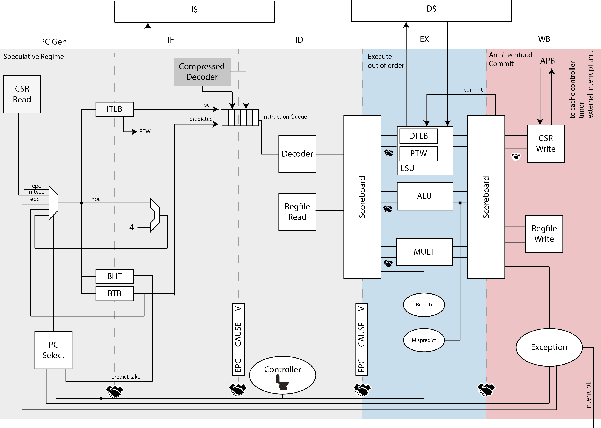

# Ariane RISC-V CPU

This document describes the 5-stage, single issue Ariane CPU which implements the 64bit RISC-V instruction set. It is conformant to the I,M and C extensions as specified in Volume I: User-Level ISA V2.1 as well as the draft privilege extension 1.10. It implements three privilege levels M, S, U to fully support a Unix-like operating system.

## Scope and Purpose

The purpose of the core is to run a full OS at reasonable speed and IPC. To achieve the necessary speed (targeting 1.6ns cycle time in UMC65) the core features a 5-stage pipelined design. In order to increase the IPC the CPU features a scoreboarding technique that should hide the rather long latency to the data RAM (cache) by issuing independent instructions.
The instruction RAM has (or L1 instruction cache) an access latency of 1 cycle on a hit, while accesses to the data RAM (or L2 data cache) have a longer latency of 3 cycles on a hit.



## Planned Limitations

# Instructions

- Integer computation (immediate-register): ADDI/SLTI[U], ANDI/ORI/XORI, SLLI/SRLI/SRAI
- Integer computation (register-register): ADD/SLT/SLTU, AND/OR/XOR, SLL/SRL, SUB/SRA, MUL/DIV/REM
- Operations on PC (PC-immediate): LUI, AUIPC
- Control Transfer: J, JAL, JALR
- Conditional Branches: BEQ/BNE, BLT[U], BGE[U]
- Load and Stores
- Memory instructions: FENCE.I (flush D$ and I$, kill pipeline), SFENCE.VM (flush TLB)
- System Instructions: CSRR[..], RDCYCLE, RDTIME, RDINSTRET, ECALL, EBREAK, WFI, MRET/SRET/URET

Ariane is not going to support floating points and atomic operations.

# General Architecture

## Scoreboarding

The scoreboards main purpose is to decouple the check for data (WAW, WAR) and structural hazards and issue instructions to the various functional units. It does so by taking full responsibility for instruction issue and execution. This also includes detecting the two aforementioned hazards.
The scoreboard enables utilization of all available functional units as well as efficient usage of pipelined functional units which take a couple of cycles before the instruction finishes. The scoreboard tracks all instructions which are currently being processed in all functional units.
Because the scoreboard is in full control over the functional units it also controls the forwarding path and write back of all functional units.
- Issue: If a functional unit for the instruction is free and no other active instruction has the same  destination register, the scoreboard issues the instruction to the functional unit. If a WAW hazard is present, the instruction issue will stall until the hazard has been cleared. Should the issue stage stall the instruction buffer in the ID stage fills until it is full.
- Read operand: The scoreboard monitors the availability of the source operands. A source operand is available if no earlier issued active instruction is going to write it. When the source operands are available (either through the register file or through a forwarding path from any of the other functional units or an already completed instruction), the scoreboard tells the FUs to proceed to read the operands. The scoreboard resolves RAW hazards dynamically in this step.
- Execution: The FU begins execution upon receiving operands. When the result is ready, it notifies the scoreboard. Any instruction can take multiple cycles.
- Write Back: Once the scoreboard is aware that the functional unit has completed execution, it commits the result in-order to either the architectural register file, CSR register file, floating point register file or data memory. If there are no structural dependencies on the write path the scoreboard can write more than one result at a time.
The scoreboard maintains a connection to each functional unit and each architectural state holding element. For Ariane there is the plan to include the following FUs: ALU, Multiplier and LSU. If it should turn out to be necessary additional ALUs or multipliers can be easily added.
TODO: Detailed Bookkeeping

> While it will be possible that the execute stage houses more than one ALU or multiplier, this is not going to be the case for the load store unit (LSU). The current assumption will be, that the LSU is like any other functional unit (using a variable amount of cycles to perform its operation), but it should also be in full control over the data memories state. It therefore takes a special role in the whole design.

The scoreboard has the following entries:

 |            **Name**           | **Abbr.** |                                           **Description**                                           |
 | ----------------------------- | --------- | --------------------------------------------------------------------------------------------------- |
 | Program Counter               | PC        | Program counter of instruction                                                                      |
 | Functional Unit               | FU        | Which type of  functional unit this instruction is going to need                                    |
 | FU Result                     | FUR       | Which functional unit the result is coming from                                                     |
 | Operation                     | OP        | Which operation the functional unit is going to perform on it                                       |
 | Destination Register          | RD        | Destination register address of instruction                                                         |
 | Value of destination register | VAL(RD)   | Result written by the functional unit. The result in here is valid only if the finished bit is set. |
 | Immediate                     | IMM       | Immediate Field                                                                                     |
 | Source Register 1             | RS1       | First source registers address of instruction                                                       |
 | Source Register 2             | RS2       | Second source registers address of instruction                                                      |
 | In Flight                     | IF        | Set to one if the instruction is currently being processed                                          |
 | Valid                         | VALID     | The instruction has been executed and the result is valid                                           |
 | Exception Valid               | ISEXCPT   | Set if an exception occurred.                                                                       |
 | Exception Cause               | ECAUSE    | Exception cause as listed in privileged specification                                               |

Register addresses can be of type: CSR, Regfile (x0,.., x31), None (immediate), current PC
TODO: Register Encoding, OP encoding


### Exception Propagation

In order to simplify hardware design exceptions are only considered at commit time. Therefore, the scoreboard provides an exception field. If an exception has been present prior to issue (for example in the fetch or decode step) it has been propagated to this point. An instruction that has the exception flag set is considered as completed by the scoreboard and can be retired as soon as every instruction prior to this one has been committed.

### Scoreboard Implementation

The scoreboard is implemented as a circular buffer with two pointers. The first pointer being the commit point. Everything above this pointer is save to be reused for new instructions arriving. The issue pointer points to the top of the buffer, e.g.: always to the latest issued instruction. The scoreboard therefore keeps track of instruction ordering.

### Functional Units

The FU are not supposed to have inter-unit dependencies for the moment, e.g.: every FU must be able to perform its operation independently of every other unit. The following interface is proposed to keep maximum interoperability. A minimum set of port definitions would be:

| **Signal** | **Direction** |                **Description**                |
| ---------- | ------------- | --------------------------------------------- |
| clk_i      | Input         | Global clock signal                           |
| rst_ni     | Input         | Reset the functional unit to a specific state |
| operator_i | Input         | Operation to perform                          |
| operand_ai | Input         | Operand A                                     |
| operand_bi | Input         | Operand B                                     |
| result_o   | Output        | Result Output                                 |
| valid_i    | Input         | Data is valid from ID/Scoreboard              |
| ready_o    | Output        | Ready signal to ID/Scoreboard                 |
| ready_i    | Input         | Ready signal from WB/Scoreboard               |
| valid_o    | Output        | Data is valid to WB/Scoreboard                |

TODO: Details about comparisons and branches.

### LSU

Loads can be issued immediately while stores need to wait for the commit signal from the scoreboard. They are kept in a store address queue (SAQ) for the time being.

### Commit Point

The scoreboard is the only way to update the architectural state. This simplifies the controller design significantly since this is the only point where an exception is known to be taken.

### Issue Window

Currently the idea is to not speculate past branches or jumps. So the issue window is the size of a basic block. Theoretically it could be possible to speculate past one branch.
If the scoreboard encounters a branch it does not accept new instructions from ID. Executes the branch instruction. In the next cycle the speculated pc is compared to the calculated PC. If they match the scoreboard starts to issue instructions again. If not, a miss-predict is signaled and all fetched instructions are killed prior to the execute stage. The pipeline fills from the new address. Branch prediction data structures are updated accordingly.

## Load Store Unit
The load store unit is similar to every other functional unit. In addition, it has to manage the interface to the data memory. In particular, it houses the DTLB (Data Translation Lookaside Buffer) and the page table walker (PTW). It arbitrates the access to data memory, giving precedence to PTW lookups. This is done in order to unstall TLB misses as soon as possible.
The load store unit can issue load request immediately while stores need to be kept back as long as the scoreboard does not issue a commit signal. Therefore, upon a load, the LSU also needs to check its SAQ for potential data words. Should it find uncommitted data it stalls, since it can’t satisfy the current request. This means:
- Two loads to the same address are allowed. They will return in issue order.
- Two stores to the same address are allowed. They are issued in-order by the scoreboard and stored in the SAQ as long as the scoreboard didn’t give the grant to commit them.
- A store followed by a load to the same address can only be satisfied if the store has already been committed (marked as committed in the SAQ). Otherwise the LSU stalls until the scoreboard commits the instruction. We cannot guarantee that the store will eventually be committed (e.g.: an exception occurred).

For the moment being, the LSU does not handle misaligned accesses (e.g.: access which are not aligned at a 64bit boundary). It simply issues a misaligned exception and lets the exception handler resolve the LD/ST. Furthermore, it can issue a load access exception.
If an exception was signaled by the WB stage, the LSU kills all entries in its store queue except those that have been marked as committed.

The LSU of the core takes care of accessing the data memory. Load and stores on words (32 bit), half words (16 bit) and bytes (8 bit) are supported.
Table 3 describes the signals that are used by the LSU.

|     **Signal**     | **Direction** |                                                    **Description**                                                     |
| ------------------ | ------------- | ---------------------------------------------------------------------------------------------------------------------- |
| data_req_o         | output        | Request ready, must stay high until data_gnt_i is high for one cycle                                                   |
| data_addr_o[31:0]  | output        | Address                                                                                                                |
| data_we_o          | output        | Write Enable, high for writes, low for reads. Sent together with data_req_o                                            |
| data_be_o[3:0]     | output        | Byte Enable. Is set for the bytes to write/read, sent together with data_req_o                                         |
| data_wdata_o[31:0] | output        | Data to be written to memory, sent together with data_req_o                                                            |
| data_rdata_i[31:0] | input         | Data read from memory                                                                                                  |
| data_rvalid_i      | input         | data_rdata_is holds valid data when data_rvalid_i is high. This signal will be high for exactly one cycle per request. |
| data_gnt_i         | input         | The other side accepted the request. data_addr_o may change in the next cycle                                          |

## Protocol

The protocol that is used by the LSU to communicate with a memory works as follows:
The LSU provides a valid address in data_addr_o and sets data_req_o high. The memory then answers with a data_gnt_i set high as soon as it is ready to serve the request. This may happen in the same cycle as the request was sent or any number of cycles later. After a grant was received, the address may be changed in the next cycle by the LSU. In addition, the data_wdata_o, data_we_o and data_be_o signals may be changed as it is assumed that the memory has already processed and stored that information. After receiving a grant, the memory answers with a data_rvalid_i set high if data_rdata_i is valid. This may happen one or more cycles after the grant has been received. Note that data_rvalid_i must also be set when a write was performed, although the data_rdata_i has no meaning in this case.

# Block Details

The processor has 5-stages:

## Next PC Generation (PC Gen)

PC gen is responsible for generating the next program counter. All program counters are logical addressed. If the logical to physical mapping changes a fence instruction should flush the pipeline, caches (?) and TLB.
This stage contains speculation on the next branch target as well as the information if the branch target is taken or not. In addition, it provides ports to the branch history table (BHT) and branch target buffer (BTB).

<!-- If the ID stage decodes a jump and link instruction it sets PC+4 in the RAS. If it the decode stage decodes a return instruction the decode stage kills the program counter in the IF stage and the return address stack is popped accordingly.
 -->
If the branch target buffer decodes a certain PC as a jump the BHT decides if the branch is taken or not.
Because of the various state-full memory structures this stage is split into two pipeline stages. It also provides a handshaking signal to the decode stage to stall the pipeline if this should be necessary (back-pressure).
The next PC can originate from the following sources:
1.  Exception (including interrupts): This also means to figure out to which exception handler the delegate registers are pointing to. If an exception is taken, disable interrupts.
2.  Debug
3.  Request from execute stage (jump, branch) which was not detected as one by the BHT.
4.  Predicted PC (BHT and BTB)
5.  Environment Call (`ecall) instruction. Read the CSRs to figure out where to jump.
6.  Miss-predict: This triggers a pipeline flush and the PC Gen stage starts fetching from there.

### ITLB

## Instruction Fetch (IF)

In the IF stage we already know the physical PC. The request of the instruction is on its way to the instruction memory. We know the result of the BHT and can set the next PC accordingly. At the end of this stage the instruction PC is passed on to the ID stage. Retrieved instructions are stored in an instruction queue.
It is possible that a TLB or cache miss occurred. If this is the case the IF stage signals that it is not ready. The pipeline in the direction of the ID stage will empty itself.

### BTB

### BHT

### Instruction Queue

The instruction queue is part of the IF stage. Its purpose is to decouple the instruction fetch unit as much as possible from the rest of the pipeline.

### Interface

|      **Signal**     | **Direction** |            **Description**             |         **Category**        |
| ------------------- | ------------- | -------------------------------------- | --------------------------- |
| epc_i               | Input         | EPC from CSR registers                 | CSR Regs                    |
| ecall_i             | Input         | Ecall request from WB                  | WB/Commit                   |
| mtvec_i             | Input         | Base of machine trap vector            | CSR Regs                    |
| stvec_i             | Input         | Base of supervisor trap vector         | CSR Regs                    |
| epc_wb_i            | Input         | EPC Writeback                          | WB/Commit                   |
| epc_wb_valid_i      | Input         | EPC from WB is valid                   | WB/Commit                   |
|                     |               |                                        |                             |
| flush_s1_i          | Input         | Flush PC Gen stage                     | Control                     |
| flush_s2_i          | Input         | Flush fetch stage                      | Control                     |
| bp_pc_i             | Input         | Branch prediction PC, from EX stage    | EX -- Update BP/take branch |
| bp_misspredict_i    | Input         | Branch was misspredicted               | EX -- Update BP/take branch |
| bp_target_address_i | Input         | Target address of miss-predicted  jump | EX -- Update BP/take branch |
| instr_req_o         | Output        | Request to ICache                      | ICache                      |
| instr_addr_o        | Output        | Instruction address                    | ICache                      |
| instr_rdata_i       | Input         | Instruction data in                    | ICache                      |
|                     |               |                                        |                             |
| dbg_addr_i          | Input         | Fetch address from debug               | Debug                       |
| instr_valid_o       | Output        | Instruction is valid                   | To ID                       |
| instr_rdata_o       | Output        | Instruction                            | To ID                       |
| pc_o                | Output        | PC of instruction                      | To ID                       |
| is_spec_branch_o    | Output        | Is a speculative branch instruction    | To ID                       |
| spec_branch_pc_o    | Output        | Speculated branch target               | To ID                       |
| busy_o              | Output        | If is busy                             | To ID                       |
| ready_i             | Input         | ID is ready                            | From ID                     |

## Instruction Decode (ID)

The ID stage contains the instruction decode logic (including the planned compressed decoder) as well as the register files (CSR, floating point and regular register file). The decoded instruction is committed to the scoreboard. The scoreboard decides which instruction it can issues next to the execute stage.

### Compressed Decoder
The compressed decoders purpose is to expand a compressed instruction (16 bit) to its 32 bit equivalent.


### Interface

| **Signal** | **Direction** |    **Description**     | **Category** |
| ---------- | ------------- | ---------------------- | ------------ |
| flush_i    | Input         | EPC from CSR registers | CSR Regs     |


## Execute Stage (EX)

### Interface

| **Signal** | **Direction** |    **Description**     | **Category** |
| ---------- | ------------- | ---------------------- | ------------ |
| flush_i    | Input         | EPC from CSR registers | CSR Regs     |

## Writeback Stage (WB)

The writeback stage is the single commit point in the whole architecture. Everything prior to this stage was just computed in a temporary fashion. This is also the only point where an exception can occur.

### CSR Register File

The CSR register file contains all registers which are not directly related to arithmetic instructions. It contains the following registers supervisor registers:

| **Register** | **Address** |                      **Description**                      |
| ------------ | ----------- | --------------------------------------------------------- |
| sstatus      | 0x100       | Supervisor status register                                |
| sedeleg      | 0x102       | Supervisor exception delegation register (maybe external) |
| sideleg      | 0x103       | Supervisor interrupt delegation register (maybe external) |
| sie          | 0x104       | Supervisor interrupt-enable register (maybe external)     |
| stvec        | 0x105       | Supervisor trap handler base address                      |
| sscratch     | 0x140       | Scratch register for supervisor trap handler              |
| sepc         | 0x141       | Supervisor exception program counter                      |
| scause       | 0x142       | Supervisor trap cause                                     |
| stval        | 0x143       | Supervisor bad address or instruction                     |
| sip          | 0x144       | Supervisor interrupt pending (maybe external)             |
| sptbr        | 0x180       | Page-table base register                                  |

And the following machine mode CSR registers:

|     **Register**    |  **Address**   |                    **Description**                     |
| ------------------- | -------------- | ------------------------------------------------------ |
| mvendorid           | 0xF11          | Vendor ID                                              |
| marchid             | 0xF12          | Architecture ID                                        |
| mimpid              | 0xF13          | Implementation ID                                      |
| mhartid             | 0xF14          | Hardware thread ID                                     |
| mstatus             | 0x300          | Machine status register                                |
| medeleg             | 0x302          | Machine exception delegation register (maybe external) |
| mideleg             | 0x303          | Machine interrupt delegation register (maybe external) |
| mie                 | 0x304          | Machine interrupt-enable register (maybe external)     |
| mtvec               | 0x305          | Machine trap handler base address                      |
| mscratch            | 0x340          | Machine register for machine trap handler              |
| mepc                | 0x341          | Machine exception program counter                      |
| mcause              | 0x342          | Machine trap cause                                     |
| mtval               | 0x343          | Machine bad address or instruction                     |
| mip                 | 0x344          | Machine interrupt pending (maybe external)             |
| mcycle              | 0xB00          | Machine cycle counter                                  |
| minstret            | 0xB02          | Machine instruction-retired counter                    |
| Performance Counter | 0xB03 -- 0xB9F | Machine performance-monitoring counter                 |

### Interface

| **Signal** | **Direction** |    **Description**     | **Category** |
| ---------- | ------------- | ---------------------- | ------------ |
| flush_i    | Input         | EPC from CSR registers | CSR Regs     |


## MMU

|      **Signal**      | **Direction** |                                     **Description**                                      |
| -------------------- | ------------- | ---------------------------------------------------------------------------------------- |
| enable_translation_i | Input         | Enables translation, coming from CSR file.                                               |
| ireq_o               | Output        |                                                                                          |
| ivalid_i             | Output        |                                                                                          |
| ierr_i               | Input         |                                                                                          |
| ipaddr_o             | Output        | Physical address out                                                                     |
| fetch_req_i          | Input         | Fetch request in                                                                         |
| fetch_gnt_o          | Output        | Fetch request granted                                                                    |
| fetch_valid_o        | Output        | The output is valid                                                                      |
| fetch_err_o          | Output        | Fetch error                                                                              |
| fetch_vaddr_i        | Input         | Virtual address in                                                                       |
| dreq_o               | Output        | Request to data memory                                                                   |
| dgnt_i               | Input         | Grant from data memory                                                                   |
| dvalid_i             | Input         | Data from data memory is valid                                                           |
| dwe_o                | Output        | Write enable to data memory                                                              |
| dbe_o                | Output        | Byte enable to data memory                                                               |
| dpaddr_o             | Output        | Physical address to data memory                                                          |
| ddata_i              | Input         | Data from data memory                                                                    |
| lsu_req_i            | Input         | Request from LSU                                                                         |
| lsu_gnt_o            | Output        | Request granted to LSU                                                                   |
| lsu_valid_o          | Output        | Data to LSU is valid                                                                     |
| lsu_we_i             | Input         | Write enable from LSU                                                                    |
| lsu_err_o            | Output        | Error to LSU                                                                             |
| lsu_be_i             | Input         | Byte enable from LSU                                                                     |
| lsu_vaddr_i          | Input         | Virtual address from LSU                                                                 |
| priv_lvl_i           | Input         | Current Privilige Level                                                                  |
| flag_pum_i           | Input         | PUM (Protected User Mode) Flag, prevents S-mode code to alter user mode code -- from CSR |
| flag_mxr_i           | Input         | MXR (Make eXecutable Readable), makes it possible to read executable only pages          |
| pd_ppn_i             | Input         | Physical page number                                                                     |
| asid_i               | Input         | ASID (address space identifier)                                                          |
| flush_tlb_i          | Input         | Flush TLB                                                                                |
| lsu_ready_wb_i       | Input         | LSU is ready to accept new data                                                          |

# Ideas

## Dual Issue Implementation

By widening the fetch interface to 64bit we could theoretically fetch two and more instructions with a single fetch. Doubling the (compressed) decoder would result in a dual issue architecture.

## Power-down Mode

The CSR’s APB interface would allow for storing the CPU state (registers, CSR registers, etc.) to a state retentive memory when the core is in complete power down.

# Testbench

The test-bench should evolve according to the following steps:
1.  Basic Usage: Behavioral memories and boot-code. With the option of a EOC flag.
2.  Constrained Random Testing: By co-simulating on a golden model (e.g.: Spike ISA simulator) and comparing signatures. Tests generated by the torture test framework.
3.  System Integration: Complete system integration.

# Coding Style

- Keep the files tidy. No superfluous line breaks, align ports on a common boundary.
- All signal and module names should be lower case with underscores as whitespace replacements (e.g.: `fetch_busy`).
- Instantiation of modules should be postfix with `_i`, e.g.: `prefetcher_i`
- For port definitions keep a post-fix direction (`_o`, `_i`).
- For active low signals put an additional (`_no`, `_ni`).
- Denote output of ff with `_q` and the input with `_n`.
- Do not put overly large comment headers. Nevertheless, try to structure your HDL code, e.g.:
```
  // ------------------------------------
  // CSR - Control and Status Registers
  // ------------------------------------
```

## Git Considerations

- Do not push to master, if you want to add a feature do it in your branch
- Separate subject from body with a blank line
- Limit the subject line to 50 characters
- Capitalize the subject line
- Do not end the subject line with a period
- Use the imperative mood in the subject line
- Wrap the body at 72 characters
- Use the body to explain what and why vs. how

For a detailed why and how please refer to one of the multiple [resources](https://chris.beams.io/posts/git-commit/) regarding git commit messages.

If you use `vi` for your commit message, consider to put the following snippet inside your `~/.vimrc`:
```
autocmd Filetype gitcommit setlocal spell textwidth=72s
```