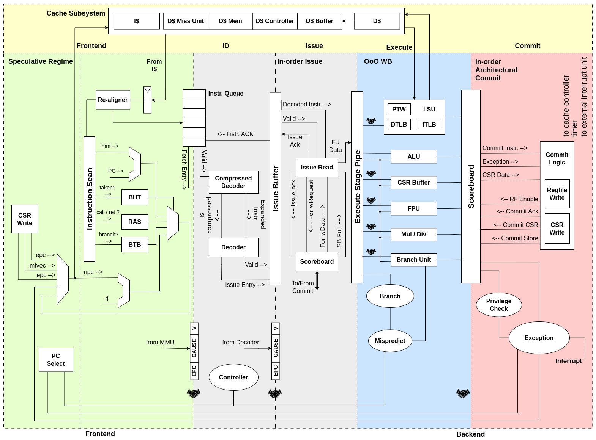

# CVA6 RISC-V CPU

CVA6 is a 6-stage, single-issue, in-order CPU which implements the 64-bit RISC-V instruction set. It fully implements I, M, A and C extensions as specified in Volume I: User-Level ISA V 2.3 as well as the draft privilege extension 1.10. It implements three privilege levels M, S, U to fully support a Unix-like operating system. Furthermore, it is compliant to the draft external debug spec 0.13.

It has a configurable size, separate TLBs, a hardware PTW and branch-prediction (branch target buffer and branch history table). The primary design goal was on reducing critical path length.




# Quick setup

The following instructions will allow you to compile and run a Verilator model of the CVA6 APU (which instantiates the CVA6 core) within the CVA6 APU testbench (corev_apu/tb).

Throughout all build and simulations scripts executions, you can use the environment variable `NUM_JOBS` to set the number of concurrent jobs launched by `make`:
- if left undefined, `NUM_JOBS` will default to 1, resulting in a sequential execution
of `make` jobs;
- when setting `NUM_JOBS` to an explicit value, it is recommended not to exceed 2/3 of
the total number of virtual cores available on your system.    

1. Checkout the repository and initialize all submodules.
```sh
git clone https://github.com/openhwgroup/cva6.git
cd cva6
git submodule update --init --recursive
```

2. Install the GCC Toolchain [build prerequisites](util/gcc-toolchain-builder/README.md#Prerequisites) then [the toolchain itself](util/gcc-toolchain-builder/README.md#Getting-started).

:warning: It is **strongly recommended** to use the toolchain built with the provided scripts.

3. Set the RISCV environment variable.
```sh
export RISCV=/path/to/toolchain/installation/directory
```

4. Install `help2man` and `device-tree-compiler` packages. 

For Debian-based Linux distributions, run :

```sh
sudo apt-get install help2man device-tree-compiler
```

5. Install the riscv-dv requirements:

```sh
pip3 install -r verif/sim/dv/requirements.txt
```

6. Run these commands to install a custom Spike and Verilator (i.e. these versions must be used to simulate the CVA6) and [these](#running-regression-tests-simulations) tests suites.
```sh
# DV_SIMULATORS is detailed in the next section
export DV_SIMULATORS=veri-testharness,spike
bash verif/regress/smoke-tests.sh
```

# Running standalone simulations

Simulating the CVA6 is done by using `verif/sim/cva6.py`.

The environment variable `DV_SIMULATORS` allows you to specify which simulator to use.

Four simulation types are supported:
- **veri-testharness**: verilator with corev_apu/testharness testbench
- **vcs-testharness**: vcs with corev_apu/testharness testbench
- **vcs-uvm**: vcs with UVM testbench
- **Spike** ISS 

You can set several simulators, such as :

```sh
export DV_SIMULATORS=veri-testharness,vcs-testharness,vcs_uvm
```

If exactly 2 simulators are given, their trace is compared ([see the Regression tests section](#running-regression-tests-simulations)).

Here is how you can run the hello world C program with the Verilator model: 

```sh
# Make sure to source this script from the root directory 
# to correctly set the environment variables related to the tools
source verif/sim/setup-env.sh

# Set the NUM_JOBS variable to increase the number of parallel make jobs
# export NUM_JOBS=

export DV_SIMULATORS=veri-testharness

cd ./verif/sim

python3 cva6.py --target cv32a60x --iss=$DV_SIMULATORS --iss_yaml=cva6.yaml \
--c_tests ../tests/custom/hello_world/hello_world.c \
--linker=../tests/custom/common/test.ld \
--gcc_opts="-static -mcmodel=medany -fvisibility=hidden -nostdlib \
-nostartfiles -g ../tests/custom/common/syscalls.c \
../tests/custom/common/crt.S -lgcc \
-I../tests/custom/env -I../tests/custom/common"
```

You can run either assembly programs (check `verif/test/custom/hello_world/custom_test_template.S`) or C programs. Run `python3 cva6.py --help` to have more informations on the available parameters.

## Simulating with VCS and Verdi

You can set the environment variable `VERDI` as such if you want to launch Verdi while simulating with VCS:

```sh
export VERDI=1
```


# Running regression tests simulations

The smoke-tests script installs a random instruction generator and several tests suites:
- [riscv-dv](https://github.com/chipsalliance/riscv-dv)
- [riscv-compliance](https://github.com/lowRISC/riscv-compliance)
- [riscv-tests](https://github.com/riscv-software-src/riscv-tests)
- [riscv-arch-test](https://github.com/riscv-non-isa/riscv-arch-test)


The regression tests are done by comparing a model simulation trace with the Spike trace.

Several tests scripts can be found in `./verif/regress`

For example, here is how would run the riscv-arch-test regression test suite with the Verilator model:

```sh
export DV_SIMULATORS=veri-testharness,spike
bash verif/regress/dv-riscv-arch-test.sh
```


# Logs

The logs from cva6.py are located in `./verif/sim/out_YEAR-MONTH-DAY`.

Assuming you ran the smoke-tests scripts in the previous step, here is the log directory hierarchy:

- **directed_asm_tests/**: The compiled (to .o then .bin) assembly tests
- **directed_c_tests/**: The compiled (to .o then .bin) c tests
- **spike_sim/**: Spike simulation log and trace files
- **veri_testharness_sim**: Verilator simulation log and trace files
- **iss_regr.log**: The regression test log 

The regression test log summarizes the comparison between the simulator trace and the Spike trace. Beware that a if a test fails before the comparison step, it will not appear in this log, check the output of cva6.py and the logs of the simulation instead.


# Waveform generation

Waveform generation is currently supported for Verilator (`veri-testharness`)
and VCS with full UVM testbench (`vcs-uvm`) simulation types.  It is disabled
by default to save simulation time and storage space.

To enable waveform generation for a supported simulation mode, set either
of the two shell variables that control tracing before running any of the
test scripts under `verif/regress`:
- `export TRACE_FAST=1` enables "fast" waveform generation (keep simulation
   time low at the expense of space).  This will produce VCD files when using
   Verilator, and VPD files when using Synopsys VCS with UVM testbench (`vcs-uvm`).
- `export TRACE_COMPACT=1` enables "compact" waveform generation (keep waveform
   files smaller at the expense of increased simulation time).  This will
   produce FST files when using Verilator, and FSDB files when using Synopsys
   VCS with UVM testbench (`vcs-uvm`).

To generate VCD waveforms of the `smoke-tests` regression suite using Verilator, use:
```sh
export DV_SIMULATORS=veri-testharness,spike
export TRACE_FAST=1
bash verif/regress/smoke-tests.sh
```

After each simulation run involving Verilator or VCS, the generated waveforms
will be copied  to the directory containing the log files (see above,) with
the name of the current HW configuration added to the file name right before
the file type suffix (e.g., `I-ADD-01.cv32a60x.vcd`).


# Physical Implementation

## ASIC Synthesis

How to make cva6 synthesis ?
```
make -C pd/synth cva6_synth FOUNDRY_PATH=/your/techno/basepath/ TECH_NAME=yourTechnoName TARGET_LIBRARY_FILES="yourLib1.db\ yourLib2.db" PERIOD=10 NAND2_AREA=650 TARGET=cv64a6_imafdc_sv39 ADDITIONAL_SEARCH_PATH="others/libs/paths/one\ others/libs/paths/two"
```
Don't forget to escape spaces in lists.
Reports are under: pd/synth/ariane/reports


## ASIC Gate Simulation with `core-v-verif` repository

> :warning: **Warning**: this chapter needs to be updated. See Github issue https://github.com/openhwgroup/cva6/issues/1358.

```sh
export DV_SIMULATORS=veri-testharness,spike
cva6/regress/smoke-tests.sh
make -C pd/synth cva6_synth FOUNDRY_PATH=/your/techno/basepath/ TECH_NAME=yourTechnoName TARGET_LIBRARY_FILES="yourLib1.db\ yourLib2.db" PERIOD=10 NAND2_AREA=650 TARGET=cv64a6_imafdc_sv39 ADDITIONAL_SEARCH_PATH="others/libs/paths/one\ others/libs/paths/two"
sed 's/module SyncSpRamBeNx64_1/module SyncSpRamBeNx64_2/' pd/synth/ariane_synth.v > pd/synth/ariane_synth_modified.v
cd cva6/sim
make vcs_clean
python3 cva6.py --testlist=../tests/testlist_riscv-tests-cv64a6_imafdc_sv39-p.yaml --test rv64ui-p-ld --iss_yaml cva6.yaml --target cv64a6_imafdc_sv39 --iss=spike,vcs-core-gate $DV_OPTS
```


# COREV-APU FPGA Emulation

We currently only provide support for the [Genesys 2 board](https://reference.digilentinc.com/reference/programmable-logic/genesys-2/reference-manual). We provide pre-build bitstream and memory configuration files for the Genesys 2 [here](https://github.com/openhwgroup/cva6/releases).

Tested on Vivado 2018.2. The FPGA currently contains the following peripherals:

- DDR3 memory controller
- SPI controller to conncet to an SDCard
- Ethernet controller
- JTAG port (see debugging section below)
- Bootrom containing zero stage bootloader and device tree.

> The ethernet controller and the corresponding network connection is still work in progress and not functional at the moment. Expect some updates soon-ish.


## Programming the Memory Configuration File

- Open Vivado
- Open the hardware manager and open the target board (Genesys II - `xc7k325t`)
- Tools - Add Configuration Memory Device
- Select the following Spansion SPI flash `s25fl256xxxxxx0`
- Add `ariane_xilinx.mcs`
- Press Ok. Flashing will take a couple of minutes.
- Right click on the FPGA device - Boot from Configuration Memory Device (or press the program button on the FPGA)


## Preparing the SD Card

The first stage bootloader will boot from SD Card by default. Get yourself a suitable SD Card (we use [this](https://www.amazon.com/Kingston-Digital-Mobility-MBLY10G2-32GB/dp/B00519BEQO) one). Either grab a pre-built Linux image from [here](https://github.com/pulp-platform/ariane-sdk/releases) or generate the Linux image yourself following the README in the [ariane-sdk repository](https://github.com/pulp-platform/ariane-sdk). Prepare the SD Card by following the "Booting from SD card" section in the ariane-sdk repository.

Connect a terminal to the USB serial device opened by the FTDI chip e.g.:
```
screen /dev/ttyUSB0 115200
```

Default baudrate set by the bootlaoder and Linux is `115200`.

After you've inserted the SD Card and programmed the FPGA you can connect to the serial port of the FPGA and should see the bootloader and afterwards Linux booting. Default username is `root`, no password required.


## Generating a Bitstream

To generate the FPGA bitstream (and memory configuration) yourself for the Genesys II board run:

```
make fpga
```

This will produce a bitstream file and memory configuration file (in `fpga/work-fpga`) which you can permanently flash by running the above commands.


## Debugging

You can debug (and program) the FPGA using [OpenOCD](http://openocd.org/doc/html/Architecture-and-Core-Commands.html). We provide two example scripts for OpenOCD below.

To get started, connect the micro USB port that is labeled with JTAG to your machine. This port is attached to the FTDI 2232 USB-to-serial chip on the Genesys 2 board, and is usually used to access the native JTAG interface of the Kintex-7 FPGA (e.g. to program the device using Vivado). However, the FTDI chip also exposes a second serial link that is routed to GPIO pins on the FPGA, and we leverage this to wire up the JTAG from the RISC-V debug module.

>If you are on an Ubuntu based system you need to add the following udev rule to `/etc/udev/rules.d/99-ftdi.rules`
>```
> SUBSYSTEM=="usb", ACTION=="add", ATTRS{idProduct}=="6010", ATTRS{idVendor}=="0403", MODE="664", GROUP="plugdev"
>```

Once attached to your system, the FTDI chip should be listed when you type `lsusb`:

```
Bus 005 Device 019: ID 0403:6010 Future Technology Devices International, Ltd FT2232C/D/H Dual UART/FIFO IC
```

If this is the case, you can go on and start openocd with the `fpga/ariane.cfg` configuration file:

```
openocd -f fpga/ariane.cfg

Open On-Chip Debugger 0.10.0+dev-00195-g933cb87 (2018-09-14-19:32)
Licensed under GNU GPL v2
For bug reports, read
    http://openocd.org/doc/doxygen/bugs.html
adapter speed: 1000 kHz
Info : auto-selecting first available session transport "jtag". To override use 'transport select <transport>'.
Info : clock speed 1000 kHz
Info : TAP riscv.cpu does not have IDCODE
Info : datacount=2 progbufsize=8
Info : Examined RISC-V core; found 1 harts
Info :  hart 0: XLEN=64, misa=0x8000000000141105
Info : Listening on port 3333 for gdb connections
Ready for Remote Connections
Info : Listening on port 6666 for tcl connections
Info : Listening on port 4444 for telnet connections
Info : accepting 'gdb' connection on tcp/3333
```

Then you will be able to either connect through `telnet` or with `gdb`:

```
riscv64-unknown-elf-gdb /path/to/elf

(gdb) target remote localhost:3333
(gdb) load
Loading section .text, size 0x6508 lma 0x80000000
Loading section .rodata, size 0x900 lma 0x80006508
(gdb) b putchar
(gdb) c
Continuing.

Program received signal SIGTRAP, Trace/breakpoint trap.
0x0000000080009126 in putchar (s=72) at lib/qprintf.c:69
69    uart_sendchar(s);
(gdb) si
0x000000008000912a  69    uart_sendchar(s);
(gdb) p/x $mepc
$1 = 0xfffffffffffdb5ee
```

You can read or write device memory by using:
```
(gdb) x/i 0x1000
    0x1000: lui t0,0x4
(gdb) set {int} 0x1000 = 22
(gdb) set $pc = 0x1000
```


## Preliminary Support for OpenPiton Cache System

CVA6 has preliminary support for the OpenPiton distributed cache system from Princeton University. To this end, a different L1 cache subsystem (`src/cache_subsystem/wt_cache_subsystem.sv`) has been developed that follows a write-through protocol and that has support for cache invalidations and atomics.

The corresponding integration patches will be released on [OpenPiton GitHub repository](https://github.com/PrincetonUniversity/openpiton). Check the `README` in that repository to see how to use CVA6 in the OpenPiton setting.

To activate the different cache system, compile your code with the macro `DCACHE_TYPE`.


## Re-generating the Bootcode (ZSBL)

The zero stage bootloader (ZSBL) for RTL simulation lives in `bootrom/` while the bootcode for the FPGA is in `fpga/src/bootrom`. The RTL bootcode simply jumps to the base of the DRAM where the FSBL takes over. For the FPGA the ZSBL performs additional housekeeping. Both bootloader pass the hartid as well as address to the device tree in argumen register `a0` and `a1` respectively.

To re-generate the bootcode you can use the existing makefile within those directories. To generate the SystemVerilog files you will need the `bitstring` python package installed on your system.


# Directory Structure:

The directory structure separates the [CVA6 RISC-V CPU](#cva6-risc-v-cpu) core from the [CORE-V-APU FPGA Emulation Platform](#corev-apu-fpga-emulation).
Files, directories and submodules under `cva6` are for the core _only_ and should not have any dependencies on the APU.
Files, directories and submodules under `corev_apu` are for the FPGA Emulation platform.
The CVA6 core can be compiled stand-alone, and obviously the APU is dependent on the core.

The top-level directories of this repo:
* **ci**: Scriptware for CI.
* **common**: Source code used by both the CVA6 Core and the COREV APU. Subdirectories from here are `local` for common files that are hosted in this repo and `submodules` that are hosted in other repos.
* **core**: Source code for the CVA6 Core only. There should be no sources in this directory used to build anything other than the CVA6 core.
* **corev_apu**: Source code for the CVA6 APU, exclusive of the CVA6 core. There should be no sources in this directory used to build the CVA6 core.
* **docs**: Documentation.
* **pd**: Example and CI scripts to synthesis CVA6.
* **util**: General utility scriptware.
* **vendor**: Third-party IP maintained outside the repository.
* **verif**: Verification environment for the CVA6. The verification files shared with other cores are in the [core-v-verif](https://github.com/openhwgroup/core-v-verif) repository on GitHub. core-v-verif is defined as a cva6 submodule.


## verif Directories

- **bsp**:     board support package for test-programs compiled/assembled/linked for the CVA6.
This BSP is used by both `core` testbench and `uvmt_cva6` UVM verification environment.
- **regress**: scripts to install tools, test suites, CVA6 code and to execute tests
- **sim**:     simulation environment (e.g. riscv-dv)
- **tb**:      testbench module instancing the core
- **tests**:   source of test cases and test lists

# Planned Improvements

Go to the CVA6 Kanban Board which also loosely tracks planned improvements.


# Contributing

We highly appreciate community contributions.
<br><br>To ease the work of reviewing contributions, please review [CONTRIBUTING](CONTRIBUTING.md).


# Issues and Troubleshooting

If you find any problems or issues with CVA6 or the documentation, please check out the [issue tracker](https://github.com/openhwgroup/cva6/issues)
and create a new issue if your problem is not yet tracked.


# Publication

If you use CVA6 in your academic work you can cite us:

<details>
<summary>CVA6 Publication</summary>
<p>
```
@article{zaruba2019cost,
   author={F. {Zaruba} and L. {Benini}},
   journal={IEEE Transactions on Very Large Scale Integration (VLSI) Systems},
   title={The Cost of Application-Class Processing: Energy and Performance Analysis of a Linux-Ready 1.7-GHz 64-Bit RISC-V Core in 22-nm FDSOI Technology},
   year={2019},
   volume={27},
   number={11},
   pages={2629-2640},
   doi={10.1109/TVLSI.2019.2926114},
   ISSN={1557-9999},
   month={Nov},
}
```
</p>
</details>
<br/>


# Acknowledgements

Check out the [acknowledgements](ACKNOWLEDGEMENTS.md).
