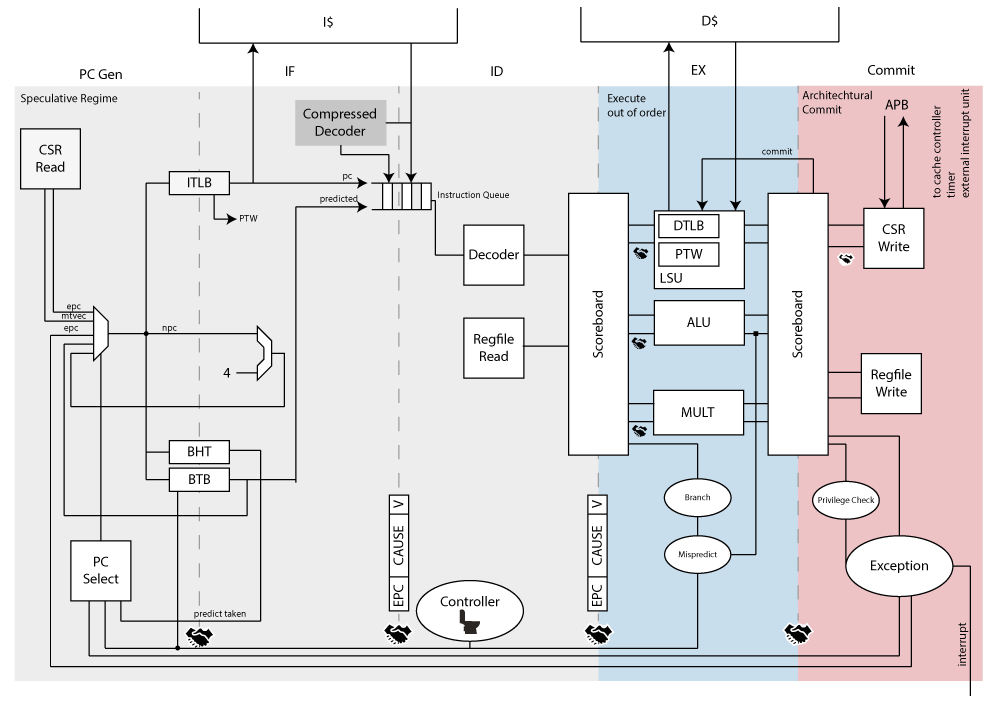

[](https://iis-git.ee.ethz.ch/floce/ariane/commits/initial-dev)
[](https://iis-git.ee.ethz.ch/floce/ariane/commits/initial-dev)

# Ariane RISC-V CPU



For detailed documentation refer to the [online documentation](http://www.be4web.net/ariane/) (Login: `zarubaf` Password: `zaruba`).

## Getting Started

Checkout the repository and initialize all submodules
```
git checkout git@iis-git.ee.ethz.ch:floce/ariane.git
git submodule update --init --recursive
```
Build the RISC-V front-end server (fesvr) which contains utility functions to read and load ELF files.
```
make build-fesvr
```

Build Ariane by using the Makefile:
```
make build
```

Start the simulation using Modelsim:
```
make sim
```

Or start any of the unit tests by:
```
make dcache_arbiter
```
# Contributing

Check out the [contribution guide](CONTRIBUTING.md)

# Test Overview

| **Test Name** |      **P/F/U**       | **Test Name** |      **P/F/U**       | **Test Name** |      **P/F/U**       |
|---------------|----------------------|---------------|----------------------|---------------|----------------------|
| add           | :white_check_mark:   | lb            | :white_large_square: | sll           | :white_large_square: |
| addi          | :white_check_mark:   | lbu           | :white_large_square: | slli          | :white_large_square: |
| addiw         | :white_check_mark:   | ld            | :white_large_square: | slliw         | :white_large_square: |
| addw          | :white_check_mark:   | lh            | :white_large_square: | sllw          | :white_large_square: |
| and           | :white_check_mark:   | lhu           | :white_large_square: | slt           | :white_large_square: |
| andi          | :white_check_mark:   | lui           | :white_large_square: | slti          | :white_large_square: |
| auipc         | :white_check_mark:   | lw            | :white_large_square: | sltiu         | :white_large_square: |
| beq           | :white_check_mark:   | lwu           | :white_large_square: | sltu          | :white_large_square: |
| bge           | :white_check_mark:   | or            | :white_large_square: | sra           | :white_large_square: |
| bgeu          | :white_check_mark:   | ori           | :white_large_square: | srai          | :white_large_square: |
| blt           | :white_check_mark:   | sb            | :white_large_square: | sraiw         | :white_large_square: |
| bltu          | :white_check_mark:   | sd            | :white_large_square: | sraw          | :white_large_square: |
| bne           | :white_check_mark:   | sh            | :white_large_square: | srl           | :white_large_square: |
| sub           | :white_large_square: | simple        | :white_check_mark:   | srli          |                      |
| subw          | :white_large_square: | jal           | :white_check_mark:   | srliw         |                      |
| sw            | :white_large_square: | jalr          | :white_check_mark:   | srlw          |                      |
| xor           | :white_large_square: |               |                      |               |                      |
| xori          | :white_large_square: |               |                      |               |                      |
