<!--
Copyright 2025 Thales DIS design services SAS

Licensed under the Solderpad Hardware Licence, Version 2.0 (the "License");
you may not use this file except in compliance with the License.
SPDX-License-Identifier: Apache-2.0 WITH SHL-2.0
You may obtain a copy of the License at https://solderpad.org/licenses/

Author: Maxime Colson - Thales
-->
	

# Instruction Tracing

## Introduction

Instruction tracing is a crucial feature in modern processor design, particularly when it comes to **certification**, **debugging**, and **formal verification**. It allows engineers to **track the exact sequence of executed instructions**, providing a ground truth that can be compared against expected behavior.

### Why Instruction Tracing?

There are several scenarios where instruction tracing is essential:

* **Certification and Compliance**: In safety-critical systems (e.g., avionics, automotive), it may be necessary to prove that instructions executed **exactly** as specified.
* **Debugging**: When an execution does not behave as expected, a trace can help **reconstruct** the execution flow and understand where and why things went wrong.

### How Does It Work?

In this project, we implemented an instruction tracer that uses the **E-TRACE encoding format** (as specified in the [E-Trace specification](https://github.com/riscv-non-isa/riscv-trace-spec)).

 E‑Trace implements a branch‑trace algorithm: it only emits control‑flow "deltas" (branches taken/not‑taken, indirect jumps/calls/returns, interrupts/exceptions) along with PC deltas, assumes sequential instructions implicitly, and can pack multiple retirements into compact packet, achieving a high compression rates while minimizing off‑chip bandwidth and interface complexity. 

There exist other encoding formats such as [N‑Trace](https://github.com/riscv-non-isa/tg-nexus-trace), which is built on the IEEE‑5001 Nexus standard.

### System Overview

The tracing system we built is composed of four main elements, illustrated in the block diagram below:

<picture>
  <source srcset="Pictures/Main_tracer_dark.svg" media="(prefers-color-scheme: dark)">
  <source srcset="Pictures/Main_tracer_light.svg" media="(prefers-color-scheme: light)">
  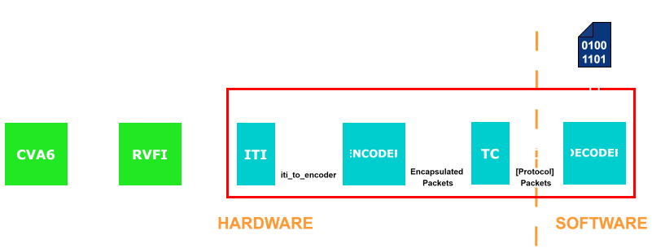
</picture>


## 1. Instruction Trace Interface (ITI)

The **Instruction Trace Interface (ITI)** module is implemented in accordance with the [E-Trace specification](https://github.com/riscv-non-isa/riscv-trace-spec) (2025), specifically section 4.2 concerning the Instruction Trace Interface. It sits between the **cva6\_rvfi** (RISC-V Formal Interface) and the **encoder**, and plays a role in collecting and formatting instruction trace data.

The ITI currently supports **two operating modes**:

* **Multiple-retirement mode**(`block_mode = 1`): the trace data for several instructions is grouped together and sent to the encoder as a block.
* **Single-retirement mode**(`block_mode = 0`): the trace data are sent to the encoder instructions by instructions.

At the moment, the ITI only supports the 3-bit itype format (`itype_len = 3`) for classifying instruction types. This is sufficient to distinguish key instruction categories such as branches, uninferable jumps, exceptions, and interrupts.  While the E-Trace specification also defines a 4-bit format (`itype_len = 4`) for finer-grained classification, this is not yet implemented in the current design. Support for the 4-bit version could be added later if needed and if compatible with the encoder.

> For more details about the `itype` field, refer to Table 7 of the [E-Trace specification](https://github.com/riscv-non-isa/riscv-trace-spec), as well as the field description provided just below.

### Input Interface

<picture>
  <source srcset="Pictures/ITI_diagram_detailed_dark.svg" media="(prefers-color-scheme: dark)">
  <source srcset="Pictures/ITI_diagram_detailed_light.svg" media="(prefers-color-scheme: light)">
  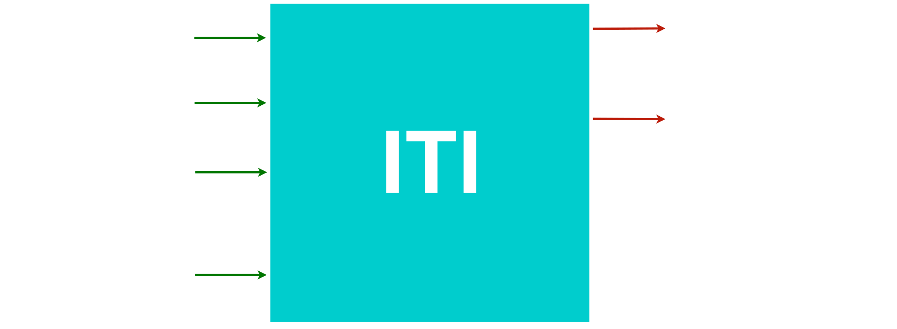
</picture>

<br><br>
The module receives a structured input named **`rvfi_to_iti`**, which encapsulates all the necessary signals to:

* determine the **instruction type (`itype`)** using fields such as `opcode`, `branch_valid`, etc.,
* supply relevant metadata to the encoder like `cycle`, `privilege level`, `pc`, etc.

Changes were also made to the `cva6_rvfi` module to collect the signals required by the ITI and to properly resynchronize them, since they may originate from different stages of the processor pipeline. This justifies the use of a structured interface to ensure reliable and consistent data transfer to the ITI.

---

### Multiple-Retirement Mode

In **multiple-retirement mode**, the ITI groups instructions into **blocks**, based on the occurrence of *special* instructions , typically those altering the control flow (e.g., jumps, exceptions, interrupts).

The ITI outputs the following signals to the encoder in this mode:

* `iret`: number of half-words for the retired instructions in the current block,
* `iaddr`: address of the first instruction in the block,
* `ilastsize`: size of the last instruction in the block.

To support this, the ITI adopts a **systolic-like architecture** made up of `block_retirement` submodules. There are `Nr_commit_ports` such submodules, each able to:

* detect special instructions independently,
* initiate a new block if necessary,
* propagate control and data signals (like `special`, `iaddr`, and incremented `iret`) along a chain.

This design enables the generation of **multiple blocks in a single cycle** when several special instructions retire simultaneously.

<picture>
  <source srcset="Pictures/ITI_diagram_inside_block_mode_dark.svg" media="(prefers-color-scheme: dark)">
  <source srcset="Pictures/ITI_diagram_inside_block_mode_light.svg" media="(prefers-color-scheme: light)">
  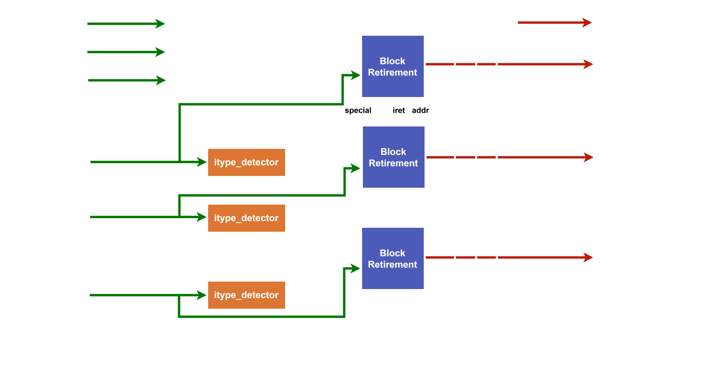
</picture>


---
### Single-Retirement Mode

In **single-retirement mode**, the ITI module forwards the trace information **instruction by instruction**, without grouping them into blocks.

In this configuration:

* There is no need to track special instructions or segment blocks.
* The encoder receives a simple feed of retired instructions, making this mode well-suited for simpler architectures.


<picture>
  <source srcset="Pictures/ITI_diagram_inside_single_mode_dark.svg" media="(prefers-color-scheme: dark)">
  <source srcset="Pictures/ITI_diagram_inside_single_mode_light.svg" media="(prefers-color-scheme: light)">
  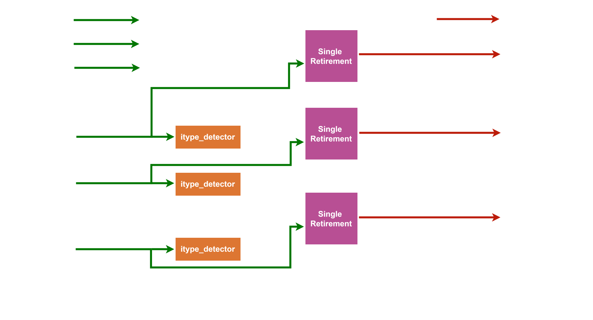
</picture>

---
### Full System Overview

The overall role of the ITI module in the trace infrastructure is summarized in the following diagram:
<picture>
  <source srcset="Pictures/ITI_diagram_dark.svg" media="(prefers-color-scheme: dark)">
  <source srcset="Pictures/ITI_diagram_light.svg" media="(prefers-color-scheme: light)">
  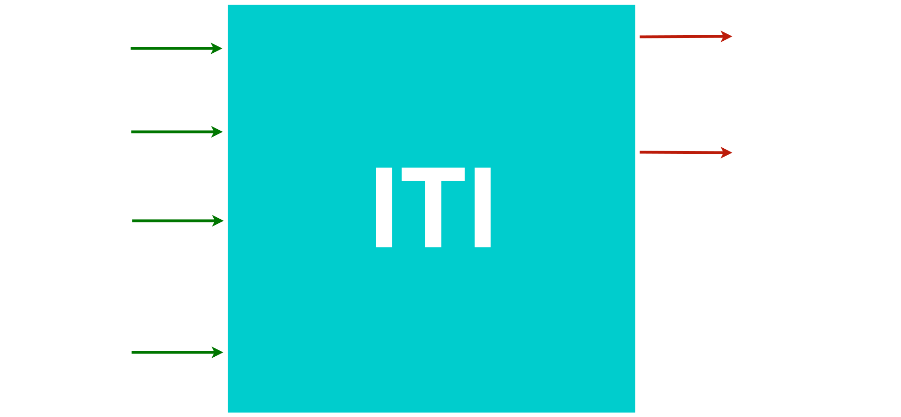
</picture>

---
### Continuous Integration for ITI

The CI (Continuous Integration) test for the ITI is contained in Instr_tracing_test.sh and consist of running a simulation on ariane_testharness with the previous test iti_test.sh and extracting the iti.trace. Then it run the regressionFlow from the [E-Trace specification](https://github.com/riscv-non-isa/riscv-trace-spec) and compare both files.
We cleaned both file to compare what is comparable ,we exclude the start and the end because it's not matching based spike version


## 2. Encoder + Encapsulator

### Collaboration and Reference Design

For this module, we collaborate with the University of Bologna by integrating their version of the encoder, available 
[here](https://github.com/pulp-platform/rv_tracer)

Their repository is well-documented and serves as a solid foundation. The encoder design is aligned with the **E-Trace specification** and leverages an ITI running in **multiple-retirement mode** to emit **trace packets**. These packets are structured according to the **instruction delta trace algorithm** described in the [E-Trace specification](https://github.com/riscv-non-isa/riscv-trace-spec) (Figure 1), which provides a model for encoding deltas (non-linearities) in the control flow.

Each data trace outputed by the ITI, whether block-based or instruction-based, is interpreted to identify these deltas and transmit them in the form of trace packets. These packets vary in format and size depending on the instruction type and control flow transitions.

---

### Custom Implementation and Simplification

While their encoder provides a baseline, it remains under active development. In its current state, its behavior (in terms of number of packets emitted, their contents, or supported options) differs from the Reference Flow.

As a result, we opted to build a simplified version derived from the original architecture. This internal encoder:

* Expects **instruction-by-instruction traces** as input,
* Supports only **Nr\_commit\_ports = 1** (single commit port),
* Implements only a **basic subset** of the E-Trace functionality.

This choice facilitates initial validation and integration, though we remain open to switching back to a mature multiple-retirement encoder once available.

Below is a high-level architectural diagram of the current encoder setup (here `N=1`):
<picture>
  <source srcset="Pictures/Encoder_dark.svg" media="(prefers-color-scheme: dark)">
  <source srcset="Pictures/Encoder_light.svg" media="(prefers-color-scheme: light)">
  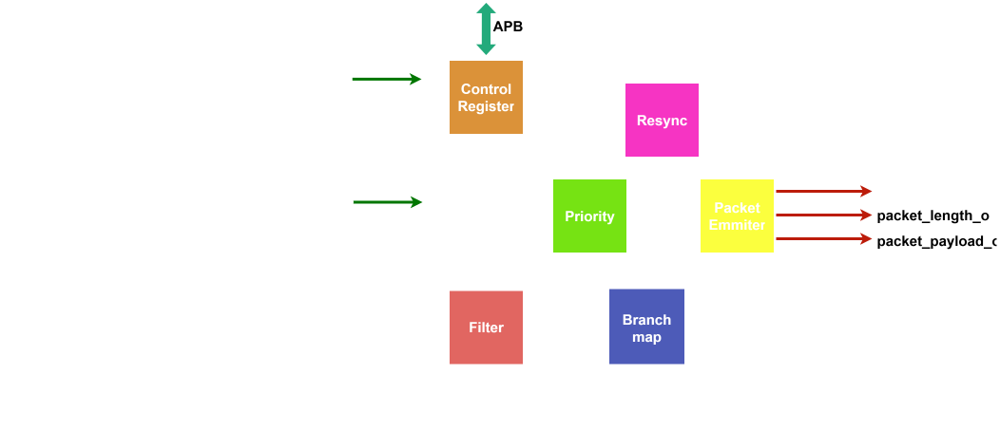
</picture>

---

### Submodules Description

The encoder is composed of several key submodules:

### Submodules Description

The encoder is composed of several key submodules:

* **Priority**:  
  This submodule constitutes the core of the *Instruction Delta Trace Algorithm*. It is responsible for analyzing control flow transitions across instructions and determining the format and/or subformat of trace packets to be emitted.  
  
  <picture>  
    <source srcset="Pictures/Priority_dark.svg" media="(prefers-color-scheme: dark)">
    <source srcset="Pictures/Priority_light.svg" media="(prefers-color-scheme: light)">
    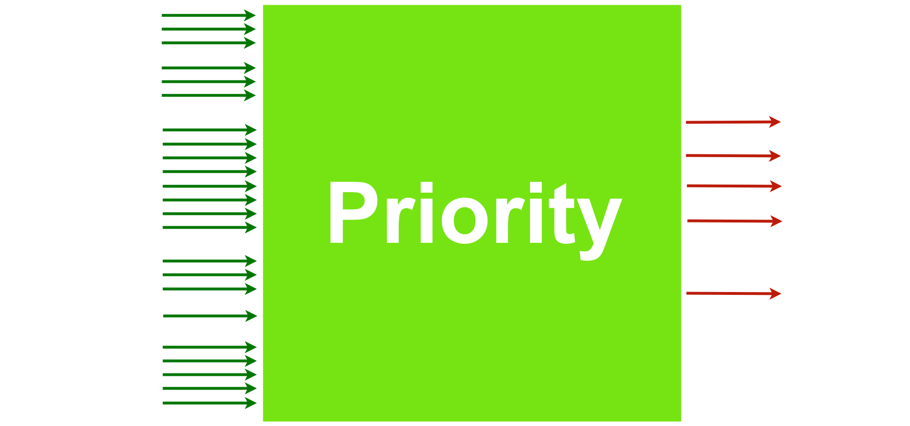
  </picture>

  The logic is driven by three categories of input signals that represent the state of the instruction stream at different points in time:  
  - **lc**: *Last Cycle* - information from the previous retired instruction,  
  - **tc**: *This Cycle* - information from the currently retiring instruction,  
  - **nc**: *Next Cycle* - information from the next instruction.  
  
  > Some signals are intentionally absent for the sake of understanding

  Using these signals, the `Priority` module identifies the relevant **deltas** (e.g., taken branches, jumps, exceptions) and selects the appropriate **packet format and/or subformat**, which will subsequently guide the `Packet_Emitter`.  

  <div align="center">

  | Format   | Subformat | Description         |
  | :------: | :-------: | :------------------ |
  | 3        | 3         | Support             |
  |          | 2         | Context             |
  |          | 1         | Trap                |
  |          | 0         | Synchronisation     |
  | 2        |           | Address Only        |
  | 1        |           | Branch              |  
  | 0        |           | Optional extensions |
  </div>  

  > For more details, refer to [Chapter 7 (Instruction Trace Encoder Output Packet)](https://github.com/riscv-non-isa/riscv-trace-spec) (2025), or consult the corresponding encoder section in the [University of Bologna's implementation](https://github.com/pulp-platform/rv_tracer).


* **Packet_Emitter**:  
  This submodule is responsible for **constructing and filling the trace packet** to be emitted. It plays a central role in materializing the output of the delta trace algorithm into a well-structured packet format compliant with the E-Trace specification.

  <picture>  
    <source srcset="Pictures/Emmiter_dark.svg" media="(prefers-color-scheme: dark)">
    <source srcset="Pictures/Emmiter_light.svg" media="(prefers-color-scheme: light)">
    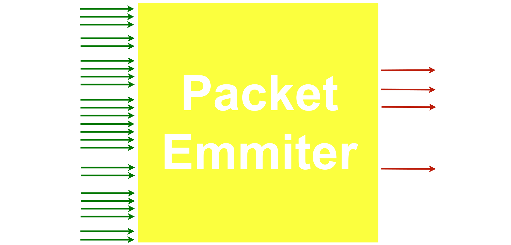
  </picture>

  Similar to the `Priority` module, it receives multiple input signals that span across different time domains (*lc*,*tc*,*nc*).

  However, the most important **inputs** for this submodule is the **packet format and/or subformat**, which is deteminated by the `Priority` module. This format/subformat dictates the structure and contents of the packet's payload. Also **ppccd** means privilege change, precise context change or context change with discontinuity.

  Based on this, the `Packet_Emitter` output:
  - The **payload** which contains all the fields expected for this packet,
  - The **packet length** (in bytes), depending on the format/subformat and data,
  - A **branch_map_flush** signal that is used to flush the `branch_map` field. This ensures the `branch_map` is ready to accurately track future branches for the next packet.

  > For a complete description of each packet type and its associated payload content, refer to [Chapter 7 (Instruction Trace Encoder Output Packet)](https://github.com/riscv-non-isa/riscv-trace-spec) of the E-Trace specification (2025).

* **Filter**:  
  The `Filter` submodule is responsible for **selectively enabling or disabling instruction tracing** (with the qualified signal) based on configurable events defined through **Control Registers**. By filtering out irrelevant or redundant instructions, it can significantly improves trace analysis efficiency and bandwidth usage.

  <picture>  
    <source srcset="Pictures/Filter_dark.svg" media="(prefers-color-scheme: dark)">
    <source srcset="Pictures/Filter_light.svg" media="(prefers-color-scheme: light)">
    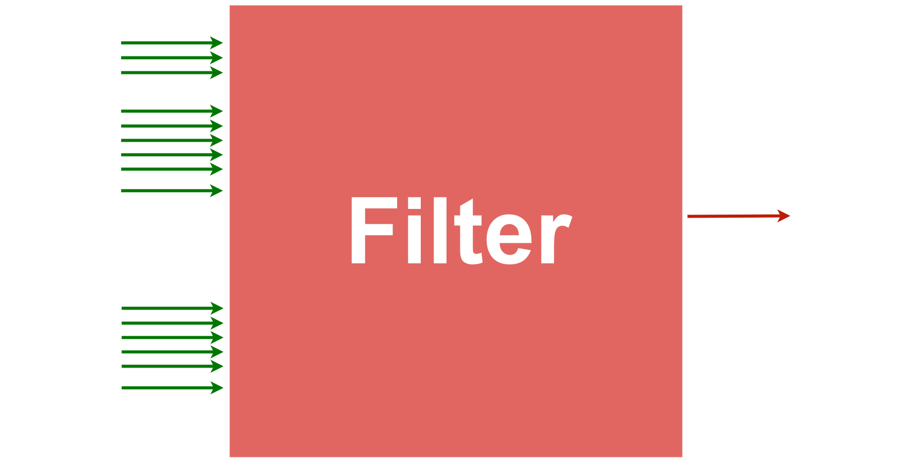
  </picture>

  The filtering mechanism supports a variety of events, including:

  - **Range Address**: Enables tracing **only when the instruction address (`iaddr`) falls within a specified address window**, defined by a `lower_addr` and a `higher_addr` boundary.
  - **Stop Event**: Immediately halts instruction tracing when triggered.
  - **Selected Privilege Level**: Enables or disables tracing depending on the **current privilege level** (e.g., user, supervisor, machine mode).
  - **Other Events**: Filtering can also be triggered by **exceptions**, **interrupts**, or other **context-specific conditions**.


* **Branch\_Map**:  
  The `Branch_Map` submodule acts as a **history buffer** for recently executed branch instructions. It plays a crucial role in the generation of compressed trace packets by allowing the encoder to **reconstruct control-flow paths** through a compact representation.
  <picture>  
    <source srcset="Pictures/Branch_map_dark.svg" media="(prefers-color-scheme: dark)">
    <source srcset="Pictures/Branch_map_light.svg" media="(prefers-color-scheme: light)">
    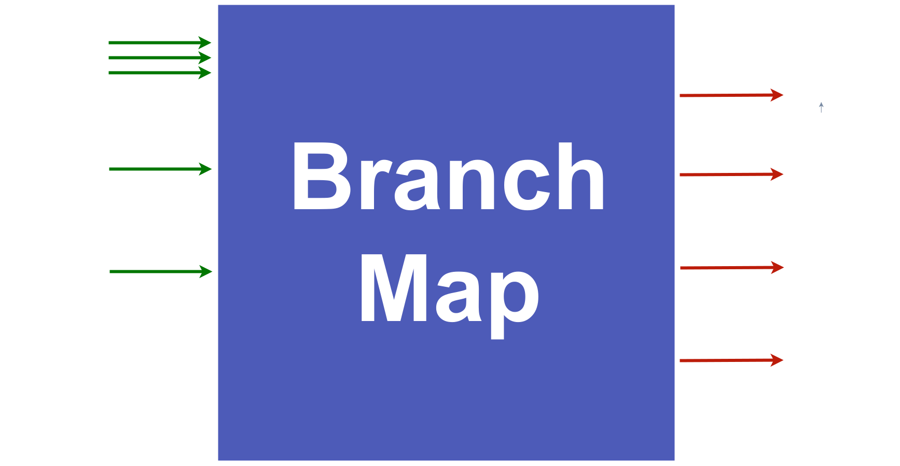
  </picture>

  This module maintains two key outputs:

  - **`branch_map`**: a **bitfield** representing the history of up to 31 conditional branches. For each branch, a **bit is added to the right**:
    - `0` if the branch was **taken**,
    - `1` if the branch was **not taken**.
  
  - **`branches`**: an **integer count** of how many branches are currently stored in the map (max: **31**). This counter helps determine the valid width of the `branch_map` field and guides packet formatting/decoding.

  The branch_map is updated as instructions retire. Once the maximum depth is reached or a flush is triggered (e.g., via `branch_map_flush` from the `Packet_Emitter`), the map is cleared to allow tracking of the next sequence.

  Here is an illustrative example, taken from [E-Trace Specification – Chapter 12, Example 4](https://github.com/riscv-non-isa/riscv-trace-spec).

  <picture>  
    <source srcset="Pictures/Branch_example_dark.svg" media="(prefers-color-scheme: dark)">
    <source srcset="Pictures/Branch_example_light.svg" media="(prefers-color-scheme: light)">
    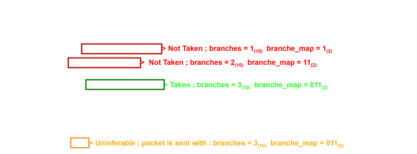
  </picture>


---

### Encapsulation Module

This module was developed by the **University of Bologna**, and we reused the `encapsulator.sv` module **as-is**, without any modifications. We chose **not to integrate the other submodules** provided in the original repository, as they are designed for the **ATB (Advanced Trace Bus)** protocol. In our case, we rely on a different trace output interface, named **DPTI (Digilent Parallel Transfer Interface)**, making the use of those ATB-specific modules unnecessary. [Here](https://github.com/pulp-platform/rv_encapsulator) is the repository of the encapsulator from the **University of Bologna**.

The **encapsulator** is placed directly after the encoder and is responsible for wrapping each trace packet into a **standardized encapsulation format** as defined by the [encapsulation specification](https://github.com/riscv-non-isa/e-trace-encap).

This format ensures **interoperability**, provides **framing rules**, and facilitates **packet-level synchronization** in the *transmission channel* interface. Each encapsulated packet in this implementation is **fixed at 320 bits (40 bytes)** and includes this field groups:

- **Header (8 bits)**:  
  Includes a `length` field (5 bits) specifying the payload size in bytes, a `flow` field (2 bits) which is currently set to `00` (no multi-sink used yet), and an `extend` bit (1 bit) which is set to `1`, indicating the presence of a timestamp (T ? in the figure bellow).
  
- **Timestamp (`T * 8` bits)**:  
  The timestamp is included in our packets and is **fixed at 8 bytes (64 bits)**. Its presence is governed by the `extend` bit in the header.
  
- **Payload (1–248 bits)**:  
  Contains the actual trace packet, emmited by the encoder with `packet_payload_o`.

An illustration of the encapsulation structure is shown below:

<picture>  
  <source srcset="Pictures/Encapsulated_Packet_dark.svg" media="(prefers-color-scheme: dark)">
  <source srcset="Pictures/Encapsulated_Packet_light.svg" media="(prefers-color-scheme: light)">
  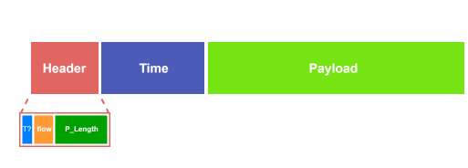
</picture>
<br></br>

Once encapsulated, the packets are written into a **FIFO buffer**, where they await transmission through the trace communication channel.

This design enables modular evolution: improvements or full spec-compliance in the encoder can be adopted later without altering the overall encapsulation and transmission stages.
<br></br>

> While the [encapsulation specification](https://github.com/riscv-non-isa/e-trace-encap) also defines support for **source IDs** , **null packets** (e.g., `null.idle`, `null.alignment`), and **synchronization sequences**, these features are **not yet implemented** in the current prototype.

### Continuous Integration for Encoder + Encapsulator

The CI (Continuous Integration) test for the Encoder and  Encapsulator is also contained in Instr_tracing_test.sh and consists in running a simulation on ariane_testharness with the previous test iti_test.sh and extracting the `encoded.trace`, it will convert them in decaspulated csv format with the Decapsuler. Then it runs the regressionFlow from the [E-Trace specification](https://github.com/riscv-non-isa/riscv-trace-spec) and compare both files.
We cleaned both file to compare what is comparable, again we exclude the start and the end because it's not matching based spike version.


---


## 3. Transmission Channel (TC) via DPTI

<div align="center">
  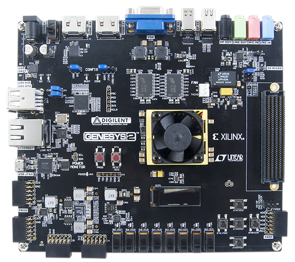
  <p><em>Figure: Digilent Genesys2 development board</em></p>
</div>

Picture from [Digilent Reference Manual](digilent.com/reference/programmable-logic/genesys-2/reference-manual)
<br></br>
Since most onboard peripherals (UART, SPI, etc.) are already used by the `ariane_xilinx` platform, we use the **FTDI FT2232H**'s DPTI interface exposed on the **USB-JTAG bridge (J17)**:

<div align="center">
  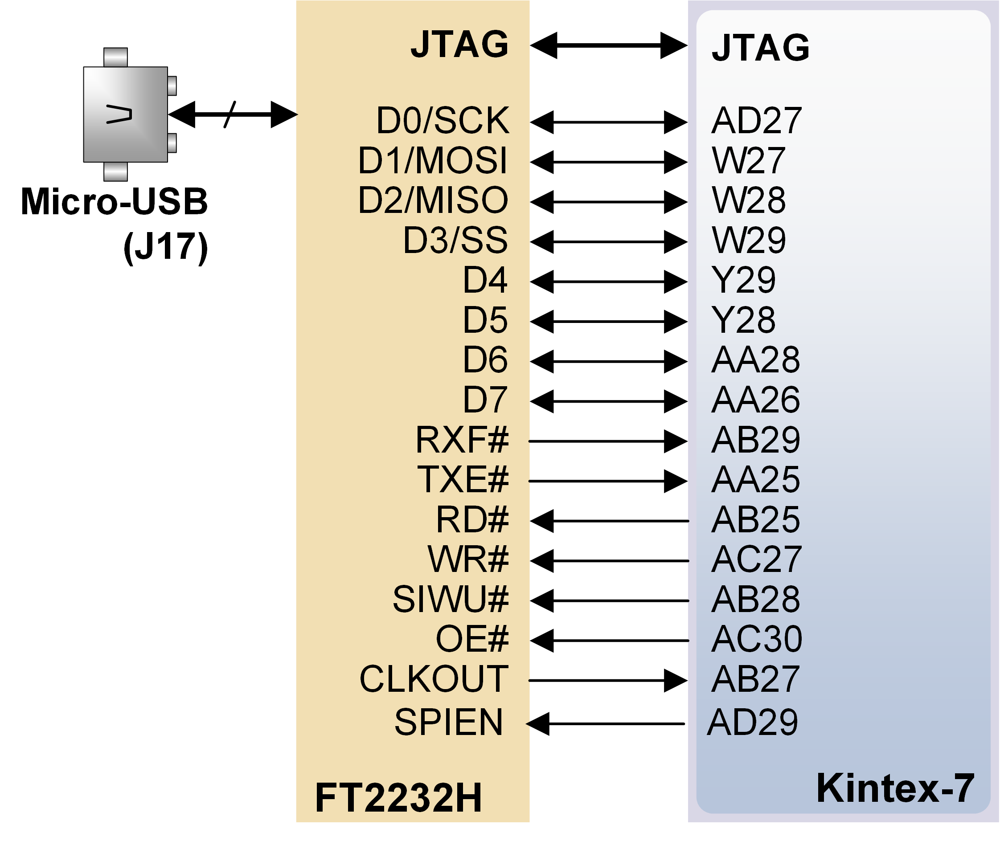
  <p><em>Figure: USB-JTAG bridge </em></p>
</div>

Picture from [Digilent Reference Manual](digilent.com/reference/programmable-logic/genesys-2/reference-manual)

- **DPTI/DSPI header** on J17 provides:
  - A **Digilent Parallel Transfer Interface (DPTI)** channel
  - A generic SPI channel (not used here due to limited bandwidth)

We selected **DPTI** because it is a **mature, out‑of‑the‑box solution** full driver support from Digilent Adept ([Adept Drivers & Utilities](https://digilent.com/reference/software/adept/)).

---

### FT2232H Ports in Genesys 2

The FT2232H chip offers two independent channels but in the Top platform `ariane_xilinx` both of them are used :

| Port  | Default Use in `ariane_xilinx`|
|-------|-------------------------------|
| Port A| Bitstream injection           |
| Port B| Debug Module interface        |

Because both channels are occupied, we have two deployment options:

1. **Re-purpose Port B**  
   - **Disconnect the Debug Module** in `ariane_xilinx.sv`.  
   - Update `genesys.xdc` to add DPTI pin constraints (e.g., check the [default constraint file](https://github.com/Digilent/digilent-xdc/blob/master/Genesys-2-Master.xdc) section DPTI).  
   - Inject your program via the on‑chip **bootrom**, modify the Makefile in `corev_apu/fpga/src/bootrom` accordingly.

2. **Add an FT2232H MiniModule**  
   - Use a standard [FT2232H Mini Module](https://ftdichip.com/products/ft2232h-mini-module/) connected to two PMOD headers.  
   - This gives you two **additional** FT2232H channels without touching the existing Port A/B setup.

  <div align="center">
    
    <p><em>Figure: FT2232H MiniModule wired to Genesys2 PMODs</em></p>
  </div>
<br></br>
<div style="display: flex; justify-content: center; gap: 30px;">
  <picture>
    <source srcset="Pictures/JA_dark.svg" media="(prefers-color-scheme: dark)">
    <source srcset="Pictures/JA_light.svg" media="(prefers-color-scheme: light)">
    
  </picture>

  <picture>
    <source srcset="Pictures/JB_dark.svg" media="(prefers-color-scheme: dark)">
    <source srcset="Pictures/JB_light.svg" media="(prefers-color-scheme: light)">
    
  </picture>
</div>
<br></br>

> For more details on the wiring, check these resources:
> - [FT2232H Datasheet](https://ftdichip.com/wp-content/uploads/2024/09/DS_FT2232H.pdf), Table 3.1
> - [FT2232H Mini Module Datasheet](https://ftdichip.com/wp-content/uploads/2020/07/DS_FT2232H_Mini_Module.pdf), Table 3.1 and Table 3.2 and USB Bus-powered section.

---

### Platform Modifications

<picture>  
  <source srcset="Pictures/TC_dark.svg" media="(prefers-color-scheme: dark)">
  <source srcset="Pictures/TC_light.svg" media="(prefers-color-scheme: light)">
  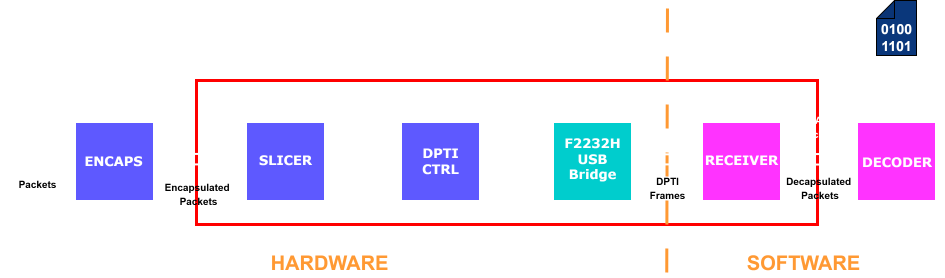
</picture>


1. **DPTI Controller**  
    - Add `dpti_ctrl.vhd` to handle **frame send/receive** over DPTI. This module is provided by Digilent and can be found in the [**Digilent Adept SDK**](https://lp.digilent.com/complete-adept-runtime-download), under `samples/dpti/DptiDemo/logic/dpti_ctrl.vhd`.
    - Protocol: **8-bit parallel**, synchronous/asynchronous, running at **60 MHz**, allowing for up to **480 Mbps** throughput.
    - The controller requires a clock. It is instantiated in the platform using `xlnx_dpti_clk` located in `cva6/corev_apu/fpga/xilinx/xlnx_dpti_clk`. Alternatively, it can be added to the Vivado project using a Clock Wizard. An example configuration is available in `samples/dpti/DptiDemo/logic/clk_wiz_0.v`.

2. **Packet Slicer**  
   - Our trace packets are **320 bits** (40 bytes).  
   - Insert `slicer_DPTI.sv` to segment each packet into **40 eight‑bit frames** for DPTI transport.

3. **PMOD Pin Mapping & Constraints**  
   - PMOD pins used must support external clock (C‑capable). Follow [UG472](https://docs.amd.com/v/u/en-US/ug472_7Series_Clocking) (Vivado) guidelines.  
   - Example excerpt from `genesys2.xdc`:
     ```xdc
      ## PMOD Header JA
      #set_property -dict { PACKAGE_PIN U27   IOSTANDARD LVCMOS33 } [get_ports prog_clko]; #IO_L13P_T2_MRCC_14 Sch=ja_p[1]
      #set_property -dict { PACKAGE_PIN U28   IOSTANDARD LVCMOS33 } [get_ports prog_oen]; #IO_L13N_T2_MRCC_14 Sch=ja_n[1]
      #set_property -dict { PACKAGE_PIN T26   IOSTANDARD LVCMOS33 } [get_ports prog_rdn]; #IO_L12P_T1_MRCC_14 Sch=ja_p[2]
      #set_property -dict { PACKAGE_PIN T27   IOSTANDARD LVCMOS33 } [get_ports prog_rxen]; #IO_L12N_T1_MRCC_14 Sch=ja_n[2]
      #set_property -dict { PACKAGE_PIN T22   IOSTANDARD LVCMOS33 } [get_ports prog_siwun]; #IO_L5P_T0_D06_14 Sch=ja_p[3]
      #set_property -dict { PACKAGE_PIN T23   IOSTANDARD LVCMOS33 } [get_ports prog_spien]; #IO_L5N_T0_D07_14 Sch=ja_n[3] // Not needed here
      #set_property -dict { PACKAGE_PIN T20   IOSTANDARD LVCMOS33 } [get_ports prog_txen]; #IO_L4P_T0_D04_14 Sch=ja_p[4]
      #set_property -dict { PACKAGE_PIN T21   IOSTANDARD LVCMOS33 } [get_ports prog_wrn]; #IO_L4N_T0_D05_14 Sch=ja_n[4]

      ## PMOD Header JB
      #set_property -dict { PACKAGE_PIN V29   IOSTANDARD LVCMOS33 } [get_ports { prog_d[0] }]; #IO_L17P_T2_A14_D30_14 Sch=jb_p[1]
      #set_property -dict { PACKAGE_PIN V30   IOSTANDARD LVCMOS33 } [get_ports { prog_d[1] }]; #IO_L17N_T2_A13_D29_14 Sch=jb_n[1]
      #set_property -dict { PACKAGE_PIN V25   IOSTANDARD LVCMOS33 } [get_ports { prog_d[2] }]; #IO_L18P_T2_A12_D28_14 Sch=jb_p[2]
      #set_property -dict { PACKAGE_PIN W26   IOSTANDARD LVCMOS33 } [get_ports { prog_d[3] }]; #IO_L18N_T2_A11_D27_14 Sch=jb_n[2]
      #set_property -dict { PACKAGE_PIN T25   IOSTANDARD LVCMOS33 } [get_ports { prog_d[4] }]; #IO_L14P_T2_SRCC_14 Sch=jb_p[3]
      #set_property -dict { PACKAGE_PIN U25   IOSTANDARD LVCMOS33 } [get_ports { prog_d[5] }]; #IO_L14N_T2_SRCC_14 Sch=jb_n[3]
      #set_property -dict { PACKAGE_PIN U22   IOSTANDARD LVCMOS33 } [get_ports { prog_d[6] }]; #IO_L21P_T3_DQS_14 Sch=jb_p[4]
      #set_property -dict { PACKAGE_PIN U23   IOSTANDARD LVCMOS33 } [get_ports { prog_d[7] }]; #IO_L21N_T3_DQS_A06_D22_14 Sch=jb_n[4]
     ```
   - Ensure **V3V3** pins are tied to **VIO** in the MiniModule.

4. **FT2232H Configuration**  
   - Use **FT_Prog** (or equivalent) to set the MiniModule into **USB FIFO mode**.  
   - ⚠️ Digilent Adept drivers validate a protected EEPROM region not writable via FT_Prog.  
     - Either use Digilent reprogramming executable  
     - Or adapt the C++ receiver to be compatible with the FTDI drivers.

  <div align="center">
    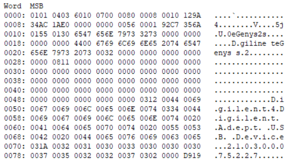
    <p><em>Figure: Valid EEPROM for DPTI</em></p>
  </div>

---

### Bitstream Build & Deployment

Once hardware wiring and constraints are in place with ITI, Encoder, Encapsulator, etc. :
> We used Vivado version: 2018.2
```bash
make clean
make fpga TARGET=cv32a6_imac_sv32
```

Then upload the generated ariane_xilinx.bit via Vivado Lab or your preferred hardware manager.

---
## 4. Software-Side Reception

The trace reception is handled on a **Linux-based host PC**, which is connected either to the **FTDI MiniModule** or directly to the **Genesys2 board via port J17**.

To enable communication via **DPTI (Digilent Parallel Trace Interface)**, you must first install the [**Digilent Adept SDK**](https://lp.digilent.com/complete-adept-runtime-download), specifically version `2.4.2`. This provides the required runtime libraries and development headers. The receiver code needs a C++17 version for `std::optional`.

---

### Setup Instructions

1. **Install Adept SDK**

   * Ensure the Digilent API is installed and correctly configured.
   * The official Digilent SDK and documentation provide a guide.

2. **Configure and Compile the Receiver**

   * The receiver code is located in `Receiver_DPTI.cpp`.
   * You must **edit the `Makefile`** to match the paths to the Adept libraries and headers.

     * Refer to the README files in `digilent.adept.sdk_2.4.2/samples` for more informations .
   * Then compile the program with:

     ```bash
     make clean
     make
     ```

3. **Device Detection and Debugging**

   * The receiver includes debug function, such as `Scan_Device`, which:

     * Lists connected FTDI devices
     * Displays their names

4. **Configure BOARD\_NAME**

   * You must update the `BOARD_NAME` field in `Receiver_DPTI.cpp` to match the actual serial string of your connected device.
   * Example:

     ```cpp
     char* BOARD_NAME = (char*) "#tpt_0001#ptc_0002#210300075227";
     ```
   * After editing the file, recompile:

     ```bash
     make clean
     make
     ```

5. **Running the Receiver**

   * Launch the receiver with:

     ```bash
     ./Receiver_DPTI
     ```
   * The program proceeds in **two phases**:

     * **Acquisition Phase**: Data is streamed and stored in raw format. Stop the acquisition with `SIGINT` (Ctrl+C).
     * **Decapsulation Phase**: The raw binary packets are parsed and converted into human-readable CSV format.


  <div align="center">
    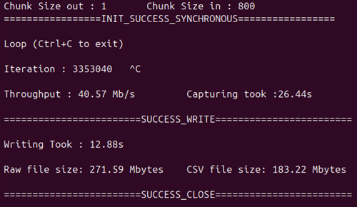
    <p><em>Figure: Valid execution ./Receiver_DPTI</em></p>
  </div>

---

### Output Files

Two output files are generated in the `receiver_data/` directory:

* `YYYYMMDD_hhmm_raw_file.txt` - the raw encapsulated packets
* `YYYYMMDD_hhmm_data.csv` - the decoded content in CSV format

These CSV files can be supplied to a decoder for further analysis.

>Currently, no custom decoder is implemented. We use the reference decoder provided in the Reference Flow repository to interpret the trace contents. The University of Bologna released a version of their decoder on 3rd July 2025, but we have not evaluated it yet.

--- 

## 5. Decoder

At this stage, we have **not yet implemented** our own decoder. Instead, we rely on the **Reference Flow decoder** provided by the E‑Trace specification.

#### Running the Reference Flow

To perform decoding, you first need to run the full reference flow regression so that it can generate the files from the program binary required by its version of Spike(in the `referenceFlow`). In addition, your compiled program must be renamed with a `.riscv` extension so that the flow recognizes it as RISC‑V input and it need to be place in `referenceFlow/tests/test_files`.

1. **Prepare your binary**  
   ```bash
   cp path/to/your_program.elf referenceFlow/tests/test_files/your_program.riscv
   ```
2. **Execute the full reference flow**
```bash
cd referenceFlow
./scripts/run_regression.sh \
  -t itype3_debug  \        
  --annotate \
  --debug\
  tests/test_files/your_program.riscv
```  

  * `-t`: Specify the test suite used, here we choose `itype3_debug` to match our encoder and `_debug` to add more information in packets like `full_address mode`
  * `--annotate`: This flag is optionnal and using it create annotated version of output files , usefull for understanding/debugging
  * `--debug`: This flag is optionnal and using it will print in the terminal more informations about each stage 

### Decoding the Trace
Once the reference flow regression has run successfully (and generated the files needed), you can invoke the decoder step: 

```bash
cd referenceFlow
./scripts/decoder_model.py \
  -u regression_YYYYMMDD_hhmmss/itype3_debug/your_program.decoder.ucf  \        
  -c regression_YYYYMMDD_hhmmss/itype3_debug/hardware.scf \
  -i TRACE_OUTPUT

```  
  * `-u`: user_config, this file is generated with the first regression, inside there are information about debug flags, object-files, encoder configuration, etc 
  * `-c`: static_config, this file is also generated but correspond to test suite you choose, inside there are informations about default values (size of fields, encoder options, etc)
  * `-i`: This file is the output of the encoder by default :`regression_YYYYMMDD_hhmmss/itype3_debug/your_program.te_inst_raw` but you can use the trace from the receiver, it support CSV format and raw format (needs to be a real binary in this case)

  If everything matches, meaning there are no difference between the captured trace and the reference Trace, you will obtain an output file like this:
  
  <div align="center">
    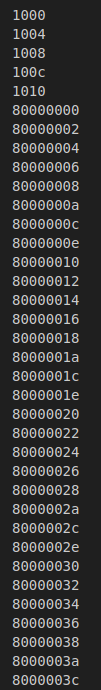
    <p><em>Figure: Excerpt from decoded trace </em></p>
  </div>

<br></br>
⚠️ Mismatches can occur if, for example:

* The platform's address map (CrossBar) doesn't align with your binary's load addresses

* The encoder fails to emit a packet (e.g., due to a bug in the encoder)

* There is receiver desynchronization or signal glitches during trace capture

### Current Limitations & Future Work
When we load the program via the onboard Debug Module, you will notice "trace pollution" : extra instructions corresponding to debug and JTAG activity appear in the trace. One way to mitigate this is to use the Filter submodule in the encoder to suppress unwanted instructions. However:

**Problem:** We have not yet exposed the APB path needed to drive the Filter's control registers at runtime.

**Next Steps:** Extend the encoder to include an APB interface for the Filter module, allowing dynamic trace filtering before encapsulation.


## 6. Debug Automation & VSCode Setup

This section presents a set of **automation tools and configurations** developed to streamline the debug process using **Visual Studio Code (VSCode)**. The goal is to make it easy to:

* **Compile user programs** into a binary format compatible with the **CV32A6** core
* **Launch OpenOCD** using the expected configuration (`ariane.cfg`)
* **Start GDB** in **remote debug mode**, attached to the target via OpenOCD

---

### VSCode Integration

To integrate these operations directly within the VSCode interface, we make use of two special configuration files:

* `.vscode/launch.json` - defines how to start a debugging session
* `.vscode/tasks.json` - defines custom build and terminal commands

With this setup, you can use the built-in **debug pane** of VSCode to:

* Upload and connect to the board
* Step through code using breakpoints and GDB integration

These files must be placed inside a `.vscode/` directory at the root of the project.

---

### File Overview 

**launch.json**

```json
{
    "version": "0.2.0",
    "configurations": [
      {
        "name": "Debug FPGA via OpenOCD",
        "type": "cppdbg",
        "targetArchitecture": "x86_64",
        "request": "launch",
        "program": "${workspaceFolder}/Prog_compiled",
        "miDebuggerServerAddress": "localhost:3333",
        "useExtendedRemote": true,
        "miDebuggerPath": "toolchain/bin/riscv-none-elf-gdb",
        "stopAtEntry": true,
        "stopAtConnect": true,
        "cwd": "${workspaceFolder}",
        "environment": [],
        "externalConsole": false,
        "MIMode": "gdb",
        "preLaunchTask": "build-and-start-openocd",
        "postRemoteConnectCommands": [
          {
           "text": "source ${workspaceFolder}/gdb_init.txt" 
          }
        ]
        }
    ]
  }
```

**tasks.json**

```json
{
    "version": "2.0.0",
    "tasks": [

        {
            "label": "build-exec",
            "type": "shell",
            "command": "riscv-none-elf-gcc",
            "args": [
                "-g", "-T", "custom_linker.ld",
                "-march=rv32imac_zicsr",
                "-lgcc", "-fvisibility=hidden",
                "-mcmodel=medany", "-mabi=ilp32",
                "-nostartfiles", "crt.S", "syscalls.c", "test.c",
                "-o", "Prog_compiled"
            ],
            "problemMatcher": [],
            "group": {
                "kind": "build",
                "isDefault": true
            }
        },
        {
        "label": "start openocd",
        "type": "shell",
        "command": "bash",
        "args": [
            "-c",
            "nohup gnome-terminal -- bash -c \"openocd -f ariane.cfg; exec bash\""
        ],
        "problemMatcher": []
    },
    {
        "label": "build-and-start-openocd",
        "dependsOn": ["build-exec", "start openocd"]
    }
    ]
  }


```

These configurations are adaptable to your own build system or directory structure.

---

### Additional Resources

* [VSCode Debugging Documentation](https://code.visualstudio.com/docs/debugtest/debugging)
* [VSCode Task Configuration](https://code.visualstudio.com/docs/debugtest/tasks)
