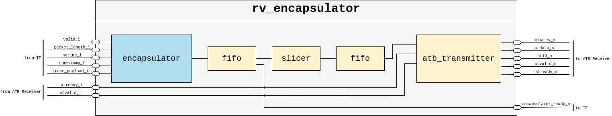
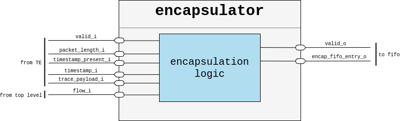
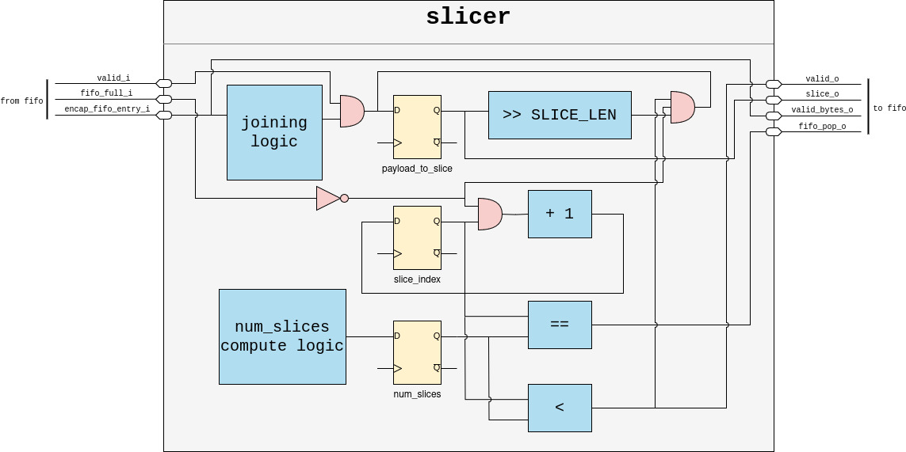
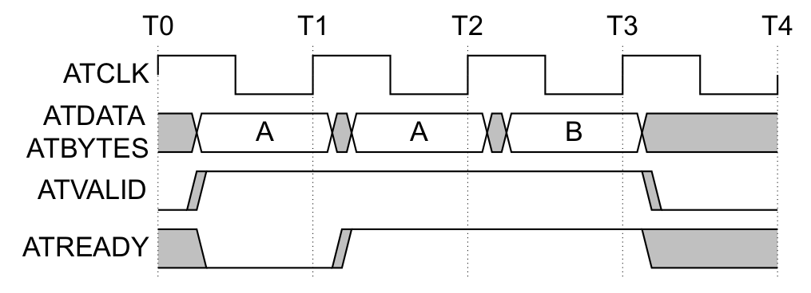
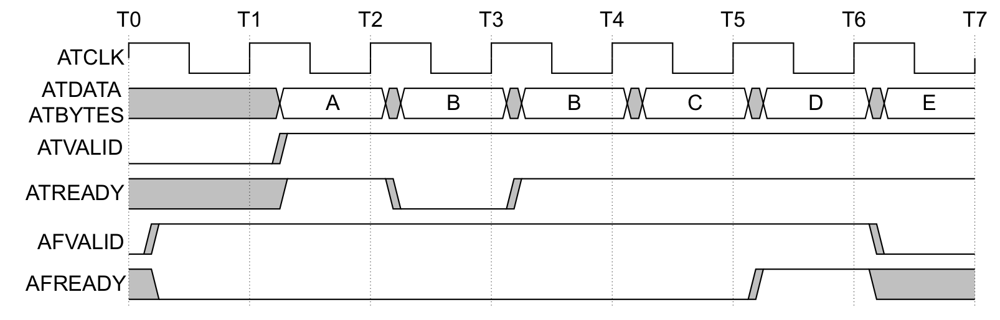
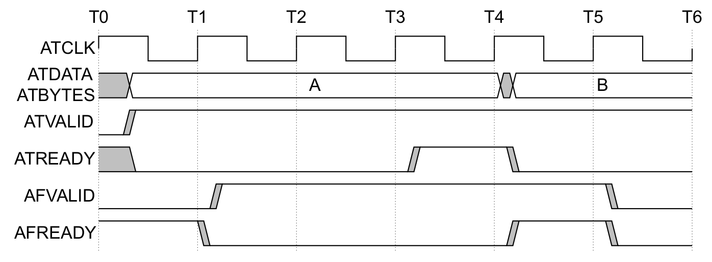
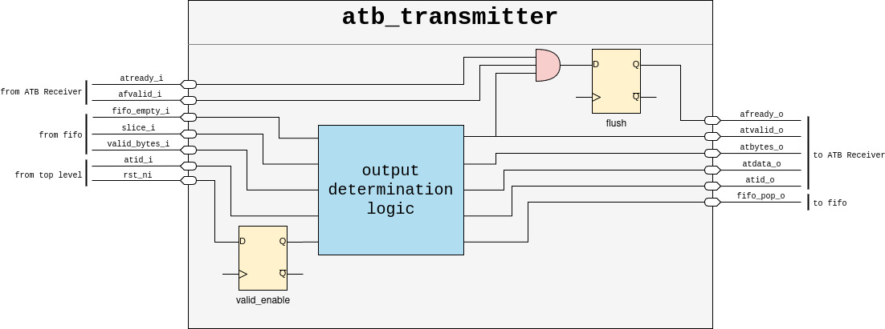

[comment]: <> (Author:  Umberto Laghi)
[comment]: <> (Contact: umberto.laghi2@unibo.it)
[comment]: <> (Github:  @ubolakes)

# rv_encapsulator
[](LICENSE)

System Verilog implementation of the *Unformatted Trace &amp; Diagnostic Data Packet Encapsulation for RISC-V* specification.

rv_encapsulator is developed as part of the PULP project, a joint effort between ETH Zurich and the University of Bologna.

## License
Unless specified otherwise in the respective file headers, all code checked into this repository is made available under a permissive license. All hardware sources and tool scripts are licensed under the Solderpad Hardware License 0.51 (see [`LICENSE`](LICENSE)) or compatible licenses, except for files contained in the `docs` directory, which are licensed under the [Creative Commons Attribution-NoDerivates 4.0 International](https://creativecommons.org/licenses/by-nd/4.0) license (CC BY-ND 4.0).
The file `generate_do.py` is licensed under [Apache 2.0](https://www.apache.org/licenses/LICENSE-2.0) license.

## Short summary

### Modules present
<div align="center">

| Name              | Short description                                                 |
| :---------------: | :---------------------------------------------------------------: |
| rv_encapsulator   | top level                                                         |
| encapsulator      | creates the encapsulation structure defined in the specification  |
| slicer            | turns the encapsulated packet into sequentally output slices      |
| atb_transmitter   | communicates with the ATB bridge                                  |
</div>

### Testing progress
<div align="center">

| Module            | Tested                |
| :---------------: | :-------------------: |
| rv_encapsulator   | :white_check_mark:    |
| encapsulator      | :white_check_mark:    |
| slicer            | :white_check_mark:    |
| atb_transmitter   | :white_check_mark:    |
</div>

### How to run it
After downloading the repo, move inside the repo:
```
cd rv_encapsulator
```
Then, run the simulation:
```
make run
```
Between one run and the other launch the command:
```
make clean
```

## Design

### Introduction
In modern CPUs, comprehending program behavior presents significant challenges. It is not surprising that software in such environments may occasionally deviate from expected performance and behavior.  
This unpredictability may depend on various factors, including interactions with other cores, software components, peripherals, real-time events, suboptimal implementations, or a combination of these factors.

To tackle this challenge, a less intrusive and efficient technique to performance debug was developed: tracing.  
The RISC-V consortium developed the open-source RISC-V ISA and also connected non-ISA specifications. Among these is the *RISC-V Efficient Trace (E-Trace)*. This specification is a standardized processor trace method that defines an efficient compressed branch trace algorithm, input port specifications, and trace output packet formats.

To implement the E-Trace specification, the Trace Encoder (TE) was developed.  
For more details about branch tracing and the trace encoder design, refer to the associated documentation.

Currently, the TE produces the output packets as defined in the specifications, but there's a problem: it is not possible to read the output produced by the TE outside simulation. To overcome this issue, the RISC-V consortium also developed the *Unformatted Trace & Diagnostic Data Packet Encapsulation for RISC-V*, which describes a module that transforms the tracing data into standard packets that can be sent off-chip.

The specification does not specify the inputs and outputs: for our specific use case, the input is obviously the TE output. The output is not specified either, but the protocol most practical for our use case is the *ARM Trace Bus* (ATB).

This protocol was chosen because it is designed to transport tracing data and can be easily converted to other more capable protocols such as AXI. From AXI, it can be converted to PCIe, and the data can be sent to the debug device.

The chosen architecture is designed to be easily adapted to other communication protocols on the output.

<div align="center">
    <p style="background-color: white; padding: 10px">
        
    </p>

*Figure 1: Top-level module internal architecture*
</div>

### Encapsulator

This module is designed to create the encapsulated modules as described in the specification.  
The standard encapsulation structure is the following:

<div align="center">

| Field name    | Bits      | Description             |
| :-----------: | :-------: | :---------------------: |
| header        | 8         | Encapsulation header.   |
| srcID         | 0 - 16    | Source ID.              |
| timestamp     | T*8       | Time stamp.             |
| payload       | 1 - 248   | Packet payload          |

*Table 1: Encapsulation field groups*
</div>

As clearly stated in the specification: the uppermost field must be transmitted first, and multi-bit fields are transmitted least significant bit first.

This module is a simple combinatorial network that takes the inputs from the TE and configuration registers and puts them inside the associated structs (when necessary).

#### Header
The header is a byte long and works as an introduction to the payload. It is organized as follows:

<div align="center">

| Field name    | Bits  | Description                                                                           |
| :-----------: | :---: | :-----------------------------------------------------------------------------------: |
| length        | 5     | Encapsulated payload length. A value of L indicates an L byte payload. Must be > 0.   |
| flow          | 2     | Flow indicator. Directs packets to a specific sink in systems with multiple sinks.    |
| extend        | 1     | Indicates the presence of a timestamp when 1. Must be 0 if timestamp width is 0.      |

*Table 2: Header fields*
</div>

The header is implemented as a `packed struct` in SystemVerilog, so each field can be accessed via dot notation.

#### srcID
This field serves as an identification for the packet source, and its size varies from 0 to 16 bits.  
As explained in the specification, this field can be omitted in two scenarios:

- There is only one source in the system.
- The transport scheme uses a sideband bus for the source ID (e.g., ATB).

Since in this implementation we have only one source—the TE—and the transport used is ATB, this field is not needed.

#### Timestamp
This field is used to include time information with every packet. It is included in the encapsulation if `header.extend` is 1. When included, it is T bytes long.  
The timestamp field can be omitted if the user is not interested or it is already included inside the payload. To verify this, the TE configuration parameters are checked.

#### Payload
The encapsulation payload has the following structure:


<div align="center">

| Field name    | Bits  | Description                                                                                                                               |
| :-----------: | :---: | :---------------------------------------------------------------------------------------------------------------------------------------: |
| type          | ≥ 0   | Packet type. May be eliminated for sources with only one packet type.                                                                     |
| trace_payload | ≤ R   | Packet payloads such as those defined for E-Trace. Maximum value of R is `248 - Y - srcID%8`, where Y is the length of the type field.    |

*Table 3: Payload fields*
</div>

As explained in the specification, if the TE supports only *instruction tracing* (like in this case), the *type* field can be omitted from the payload.  
The length of the *trace_payload* field in this implementation is the maximum allowed (248) because both the *type* and *srcID* fields are omitted.

#### Null Encapsulation
The specification also describes *null packets*. They can be distinguished from standard packets by the `length` field of the header, which is set to 0.  
These packets are used for transport schemes that do not use a ready/valid handshake but require a continuous flow of data. When no useful data is available, gaps are filled with null packets.

In this implementation, the ATB transport protocol is used, which employs a ready/valid handshake. Therefore, null packets are not emitted.

For completeness, here are the two kinds of null packets:

- *null.idle*: Used to fill gaps.
- *null.alignment*: Used for synchronization.

To distinguish between these two types, the `extend` field of the header is used, which would otherwise be unused.

<div align="center">
    <p style="background-color: white; padding: 10px">
        
    </p>

*Figure 2: Encapsulator module internal architecture*
</div>

### Slicer

This module is responsible for turning the encapsulator output into user-chosen chunks of bits.  
It is necessary because the ATB interface has a specific sized data bus on which data must travel.

The *slicer* reads the outputs of the encapsulator module: header, timestamp, and payload.  
These components are combined into a single array, and starting from the least significant byte, they are output one slice per cycle, along with the number of valid bits in each slice.  
The output of this module is connected to a FIFO, and when it is full, the module stops outputting slices and waits for the FIFO to have a free entry.  
The number of valid bytes per slice is necessary for the ATB interface, as required by the AMBA ATB specification.

On instantiation, the `SLICE_LEN` parameter can be selected to make it compliant with the data bus size used by the ATB interface.

<div align="center">
    <p style="background-color: white; padding: 10px">
        
    </p>

*Figure 3: Slicer module internal architecture*
</div>

### ATB Transmitter

The *ATB Transmitter* module performs transactions using the AMBA ATB protocol.  
This module is fundamental to enable the TE to communicate with the outside world.

#### Signals Necessary

The AMBA ATB specification requires the following signals, grouped by usage.

##### ATB Global Signals

<div align="center">

| Signal    | Transmitter   | Receiver  | Description                                                                                                       |
| :-------: | :-----------: | :-------: | :---------------------------------------------------------------------------------------------------------------: |
| ATCLK     | Input         | Input     | Global ATB clock.                                                                                                 |
| ATCLKEN   | Input         | Input     | Enable signal for ATCLK domain. This signal is optional.                                                          |
| ATRESETn  | Input         | Input     | ATB interface reset, active LOW. This signal is asserted LOW asynchronously, and deasserted HIGH synchronously.   |

*Table 4: ATB global signals*
</div>

##### ATB Data Signals

<div align="center">

| Signal        | Transmitter   | Receiver  | Description                                                                           |
| :-----------: | :-----------: | :-------: | :-----------------------------------------------------------------------------------: |
| ATBYTES[m:0]  | Output        | Input     | The number of bytes on ATDATA to be captured, minus 1.                                |
| ATDATA[n:0]   | Output        | Input     | Trace data.                                                                           |
| ATID[6:0]     | Output        | Input     | An ID that uniquely identifies the source of the trace.                               |
| ATREADY       | Input         | Output    | The Receiver is ready to accept data.                                                 |
| ATVALID       | Output        | Input     | A transfer is valid during this cycle. If LOW, all other AT signals must be ignored.  |

*Table 5: ATB data signals*
</div>

##### ATB Flush Control Signals

<div align="center">

| Signal    | Transmitter   | Receiver  | Description                                                                                           |
| :-------: | :-----------: | :-------: | :---------------------------------------------------------------------------------------------------: |
| AFVALID   | Input         | Output    | The flush signal to indicate that all buffers must be flushed because trace capture is about to stop. |
| AFREADY   | Output        | Input     | The flush acknowledge to indicate that buffers have been flushed.                                     |

*Table 6: ATB flush control signals*
</div>

##### ATB Synchronization Request Signals

<div align="center">

| Signal    | Transmitter   | Receiver  | Description                                                                                                       |
| :-------: | :-----------: | :-------: | :---------------------------------------------------------------------------------------------------------------: |
| SYNCREQ   | Input         | Output    | The synchronization request signal to request the insertion of synchronization information in the trace stream.   |

*Table 7: ATB synchronization request signals*
</div>

##### ATB Wake-up Signals

<div align="center">

| Signal    | Transmitter   | Receiver  | Description                                                                   |
| :-------: | :-----------: | :-------: | :---------------------------------------------------------------------------: |
| ATWAKEUP  | Input         | Output    | The wake-up signal indicating any activity associated with an ATB interface.  |

*Table 8: ATB wake-up signals*
</div>

#### Transactions

The fundamental transactions that can happen are the following:

- Data transfer.
- Flush control.
- Synchronization.

This module can be instantiated to use different sized data buses, provided they are compliant with those defined in the specification.

Within the AMBA ATB specification, different functionalities are defined, some of which are optional. The table below shows which features are implemented and which are not:

<div align="center">

| Feature           | Supported |
| :---------------: | :-------: |
| Flush control     | Yes       |
| Synchronization   | No        |
| Wake-up           | No        |

*Table 9: ATB features supported by the ATB transmitter module*
</div>

##### Data Transfer

<div align="center">
    <p style="background-color: white; padding: 10px">
        
    </p>

*Figure 4: ATB data transfer*
</div>

The transfer is initiated by the transmitter asserting the `ATVALID` signal and placing data along with the number of valid bytes (`ATBYTES`) on the bus.  
The `ATVALID` signal remains asserted, and data stays on the bus until the receiver asserts the `ATREADY` signal, indicating the data can be read.

#### Flush Control

The buffer flush is used to clean the FIFO to prepare for new data as cycles progress.  
The handshake process depends on the architecture used for the Transmitter: with or without internal storage.

##### Transmitter with Internal Storage

<div align="center">
<p style="background-color: white; padding: 10px">
    
</p>

*Figure 5: ATB flush transmitter with storage*
</div>

When the `AFVALID` signal from the receiver is asserted, the Transmitter starts outputting the data stored and generated until the `AFVALID` signal was received.  
When all the data stored before receiving the `AFVALID` signal has been sent, the `AFREADY` signal is asserted. This signal does not necessarily mean the FIFO is empty.

##### Transmitter with No Internal Storage

<div align="center">
<p style="background-color: white; padding: 10px">
    
</p>

*Figure 6: ATB flush transmitter with no storage*
</div>

If the Transmitter has no internal storage, the flush can be performed.  
In this case, the packet considered "old" and to be flushed is the one that the Transmitter is trying to send when the `AFVALID` signal is received.  
The cycle after the "old" packet has been sent, the `AFREADY` signal is asserted, indicating to the Receiver that the flush has been completed.

<div align="center">
<p style="background-color: white; padding: 10px">
    
</p>

*Figure 7: ATB Transmitter module internal architecture*
</div>