[comment]: <> (Author:  Umberto Laghi)
[comment]: <> (Contact: umberto.laghi2@unibo.it)
[comment]: <> (Github:  @ubolakes)

# rv_tracer
[](LICENSE)

rv_tracer is developed as part of the PULP project, a joint effort between ETH Zurich and the University of Bologna.

## License
Unless specified otherwise in the respective file headers, all code checked into this repository is made available under a permissive license. All hardware sources and tool scripts are licensed under the Solderpad Hardware License 0.51 (see [`LICENSE`](LICENSE)) or compatible licenses, except for files contained in the `img` directory, which are licensed under the [Creative Commons Attribution-NoDerivates 4.0 International](https://creativecommons.org/licenses/by-nd/4.0) license (CC BY-ND 4.0).
The file `generate_do.py` is licensed under [Apache 2.0](https://www.apache.org/licenses/LICENSE-2.0) license.

## Short summary
### Supported features

<div align="center">

| Feature                                       | Implemented           |
| :-------------------------------------------: | :-------------------: |
| **Branch Trace**                              |                       |
| Delta address mode                            | :white_check_mark:    |
| Full address mode                             | :white_check_mark:    |
| Implicit exception mode                       | :x:                   |
| Sequentially inferable jump mode              | :x:                   |
| Implicit return mode                          | :x:                   |
| Branch prediction mode                        | :x:                   |
| Jump target cache mode                        | :x:                   |
| **Instruction Trace Interface**               |                       |
| Single-retirement                             | :white_check_mark:    |
| Multiple-retirement                           | :white_check_mark:    |
| Trigger unit                                  | :white_check_mark:    |
| **Data Trace**                                | :x:                   |
| **Instruction Trace Output Packets**          |                       |
| Time                                          | :x:                   |
| Context                                       | :x:                   |
</div>

### Testing progress

<div align="center">

| Module                | Tested                                    |
| :-------------------:	| :---------------------------------------: |
| rv_tracer      	  | :white_check_mark:                        |
| te_branch_map         | :white_check_mark:                        |
| te_filter         	  | :white_check_mark:                        |
| te_packet_emitter 	  | :white_check_mark: (no format 0 packets)  |
| te_priority       	  | :white_check_mark:                        |
| te_reg            	  | :white_check_mark:                        |
| te_resync_counter 	  | :white_check_mark:                        |
</div>

### How to run it
After downloading the repo, move inside the repo:
```
cd rv_tracer
```
Then, run the simulation:
```
make run
```
Between one run and the other launch the command:
```
make clean
```

## Design

The modules defined are the following:
- *te_reg*: stores configuration data, produces clock signal for the other modules;
- *te_resync_counter*: counts packets emitted or clock cycles and asks for a resynchronization packet;
- *te_branch_map*: counts the branches and keeps track if they were taken or not;
- *te_filter*: declares input blocks as "qualified" - they can be processed by the next modules - based on user-defined values read from *te_reg*;
- *te_priority*: determines which packet needs to be emitted and performs a simple compression on the address that is put inside the payload;
- *te_packet_emitter*: populates the payload and can reset both the *te_resync_counter* and *te_branch_map*.

<div align="center">
  <p style="background-color: white; padding: 10px;">
    
  </p>

*Figure 1: high level rv_tracer architecture*
</div>

### te_reg

This module stores the user and non-user definable parameters.

The user-definable parameters are the following:
- `trace_activated`: determines if the encoder is waiting for a first block to start tracing;
- `nocontext`: determines if the optional context input is used or not;
- `notime`: determines if the optional time input is used or not;
- `encoder_mode`: determines if the encoder is doing branch tracing or another type of tracing technique (currently only branch trace mode is supported);
- `configuration`: determines in which of the 7 modes available in the E-Trace specification v2.0.3 the encoder is operating. Currently, only `delta_address` (the address in the payload is expressed as a difference between the current address and the last one) and `full_address` (the address in the payload is the current one) modes are implemented;
- `lossless_trace`: determines if the TE stalls the hart if there is back-pressure from the transport interface;
- `shallow_trace`: determines if the branch map content has to be flushed after each packet emitted or only after a packet containing the branch map;
- All the parameters necessary for the *te_filter* module to perform filtering.

The `clock_gated` signal depends on the `trace_activated` signal. It is connected to all the other modules to have a different clock domain and to switch off the parts of the encoder when they are not necessary.

<div align="center">
  <p align="center" style="background-color: white; padding: 10px;">
    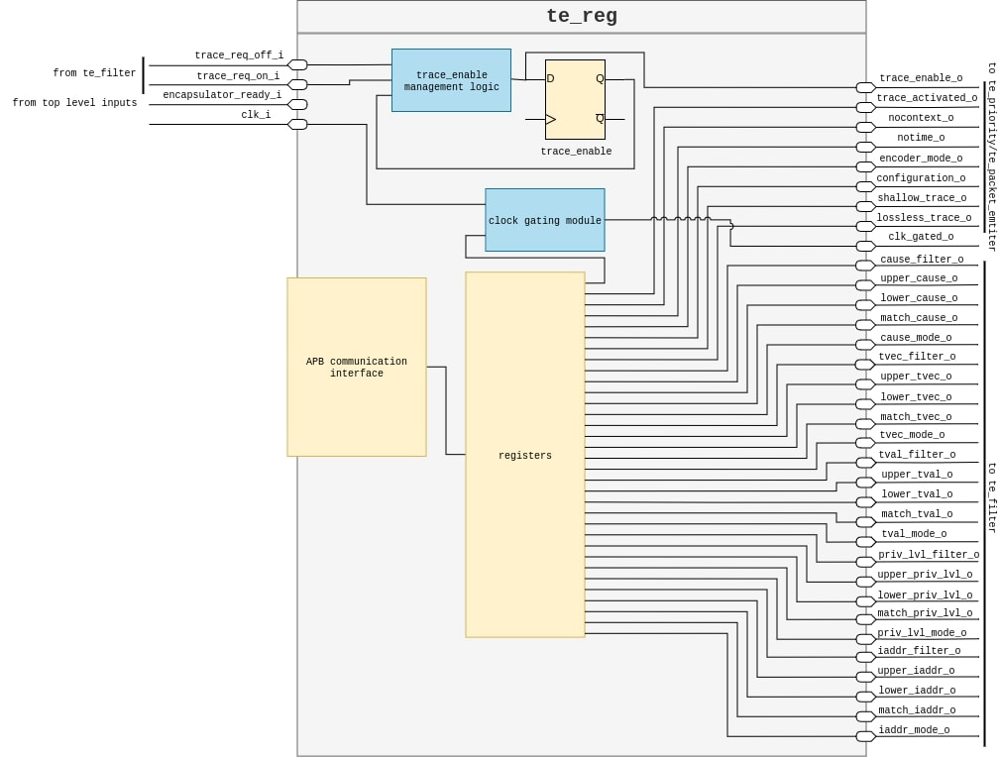
  </p>

*Figure 2: te_reg internal architecture*
</div>

#### APB Protocol

To access the registers, an APB interface is required. This protocol was selected for its ease of use and the minimal amount of data involved in reading or writing operations.

In the first place, the two actors of this protocol must be defined:

- *Requester*: The one that requires an APB transfer, usually an APB Bridge between the CPU and the peripherals.
- *Completer*: The one that receives a request for an APB transfer.

The following table shows which signals are necessary to perform an access via APB.

<div align="center">

| Signal Name | Source    | Width         | Description                                                                                                                                                     |
|:-----------:|:---------:|:-------------:|:---------------------------------------------------------------------------------------------------------------------------------------------------------------:|
| PCLK        | Clock     | 1             | Clock. PCLK is a clock signal. All APB signals are timed against the rising edge of PCLK.                                                                       |
| PADDR       | Requester | ADDR_WIDTH    | Address. PADDR is the APB address bus. PADDR can be up to 32 bits wide.                                                                                         |
| PSELx       | Requester | 1             | Select. The Requester generates a PSELx signal for each Completer. PSELx indicates that the Completer is selected and that a data transfer is required.         |
| PENABLE     | Requester | 1             | Enable. PENABLE indicates the second and subsequent cycles of an APB transfer.                                                                                  |
| PWRITE      | Requester | 1             | Direction. PWRITE indicates an APB write access when HIGH and an APB read access when LOW.                                                                      |
| PWDATA      | Requester | DATA_WIDTH    | Write data. The PWDATA write data bus is driven by the Requester during write cycles when PWRITE is HIGH. PWDATA can be 8 bits, 16 bits, or 32 bits wide.       |
| PREADY      | Completer | 1             | Ready. PREADY is used to extend an APB transfer by the Completer.                                                                                               |
| PRDATA      | Completer | 1             | Read data. The PRDATA read data bus is driven by the selected Completer during read cycles when PWRITE is LOW. PRDATA can be 8 bits, 16 bits, or 32 bits wide.  |

*Table 1: Mandatory signals for the APB protocol*
</div>

The process involves two essential parts:

1. *Setup phase*: The requester selects the completer for the transaction by asserting `PWRITE` and `PSEL` while setting `PENABLE` to 0. This signals to the completer that it will be accessed and specifies the type of transfer (read or write).
2. *Access phase*: Data is transferred between the requester and the completer by setting `PENABLE` to 1. If the completer is ready, it asserts the `PREADY` signal, enabling the data transfer to occur.

<div align="center">
  <p style="background-color: white; padding: 10px;">
    
  </p>

*Figure 3: APB read transfer*
</div>

<div align="center">
  <p style="background-color: white; padding: 10px;">
    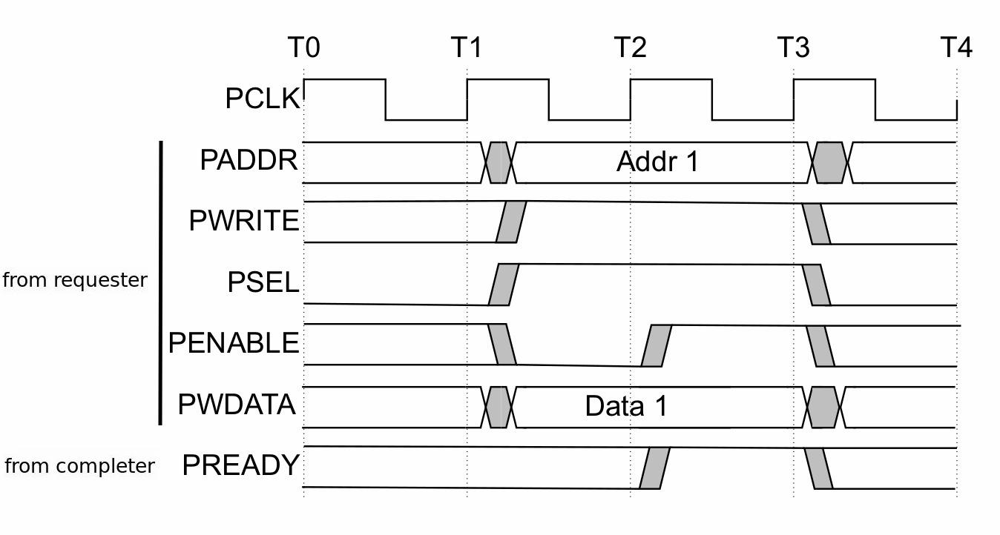
  </p>

*Figure 4: APB write transfer*
</div>

Programming a single register requires selecting it using the `PADDR` signal from the requester. Each register is associated with an 8-bit value, which the requester must add to the base address where the completer is mapped.

#### 32 and 64 Bits Registers

The number of available addresses varies depending on whether a 32-bit or 64-bit implementation is chosen. The APB protocol supports only a 32-bit wide data bus, requiring two transactions to access a full 64-bit register. A 64-bit register is split into two 32-bit registers: one for the most significant 32 bits and another for the least significant 32 bits.

### te_branch_map

The *te_branch_map* module serves the purpose of keeping track of branches. It does so using a counter and an array called branch map. The counter counts the received branches, and the branch map saves whether the branches are taken or not. According to the E-Trace specification, the counter counts up to 31 branches (5 bits long), and the branch map is a 31-bit long array saving `1` when the branch is not taken and `0` when it is.

When the counter reaches the value of 31 (branch map is full), the module asserts the `is_full_o` signal to request the generation of the associated packet (format 1). It remains asserted until it receives the `flush_i` signal from the *te_packet_emitter* module that communicates the associated packet has been generated.

The update of both the branch counter and branch map is done in a combinatorial network. The first step loads the number of branches left from the previous cycle, then processes the branches received in the current cycle. If the branch map is full, the remaining branches are stored for the next cycle.

<div align="center">
  <p style="background-color: white; padding: 10px;">
    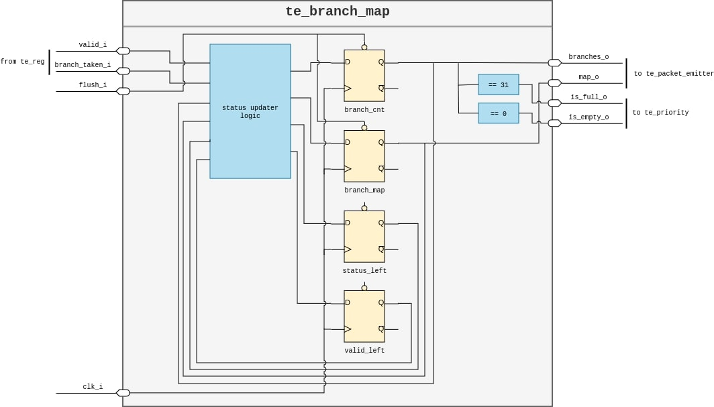
  </p>

*Figure 5: te_branch_map internal architecture*
</div>

### te_filter

The *te_filter* filters input blocks to trace specific portions of code or specific discontinuities. The E-Trace specification suggests using a pair of comparators arranged to select specific ranges for different parameters. This implementation uses one comparator per input and allows for more flexibility in filtering.

Filtering is enabled by activating the associated filter signal and setting the operative mode (`range` or `match`) for each filter. Filtering values are taken from the *te_reg* module.

<div align="center">
  <p style="background-color: white; padding: 10px;">
    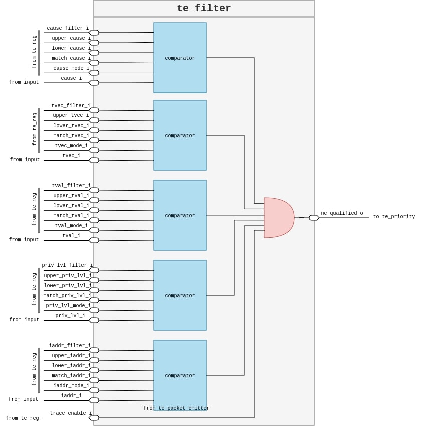
  </p>

*Figure 6: te_filter internal architecture*
</div>

### te_priority

This module implements the flow chart in the E-Trace specification as a combinatorial network to determine the packet type in one clock cycle.

<div align="center">
  <p style="background-color: white; padding: 10px;">
    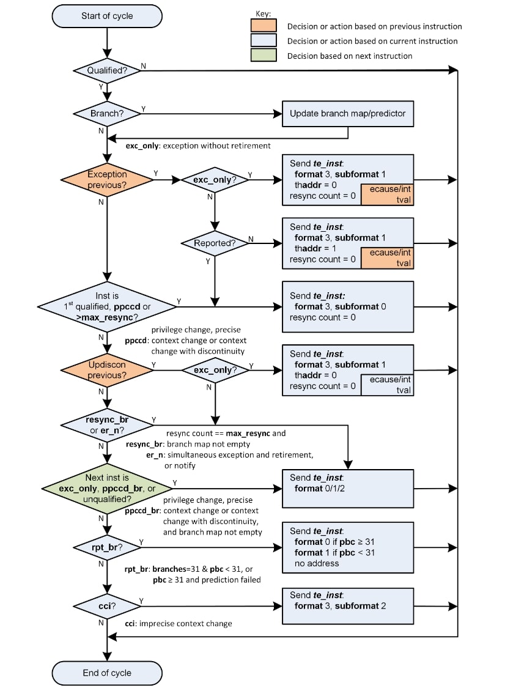
  </p>

*Figure 7: flow chart determining packet type*
</div>

Packets are determined based on:
- Previous instruction
- Current instruction
- Next instruction

Delays are implemented using flip-flops that store input information for up to 2 cycles.

<div align="center">
  <p style="background-color: white; padding: 10px;">
    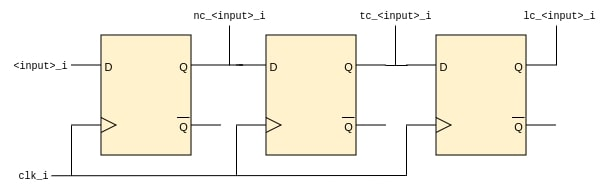
  </p>

*Figure 8: logic to delay inputs*
</div>

Address compression is implemented to remove the most significant bits that are all `0`s or `1`s, except for the last one. For example, compressing `0000001100010` results in `01100010`, which can be sign-extended to retrieve the original address.

<div align="center">
  <p style="background-color: white; padding: 10px;">
    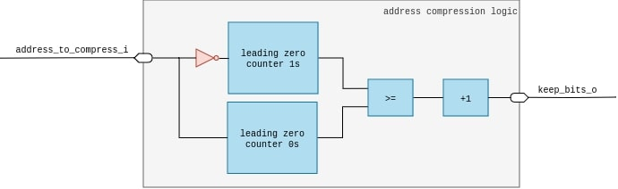
  </p>

*Figure 9: address compression logic internal architecture*
</div>

<div align="center">
  <p style="background-color: white; padding: 10px;">
    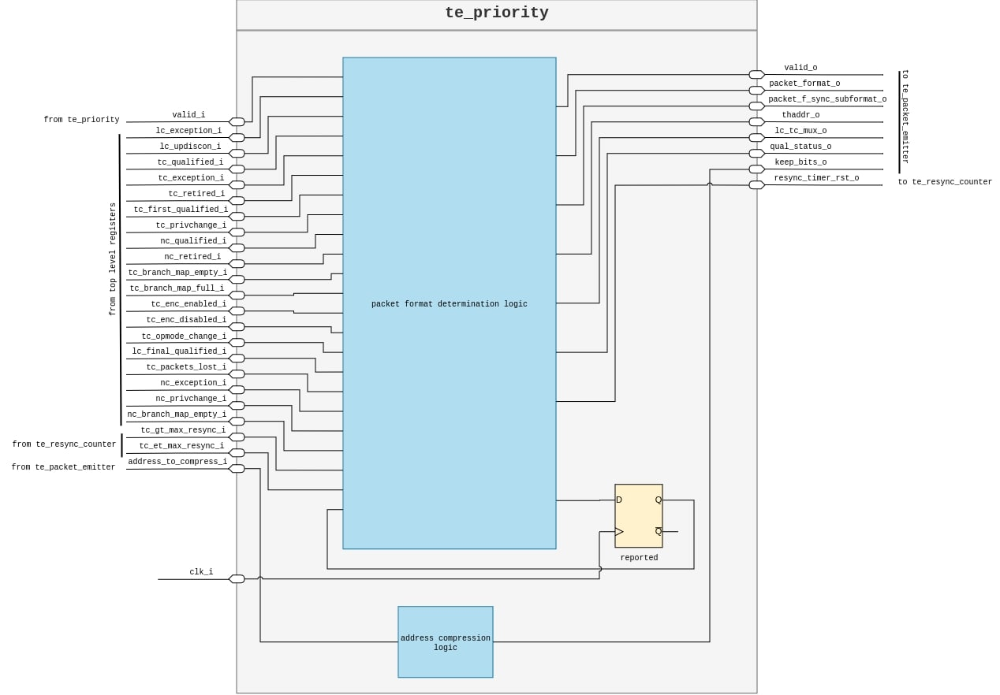
  </p>

*Figure 10: te_priority internal architecture*
</div>

### te_packet_emitter

The *te_packet_emitter* module populates the payload according to inputs from *te_priority*. Dynamic array operations are approximated via chunking, rounding the number of bits to the nearest multiple of 8. Similar operations compress the branch map.

<div align="center">
  <p style="background-color: white; padding: 10px;">
    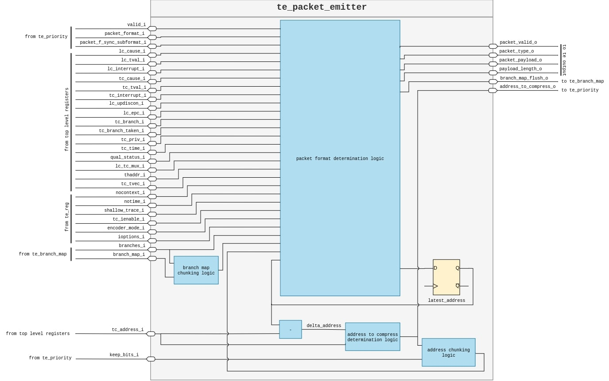
  </p>

*Figure 11: te_packet_emitter internal architecture*
</div>

### te_resync_counter

This module counts emitted packets or elapsed clock cycles and signals when a resynchronization packet is required. Configurable parameters include:
- `N`: max packets emitted in one cycle;
- `MODE`: counts packets or clock cycles;
- `MAX_VALUE`: asserts resync signals when reached.

The module can ignore packets or cycles when a resynchronization is pending.

<div align="center">
  <p style="background-color: white; padding: 10px;">
    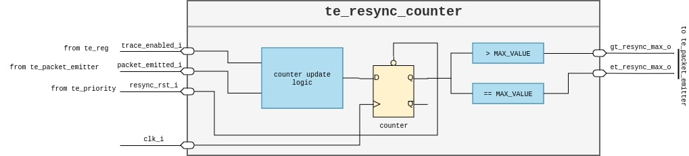
  </p>

*Figure 12: te_resync_counter internal architecture*
</div>

## Multiple Retirement Support

Many RISC-V cores can retire up to *N* instructions per cycle. To handle multiple instructions, the following inputs are replicated:
- `itype`
- `iaddr`
- `iretire`
- `ilastsize`

### Multiple Retirement: Branches Only

This design replicates the *te_filter* module and adapts the *branch map* to handle up to *N* branches per cycle.

<div align="center">
  <p style="background-color: white; padding: 10px;">
    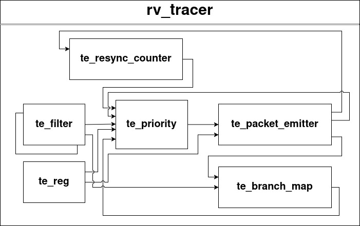
  </p>

*Figure 13: rv_tracer architecture for up to N branches in the same cycle*
</div>

### Multiple Retirement: Not Only Branches

This design replicates the *te_filter*, *te_priority*, and *te_packet_emitter* modules to handle up to *N* uninferable discontinuities.

<div align="center">
  <p style="background-color: white; padding: 10px;">
    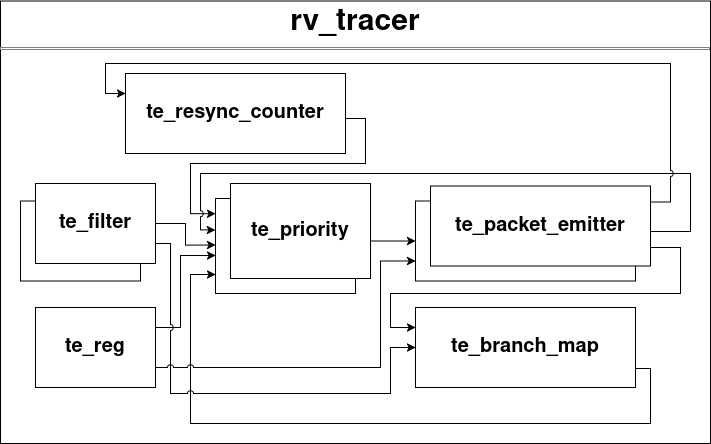
  </p>

*Figure 14: rv_tracer architecture for up to N discontinuities in the same cycle*
</div>