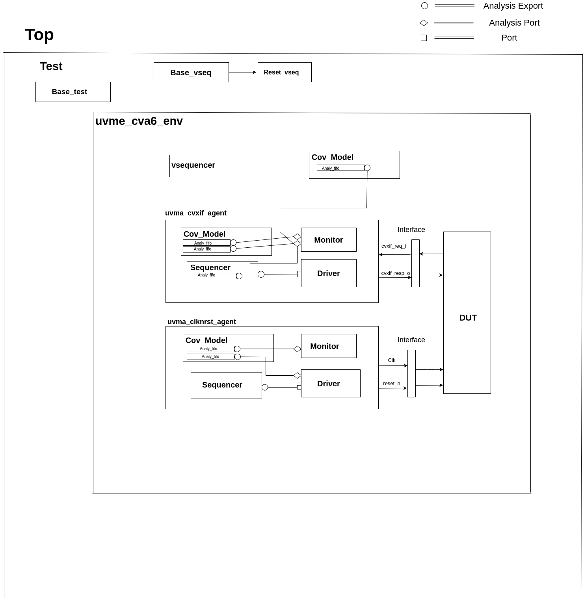

<!--_ Copyright (c) 2023 10x-Engineers
    SPDX-License-Identifier: Apache-2.0 WITH SHL-2.1
 -->
# The CVA6 UVM Verification Environment

This document describes the uvm verification environment of the CVA6 core. This environment is intended to be able to verify the CVA6 core and run different test cases by the minimal modification to the environment itself.  The environment is shown below:

***

This environment consist of the following

1. Simple two uvm agents for the uvma_clknrst_if and uvma_cvxif_intf .
2. Result checking capability is built into the environment so the test cases do not need to determine and check for the pass/fail criteria.

The environment consists of disjoint components. When a user invokes a command to run a test case a set of scripts and makefile rules are invoked to compile the environment and tests, run the simulation and check the results. On running a particular test it generates a .bin file which then is loaded into the main memory in the tb_top at the Boot_address of the core and the instructions are then start executing.

## uvmt_cva6_tb

In this module we instantiate the agent interfaces and the `uvmt_cva6_dut_wrap` module. We set the interfaces for the uvma_clknrst and uvma_cvxif using the configuration database set method. In this module we get the `sim_finished` database object set in the `uvmt_cva6_base_test_c` class. To check whether the simulation passed or failed we check the `err_count` and `fatal_count` along with `sim_finished`.

## uvmt_cva6_base_test_c

This class extends from `uvm_test`. It randomise the `uvmt_cva6_test_cfg_c` and `uvme_cva6_cfg_c` objects. The class's build_phase, connect_phase functions handle the setup and configuration of the testbench environment, connecting it to the CVA6, and executing the test. We start the `uvme_cva6_reset_vseq_c` sequence in the reset phase on the `uvme_cva6_vsqr_c` sequencer.

## uvme_cva6_env_c

This class extends from the `uvm_env` class. The class's build_phase,connect_phase functions handle the setup and configuration of the  `uvma_clknrst_agent_c`,`uvma_cvxif_agent_c` agents.The class's run_phase task start the `cvxif_seq` sequence on the uvma_cvxif_agent sequencer. We get the configuration and context information for the environment in this class using the get method.

### Environment_objects

There are two uvm_objects that are `uvme_cva6_cfg_c` and `uvme_cva6_cntxt_c`. The Objects contain configuration and context information for the environment.

### uvme_cva6_cfg_c

This class extends from the `uvm_object` class. The object encapsulates all parameters for creating, connecting and running CVA6 environment (`uvme_cva6_env_c`) components. This class also includes a constraint block that defines default values for some of its fields and other constraints on its fields such as, `enabled` and `is_active` fields are set to 0 and 'UVM_PASSIVE' respectively by default. `clknrst_cfg.enabled` and `clknrst_cfg.is_active` are set to 1 if `enabled` and `is_active` fields are set to 1. `clknrst_cfg.trn_log_enabled` is set to 1 if `trn_log_enabled` is set to 1. `cvxif_cfg.cov_model_enabled` is set to 1 if `cov_model_enabled` is set to 1.

<table>
 <tr>
  <td><strong>signal</strong>
  </td>
  <td><strong>Description</strong>
  </td>
 </tr>
 <tr>
  <td>enabled
  </td>
  <td> is set to 1, the environment is enabled and the components within the environment can be instantiated, built, and connected.
  </td>
 </tr>
 <tr>
  <td>is_active
  </td>
  <td>This is set to UVM_PASSIVE.
  </td>
 </tr>
 <tr>
  <td>scoreboarding_enabled
  </td>
  <td> It enables the scoreboard and predictor in the environment class.
  </td>
 </tr>
 <tr>
  <td>cov_model_enabled
  </td>
  <td> It enables the coverage collection for environment and cvxif_agent.
  </td>
 </tr>
 <tr>
  <td>trn_log_enabled
  </td>
  <td> It enables the trace log for the clk_rst_agent
  </td>
 </tr>
</table>

### uvme_cva6_cntxt_c

The class uvme_cva6_cntxt_c is an object that encapsulates all state variables for CVA6 environment (`uvme_cva6_env_c`) components. It inherits from the `uvm_object` base class.It also contains two events, `sample_cfg_e` and `sample_cntxt_e`, that can be used to synchronize the sampling of configuration and context information.

### uvme_cva6_vsqr_c

This class extends from the `uvm_sequencer` base class. It also has two sequencer handles, "clknrst_sequencer" and "cvxif_sequencer" of the types `uvma_clknrst_sqr_c` and `uvma_cvxif_sqr_c`, respectively. This class is used to start the virtual sequence.

### uvme_cva6_reset_vseq_c

This class `uvme_cva6_reset_vseq_c` extends a class called `uvme_cva6_base_vseq_c`. The purpose of this sequence is to start the system clock and issue the initial reset pulse to the Device Under Test (DUT). The class has three random variables, `num_clk_before_reset`,  `rst_deassert_period`, and `post_rst_wait`. These variables are used to specify the number of clock cycles between the start of the clock and the reset assert.The class has a default constructor and a virtual task called "body" which is responsible for starting the clock, waiting for a specified amount of time, and then resetting the DUT.

## Clock & Reset Agent

 This agent controls the clock and reset signal of the CVA6 core.

### uvma_clknrst_if

The `uvma_clknrst_if` interface has two logic signals, `clk` and `reset_n`. The `clk` signal represents the system clock, while the  `reset_n` signal is the active-low reset signal.The interface includes an initial block that contains a forever loop that generates the clock signal, based on the value of `clk_active` and `clk_period`. If `clk_active` is set to 1 and `clk_period` is 0, the function will raise a fatal error. The interface also includes three functions: set_period, which sets the value of `clk_period`; start_clk, which sets `clk_active` to 1; and stop_clk, which sets `clk_active` to 0.

<table>
 <tr>
  <td><strong>signal</strong>
  </td>
  <td><strong>Description</strong>
  </td>
 </tr>
 <tr>
  <td>clk
  </td>
  <td>Controls the Clock fed to the design under test.
  </td>
 </tr>
 <tr>
  <td>reset_n
  </td>
  <td>Control the reset state of the design under test.
  </td>
 </tr>
</table>

### uvma_clknrst_uvm_objects

The uvm_objects `uvma_clknrst_cfg_c` , `uvma_clknrst_cntxt_c` contain the configuration and context information of the uvma_clknrst_agent.

### uvma_clknrst_seq_item_c

The class represents an object created by Clock & Reset agent sequences that extend the `uvma_clknrst_seq_base_c` class.

The class contains several randomized variables:

* `action` is an enumerated variable of type "uvma_clknrst_seq_item_action_enum" that represents the operation to perform (e.g. start clock, stop clock, assert reset, de-assert reset).
* `initial_value` is an enumerated variable of type "uvma_clknrst_seq_item_initial_value_enum" that represents the initial value of the signals (if starting or asserting).
* `clk_period` is an unsigned 32-bit integer variable representing the period of the clock signal.
* `rst_deassert_period` is an unsigned 32-bit integer variable representing the amount of time (in picoseconds) after which to de-assert reset.
* The class also includes a constraint "default_cons" which sets the default values for `clk_period` to 0 and `rst_deassert_period` to a value defined by `uvma_clknrst_default_rst_deassert_period`

The class has a default constructor which calls the superclass constructor.

### uvma_clknrst_Sequence

It consists of two main sequences: `uvma_clknrst_stop_clk_seq_c` and `uvma_clknrst_restart_clk_seq_c`.

* The `uvma_clknrst_stop_clk_seq_c` create an instance of the `uvma_clknrst_seq_item_c` and set the its action to the `UVMA_CLKNRST_SEQ_ITEM_ACTION_STOP_CLK` and start and finish the item.

* The  `uvma_clknrst_restart_clk_seq_c` create an instance of the `uvma_clknrst_seq_item_c` and set the its action to the `UVMA_CLKNRST_SEQ_ITEM_ACTION_RESTART_CLK` and start and finish the item.

### uvma_clknrst_drv_c

This class `uvma_clknrst_drv_c` is used for driving the interface of the clknrst agent. It get reqs from the sequence item port and calls the `drv_req` task. The `drv_req` task drives the virtual interface's (`cntxt.vif`) signals using req's contents. And then call the write method for the analysis port to send the req transaction to the coverage model.

### uvma_clknrst_mon_c

This class `uvma_clknrst_mon_c` is used for monitoring the virtual interface of the Clock & Reset agent. The class extends the `uvm_monitor` class and contains objects for configuration (cfg) and context (cntxt), as well as an analysis port (ap) for transaction analysis.The run_phase() task in the `uvma_clknrst_mon_c` class is responsible for overseeing the monitoring process of the Clock and Reset virtual interface. It does this by executing the monitor_clk() and monitor_reset() tasks in parallel forks.

### uvma_clknrst_cov_model_c

This class `uvma_clknrst_cov_model_c` extends from the `uvm_component` base class. The overall functionality of this class is to provide the coverage model for the clknrst_agent. It contains objects for configuration, context, monitor transaction, and sequence item, as well as two analysis FIFOs for holding transactions coming from the monitor and sequence item respectively. This section is in progress.

### uvma_clknrst_agent_c

 This class `uvma_clknrst_agent_c` extends from `uvm_agent` base class. This class encapsulates ,builds and connects all the other components for driving and monitoring a Clock & reset interface. This class gets the `cfg` , `cntxt` using configuration database get method. It creates a driver,monitor,cov_model and sequencer. This class connects the driver with a sequencer.

## Cvxif Agent

Cv-xif agent supports custom instructions. Upon receiving the issue request it drives the response one clock cycle after the issue request.

### uvma_cvxif_intf

The interface includes inputs for clock and reset_n signal, as well as two data input/output called `cvxif_req_i` and `cvxif_resp_o`. It includes a clocking block for the monitor `monitor_cb` to sample the  `cvxif_req_i` and `cvxif_resp_o` signal at the rising edge of the clock.
<table>
 <tr>
 <td><strong>Enum Variable</strong>
  </td>
  <td><strong>Description</strong>
  </td>
 </tr>
 <tr>
  <td> Cvxif_req_i
  </td>
  <td>The request is send to get a response
  </td>
 </tr>
 <tr>
  <td>Cvxif_resp_o
  </td>
  <td>The response is generated according to the request.
  </td>
 </tr>
</table>

### uvma_cvxif_uvm_objects

There are two uvm_objects `uvma_cvxif_cfg_c` and `uvma_cvxif_cntxt_c`. `uvma_cvxif_cfg_c` encapsulates all the parameters for creating ,connecting and running  the `uvma_cvxif_agent_c` agent . `uvma_cvxif_cntxt_c` confine all the state variables for all the CVXIF agent components.

### uvma_cvxif_Sequence_items

Cvxif agent has two sequence items one `uvma_cvxif_req_item_c`and `uvma_cvxif_resp_item_c` for the request and response transaction.

### uvma_cvxif_sqr_c

`uvma_cvxif_sqr_c` class extends from `uvm_sequencer` base class. It is a typical sequencer. This class instantiates a FIFO to receive the `uvma_cvxif_req_item_c`.

### uvma_cvxif_sequences

* `uvma_cvxif_base_seq_c` class extends from `uvm_sequence` . This class simply implements a decode function that checks whether the instructions are legal or illegal.

* `uvma_cvxif_seq_c` class extends from `uvma_cvxif_base_seq_c` class. This class gets the `uvma_cvxif_req_item_c` from the FIFO in sequencer using the p_sequencer handle. In this sequence class, we send the response according to the request item received . If we receive an instruction from the req_item that is illegal then we drive zero's on the response signals.  Otherwise we drive response accordingly.

### uvma_cvxif_drv_c

This class `uvma_cvxif_drv_c` extends from the `uvm_driver` class. This class has several tasks that perform different actions such as generating a random ready signal, getting response_item, driving an issue response to the `VIF` , driving results in order and out of order fashion, and de-asserting signals.

### uvma_cvxif_mon_c

`uvma_cvxif_mon_c` class extends from the `uvm_monitor` . It monitors the virtual interface `vif`. It monitors transaction requests and responses, and sends transaction requests to `uvma_cvxif_sqr_c` and responses to the coverage model. It has several fields, including objects for configuration and context, and analysis ports for transaction requests and responses.

### uvma_cvxif_cov_model_c

`uvma_cvxif_cov_model_c` is derived from the `uvm_component` class. This class defines various objects and covergroups with different coverpoints, and it also uses the UVM library to sample these coverpoints and measure coverage.The main purpose of this class is to measure the functional coverage of a specific interface in the design and ensure that it has been fully tested.

### uvma_cvxif_agent_c

`uvma_cvxif_agent_c` class extends from `uvm_agent` class. This class represents an agent that is responsible for the test execution and communication between the virtual interface (VIF) and the testbench components. The main role of this class is to create and connect the different components of the testbench and manage the communication between them and the virtual interface (VIF) during the test execution.