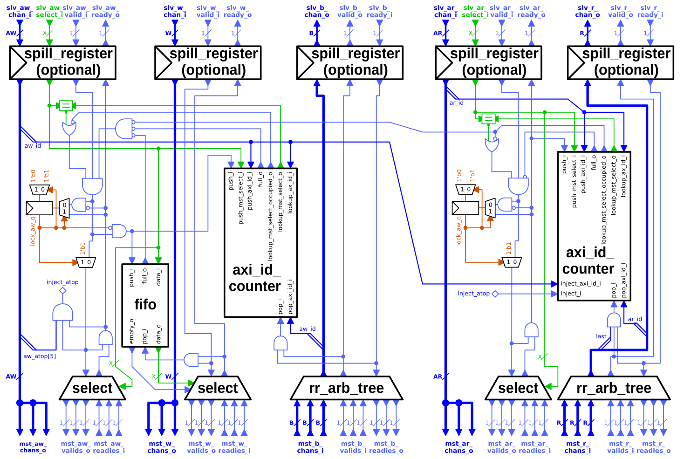

# AXI Demultiplexer

`axi_demux` splits one AXI connection into multiple ones.  It implements the full AXI4 specification plus atomic operations (ATOPs) from AXI5.

## Design Overview

The demultiplexer has one *slave port* and a configurable number of *master ports*.  A block diagram is shown below:

The AW and AR channels each have a *select* input, to determine the master port to which they are sent.  The select can, for example, be driven by an (external) address decoder to map address ranges to different AXI slaves.

Beats on the W channel are routed by demultiplexer according to the selection for the corresponding AW beat.  This relies on the AXI property that W bursts must be sent in the same order as AW beats and beats from different W bursts may not be interleaved.

Beats on the B and R channel are multiplexed from the master ports to the slave port with a round-robin arbitration tree.

## Configuration

This demultiplexer is configured through the parameters listed in the following table:

| Name                 | Type               | Definition |
|:---------------------|:-------------------|:-----------|
| `AxiIdWidth`         | `int unsigned`     | The AXI ID width (of all ports). |
| `NoMstPorts`         | `int unsigned`     | The number of AXI master ports of the demultiplexer (in other words, how many AXI slave modules can be attached). |
| `MaxTrans`           | `int unsigned`     | The slave port can have at most this many transactions [in flight](../doc#in-flight). |
| `AxiLookBits`        | `int unsigned`     | The number of ID bits (starting at the least significant) the demultiplexer uses to determine the uniqueness of an AXI ID (see section *Ordering and Stalls* below).  This value has to be less or equal than `AxiIdWidth`. |
| `FallThrough`        | `bit`              | Routing decisions on the AW channel fall through to the W channel.  Enabling this allows the demultiplexer to accept a W beat in the same cycle as the corresponding AW beat, but it increases the combinatorial path of the W channel with logic from `slv_aw_select_i`. |
| `SpillXX`            | `bit`              | Inserts one spill register on the respective channel (AW, W, B, AR, and R) before the demultiplexer. |

The other parameters are types to define the ports of the demultiplexer.  The `_*chan_t` types must be bound in accordance to the configuration using the `AXI_TYPEDEF` macros defined in `axi/typedef.svh`.

### Pipelining and Latency

The `SpillXX` parameters allow to insert spill register before each channel of the demultiplexer.  Spill registers cut all combinatorial paths of a channel (i.e., both payload and handshake).  Thus, they add one cycle of latency per channel but do not impair throughput.

If all `SpillXX` and `FallThrough` are disabled, all paths through this multiplexer are combinatorial (i.e., have zero sequential latency).

## Ports

| Name                              | Description |
|:----------------------------------|:------------|
| `clk_i`                           | Clock to which all other signals (except `rst_ni`) are synchronous. |
| `rst_ni`                          | Reset, asynchronous, active-low. |
| `test_i`                          | Test mode enable (active-high). |
| `slv_*` (except `slv_*_select_i`) | Single slave port of the demultiplexer. |
| `slv_{aw,ar}_select_i`            | Index of the master port to which a write or read, respectively, is demultiplexed.  This signal must be stable while a handshake on the AW respectively AR channel is [pending](../doc#pending). |
| `mst_*`                           | Array of master ports of the demultiplexer.  The array index of each port is the index of the master port. |

## Ordering and Stalls

When the demultiplexer receives two transactions with the same ID and direction (i.e., both read or both write) but targeting two different master ports, it will not accept the second transaction until the first has completed.  During this time, the demultiplexer stalls the AR or AW channel, respectively.  To determine whether two transactions have the same ID, the `AxiLookBits` least-significant bits are compared.  That parameter can be set to the full `AxiIdWidth` to avoid false ID conflicts, or it can be set to a lower value to reduce area and delay at the cost of more false conflicts.

The reason for this behavior are AXI ordering constraints, see the [documentation of the crossbar](axi_xbar.md#ordering-and-stalls) for details.

### Implementation

`2 * 2^AxiLookBits` counters track the number of [in-flight](../doc#in-flight) transactions.  That is, for each ID in the (potentially) reduced set of IDs of `AxiLookBits` bits, there is one counter for write transactions and one for read transactions.  Each counter can count up to (and including) `MaxTrans`, and there is a register that holds the index of the master port to which a counter is assigned.

When the demultiplexer gets an AW or an AR, it indexes the counters with the AXI ID.  If the indexed counter has a value greater than zero and its master port index register is not equal to the index to which the AW or AR is to be sent, a transaction with the same direction and ID is already in flight to another master port.  The demultiplexer then stalls the AW or AR.  In all other cases, the demultiplexer forwards the AW or AR, increments the value of the indexed counter, and sets the master port index of the counter.  A counter is decremented upon a handshake a B respectively last R beat at a slave port.

W beats are routed to the master port defined by the value of `slv_aw_select_i` for the corresponding AW.  As the order of the W bursts is given by the order of the AWs, the select signals are stored in a FIFO queue.  This FIFO is pushed upon a handshake on the AW slave channel and popped upon a handshake of the last W beat of a burst on a W master channel.

## Atomic Transactions

The demultiplexer also supports AXI atomic transactions (initiated by an AW with `atop` field not equal to zero).  A part of AXI atomic transactions, namely atomic loads, require a response on the B *and* the R channel.

### Implementation

Atomic loads introduce a dependency between the read and write channels that otherwise does not exist in AXI.  In this demultiplexer, the ID counters of the read channel must be aware of R beats without a corresponding AR.  Otherwise, they would underflow upon atomic loads.  To prevent this, the AW channel of the demultiplexer can "inject" the ID of an atomic load to the ID counter of the AR channel.  This is possible because atomic transactions must have an ID that is unique with respect to *all* other transactions (i.e., reads *and* writes) currently in flight.

As only a part of the AXI ID is compared to determine whether two transactions have the same ID (see section *Ordering and Stalls*), atomic loads can lead to additional false conflict stalls on the read channel.  However, atomic transactions are short bursts and thus usually complete relatively fast, so this should not reduce throughput under non-degenerate conditions.
