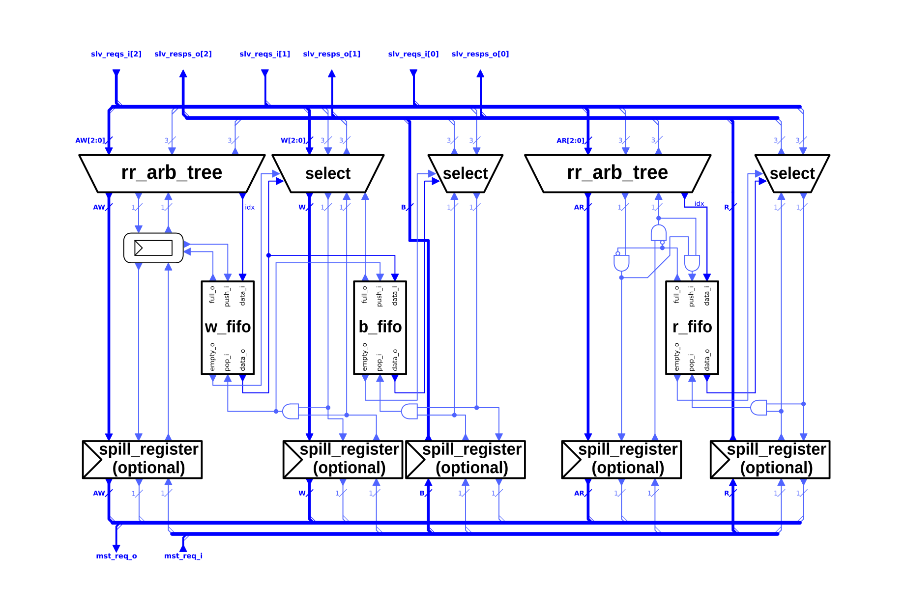

# AXI4-Lite Multiplexer

The opposite function to the AXI4-Lite demultiplexer is performed by the AXI4-Lite Multiplexer. It merges multiple AXI4-Lite connections into one. The requests from multiple slave ports get interleaved and transmitted over a single master port.

The requests on the AW and AR channels each get merged with round robin arbitration. The arbitration decision is stored in the FIFO's which handle the response routing.

The following table shows the parameters of the module. The module further requires the structs describing the five AXI4-Lite channels.

| Name          | Type           | Function                                                                                                       |
|:--------------|:---------------|:---------------------------------------------------------------------------------------------------------------|
| `NoSlvPorts`  | `int unsigned` | How many slave ports the multiplexer features. This many master modules can be connected to the multiplexer.   |
| `MaxWTrans`   | `int unsigned` | The depth of the FIFO holding the highest bits of the ID between the AW and W channel.                         |
| `FallThrough` | `bit`          | Is the FIFO between the AW and W channel in fall-through mode. Enabling will lead to an additional delay cycle |
| `SpillXX`     | `bit`          | Enables the optional spill-register on the respective channel.                                                 |
