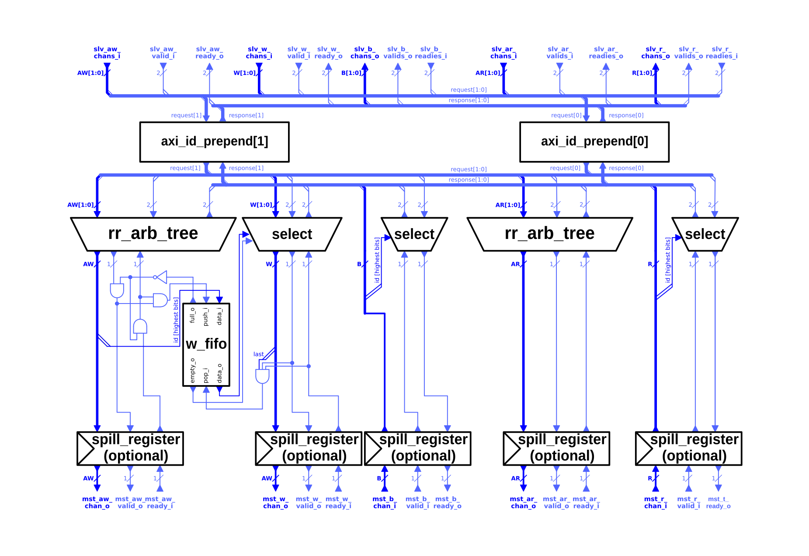

# AXI Multiplexer

The opposite function to the AXI demultiplexer is performed by the AXI Multiplexer. It merges multiple AXI-4 connections and merges them into one. The requests from multiple slave ports of the module get interleaved and transmitted over its one master port.



The Multiplexer module is has a simpler structure than the demultiplexer introduced in the previous section. The requests on the AW and AR channels get merged with the same round robin arbitration used for merging the responses in the demultiplexer. One key difference however is the mechanism how the multiplexer determines from which slave port a request came. It uses for this the higher bits of the `axi_id` field of a request. The number of bits can be calculated with:

```systemverilog
$clog2(NoSlavePorts)
```

This restricts the type of ID which can be sent through each slave port of the module. When the higher ID bits do not correspond to the index of the port the following response will be sent back through to the wrong master, leading to a breakdown of the functionality. So for using this module it is recommended to extend each AXI ID by the required amount of bits indicating the index of the respective slave port, before being sent over this module.

For a write transaction the W beats belonging to an AW request have to be sent in order. For this the highest bits of the `aw_id` get pushed into a FIFO. When the FIFO is not empty the data determines which W slave port gets connected to the master port. When the last beat of a write transaction is sent, the data gets poped.
All responses get routed with the same scheme for tracking to which slave port a response should be sent. If the module has a response ready at its master port it connects the respective slave port indicated by the AXI ID.

The reason the switching is done this way is that again, the ordering model of the AXI protocol has to be respected. By using the extended ID it further helps to decouple requests from different master modules connected to the Multiplexer. It ensures that each master module has its unique set of AXI ID's, leading to potential performance increases when different masters are using vastly different burst lengths. As this could enable a slave module to interleave the responses.
Another reason, why the switching of the responses is done over the ID is the required atomic transaction support. The protocol specifies that a master module has to ensure that a atomic transaction uses a different ID than normal transactions already in flight. This is to prevent ordering requirements between atomic transaction and normal ones. Another problem is further again that an atomic transaction can lead to a response in the B and R channel, further defining a dependence between the read and write channels.

Using an ID prefix for the switching in the multiplexer prevents that this module has to deal with the ordering requirements between these different types of instructions. The responsibility gets put to the master module connected to the slave port of the multiplexer.

The following table shows the parameters of the module. The module further requires the structs describing the five AXI channels.

| Name          | Type | Function |
|:------------------ |:----------------- |:---------------------------------- |
| `AxiIdWidth`  | `int unsigned` | The width of the AXI transaction ID in bits. |
| `NoSlvPorts`  | `int unsigned` | How many slave ports the multiplexer features. This many master modules can be connected to the multiplexer.|
| `MaxWTrans` | `int unsigned` | The depth of the FIFO holding the highest bits of the ID between the AW and W channel. |
| `FallThrough` | `bit` | Is the FIFO between the AW and W channel in fall-through mode. Enabling will lead to longer cycle delays. |
| `SpillXX` | `bit` | Enables the optional spill-register on the respective channel. |


The ports of the multiplexer module are defined by the AXI4 channel structs. The module features only the respective slaves and master port, as the switching happens over the highest bits of the AXI ID.
