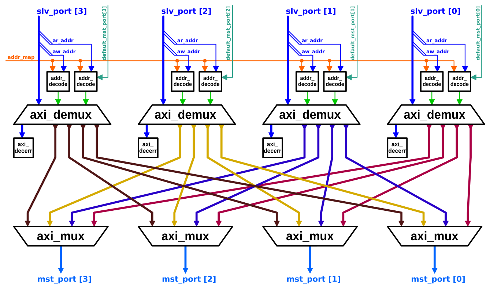

# AXI4+ATOP Fully-Connected Crossbar

`axi_xbar` is a fully-connected crossbar that implements the full AXI4 specification plus atomic operations (ATOPs) from AXI5.


## Design Overview

`axi_xbar` is a fully-connected crossbar, which means that each master module that is connected to a *slave port* for of the crossbar has direct wires to all slave modules that are connected to the *master ports* of the crossbar.
A block-diagram of the crossbar is shown below:



The crossbar has a configurable number of slave and master ports.

The ID width of the master ports is wider than that of the slave ports.  The additional ID bits are used by the internal multiplexers to route responses.  The ID width of the master ports must be `AxiIdWidthSlvPorts + $clog_2(NoSlvPorts)`.


## Address Map

One address map is shared by all master ports.  The *address map* contains an arbitrary number of rules (but at least one).  Each *rule* maps one address range to one master port.  Multiple rules can map to the same master port.  The address ranges of two rules may overlap: in case two address ranges overlap, the rule at the higher (more significant) position in the address map prevails.

Each address range includes the start address but does **not** include the end address.  That is, an address *matches* an address range if and only if
```
    addr >= start_addr && addr < end_addr
```
The start address must be less than or equal to the end address.

The address map can be defined and changed at run time (it is an input signal to the crossbar).  However, the address map must not be changed while any AW or AR channel of any slave port is valid.


## Decode Errors and Default Slave Port

Each slave port has its own internal *decode error slave* module.  If the address of a transaction does not match any rule, the transaction is routed to that decode error slave module.  That module absorbs each transaction and responds with a decode error (with the proper number of beats).  The data of each read response beat is `32'hBADCAB1E` (zero-extended or truncated to match the data width).

Each slave port can have a default master port.  If the default master port is enabled for a slave port, any address on that slave port that does not match any rule is routed to the default master port instead of the decode error slave.  The default master port can be enabled and changed at run time (it is an input signal to the crossbar), and the same restrictions as for the address map apply.


## Configuration

The crossbar is configured through the `Cfg` parameter with a `axi_pkg::xbar_cfg_t` struct.  That struct has the following fields:

| Name                 | Type               | Definition |
|:---------------------|:-------------------|:-----------|
| `NoSlvPorts`         | `int unsigned`     | The number of AXI slave ports of the crossbar (in other words, how many AXI master modules can be attached). |
| `NoMstPorts`         | `int unsigned`     | The number of AXI master ports of the crossbar (in other words, how many AXI slave modules can be attached). |
| `MaxMstTrans`        | `int unsigned`     | Each slave port can have at most this many transactions [in flight](../doc#in-flight). |
| `MaxSlvTrans`        | `int unsigned`     | Each master port can have at most this many transactions per ID [in flight](../doc#in-flight). |
| `FallThrough`        | `bit`              | Routing decisions on the AW channel fall through to the W channel.  Enabling this allows the crossbar to accept a W beat in the same cycle as the corresponding AW beat, but it increases the combinatorial path of the W channel with logic from the AW channel. |
| `LatencyMode`        | `enum logic [9:0]` | Latency on the individual channels, defined in detail in section *Pipelining and Latency* below. |
| `AxiIdWidthSlvPorts` | `int unsigned`     | The AXI ID width of the slave ports. |
| `AxiIdUsedSlvPorts`  | `int unsigned`     | The number of slave port ID bits (starting at the least significant) the crossbar uses to determine the uniqueness of an AXI ID (see section *Ordering and Stalls* below).  This value has to be less or equal than `AxiIdWidthSlvPorts`. |
| `AxiAddrWidth`       | `int unsigned`     | The AXI address width. |
| `AxiDataWidth`       | `int unsigned`     | The AXI data width. |
| `NoAddrRules`        | `int unsigned`     | The number of address map rules. |

The other parameters are types to define the ports of the crossbar.  The `*_chan_t` and `*_req_t`/`*_resp_t` types must be bound in accordance to the configuration with the `AXI_TYPEDEF` macros defined in `axi/typedef.svh`.  The `rule_t` type must be bound to an address decoding rule with the same address width as in the configuration, and `axi_pkg` contains definitions for 64- and 32-bit addresses.

### Pipelining and Latency

The `LatencyMode` parameter allows to insert spill registers after each channel (AW, W, B, AR, and R) of each master port (i.e., each multiplexer) and before each channel of each slave port (i.e., each demultiplexer).  Spill registers cut combinatorial paths, so this parameter reduces the length of combinatorial paths through the crossbar.

Some common configurations are given in the `xbar_latency_e` `enum`.  The recommended configuration (`CUT_ALL_AX`) is to have a latency of 2 on the AW and AR channels because these channels have the most combinatorial logic on them.  Additionally, `FallThrough` should be set to `0` to prevent logic on the AW channel from extending combinatorial paths on the W channel.  However, it is possible to run the crossbar in a fully combinatorial configuration by setting `LatencyMode` to `NO_LATENCY` and `FallThrough` to `1`.

If two crossbars are connected in both directions, meaning both have one of their master ports connected to a slave port of the other, the `LatencyMode` of both crossbars must be set to either `CUT_SLV_PORTS`, `CUT_MST_PORTS`, or `CUT_ALL_PORTS`.  Any other latency mode will lead to timing loops on the uncut channels between the two crossbars.  The latency mode of the two crossbars does not have to be identical.


## Ports

| Name                    | Description |
|:------------------------|:------------|
| `clk_i`                 | Clock to which all other signals (except `rst_ni`) are synchronous. |
| `rst_ni`                | Reset, asynchronous, active-low. |
| `test_i`                | Test mode enable (active-high). |
| `slv_ports_*`           | Array of slave ports of the crossbar.  The array index of each port is the index of the slave port.  This index will be prepended to all requests at one of the master ports. |
| `mst_ports_*`           | Array of master ports of the crossbar.  The array index of each port is the index of the master port. |
| `addr_map_i`            | Address map of the crossbar (see section *Address Map* above). |
| `en_default_mst_port_i` | One bit per slave port that defines whether the default master port is active for that slave port (see section *Decode Errors and Default Slave Port* above). |
| `default_mst_port_i`    | One master port index per slave port that defines the default master port for that slave port (if active). |


## Ordering and Stalls

When one slave port receives two transactions with the same ID and direction (i.e., both read or both write) but targeting two different master ports, it will not accept the second transaction until the first has completed.  During this time, the crossbar stalls the AR or AW channel of that slave port.  To determine whether two transactions have the same ID, the `AxiIdUsedSlvPorts` least-significant bits are compared.  That parameter can be set to the full `AxiIdWidthSlvPorts` to avoid false ID conflicts, or it can be set to a lower value to reduce area and delay at the cost of more false conflicts.

The reason for this ordering constraint is that AXI transactions with the same ID and direction must remain ordered.  If this crossbar would forward both transactions described above, the second master port could get a response before the first one, and the crossbar would have to reorder the responses before returning them on the master port.  However, for efficiency reasons, this crossbar does not have reorder buffers.


## Verification Methodology

This module has been verified with a directed random verification testbench, described and implemented in `test/tb_axi_xbar.sv`.


## Design Rationale for No Pipelining Inside Crossbar

Inserting spill registers between demuxers and muxers seems attractive to further reduce the length of combinatorial paths in the crossbar.  However, this can lead to deadlocks in the W channel where two different muxes at the master ports would circular wait on two different demuxes (TODO).  In fact, spill registers between the switching modules causes all four deadlock criteria to be met.  Recall that the criteria are:

1. Mutual Exclusion
2. Hold and Wait
3. No Preemption
4. Circular Wait

The first criterion is given by the nature of a multiplexer on the W channel: all W beats have to arrive in the same order as the AW beats regardless of the ID at the slave module.  Thus, the different master ports of the multiplexer exclude each other because the order is given by the arbitration tree of the AW channel.

The second and third criterion are inherent to the AXI protocol:  For (2), the valid signal has to be held high until the ready signal goes high.  For (3), AXI does not allow interleaving of W beats and requires W bursts to be in the same order as AW beats.

The fourth criterion is thus the only one that can be broken to prevent deadlocks.  However, inserting a spill register between a master port of the demultiplexer and a slave port of the multiplexer can lead to a circular dependency inside the W FIFOs.  This comes from the particular way the round robin arbiter from the AW channel in the multiplexer defines its priorities.  It is constructed in a way by giving each of its slave ports an increasing priority and then comparing pairwise down till a winner is chosen.  When the winner gets transferred, the priority state is advanced by one position, preventing starvation.

The problem can be shown with an example.  Assume an arbitration tree with 10 inputs.  Two requests want to be served in the same clock cycle.  The one with the higher priority wins and the priority state advances.  In the next cycle again the same two inputs have a request waiting.  Again it is possible that the same port as last time wins as the priority shifted only one position further.  This can lead in conjunction with the other arbitration trees in the other muxes of the crossbar to the circular dependencies inside the FIFOs.  Removing the spill register between the demultiplexer and multiplexer forces the switching decision into the W FIFOs in the same clock cycle.  This leads to a strict ordering of the switching decision, thus preventing the circular wait.
