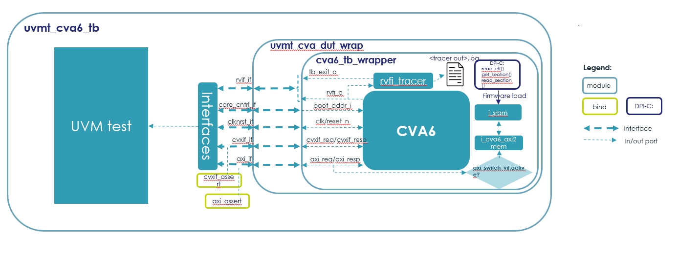

[.text-center]
*TRISTAN*

[.text-center]
*Together for RISc-V Technology and ApplicatioNs*

[.text-center]
image:./media/image1.png[./media/image1,width=273,height=273]

[.text-center]
*Verification Specifications*

*Document Number* D[X.X]

*Primary Author(s)* [Name of primary author(s)]

*Document Date* [Date of version]

**Document Version / Status [**Draft / Final; v.X.X]

**Distribution Level [**Public / Restricted]

*Reference DoA* TBD

*Project Coordinator* Patrick Pype, NXP Semiconductors, patrick.pype@nxp.com

*Project Website* www.tristan-project.eu

*JU Grant Agreement Number* 101095947

[width="100%",cols="40%,60%",options="header",]

|===

|image:./media/image2.png[./media/image2,width=172,height=81] |TRISTAN

has received funding from the Key Digital Technologies Joint Undertaking
(KDT JU) under grant agreement nr. 101095947. The KDT JU receives support from the European Union’s Horizon Europe’s research and innovation programme and Austria, Belgium, Bulgaria, Croatia, Cyprus, Czechia, Germany, Denmark, Estonia, Greece, Spain, Finland, France, Hungary, Ireland, Israel, Iceland, Italy, Lithuania, Luxembourg, Latvia, Malta, Netherlands, Norway, Poland, Portugal, Romania, Sweden, Slovenia, Slovakia, Turkey

|===

*TEMPLATE INFORMATION*

*CONTRIBUTORS/OWNERS*

[width="100%",cols="36%,64%",options="header",]

|===

|*Name* |*Organization*

|Tiberio Fanti |NXP-AT

|Harsh Desai |NXP-AT

|===

*FORMAL REVIEWERS*

[width="100%",cols="36%,64%",options="header",]

|===

|*Name* |*Organization*

|TRISTAN WP2 and WP3 leads |N.A.

|TRISTAN WP2 and WP3 Task leads |N.A.

|===

*HISTORY*

[width="100%",cols="11%,17%,24%,48%",options="header",]

|===

|*Revision* |*Date* |*Author / Organization* |*Description*

|0.1 |2023-07-20 |Tiberio Fanti / NXP-AT |Initial version. Distributed for limited review.

|===

== README

* Use a copy of this document for writing your own VS document.

* Assign a file name that reports the WI it refers to.

** Exempli gratia: “TRISTAN WI0.0.0 Verification Specifications.docx”

* Agree with your Task Lead and WPL where is the best place to store the resulting document.

* Remove this page and the previous one relative to the template information.

* Keep _Track Changes_ feature on for review and maintenance.

* For common text, use always [TEXT: Font type: Calibri; Font size:11pt, Font color: black].

* When a section of the Verification Plan refers to one of the deliverable requirements, which must be listed in the corresponding module Requirements Specifications (WP1) and Design Specifications (WP2 or WP3), use the same tag format next to the description.

** Id est: [REQ-WI-X.Y.Z-M]

* Each mandatory requirement must be covered by this document.

== Table of Contents

. link:#_Introduction[Introduction][Mandatory]

.. General Information

.. Purpose and Scope

.. Acronyms and Definitions

.. Document History

. link:#_Verification_Strategy[Verification Strategy] [MANDATORY]

.. Methodology [MANDATORY]

.. Database Structure [MANDATORY]

.. Tools [MANDATORY]

... <VCS>

.. Planned releases

. link:#_Testbench[Testbench] [MANDATORY]

.. Testbench Architecture

.. Testbench Block-Diagram

.. Testbench Components

... Agents

... UVCs

... Checkers

... Assertions

... Coverage Model

. link:#_Verification_Plan[Verification Plan] [MANDATORY]

.. DV Bring-Up

... Clocks & Reset

... Register Model [OPTIONAL]

.. <DV Phase A>

.. <DV Phase B>

.. HW-SW Co-Verification [OPTIONAL]

.. Formal Verification [OPTIONAL]

... Connectivity [OPTIONAL]

... FSM deadlock & livelock analysis [OPTIONAL]

... UNR analysis

. link:#_Verification_Reports[Verification Reports]

.. Checklist

.. Regression Results

.. Functional coverage

.. Code coverage

.. Exclusion list

. link:#_References[References] [OPTIONAL]

[#_Introduction]
== Introduction [Mandatory]
=== General Information

Add here a general introduction to the module this paper refers to. It is important to specify the RTL object(s) that make up the deliverable of the TRISTAN Project Work-Item assigned to the owner of this document.

In the “References” section, pointers to the input documents of the verification activity (namely, Requirements Specifications, Architectural Description and Design Specifications) must be listed.

=== Purpose and Scope

Add here information about the use that can be done of this document, as
well as of the distribution that can be done of it.

=== Acronyms and Definitions

[width="100%",cols="24%,76%",options="header",]

|===
|Acronym |Description
|TB |Testbench
|UVC |Universal verification component
|IF |SystemVerilog Interface
|CVXIF |CORE-V eXtension Interface
|===

[width="100%",cols="24%,76%",options="header",]

|===
|Term |Definition
| |
|===

=== Document History

[width="100%",cols="12%,28%,13%,30%,17%",options="header",]

|===
|Version |Author |Date |Notes |Review Date
| | | | |
|===
[#_Verification_Strategy]
== Verification Strategy [MANDATORY]
=== Methodology [MANDATORY]

This project is not a single verification environment that can support any-and-all CORE-V cores. Rather, it supports the verification of multiple cores by enabling the rapid creation of core-specific verification environments. There is no attempt to define a one-size-fits-all environment as these inevitably lead to either bloated code, needless complexity, or both. Instead, the idea is to create a toolkit that allows for the rapid development of core-specific environments using a set of high-level reusable components and a standard UVM framework.

UVM environments are often described as a hierarchy with the device-under-test (CVA6) at the bottom and testcases at the top. In between are various components with increasing degrees of abstraction as we go from the bottom levels (the register-transfer level) to the middle layers (transaction-level) to the top (tests). The lower layers of the environment see the least amount of re-use owing to the need to deal with core-specific issues. Components at this level are core-specific. At the transaction level there can be considerable amounts of re-use. For example, it is easy to imagine a single UVM RVFI Agent serving the needs of any and all CORE-V cores. The test level sees a mix of re-usable tests (e.g. RV32IMAC compliance) and core-specific tests (e.g. hardware loops in CV32A60X).

The core-v-verif project exploits this idea to maximize re-use across multiple cores by striving to keep as much of the environment as possible independent of the core’s implementation. Components such as the instruction generator (RISCV-DV), reference model (Spike), CSR checkers can be made almost entirely independent of a specific core because they can be based on the ISA alone. Other components such as the functional coverage model, AXI & CVXIF Agents and the test-program environment can be implemented as a mix of re-usable components and core-specific components.

Depending on the details of the top-level interfaces of individual cores, the lowest layers of the this environment may not be re-usable at all.

=== Database Structure [MANDATORY]

The verification environment, built from the resources provided by core-v-verif can be conceptually divided into four levels: Testbench Layer, Translation Layer, Abstraction Layer and Test Layer. Each of these will be discussed in turn.

*_[.underline]#Testbench Layer:#_*

the testbench layer is comprised of two SystemVerilog modules and several SystemVerilog interfaces. We will discuss the SystemVerilog interfaces first, as this will make it easier to understand the structure and purpose of the modules.

*_[.underline]#SystemVerilog Interfaces:#_*

the top-level ports of the core can be categorized as follows:

* Instruction and Data memory interface(s)
* Clocks and Resets
* Configuration
* Trace
* Special Status and Control

The Instruction and Data memory interface is listed first for a reason. This interface is generally the most core-specific. For example, CV32E supports I&D interfaces that are AHB-like while CVA6 supports AXI-like interfaces. These are significant difference and so the Testbench Layer deliberately hides this interface from the higher-level layers. This is done in the “DUT Wrapper” module, see below.

The remaining interface categories can be defined as generic collections of input or output signals whose operation can be defined by higher layers. A few examples should illustrate this point:

Clocks and resets can be parameterized arrays of clock and reset signals. The upper layers of the environment will define the number of clocks and implement the appropriate frequency and phase relationships. Resets are managed in the same manner.

*_[.underline]#Testbench Modules:#_*

The two modules of the Testbench Layer are the “DUT Wrapper” and the “Testbench”. The purpose of the wrapper is to conceal as many core-specific physical attributes as possible. As hinted at above this is done by keeping control of the core’s memory interface(s) and mapping all other ports to one of the non-memory interface types.

The wrapper instantiates a memory model that connects directly to the core’s instruction and data interface(s). This memory model also supports several memories mapped virtual peripherals. The core’s memory interface is not “seen” by any other part of the environment, so this interface (or these interfaces, as the case may be) can be completely different from other cores and the only part of the environment affected is the DUT wrapper, and its memory model. The address map of the modeled memory and peripherals is implemented to ensure compatibility with the test-program environment.

The Testbench module is mostly boiler-plate code that does the following: - instantiates the wrapper - push handles of the SV interfaces to the UVM configuration database - invoke run_test() - Implement a final code-block to display test pass/fail

The expectation is that the DUT Wrapper module will be core-specific and will need to be coded from scratch for each core. The Testbench module is also expected to be core-specific but can be easily created by copying and modifying a Testbench module from a previous generation. The SystemVerilog interfaces for Clocks and Resets, Configuration, ISACOV, RVFI, Trace, AXI, plus Special Status and Control are generic enough to be fully re-used.

*_[.underline]#Repository Structure:#_*

The top-level of the repository is specifically organized to support multiple verification environments. The directory structure below shows a version of the environment that supports multiple CORE-V cores. What follows is a brief description of the purpose of each top-level directory. Refer to the README files at each of these locations for additional information. If you read nothing else, please read $CORE_V_VERIF/cva6/README.md.

*cva6*: this directory contains the cva6 specific environment, testbench, tests and simulation directories.

*ci*: This directory supports common and core-specific scripts and configuration filesto support user-level regressions and the Metrics continuous integration flow.

*lib*: This is where the bulk of the re-usable components and tests are maintained. This is where you will find the instruction generator, reference model, common functional coverage models, UVM Agents for clocks-and-resets, interrupts, status, etc.

=== Tools [MANDATORY]

Provide details about any simulation tool, coverage tools, formal verification tools adopted. Also indicate the tool version

==== <VCS>

In our verification environment we use Synopsys tool (VCS) to simulate, generate coverage also, the tool version is *_VCS 2021_*

=== Planned releases

Provide details regarding verification milestones, starting from TB bring up till Code-Coverage complete.

[#_Testbench]
== Testbench [MANDATORY]
=== Testbench Architecture

This section describes the testbench of the CVA6 core. This environment

is intended to be able to verify the CVA6 core and run different test

cases by the minimal modification to the environment itself.

*_[.underline]#uvmt_cva6_tb#_*

In this module we instantiate the agent interfaces, the uvmt_cva6_dut_wrap module and assertions modules. We set the interfaces for using the configuration database set method. In this module we get the sim_finished database object set in the uvmt_cva6_base_test_c class.

To check whether the simulation passed or failed we check the err_count and fatal_count along with sim_finished.

*_[.underline]#uvmt_cva6_dut_wrap#_*

In this module we instantiate the cva6_tb_wrapper module and we instantiate some unused outputs of the cvxif.

*_[.underline]#cva6_tb_wrapper#_*

In this module we instantiate the CVA6 core, and we connect it with all the interfaces of the cva6 environment verification. Also, in this module we instantiate an SRAM, an AXI interface and an AXI adapter that we can use if we don’t have an AXI agent or if we want disactivate the agent for performance reason. The switch between the SRAM and AXI agent it’s possible thanks to the AXI switch.

=== Testbench Block-Diagram

image:./media/image4.png[./media/image4,width=624,height=294]

*_[.underline]#uvmt_cva6_base_test_c#_*

This class extends from uvm_test. It randomise the uvmt_cva6_test_cfg_c and uvme_cva6_cfg_c objects. The class's build_phase, connect_phase functions handle the setup and configuration of the environment, connecting it to the CVA6, and executing the test.

We start the uvme_cva6_reset_vseq_c sequence in the reset phase on the uvme_cva6_vsqr_c sequencer.

*_[.underline]#uvme_cva6_env_c#_*

This class extends from the uvm_env class. The class's build_phase, connect_phase functions handle the setup and configuration

of all the agents. The class's run_phase task start the sequence of the active agents on their sequencers. We get the configuration and context information for the environment in this class using the get method.

[.underline]#Environment component#

There are two types of uvm_component that are uvm agent and uvm coverage model.

[.underline]#Environment_objects#

There are two uvm_objects that are uvme_cva6_cfg_c and uvme_cva6_cntxt_c. The Objects contain configuration and context information for the environment.

*_[.underline]#uvme_cva6_cfg_c#_*

This class extends from the uvm_object class. The object encapsulates all parameters for creating, connecting and running CVA6 environment (uvme_cva6_env_c) components. This class also includes a constraint block that defines default values for some of its fields and other constraints on its fields such as, enabled and is_active fields are set to 0 and 'UVM_PASSIVE' respectively by default.

*_[.underline]#uvme_cva6_cntxt_c#_*

The class uvme_cva6_cntxt_c is an object that encapsulates all state variables for CVA6 environment (uvme_cva6_env_c) components. It inherits from the uvm_object base class.It also contains two events, sample_cfg_e and sample_cntxt_e, that can be used to synchronize the sampling of configuration and context information.

*_[.underline]#uvme_cva6_vsqr_c#_*

This class extends from the uvm_sequencer base class. It also has sequencer handles of all the active agent. This class is used to start the virtual sequence.

*_[.underline]#uvme_cva6_reset_vseq_c#_*

This class uvme_cva6_reset_vseq_c extends a class called uvme_cva6_base_vseq_c. The purpose of this sequence is to start the system clock and issue the initial reset pulse to the Device Under Test (DUT).The class has a default constructor and a virtual task called "body" which is responsible for starting the clock, waiting for a specified amount of time, and then resetting the DUT.

=== Testbench Components

==== Agents

*_[.underline]#Clock & Reset Agent#_*

This agent controls the clock and reset signal of the CVA6 core.

[.underline]#uvma_clknrst_if:#

The uvma_clknrst_if interface has two logic signals, clk and reset_n. The clk signal represents the system clock, while the reset_n signal is the active-low reset signal.The interface includes an initial block that contains a forever loop that generates the clock signal, based on the value of clk_active and clk_period. If clk_active is set to 1 and clk_period is 0, the function will raise a fatal error. The interface also includes three functions: set_period, which sets the value of clk_period; start_clk, which sets clk_active to 1; and stop_clk, which sets clk_active to 0.

[width="100%",cols="<37%,<63%",options="header",]

|===

|*signal* |*Description*

|clk |Controls the Clock fed to the design under test.

|reset_n |Control the reset state of the design under test.

|===

[.underline]#uvma_clknrst_uvm_objects:#

The uvm_objects uvma_clknrst_cfg_c , uvma_clknrst_cntxt_c contain the configuration and context information of the uvma_clknrst_agent.

[.underline]#uvma_clknrst_seq_item_c:#

The class represents an object created by Clock & Reset agent sequences that extend the uvma_clknrst_seq_base_c class.

The class contains several randomized variables:

* action is an enumerated variable of type "uvma_clknrst_seq_item_action_enum" that represents the operation to perform (e.g. start clock, stop clock, assert reset, de-assert reset).

* initial_value is an enumerated variable of type "uvma_clknrst_seq_item_initial_value_enum" that represents the initial value of the signals (if starting or asserting).

* clk_period is an unsigned 32-bit integer variable representing the period of the clock signal.

* rst_deassert_period is an unsigned 32-bit integer variable representing the amount of time (in picoseconds) after which to de-assert reset.

* The class also includes a constraint "default_cons" which sets the default values for clk_period to 0 and rst_deassert_period to a value defined by uvma_clknrst_default_rst_deassert_period.

The class has a default constructor which calls the superclass constructor.

[.underline]#uvma_clknrst_Sequence:#

It consists of two main sequences: uvma_clknrst_stop_clk_seq_c and uvma_clknrst_restart_clk_seq_c.

* The uvma_clknrst_stop_clk_seq_c creates an instance of the uvma_clknrst_seq_item_c and set its action to the UVMA_CLKNRST_SEQ_ITEM_ACTION_STOP_CLK and start and finish the item.

* The uvma_clknrst_restart_clk_seq_c creates an instance of the uvma_clknrst_seq_item_c and set the its action to the UVMA_CLKNRST_SEQ_ITEM_ACTION_RESTART_CLK and start and finish the item.

[.underline]#uvma_clknrst_drv_c:#

This class uvma_clknrst_drv_c is used for driving the interface of the clknrst agent. It get reqs from the sequence item port and calls the drv_req task. The drv_req task drives the virtual interface's (cntxt.vif) signals using req's contents. And then call the write method for the analysis port to send the req transaction to the coverage model.

[.underline]#uvma_clknrst_mon_c:#

This class uvma_clknrst_mon_c is used for monitoring the virtual interface of the Clock & Reset agent. The class extends the uvm_monitor class and contains objects for configuration (cfg) and context (cntxt), as well as an analysis port (ap) for transaction analysis.The run_phase() task in the uvma_clknrst_mon_c class is responsible for overseeing the monitoring process of the Clock and Reset virtual interface. It does this by executing the monitor_clk() and monitor_reset() tasks in parallel forks.

[.underline]#uvma_clknrst_cov_model_c:#

This class uvma_clknrst_cov_model_c extends from the uvm_component base class. The overall functionality of this class is to provide the coverage model for the clknrst_agent. It contains objects for configuration, context, monitor transaction, and sequence item, as well as two analysis FIFOs for holding transactions coming from the monitor and sequence item respectively. This section is in progress.

[.underline]#uvma_clknrst_agent_c:#

This class uvma_clknrst_agent_c extends from uvm_agent base class. This class encapsulates, builds and connects all the other components for driving and monitoring a Clock & reset interface. This class gets the cfg , cntxt using configuration database get method. It creates a driver,monitor,cov_model and sequencer. This class connects the driver with a sequencer.

*_[.underline]#Cvxif Agent#_*

Cv-xif agent supports custom instructions. Upon receiving the issue request it drives the response one clock cycle after the issue request.

[.underline]#uvma_cvxif_intf:#

The interface includes inputs for clock and reset_n signal, as well as two data input/output called cvxif_req_i and cvxif_resp_o. It includes a clocking block for the monitor monitor_cb to sample the cvxif_req_i and cvxif_resp_o signal at the rising edge of the clock.

[width="100%",cols="<35%,<65%",options="header",]

|===

|*Enum Variable* |*Description*

|Cvxif_req_i |The request is sent to get a response

|Cvxif_resp_o |The response is generated according to the request.

|===

[.underline]#uvma_cvxif_uvm_objects:#

There are two uvm_objects uvma_cvxif_cfg_c and uvma_cvxif_cntxt_c. uvma_cvxif_cfg_c encapsulates all the parameters for creating, connecting and running the uvma_cvxif_agent_c agent. uvma_cvxif_cntxt_c confines all the state variables for all the CVXIF agent components.

[.underline]#uvma_cvxif_Sequence_items:#

Cvxif agent has two sequence items one uvma_cvxif_req_item_cand uvma_cvxif_resp_item_c for the request and response transaction.

[.underline]#uvma_cvxif_sqr_c:#

uvma_cvxif_sqr_c class extends from uvm_sequencer base class. It is a typical sequencer. This class instantiates a FIFO to receive the uvma_cvxif_req_item_c.

[.underline]#uvma_cvxif_sequences:#

* uvma_cvxif_base_seq_c class extends from uvm_sequence . This class simply implements a decode function that checks whether the instructions are legal or illegal.

* uvma_cvxif_seq_c class extends from uvma_cvxif_base_seq_c class. This class gets the uvma_cvxif_req_item_c from the FIFO in sequencer using the p_sequencer handle. In this sequence class, we send the response according to the request item received. If we receive an instruction from the req_item that is illegal, then we drive zeros on the response signals. Otherwise, we drive response accordingly.

[.underline]#uvma_cvxif_drv_c:#

This class uvma_cvxif_drv_c extends from the uvm_driver class. This class has several tasks that perform different actions such as generating a random ready signal, getting response_item, driving an issue response to the VIF, driving results in order and out of order fashion, and de-asserting signals.

[.underline]#uvma_cvxif_mon_c:#

uvma_cvxif_mon_c class extends from the uvm_monitor . It monitors the virtual interface vif. It monitors transaction requests and responses and sends transaction requests to uvma_cvxif_sqr_c and responses to the coverage model. It has several fields, including objects for configuration and context, and analysis ports for transaction requests and responses.

[.underline]#uvma_cvxif_cov_model_c:#

uvma_cvxif_cov_model_c is derived from the uvm_component class. This class defines various objects and covergroups with different coverpoints, and it also uses the UVM library to sample these coverpoints and measure coverage.The main purpose of this class is to measure the functional coverage of a specific interface in the design and ensure that it has been fully tested.

[.underline]#uvma_cvxif_agent_c:#

uvma_cvxif_agent_c class extends from uvm_agent class. This class represents an agent that is responsible for the test execution and communication between the virtual interface (VIF) and the testbench components. The main role of this class is to create and connect the different components of the testbench and manage the communication between them and the virtual interface (VIF) during the test execution.

*_[.underline]#Axi Agent#_*

This agent is an AXI4 (Advanced eXtensible Interface) SV UVM1.1 SLAVE. Aligned to AXI4 AMBA spec https://developer.arm.com/documentation/ihi0022/hc

[.underline]#Agent Architecture:#

image:./media/image5.png[./media/image5,width=618,height=366]

[.underline]#Agent components:#

The AXI4 slave agent provides following components:

* uvma_axi_agent_c: UVM Agent top file

* uvma_axi_mon_c: Agent monitor, collects and broadcast transactions to the sequence in each clock.

* uvma_axi_slv_seq_c: Generates AXI response to master depending on the received transaction from monitor.

* uvma_axi_sqr_c: Sequencer and Synchronizer, receives responses from reactive sequence and synchronize responses to driver.

* uvma_axi_cntxt_c: Agent context, instantiate VIF uma_axi_intf and
memory uvml_mem. VIF and Memory are accessible in all components throug context.

* uva_axi_cfg_c: Agent configuration, all available configuration fields are described in link:#_Configuration_Fields[configuration Fields]

* uvmt_axi_assert_c: Assertion module banded to the AXI interface.

* axi_transaction: encapsulates the life cycle of a transaction. It can be used by any component outside the agent that needs information about the AXI transaction.

[.underline]#Supported features:#

Only SLAVE mode is supported, features are:

* Out of order transactions (Private): Transactions with different IDs can complete in any order.

* Outstanding transactions (Private): Multiple writes or reads transactions run at the same time.

* Channel delay: Randomize the ready to valid latency, for AW, W and AR channels.

* Randomize error injection: inject error by randomizing response signal, or by injection error from the sequences.

* Atomics transactions: the agent support this feature from AXI5.

* Multiple regions signaling (Private): A region identifier, sent on the address channel for each transaction. If the master doesn't support this feature, the user must configure the memory mapping in the test class.

* Access permissions (Private): access permissions signals can be used to protect against illegal transactions. If the master doesn't support this feature, the user must configure the memory attribution in the test class and the agent will check the access.

[.underline]#Agent limitations:#

The slave axi4 agent does not support:

* QoS signaling

* User-defined signaling

The AXI protocol does not define the functions of these signals.

[.underline]#Sequences lib:#

This agent provides 2 sequences:

. Preload sequence: this sequence initializes the memory with the compiled test.

. Slave reactive sequence generates the appropriate response after he take the request decoded by the synchronizer. when the response is generated the sequence send it via the driver.

==== UVCs

No UVC used in this project

==== Checkers

In our environment we use a reference model called *Spike*, to decide if a test Passed or Failed, you can see below how this flow works:

image:./media/image6.png[./media/image6,width=557,height=252]

==== Assertions

*_[.underline]#AXI protocol assertions#_*

To check the AXI protocol specification, each channel has its own assertion set:

* AW channel protocol

* W channel protocol

* B channel protocol

* R channel protocol

* AR channel protocol

* AMO assertions

In addition to the channel assertion modules, there is a sixth module where we have implemented assertions that are common to several channels.

*_[.underline]#AXI CVA6 assertions#_*

Those assertion are limited to AXI CVA6 support:

* CVA6 identify read transaction with an ID equal to 0 or 1

* CVA6 identify write transaction with an ID equal to 0 or 1

* user-defined extension for read address channel is equal to 0b00

* user-defined extension for write address channel is equal to 0b00

* Quality of Service identifier for write transaction is equal to 0b0000

* Quality of Service identifier for read transaction is equal to 0b0000

* Region indicator for write transaction is equal to 0b0000

* Region indicator for read transaction is equal to 0b0000

* AWCACHE is always equal to 0b0000

* ARCACHE is always equal to 0b0000

* Protection attributes for write transaction always take the 0b000

* Protection attributes for read transaction always take the 0b000

* all write transaction performed by CVA6 are of type INCR

* all read transaction performed by CVA6 are of type INCR

* all write transaction performed by CVA6 are equal to 0

* Check if all Read transaction performed by CVA6 are equal to 0 or 1

*_[.underline]#CvxIf assertions#_*

Assertions to check Cvxif protocol:

* Issue interface protocol assertions

* Commit interface protocol assertions

* Result interface protocol assertions

==== Coverage Model

Our verification environment has functional coverage also, define with several coverage models:

* *_ISACOV_*: provide functional coverage relate to supported ISA base on the configuration.

* *_CVXIF_*: provide functional coverage relate CV-XIF protocol, also some custom instructions.

* *_AXI_*: provide functional coverage relate to AXI protocol.

To know all the functional coverage related to the CVA6 only is define in the environment, like CVXIF custom instruction, and soma AXI features.

[#_Verification_Plan]
== Verification Plan [MANDATORY]

In case the verification plan is split in more stages, we recommend splitting this chapter into more sub-chapters, each dedicated to a different phase of the campaign. For each section, we recommend to make use of tabular specifications. The table below is only an example. Each partner might have their own preferred format. Also links to external documents are accepted.

=== DV Bring-Up

This section is deemed mandatory. An explanation of how the DUT is brought up (resets and clocks) is required.

==== Clocks & Reset

…

==== Register Model [OPTIONAL]

…

=== <DV Phase A>

[width="100%",cols="12%,10%,10%,12%,13%,10%,9%,8%,7%,9%",options="header",]

|===

|Sr.No. |Test name |Test Category |Feature Number |Test Scenario |Checks Performed |Cover Point |Priority |Owner |Reviewed by |1. |As should appear in regression |Register test, functional test, reset test, error test, negative test, stress test |As per design Specification |Testcase sequence in terms of dut configurations and input |Checks that should be performed to declare testcase pass/fail. |DUT condition which confirms scenario coverage | | |

|===

=== <DV Phase B>

… as above …

=== HW-SW Co-Verification [OPTIONAL]

…

=== Formal Verification [OPTIONAL]

==== Connectivity [OPTIONAL]

…

==== FSM deadlock & livelock analysis [OPTIONAL]

…

==== UNR analysis

…

[#_Verification_Reports]
== Verification Reports

In the following paragraphs, each partner might need to use their own preferred format. Also links to external documents are accepted.

=== Checklist

…

=== Regression Results

…

=== Functional coverage

…

=== Code coverage

…

=== Exclusion list

…

 
[#_References]
== References [OPTIONAL]

Add references to other documents (and their version) that complete the description of the module to be verified.…

http://www.tristan-project.eu[_www.tristan-project.eu_]

_info@tristan-project.eu_

[width="100%",cols="28%,72%",options="header",]

|===

|image:./media/image7.png[Graphical user interface, application Description automatically generated,width=173,height=80] |_TRISTAN has received funding from the Key Digital Technologies Joint Undertaking (KDT JU) under grant agreement nr. 101095947. The KDT JU receives support from the European Union’s Horizon Europe’s research and innovation programme and Austria, Belgium, Bulgaria, Croatia, Cyprus, Czechia, Germany, Denmark, Estonia, Greece, Spain, Finland, France, Hungary, Ireland, Israel, Iceland, Italy, Lithuania, Luxembourg, Latvia, Malta, Netherlands, Norway, Poland, Portugal, Romania, Sweden, Slovenia, Slovakia, Turkey.
|===
