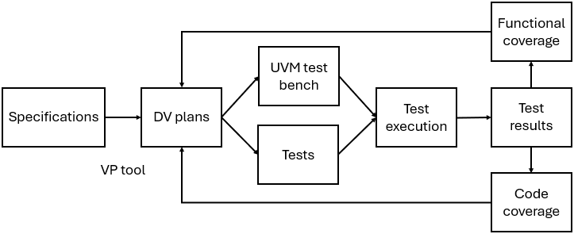

= CV32A6 Verification: Strategy, Environment and the Actual Verification Process
:toc:

== Introduction
=== General Information

This document describes the CV32A6 verification strategy, the verification environment and the actual verification process that led to the CV32A60X cores reaching TRL5.

The development of the environment and the actual verification process of the CV32A6 cores was supported by the TRISTAN project.

[#_Verification_Strategy]
== Verification Strategy

To verify the CVA6 core, the starting point are the specification documents as
tailored RISC-V International ISA Manuals, OpenHW Foundation specifications (for CV-X-IF and OBI) and CVA6 CSR specifications. See the link:../../../design/design-manual/source/intro.adoc[design documentation] for all the references.

As CVA6 as many parameters, currently only one configuration is fully verified according the described strategy. It is the so called CV32A60X core.

From them, link:../../../../verif/docs/VerifPlans/source/index.rst[DV plans]
are written with the help of VP tool.
For each applicable feature in the specifications, several informations are provided in these plans:
e.g. which kind of tests to use, which criteria for passing, which coverage method, unique tag for traceability, link to coverage model.

Based on these DV plans, on one hand, functional coverage items are implemented in the UVM test bench
and on the second hand, tests are generated. Afterwards, the tests are executed on the test bench.
To ensure the compliance of the RTL, the tests are simultaneously run on Spike, used as reference model.
According to produced test results, functional and code coverage is computed.
If some items (cover group for functional coverage, line and condition for code coverage) are not covered, it means that generated tests are not sufficient or the RTL itself contains useless code.

To fill the holes, tests are added (either by better generation or by writing dedicated tests by hand)
and/or RTL code is adapted.
At the end, the few remaining gaps are fully explained (see GitHub tasks
link:https://github.com/openhwgroup/cva6/issues/2870[2870] and
link:https://github.com/openhwgroup/cva6/issues/2908[2908]).

The coverage results and the checklist regarding the CV32A60X configuration are available on
link:https://github.com/openhwgroup/programs/tree/master/Project-Descriptions-and-Plans/CV32A60X[OpenHW project level documentation GitHub repository].

=== Objectives

In order to ensure that the implementation of the design conforms to the specification and that all parts of the implementation have been exercised during the verification process, the verification of a design involves three key aspects:

* the generation of stimuli (through statically defined and/or generated tests),
* the checking of behaviors and properties when the design processes the stimuli,
* the coverage analysis of the RTL code of the implementation.

The checking of behaviors and properties is usually performed by combining several methods:

* logical properties defined in the specification are typically represented using assertions that must hold true at all times;
* behaviors (especially complex ones) are checked by comparing the state of the design at the end of a test scenario against a reference state encoded in the test, typically one or more expected register values;
* when a reference model is available, the behaviors of the design can be tested against the behaviors of the reference model.

The comparison of behaviors of the implementation against a reference model can take two forms:

* post-mortem trace comparison, whereby simulation traces of the implementation and the reference model are compared once both simulations have completed;
* lock-step or "tandem" simulation, whereby both implementation and reference model simulations advance one step at a time and a state comparison between the implementation and the reference model is performed at a common granularity (typically upon instruction completion and trap entry).

For the verification of the CV32A60X core, the decision was made to rely as much as possible on tandem simulations, complemented with assertions when micro-architectural properties needed to be verified.
This choice was motivated by several factors:

* a reference model was already available in the form the Spike instruction set simulator;
* tandem simulations provide quasi-immediate feedback in case of divergence between the behavior of the implementation and that of the referece model;
* the team at Thales has an in-depth knowldege of the RTL implementation, the Spike simulator and the UVM framework developed inside OpenHW Foundation.

=== Approach

The verification solution retained for CV32A60X and CV32A65X is to combine the UVM framework and Spike into a tandem simulation environment in which the RTL simulator acts as a master and Spike is the slave (see xref:fig-overall-tandem-flow[xrefstyle=short]):

* The UVM-based RTL simulation advances until an instruction is committed or a trap in entered;
* If a trap was entered, this fact is notified to the reference model;
* The reference model performs the simulation of one instruction;
* If any CSR registers have been modified by hardware without a corresponding software action, their values are injected into reference model state in place of the values reported by the reference model;
* The hart state reported by the reference model after the single instruction is compared against the state of the RTL model;
* If a difference is found, it is reported to the user;
* If a predefined (and adjustable) number of differences is found, the tandem simulation is aborted.

The structure and operation of the tandem simulation environment is discussed futher in a xref:tandem/README.adoc[dedicated document] which also provides access to reference documentation for Spike and UVM tandem users and developers.

.Overall tandem verification flow
[#fig-overall-tandem-flow]
image::tandem/figures/overall-tandem-architecture.svg[Tandem verification flow,800]

The UVM verification environment used in the verification the CV32A60X and CV32A65X cores is further presented in a xref:verification_environment.adoc[separate CV32A6 UVM environment manual] which describes the architecture of the environment, its elements and their interactions.

The verification process deployed to verify the CV32A60X and CV32A65X cores to TRL5 is described in the xref:verification_process.adoc[CV32A6 verification process document] that discusses the planning, the execution and the outcomes of the verification process using the CV32A6 UVM environment.

http://www.tristan-project.eu[_www.tristan-project.eu_]

_info@tristan-project.eu_

[width="100%",cols="28%,72%",options="header",]

|===

|image:./media/image7.png[Graphical user interface, application Description automatically generated,width=173,height=80] |_TRISTAN has received funding from the Key Digital Technologies Joint Undertaking (KDT JU) under grant agreement nr. 101095947. The KDT JU receives support from the European Union’s Horizon Europe’s research and innovation programme and Austria, Belgium, Bulgaria, Croatia, Cyprus, Czechia, Germany, Denmark, Estonia, Greece, Spain, Finland, France, Hungary, Ireland, Israel, Iceland, Italy, Lithuania, Luxembourg, Latvia, Malta, Netherlands, Norway, Poland, Portugal, Romania, Sweden, Slovenia, Slovakia, Turkey.
|===
