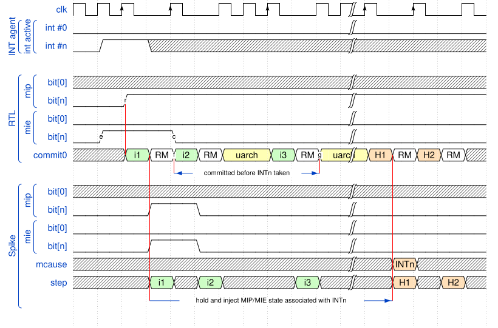

= Case Study: Tandem Modifications for TRL5 Verification of CV32A60X
:toc:

== Introduction

The CV32A60X core was verified at TRL5 level through tandem co-simulation of the RTL implementation and a Spike reference model in a UVM environment.
Spike operation was primarily controlled by parameters supplied through a core-specific Yaml file.  However, during the verification process it appeared that several implementation-dependent choices hardcoded in Spike were in conflict with the choices specified for the CV32A60X core for the corresponding features.
Addressing these differences required additional Spike modifications and the introduction of new parameters not present in the initial version of the tandem infrastructure.  Similarly, Spike was not aware of custom ISA extensions such as the CV-X-IF verification instructions.

The following sections discuss the modifications that were necessary and the way they are addressed in the CVA6  tandem verification infrastructure in order to support TRL5 verificatiom of the CV32A60X and CV32A65X cores.

== Precise handling of interrupts

The handling of interrupts in tandem simulation needs to address the fact tha in the RTL implementation, interrupt detection and processing are decoupled because of micro-architectural behavior properties:

* the occurrence of non-masked interrupts is detected in the "instruction decode" stage of the instruction pipeline;
* the instructions already decoded and the instruction being decoded when the interrupt is detected are executed to completion.

This is illustrated in xref:fig-tandem-interrupt-scenario[xrefstyle=short]:

.Interrupt processing scenario in tandem environment
[#fig-tandem-interrupt-scenario]

where:

* clock (`clk`) rising edges marked with an upward arrow indicate cycles in which instructions are committed; rising clock edges without an upward arrow correspond to additional RTL clock cycles required by microarchitectural constraints;
* `i1`, `i2`, `i3` are normal instruction flow instructions; the interrupt arrives while decoding instruction `i3`;
* `H1` and `H2` are the first two instructions of the interrupt handler;
* `uarch` stands for RTL cycles in which no commits occur (cf. rising clock edges without an upward arrow marker);
* `RM` stands for **Reference Model** and designates intervals in the RTL-driven tandem simulation when the reference model (Spike) simulation is active rather than the RTL one.

In the scenario presented in the figure, the arrival of an external interrupt is represented by interrupt line `int #n` being raised by the UVM interrupt agent.
Since the corresponding interrupt enable bit `mie[n]` was already high (marker `e` on RTL `mie[n]` waveform), the raising of the `mip[n]` triggers the `INT#n` interrupt in the core (marker `r` on the RTL `mip[n]` waveform).
The interrupt is memorized in the cycle in which instruction `i1` is ready to be committed.  The fact that the `mie[n]` interrupt enable bit corresponding to `int #n` is cleared after committing instruction `i1` has no impact on the already latched interrupt: its presence will be propagated through the instruction pipeline.
However, the corresponding handler will only be entered by the RTL implementation when all three instructions that have already been decoded (`i1`, `i2`, `i3`) will have completed.

On the other hand, without special provisions the Reference Model (Spike) would observe the arrival of the interrupt when committing instruction `i1`, and would enter the interrupt handler before committing instruction `i2` which does not match the hardware behavior.

A simple interrupt delaying mechanism consisting in propagating the value of the `mcause` CSR to Spike to indicate that an associated interrupt was taken is **not** reliable either: since the corresponding interrupt enable flag is cleared before the `mcause` notification, Spike will complain that a **disabled** interrupt was taken.

In order to address this issue correctly, it is necessary to notify the Reference Model of the arrival of a taken interrupt upon committing the instruction that was being decoded when the interrupt arrived, and to provide the memorized `mip` and `mie` context matching the detection of the interrupt.
This mechanism was added to Spike in the CSR injection stage.  The information about the *commit* of an instruction associated with an interrupt at decode time is obtained from the RVFI data structures, and the CSR conditions corresponding to the arrival of a non-masked interrupt are maintained inside the Spike tandem interface.

== Support of instructions with multiple destination registers

* describe all additions using a diagram to guide the reader:

** RVFI additions + conventions
** instruction monitor
** new types
** communication channels
** Spike-side UVM interface
** UVM scoreboard and its conventions (no compare of x0, debugging support for reg comparison)

== Implicit activation of ISA extensions by Spike

The specification of CV32A60X ISA does not support the `Zifencei` extension.  However, Spike activated this extension implicitly at all times.

**Remedy: **

. Modify extension activation policy in the ISA handler class `isa_parser_t` to comply with the content of the ISA string wrt. the presence of extension `Zifencei`.  This extension is now activated for a core only if extension name `zifencei` occurs in the ISA string of that core.
. Ensure that the Yaml parameter file of the CV32A60X target does not specify the `zifencei` extension in any ISA strings.

== Addition of a new ISA extension

Spike was not aware of the CV-X-IF verification instructions which are custom additions specific to OpenHW Foundation cores.

**Remedy: **

. Add a new custom extension `xcvxif` to the set of supported ISA extensions in the ISA handler class `isa_parser_t` (files `riscv/isa_parser.h`, `disasm/isa_parser.cc`).
. Add suitable mask and match patterns for the CV-X-IF verification instructions to the list of known encodings in file `riscv/encoding.h`.
. Place the definitions of the instructions in a custom Spike extension `cvxif` which is automatically loaded when `xcvxif` ISA extension name is present in an ISA string.

== Configuration of extensions using parameter files

The CV-X-IF interface has two modes of operation for instructions with three input operands (so-called *R4-type* instructions): these instructions can use all three input operands or only the first two of them.  The mode is controlled by a statically set configuration parameter.  The CV32A60X core only uses the first two source registers.

**Remedy: **

. Add a new core-specific parameter `cvxif_x_num_rs` to Spike.
. Let the `cvxif` custom extension store the value of the parameter as part of its internal state and use it to control the execution of R4-type CV-X-IF instructions.
. Pass the value of the parameter to the extension by means of the standard `reset()` method of the `extension_t` class called when resetting the `Processor` class object used to represent a core.
. Modify the Yaml parameter file of the CV32A60X simulation target to set the  `cvxif_x_num_rs` parameter to value 2.

== Behavior of accesses to unmapped memory addresses

The CV32A60X core is intended for embedded applications and has no memory protection unit.  The memory protection is delegated to platform level and the core treats read and fetch accesses to unmapped locations as returning zeroes, and silently ignores writes to unmapped locations.  On the other hand Spike implicitly integrates a PMP unit and raises exceptions under these conditions.

**Remedy: **

. Add a new core-specific parameter `allow_unmapped_mem_access` to Spike.
. Modify Spike low-level physical read, fetch and store routines in class `mmu_t` to change behaviour according to the value of the `allow_unmapped_mem_access` parameter.
. Modify the Yaml parameter file of the CV32A60X simulation target to set the `allow_unmapped_mem_access` parameter to `True`.

== Parameter-only adjustments of Spike behaviour

The remaining behaviour differences between Spike defaults and the CV32A60X specification could be addressed by already existing parameters:

* CV32A60X has no writable PMP regions: set the number of writable PMP registers to zero

[,yaml]
----
      pmpregions_writable: 0
----

* The `misa` register in CV32A60X has the `X` bit cleared even when the `xcvxif` extension is enabled: override the value of bit 23 in `misa` as determined by Spike and replace it with value 0:

[,yaml]
----
      misa_override_mask:  0x00800000
      misa_override_value: 0x00000000
----

* The `mtvec` register in CV32A60X is writable, but the `MODE` field of `mtvec` has always value 0 corresponding to *direct mode*: enable writing arbitrary values into bits 31:2 of `mtvec` register but force bits 1:0 to zero

[,yaml]
----
      mtvec_write_mask:     0xFFFFFFFC
      mtvec_override_mask:  0x00000003
      mtvec_override_value: 0x00000000
----

== Appendix: The final Yaml parameter file used for CV32A60X TRL5 verification

This is a verbatim copy of file config/gen_from_riscv_config/cv32a60x/spike/spike.yaml@b1f80bd7cff3a94e5191aad96dc3a22f87d0a517 (branch `cv32a60x`, tag `cv32a60x-v6.0.0`):

[,yaml]
----
spike_param_tree:
  bootrom: true
  bootrom_base: 65536
  bootrom_size: 4096
  dram: true
  dram_base: 2147483648
  dram_size: 1073741824
  generic_core_config: false
  max_steps: 200000
  max_steps_enabled: false
  isa: rv32imczicsr_zcb_zba_zbb_zbc_zbs_xcvxif
  priv: M
  core_configs:
    -
      isa: rv32imczicsr_zcb_zba_zbb_zbc_zbs_xcvxif
      extensions: cv32a60x
      boot_addr: 2147483648
      marchid_override_mask: 0xFFFFFFFF
      marchid_override_value: 0x3
      misa_write_mask: 0x0
      misa_override_mask: 0x00800000
      misa_override_value: 0x00000000
      pmp_granularity: 8
      pmpaddr0: 0
      pmpcfg0: 0
      pmpregions_max: 64
      pmpregions_writable: 0
      priv: M
      status_fs_field_we: false
      status_fs_field_we_enable: false
      status_vs_field_we: false
      status_vs_field_we_enable: false
      mstatus_write_mask: 136
      mstatus_override_mask: 6144
      mie_write_mask: 0x00000880
      mie_override_mask: 0xfffff77f
      mie_override_value: 0x00000000
      mip_write_mask: 0x00000000
      mip_override_mask: 0xfffff77f
      mip_override_value: 0x00000000
      mtval_write_mask: 0
      tinfo_accessible: 0
      mscontext_accessible: 0
      mcontext_accessible: 0
      tdata1_accessible: 0
      tdata2_accessible: 0
      tdata3_accessible: 0
      tselect_accessible: 0
      mtvec_write_mask:     0xFFFFFFFC
      mtvec_override_mask:  0x00000003
      mtvec_override_value: 0x00000000
      mhartid: 0
      mvendorid_override_mask : 0xFFFFFFFF
      mvendorid_override_value: 1538
      csr_counters_injection: true
      interrupts_injection: true
      unified_traps: true
      mcycleh_implemented: false
      mhpmevent31_implemented: false
      cvxif_x_num_rs: 2
      allow_unmapped_mem_access: true
----
