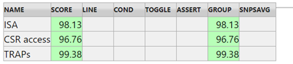
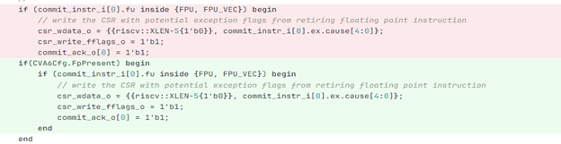
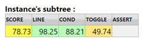

= CV32A6 Verification Process: Planning, Execution and Outcomes
:toc:

== Introduction
=== General Information

This document describes the CV32A6 verification process, focussing on the creation of verification plans, the use of the environment to verify the CV32A60X and CV32A65X designs to TRL5, and reports on the outcomes of the process.  This process was defined and deployed with partial support from the TRISTAN project.

=== Acronyms and Definitions

[width="100%",cols="24%,76%",options="header",]

|===
|Acronym |Description
|TB |Testbench
|UVC |Universal verification component
|IF |SystemVerilog Interface
|CVXIF |CORE-V eXtension Interface
|UVM | Universal Verification Methodology
|RVFI | RISC-V Formal Interface
|DUT | Device Under Test
|SV | SystemVerilog
|VIF | Virtual InterFace
|AXI | Advanced eXtensible Interface
|ISS | Instruction Set Simulator
|RM | Reference Model
|===

==== Write or Generate Tests
Testing is a crucial part of the verification process. Different types of tests are employed:

* Generate assembly tests using CVA6-DV: Uses the RISCV-DV framework to generate assembly-level test programs for the CVA6 core. RISCV-DV is a flexible and extensible tool used for generating RISC-V architecture assembly programs to stress-test the core. The extensions to RISCV-DV are available at (https://github.com/openhwgroup/cva6/tree/master/verif/env/corev-dv).
* Write directed assembly tests: These are manually written test cases designed to target specific behaviors or edge cases that are not covered by automated test generation.

[#_Verification_Plan]
== Verification Plan

The DVPlans are available at (https://github.com/openhwgroup/cva6/tree/master/verif/docs/VerifPlans).

=== <DV Phase A>

* ISA DVPlan: Focuses on verifying the Instruction Set Architecture (ISA) to ensure the core executes instructions correctly.
* CV-XIF DVPlan: This covers the verification of the Core-View External Interface (CV-XIF), likely to be an interface protocol used for communication between the core and external components. It mentions that this plan is for the first version and will require updates as the protocol evolves.
* AXI DVPlan: Deals with the verification of the AXI (Advanced eXtensible Interface).
* Traps DVPlan: Verifies the behavior of the core when exceptions, interrupts, or traps occur.
* CSRs DVPlan: Focuses on verifying the control and status registers (CSRs), which are key for managing the operation of the core.

=== <DV Phase B>

* Frontend DVPlan: Verifies the frontend part of the core, which involves instruction fetching, next pc generation, pre-decoding instruction and RET/Branch prediction.

[#_Verification_Reports]
== Verification Reports

=== Regression Results

* 2000+ tests running on the server: specifically, 2112 tests are executed as part of the regression process, which runs the entire suite of tests repeatedly to ensure that changes or updates do not introduce new bugs. All tests passed, which indicates a stable design at this stage.

[cols="1,1,1,1,1"]
|===
|
|ISA
|Traps
|CSRs
|Data hazard

|Generated tests
|900
|449
|450
|300

|Directed tests
|6
|2
|5
|0
|===

* Scripts handling failed tests: A script is used to automatically remove failing tests from the coverage database. This ensures that the coverage report is based solely on tests that pass, meaning the coverage metrics are representative of correctly functioning parts of the design.

=== Functional coverage

* Create HVP in the CVA6 env to track functional coverage: HVP refers to "Hierarchical Verification Plan," which helps monitor and track the functional coverage of the tests. The goal is to ensure that all functional aspects of the core are exercised during the verification. Functional coverage measures how much of the design’s intended functionality has been exercised.
The functional coverage is split in several parts:

  * Programmer view level: it corresponds to CVA6 from the perspective of the programmer (architectural view): ISA, CSRs, and traps.
  * Design level: it corresponds to the different parts of the CVA6 pipeline (micro-architectural view).

image:./media/hvp.png[./media/hvp,width=624,height=190]

* 98.09% functional coverage for programmer view level: Achieving 98.09% coverage is an excellent result, indicating that most of the ISA (Instruction Set Architecture), CSRs (Control and Status Registers), and traps (interrupt and exception handling) have been tested thoroughly.

* Justificative report for coverage holes: This refers to generating a report explaining any missing coverage (the 1.91% not covered). This might happen due to untested corner cases or unsupported configurations.

* Regarding the design level, the 6.65% coverage result is poor as only the frontend stage of the CVA6 pipeline is currently addressed.

=== Code coverage

* The coverage of line and condition was low, primarily due to unsupported features in the CV32A65X configuration.
* The solution was to parameterize the RTL to make it configurable, remove dead code from the coverage report, and eliminate dead gates from the netlist.
* To achieve this, we used the VCS switch “-cm_seqnoconst -diag noconst” to automatically exclude constant variables and inaccessible code from the coverage analysis.
* An example of the implementation is provided below:

* The gain of parameterization for only MMU and FPU:

image:./media/rtlparamgates.png[./media/rtlparamgates,width=975,height=92]

* We encountered the same problem with toggle coverage, and the score was very low compared to that of line and condition coverage.
* We can’t use the same options applied for line and condition coverage because we can’t parameterize the interface signals. Additionally, the VCS simulator only tracks constant signals if they are directly assigned to a constant value.
* For example, if the aw_user signal from the AXI interface is directly assigned to '0', the simulator will exclude the signal from toggle coverage. However, if aw_user is assigned to another signal, even if that signal is constant, the simulator will take no action.
* To address this, the solution is to generate an exclusion file based on the results of a Python script that detects unsupported signals according to your configuration. (More details about the script)
* Low toggle coverage initially (50%): Toggle coverage refers to how often signals switch between states during simulation. Initially, only 50% of the signals in the design were toggling, which suggests that a significant portion of the design was not being exercised.

* Issue with unsupported signals for configuration: The problem was that some signals were unsupported in the current design configuration. A Python script was used to identify these unsupported signals, and an exclusion file was generated to exclude these signals from code coverage, ensuring accurate reporting.

==== What is missing in code coverage

* CV-XIF tests: An update of the Core-View External Interface (CV-X-IF) protocol (version 1.0) is available, and the verification tests hadn’t been updated to reflect these changes. This gap in testing impacts code coverage, as some parts of the design using this protocol may remain untested.
The verification work of CV-X-IF v1.0 will be done in the ISOLDE project.
* Dead code: There is still some "dead code" in the design, code that is never executed. This could indicate unnecessary or outdated features that need to be either removed or refactored.

=== SpyGlass integration

SpyGlass is a static analysis tool used to find potential issues in RTL code, such as linting errors, coding style violations, and design rule checks. The verification effort involved:

* Adding SpyGlass support from scratch: This included setting up scripts, Makefiles, and other infrastructure to integrate SpyGlass into the CVA6 verification environment.
* Integrating SpyGlass into regression tests: SpyGlass was included in the regression process so that any RTL changes would automatically be checked for issues.
* Reporting results in a dashboard: The results of the SpyGlass runs were compared with previous runs, and reports were generated to track progress, likely in a dashboard for easy visualization of errors and trends.

=== RTL issues detected

RTL (Register Transfer Level) bugs have been detected in various areas of the CVA6 design thanks to verification:

* ISA bugs: Bugs in the instruction set implementation.
* Traps: Bugs in how the core handles exceptions and interrupts.
* CSRs: Bugs related to control and status registers.
* CV-X-IF: Bugs related to the CV-X-IF protocol.
* AXI: Bugs related to the AXI protocol.

All issues are described in CVA6 GitHub repository (https://github.com/openhwgroup/cva6/issues?q=label%3AType%3ABug).

http://www.tristan-project.eu[_www.tristan-project.eu_]

_info@tristan-project.eu_

[width="100%",cols="28%,72%",options="header",]

|===

| |_TRISTAN has received funding from the Key Digital Technologies Joint Undertaking (KDT JU) under grant agreement nr. 101095947. The KDT JU receives support from the European Union’s Horizon Europe’s research and innovation programme and Austria, Belgium, Bulgaria, Croatia, Cyprus, Czechia, Germany, Denmark, Estonia, Greece, Spain, Finland, France, Hungary, Ireland, Israel, Iceland, Italy, Lithuania, Luxembourg, Latvia, Malta, Netherlands, Norway, Poland, Portugal, Romania, Sweden, Slovenia, Slovakia, Turkey.
|===
