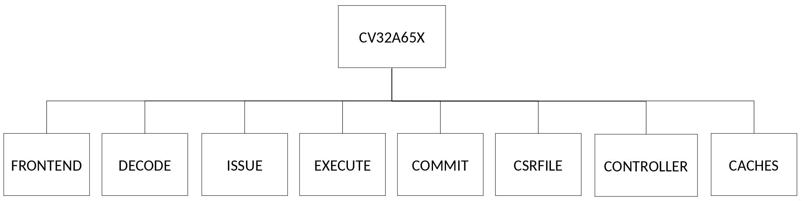
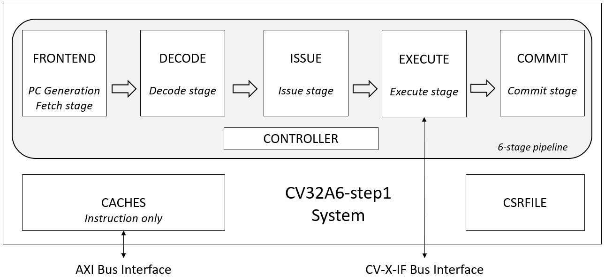

..
   Copyright 2022 Thales DIS design services SAS
   Licensed under the Solderpad Hardware Licence, Version 2.0 (the "License");
   you may not use this file except in compliance with the License.
   SPDX-License-Identifier: Apache-2.0 WITH SHL-2.0
   You may obtain a copy of the License at https://solderpad.org/licenses/

   Original Author: Jean-Roch COULON - Thales

Architecture and Modules
========================

The CV32A6 v0.1.0 subsystem is composed of 8 modules.

   CV32A6 v0.1.0 modules

Connections between modules are illustrated in the following block diagram. FRONTEND, DECODE, ISSUE, EXECUTE, COMMIT and CONTROLLER are part of the pipeline. And CACHES implements the instruction and data caches and CSRFILE contains registers.

   CV32A6 v0.1.0 pipeline and modules

.. toctree::
   :hidden:

   cv32a6_frontend
   cva6_id_stage
   cva6_issue_stage
   cv32a6_execute
   cva6_commit_stage
   cva6_controller
   cva6_csr_regfile
