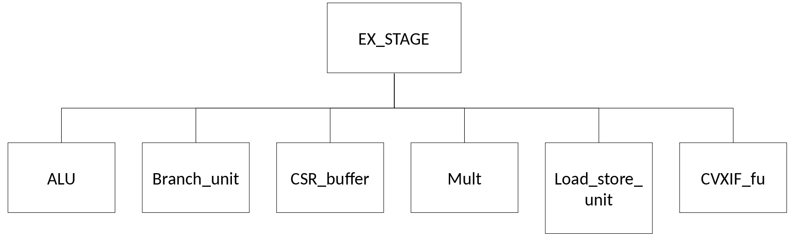

.. _CVA6_EX_STAGE:

###############
EX_STAGE Module
###############

***********
Description
***********

The EX_STAGE module implements ... TO BE COMPLETED

The module is connected to:

* TO BE COMPLETED

.. include:: port_ex_stage.rst

*************
Functionality
*************

TO BE COMPLETED

**********
Submodules
**********

   EX_STAGE submodules

ALU
===

TO BE COMPLETED

Branch Unit
===========

TO BE COMPLETED

CSR Buffer
==========

TO BE COMPLETED

Mult
====

TO BE COMPLETED

.. figure:: ../images/mult_modules.png
   :name: mult submodules
   :align: center
   :alt:

   mult submodules

----------
multiplier
----------

TO BE COMPLETED

------
serdiv
------

TO BE COMPLETED

Load Store Unit (LSU)
=====================

TO BE COMPLETED

.. figure:: ../images/load_store_unit_modules.png
   :name: load_store_unit submodules
   :align: center
   :alt:

   load_store_unit submodules

----------
store_unit
----------

TO BE COMPLETED

---------
load unit
---------

TO BE COMPLETED

----------
lsu_bypass
----------

TO BE COMPLETED

CVXIF_fu
========

TO BE COMPLETED
