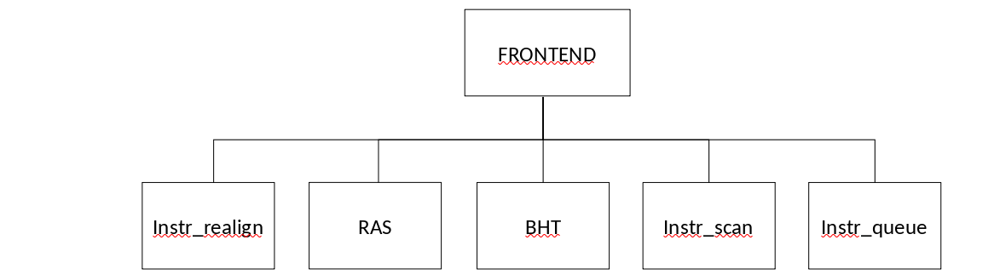

..
   Copyright 2021 Thales DIS design services SAS
   Licensed under the Solderpad Hardware Licence, Version 2.0 (the "License");
   you may not use this file except in compliance with the License.
   SPDX-License-Identifier: Apache-2.0 WITH SHL-2.0
   You may obtain a copy of the License at https://solderpad.org/licenses/

   Original Author: Jean-Roch COULON - Thales

.. _CV32A6_FRONTEND:

FRONTEND Module
===============

Description
-----------

The FRONTEND module implements two first stages of the cva6 pipeline,
PC gen and Fetch stages.

PC gen stage is responsible for generating the next program counter.
It hosts a Branch Target Buffer (BTB), a Branch History Table (BHT) and a Return Address Stack (RAS) to speculate on control flow instructions.

Fetch stage requests data to the CACHE module, realigns the data to store them in instruction queue and transmits the instructions to the DECODE module.
FRONTEND can fetch up to 2 instructions per cycles when C extension instructions is enabled, but DECODE module decodes up to one instruction per cycles.

The module is connected to:

* CACHES module provides fethed instructions to FRONTEND.
* DECODE module receives instructions from FRONTEND.
* CONTROLLER module can order to flush and to halt FRONTEND PC gen stage
* EXECUTE, CONTROLLER, CSR and COMMIT modules trigger PC jumping due to a branch misprediction, an exception, a return from an exception, a debug entry or a pipeline flush.
  They provides the PC next value.
* CSR module states about debug mode.

.. include:: port_frontend.rst

Functionality
-------------

PC Generation stage
~~~~~~~~~~~~~~~~~~~

PC gen generates the next program counter. The next PC can originate from the following sources (listed in order of precedence):

* **Reset state:** At reset, the PC is assigned to the boot address.

* **Branch Prediction:** The fetched instruction is predecoded by the instr_scan submodule.
  When the instruction is a control flow, three cases are considered:

    1. When the instruction is a JALR which corresponds to a return (rs1 = x1 or rs1 = x5).
       RAS provides next PC as a prediction.

    2. When the instruction is a JALR which **does not** correspond to a return.
       If BTB (Branch Target Buffer) returns a valid address, then BTB predicts next PC.
       Else JALR is not considered as a control flow instruction, which will generate a mispredict.

    3. When the instruction is a conditional branch.
       If BHT (Branch History table) returns a valid address, then BHT predicts next PC.
       Else the prediction depends on the PC relative jump offset sign: if sign is negative the prediction is taken, otherwise the prediction is not taken.

  Then the PC gen informs the Fetch stage that it performed a prediction on the PC.

* **Default:** The next 32-bit block is fetched.
  PC Gen fetches word boundary 32-bits block from CACHES module. And the fetch stage identifies the instructions from the 32-bits blocks.

* **Mispredict:** Misprediction are feedbacked by EX_STAGE module.
  In any case we need to correct our action and start fetching from the correct address.

* **Replay instruction fetch:** When the instruction queue is full, the instr_queue submodule asks the fetch replay and provides the address to be replayed.

* **Return from environment call:** When CSR requests a return from an environment call, next PC takes the value of the PC of the instruction after the one pointed to by the mepc CSR.

* **Exception/Interrupt:** If an exception is triggered by CSR_REGISTER, next PC takes the value of the trap vector base address CSR.

* **Pipeline starting fetching from COMMIT PC:** When the commit stage is halted by a WFI instruction or when the pipeline has been flushed due to CSR change, next PC takes the value of the PC coming from the COMMIT submodule.
  As CSR instructions do not exist in a compressed form, PC is unconditionally incremented by 4.

.. user and supervisor modes are not supported by CV32A65X
   The trap vector base address can be different depending on whether the exception traps to S-Mode or  M-Mode (user mode exceptions are currently not supported).
   It is the purpose of the CSR Unit to figure out where to trap to and present the correct address to PC Gen.

.. Debug feature is not supported by CV32A65X
   * **Debug:** Debug has the highest order of precedence as it can interrupt any control flow requests. It also the only source of control flow change which can actually happen simultaneously to any other of the forced control flow changes.
     The debug jump is requested by CSR.
     The address to be jumped into is HW coded.
  

All program counters are logical addressed.

.. MMU is not supported in CV32A65X
   If the logical to physical mapping changes, a ``fence.vm`` instruction should be used to flush the pipeline *and TLBs (MMU is not enabled in CV32A6 v0.1.0)*.

Fetch Stage
~~~~~~~~~~~

Fetch stage controls the CACHE module by a handshaking protocol.
Fetched data is a 32-bit block with a word-aligned address.
A granted fetch is processed by the instr_realign submodule to produce instructions.
Then instructions are pushed into an internal instruction FIFO called instruction queue (instr_queue submodule).
This submodule stores the instructions and sends them to the DECODE module.

.. TO_BE_COMPLETED MMU also feedback an exception, but not present in 65X

Memory can feedback potential exceptions which can be bus errors, invalid accesses or instruction page faults.
The FRONTEND transmits the exception from CACHES to DECODE.

Submodules
----------

   FRONTEND submodules

.. figure:: ../images/ZoominFrontend.png
   :name: frontend-schematic
   :align: center

   FRONTEND submodule interconnections

Instr_realign submodule
~~~~~~~~~~~~~~~~~~~~~~~

The 32-bit aligned block coming from the CACHE module enters the instr_realign submodule.
This submodule extracts the instructions from the 32-bit blocks.
It is possible to fetch up to two instructions per cycle when C extension is used.
An not-compressed instruction can be misaligned on the block size, interleaved with two cache blocks.
In that case, two cache accesses are needed to get the whole instruction.
The instr_realign submodule provides at maximum two instructions per cycle when compressed extensionis enabled, else one instruction per cycle.
Incomplete instruction is stored in instr_realign submodule until its second half is fetched.

.. include:: port_instr_realign.rst

Instr_queue submodule
~~~~~~~~~~~~~~~~~~~~~

The instr_queue receives mutliple instructions from instr_realign submodule to create a valid stream of instructions to be decoded (by DECODE), to be issued (by ISSUE) and executed (by EXECUTE).
FRONTEND pushes in FIFO to store the instructions and related information needed in case of mispredict or exception: instructions, instruction control flow type, exception, exception address and predicted address.
DECODE pops them when decode stage is ready and indicates to the FRONTEND the instruction has been consummed.

The instruction queue contains max 4 instructions.
If the instruction queue is full, a replay request is sent to inform the fetch mechanism to replay the fetch.

The instruction queue can be flushed by CONTROLLER.

.. include:: port_instr_queue.rst

instr_scan submodule
~~~~~~~~~~~~~~~~~~~~

As compressed extension is enabled, two instr_scan are instantiated to handle up to two instructions per cycle.

Each instr_scan submodule pre-decodes the fetched instructions coming from the instr_realign module, instructions could be compressed or not.
The instr_scan submodule is a flox controler which provides the intruction type: branch, jump, return, jalr, imm, call or others.
These outputs are used by the branch prediction feature.

.. include:: port_instr_scan.rst

BHT (Branch History Table) submodule
~~~~~~~~~~~~~~~~~~~~~~~~~~~~~~~~~~~~

BHT is implemented as a memory which is composed of **BHTDepth configuration parameter** entries. The lower address bits of the virtual address point to the memory entry.

When a branch instruction is resolved by the EX_STAGE module, the branch PC and the taken (or not taken) status information is stored in the Branch History Table.

.. TO_BE_COMPLETED: Specify the behaviour when BHT is saturated

The Branch History Table is a table of two-bit saturating counters that takes the virtual address of the current fetched instruction by the CACHE.
It states whether the current branch request should be taken or not.
The two bit counter is updated by the successive execution of the instructions as shown in the following figure.

.. figure:: ../images/bht.png
   :name: BHT saturation
   :align: center
   :alt:

   BHT saturation

.. TODO: if debug enable, The BHT is not updated if processor is in debug mode.

When a branch instruction is pre-decoded by instr_scan submodule, the BHT valids whether the PC address is in the BHT and provides the taken or not prediction.

The BHT is never flushed.

.. include:: port_bht.rst

BTB (Branch Target Buffer) submodule
~~~~~~~~~~~~~~~~~~~~~~~~~~~~~~~~~~~~

BTB is implemented as an array which is composed of **BTBDepth configuration parameter** entries.
The lower address bits of the virtual address point to the memory entry.

When an JALR instruction is found mispredicted by the EX_STAGE module, the JALR PC and the target address are stored into the BTB.

.. TODO: Specify the behaviour when BTB is saturated

.. TODO: when debug enabled, The BTB is not updated if processor is in debug mode.

When a JALR instruction is pre-decoded by instr_scan submodule, the BTB informs whether the input PC address is in the BTB.
In this case, the BTB provides the predicted target address.

The BTB is never flushed.

.. include:: port_btb.rst

RAS (Return Address Stack) submodule
~~~~~~~~~~~~~~~~~~~~~~~~~~~~~~~~~~~~

RAS is implemented as a LIFO which is composed of **RASDepth configuration parameter** entries.

When a JAL instruction is pre-decoded by the instr_scan, the PC of the instruction following JAL instruction is pushed into the RAS when the JAL instruction is added to the instruction queue.

When a JALR instruction which corresponds to a return (rs1 = x1 or rs1 = x5) is pre-decoded by the instr_scan, the predicted return address is popped from the RAS when the JALR instruction is added to the instruction queue.
If the predicted return address is wrong due for instance to speculation or RAS depth limitation, a mis-repdiction will be generated.

The RAS is never flushed.

.. include:: port_ras.rst

