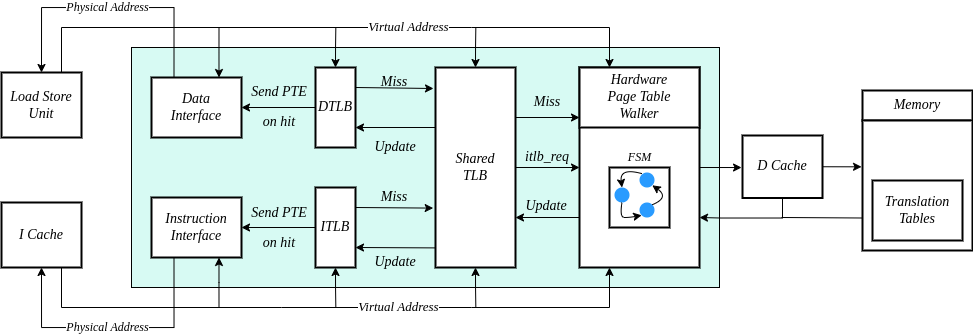
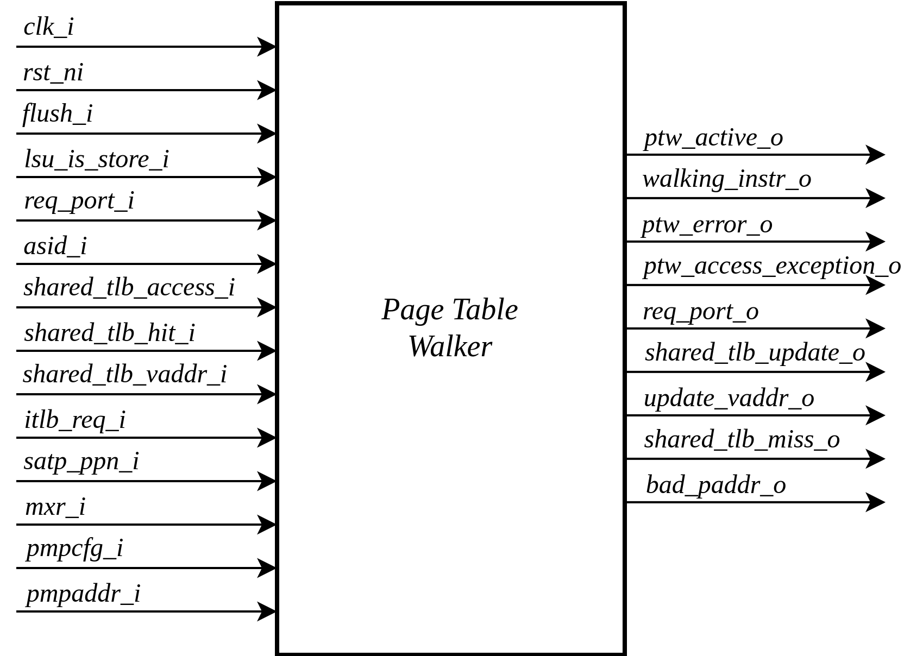
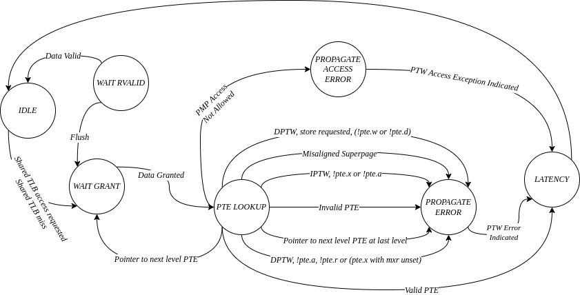
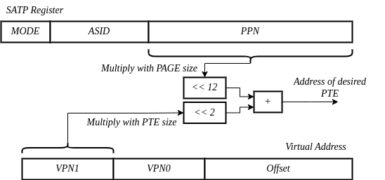

.. _CVA6_MMU:

----------------------
Memory Management Unit
----------------------

The Memory Management Unit (MMU) SV32 module is a crucial component in the RISC-V-based processor, serving as the backbone for virtual memory management and address translation.

.. figure:: ../images/mmu_in_out.png
   :name: **Figure 1:** Inputs and Outputs of CVA6 MMU SV32
   :align: center
   :width: 70%
   :alt: mmu_in_out

   **Figure 1:** Inputs and Outputs of CVA6 MMU SV32

At its core, the MMU SV32 plays a pivotal role in translating virtual addresses into their corresponding physical counterparts.
This translation process is paramount for providing memory protection, isolation, and efficient memory management in modern computer systems.
Importantly, it handles both instruction and data accesses, ensuring a seamless interaction between the processor and virtual memory.
Within the MMU, several major blocks play pivotal roles in this address translation process. These includes:

* Instruction TLB (ITLB)
* Data TLB (DTLB)
* Shared TLB
* Page Table Walker (PTW)

.. figure:: ../images/mmu_major_blocks.png
   :name: **Figure 2:** Major Blocks in CVA6 MMU SV32
   :align: center
   :width: 60%
   :alt: mmu_major_blocks

   **Figure 2:** Major Blocks in CVA6 MMU SV32

The MMU SV32 manages privilege levels and access control, enforcing permissions for user and supervisor modes while handling access exceptions.
It employs Translation Lookaside Buffers (TLBs) for efficient address translation, reducing the need for page table access.
TLB hits yield quick translations, but on misses, the shared TLB is consulted, and if necessary, the Page Table Walker (PTW) performs page table walks, updating TLBs and managing exceptions during the process.

In addition to these functionalities, the MMU SV32 seamlessly integrates support for Physical Memory Protection (PMP), enabling it to enforce access permissions and memory protection configurations as specified by the PMP settings.
This additional layer of security and control enhances the management of memory accesses

.. raw:: html

        Instruction and Data Interfaces

The MMU SV32 maintains interfaces with the instruction cache (ICache) and the load-store unit (LSU).
It receives virtual addresses from these components and proceeds to translate them into physical addresses, a fundamental task for ensuring proper program execution and memory access.

.. raw:: html

        Signal Description of MMU

.. raw:: html

   
 <b>Table 1:</b> CVA6 MMU SV32 Input Output Signals 

.. list-table::
   :header-rows: 1

   * - Signal
     - IO
     - Connection Type
     - Type
     - Description

   * - ``clk_i``
     - in
     - Subsystem
     - logic
     - Subsystem Clock

   * - ``rst_ni``
     - in
     - Subsystem
     - logic
     - Asynchronous reset active low
     
   * - ``flush_i``
     - in
     - Controller
     - logic
     - Sfence Committed

   * - ``enable_translation_i``
     - in
     - CSR RegFile
     - logic
     - Indicate address translation request for instruction

   * - ``en_ld_st_translation_i``
     - in
     - CSR RegFile
     - logic
     - Indicate address translation request for load or store

   * - ``icache_areq_i``
     - in
     - Cache Subsystem
     - icache_arsp_t
     - Icache Response

   * - ``icache_areq_o``
     - out
     - Cache Subsystem
     - icache_areq_t
     - Icache Request

   * - ``misaligned_ex_i``
     - in
     - Load Store Unit
     - exception_t
     - Indicate misaligned exception

   * - ``lsu_req_i``
     - in
     - Load Store Unit
     - logic
     - Request address translation
     
   * - ``lsu_vaddr_i``
     - in
     - Load Store Unit
     - logic [riscv::VLEN-1:0]
     - Virtual Address In

   * - ``lsu_is_store_i``
     - in
     - Store Unit
     - logic
     - Translation is requested by a store

   * - ``lsu_dtlb_hit_o``
     - out
     - Store / Load Unit
     - logic
     - Indicate a DTLB hit

   * - ``lsu_dtlb_ppn_o``
     - out
     - Load Unit
     - logic [riscv::PPNW-1:0]
     - Send PNN to LSU

   * - ``lsu_valid_o``
     - out
     - Load Store Unit
     - logic
     - Indicate a valid translation

   * - ``lsu_paddr_o``
     - out
     - Store / Load Unit
     - logic [riscv::PLEN-1:0]
     - Translated Address

   * - ``lsu_exception_o``
     - out
     - Store / Load Unit
     - exception_t
     - Address Translation threw an exception

   * - ``priv_lvl_i``
     - in
     - CSR RegFile
     - riscv::priv_lvl_t
     - Privilege level for instruction fetch interface

   * - ``ld_st_priv_lvl_i``
     - in
     - CSR RegFile
     - riscv::priv_lvl_t
     - Privilege Level for Data Interface

   * - ``sum_i``
     - in
     - CSR RegFile
     - logic
     - Supervisor User Memory Access bit in xSTATUS CSR register

   * - ``mxr_i``
     - in
     - CSR RegFile
     - logic
     - Make Executable Readable bit in xSTATUS CSR register

   * - ``satp_ppn_I``
     - in
     - CSR RegFile
     - logic [riscv::PPNW-1:0]
     - PPN of top level page table from SATP register

   * - ``asid_i``
     - in
     - CSR RegFile
     - logic [ASID_WIDTH-1:0]
     - ASID to for the lookup

   * - ``asid_to_be_flushed``
     - in
     - Execute Stage
     - logic [ASID_WIDTH-1:0]
     - ASID of the entry to be flushed.

   * - ``vaddr_to_be_flushed_i``
     - in
     - Execute Stage
     - logic [riscv::VLEN-1:0]
     - Virtual address of the entry to be flushed.

   * - ``flush_tlb_i``
     - in
     - Controller
     - logic
     - SFENCE.VMA committed

   * - ``itlb_miss_o``
     - out
     - Performance Counter
     - logic
     - Indicate an ITLB miss

   * - ``dtlb_miss_o``
     - out
     - Performance Counter
     - logic
     - Indicate a DTLB miss

   * - ``req_port_i``
     - in
     - Cache Subsystem
     - dcache_req_o_t
     - D Cache Data Requests

   * - ``req_port_o``
     - out
     - Cache Subsystem
     - dcache_req_i_t
     - D Cache Data Response

   * - ``pmpcfg_i``
     - in
     - CSR RegFile
     - riscv::pmpcfg_t [15:0]
     - PMP configurations

   * - ``pmpaddr_i``
     - in
     - CSR RegFile
     - logic [15:0][riscv::PLEN-3:0]
     - PMP Address

.. raw:: html

   Struct Description

.. raw:: html

   
 <b>Table 2:</b> I Cache Request Struct </b>(icache_areq_t</b>) 

.. list-table::
   :header-rows: 1

   * - Signal
     - Type
     - Description

   * - ``fetch_valid``
     - logic
     - Address Translation Valid

   * - ``fetch_paddr``
     - logic [riscv::PLEN-1:0]
     - Physical Address In

   * - ``fetch_exception``
     - exception_t
     - Exception occurred during fetch

.. raw:: html

   
 <b>Table 3:</b> I Cache Response Struct </b>(icache_arsq_t</b>) 

.. list-table::
   :header-rows: 1

   * - Signal
     - Type
     - Description

   * - ``fetch_req``
     - logic
     - Address Translation Request

   * - ``fetch_vaddr``
     - logic [riscv::VLEN-1:0]
     - Virtual Address out

.. raw:: html

   
 <b>Table 4:</b> Exception Struct </b>(exception_t</b>) 

.. list-table::
   :header-rows: 1

   * - Signal
     - Type
     - Description

   * - ``cause``
     - riscv::xlen_t
     - Cause of exception

   * - ``tval``
     - riscv::xlen_t
     - Additional information of causing exception (e.g. instruction causing it), address of LD/ST fault

   * - ``valid``
     - logic
     - Indicate that exception is valid

.. raw:: html

   
 <b>Table 5:</b> PMP Configuration Struct </b>(pmpcfg_t</b>) 

.. list-table::
   :header-rows: 1

   * - Signal
     - Type
     - Description

   * - ``locked``
     - logic
     - Lock this configuration

   * - ``reserved``
     - logic[1:0]
     - Reserved bits in pmpcfg CSR

   * - ``addr_mode``
     - pmp_addr_mode_t
     - Addressing Modes: OFF, TOR, NA4, NAPOT

   * - ``access_type``
     - pmpcfg_access_t
     - None, read, write, execute

.. raw:: html

   Control Flow in MMU SV32 Module

   **Figure 3:** Control Flow in CVA6 MMU SV32

.. raw:: html

   Exception Sources with Address Translation Enabled

Two potential exception sources exist:

* Hardware Page Table Walker (HPTW) throwing an exception, signifying a page fault exception.
* Access error due to insufficient permissions of PMP, known as an access exception.

.. raw:: html

   Instruction Fetch Interface

The IF stage initiates a request to retrieve memory content at a specific virtual address. When the MMU is disabled, the instruction fetch request is directly passed to the I$ without modifications.

.. raw:: html

   Address Translation in Instruction Interface

If virtual memory translation is enabled for instruction fetches, the following operations are performed in the instruction interface:

* Compatibility of requested virtual address with selected page based address translation scheme is checked.
* For 4K page translation, the module determines the fetch physical address by combining the physical page number (PPN) from ITLB content and the offset from the virtual address.
* In the case of Mega page translation, if the ITLB indicates a 4M page, the VPN0 from the fetch virtual address is written to the PPN0 of the fetch physical address to ensure alignment for superpage translation.
* If the Instruction TLB (ITLB) lookup hits, the fetch valid signal (which indicates a valid physical address) is activated in response to the input fetch request. Memory region accessibility is checked from the perspective of the fetch operation, potentially triggering a page fault exception in case of an access error or insufficient PMP permission.
* In case of an ITLB miss, if the page table walker (PTW) is active (only active if there is a shared TLB miss) and handling instruction fetches, the fetch valid signal is determined based on PTW errors or access exceptions.

If the fetch physical address doesn't match any execute region, an Instruction Access Fault is raised. When not translating, PMPs are immediately checked against the physical address for access verification.

.. raw:: html

   Data Interface

.. raw:: html

   Address Translation in Data Interface

If address translation is enabled for load or store, and no misaligned exception has occurred, the following operations are performed in the data interface:

* Initially, translation is assumed to be invalid, signified by the MMU to LSU.
* The translated physical address is formed by combining the PPN from the Page Table Entry (PTE) and the offset from the virtual address requiring translation. This send one cycle later due to the additional bank of registers which delayed the MMU’s answer. The PPN from the PTE is also shared separately with LSU in the same cycle as the hit.
* In the case of superpage translation, as in SV32, known as the 4M page, PPN0 of the translated physical address and the separately shared PPN are updated with the VPN0 of the virtual address.

If a Data TLB (DTLB) hit occurs, it indicates a valid translation, and various fault checks are performed depending on whether it's a load or store request.

* For store requests, if the page is not writable, the dirty flag isn't set, or privileges are violated, it results in a page fault corresponding to the store access. If PMPs are also violated, it leads to an access fault corresponding to the store access. Page faults take precedence over access faults.
* For load requests, a page fault is triggered if there are insufficient access privileges. PMPs are checked again during load access, resulting in an access fault corresponding to load access if PMPs are violated.

In case of a DTLB miss, potential exceptions are monitored during the page table walk. If the PTW indicates a page fault, the corresponding page fault related to the requested type is signaled. If the PTW indicates an access exception, the load access fault is indicated through address translation because the page table walker can only throw load access faults.

.. raw:: html

   Address Translation is Disabled

When address translation is not enabled, the physical address is immediately checked against Physical Memory Protections (PMPs). If there is a request from LSU, no misaligned exception, and PMPs are violated, it results in an access fault corresponding to the request being indicated.

----------------------------
Translation Lookaside Buffer
----------------------------

Page tables are accessed for translating virtual memory addresses to physical memory addresses. This translation needs to be carried out for every load and store instruction and also for every instruction fetch. Since page tables are resident in physical memory, accessing these tables in all these situations has a significant impact on performance.  Page table accesses occur in patterns that are closely related in time. Furthermore, the spatial and temporal locality of data accesses or instruction fetches mean that the same page is referenced repeatedly. Taking advantage of these access patterns the processor keeps the information of recent address translations, to enable fast retrieval, in a small cache called the Translation Lookaside Buffer (TLB) or an address-translation cache. 

The CVA6 TLB is structured as a fully associative cache, where the virtual address that needs to be translated is compared against all the individual TLB entries. Given a virtual address, the processor examines the TLB (TLB lookup) to determine if the virtual page number (VPN) of the page being accessed is in the TLB. When a TLB entry is found (TLB hit), the TLB returns the corresponding physical page number (PPN) which is used to calculate the target physical address. If no TLB entry is found (TLB miss) the processor has to read individual page table entries from memory (Table walk). In CVA6 table walking is supported by dedicated hardware. Once the processor finishes the table walk it has the Physical Page Number (PPN) corresponding to the Virtual Page Number (VPN) That needs to be translated. The processor adds an entry for this address translation to the TLB so future translations of that virtual address will happen quickly through the TLB.  During the table walk the processor may find out that the corresponding physical page is not resident in memory. At this stage a page table exception (Page Fault) is generated which gets handled by the operating system. The operating system places the appropriate page in memory, updates the appropriate page tables and returns execution to the instruction which generated the exception.  

The inputs and output signals of the TLB are shown in the following two figures. 

.. figure:: ../images/in_out_tlb.png
   :name: **Figure 4:** Inputs and Outputs of CVA6 TLB
   :align: center
   :width: 65%
   :alt: in_out_tlb

   **Figure 4:** Inputs and Outputs of CVA6 TLB

.. raw:: html

   Signal Description of TLB

.. raw:: html

   
 <b>Table 6:</b> CVA6 TLB Input Output Signals 

.. list-table::
   :header-rows: 1

   * - Signal
     - IO
     - connection
     - Type
     - Description

   * - ``clk_i``
     - in
     - SUBSYSTEM
     - logic
     - Subsystem Clock

   * - ``rst_ni``
     - in
     - SUBSYSTEM
     - logic
     - Asynchronous reset active low
     
   * - ``flush_i``
     - in
     - Controller
     - logic
     - Asynchronous reset active low

   * - ``update_i``
     - in
     - Shared TLB
     - tlb_update_sv32_t
     - Updated tag and content of TLB

   * - ``lu_access_i``
     - in
     - Cache Subsystem
     - logic
     - Signal indicating a lookup access is being requested

   * - ``lu_asid_i``
     - in
     - CSR RegFile
     - logic[ASID_WIDTH-1:0]
     - ASID (Address Space Identifier) for the lookup

   * - ``lu_vaddr_i``
     - in
     - Cache Subsystem
     - logic[riscv::VLEN-1:0]
     - Virtual address for the lookup

   * - ``lu_content_o``
     - out
     - MMU SV32
     - riscv::pte_sv32_t
     - Output for the content of the TLB entry

   * - ``asid_to_be_flushed_i``
     - in
     - Execute Stage
     - logic[ASID_WIDTH-1:0]
     - ASID of the entry to be flushed

   * - ``vaddr_to_be_flushed_i``
     - in
     - Execute Stage
     - logic[riscv::VLEN-1:0]
     - Virtual address of the entry to be flushed

   * - ``lu_is_4M_o``
     - out
     - MMU SV32
     - logic
     - Output indicating whether the TLB entry corresponds to a 4MB page

   * - ``lu_hit_o``
     - out
     - MMU SV32
     - logic
     - Output indicating whether the lookup resulted in a hit or miss

.. raw:: html

        Struct Description

.. raw:: html

   
 <b>Table 7:</b> SV32 TLB Update Struct (<b>tlb_update_sv32_t</b>) 

.. list-table::
   :header-rows: 1

   * - Signal
     - Type
     - Description

   * - ``valid``
     - logic
     - Indicates whether the TLB update entry is valid or not

   * - ``is_4M``
     - logic
     - Indicates if the TLB entry corresponds to a 4MB page

   * - ``vpn``
     - logic[19:0]
     - Virtual Page Number (VPN) used for updating the TLB, consisting of 20 bits

   * - ``asid``
     - logic[8:0]
     - Address Space Identifier (ASID) used for updating the TLB, with a length of 9 bits for Sv32 MMU

   * - ``content``
     - riscv::pte_sv32_t
     - Content of the TLB update entry, defined by the structure

.. raw:: html

   
 <b>Table 8:</b> SV32 PTE Struct (<b>riscv::pte_sv32_t</b>) 

.. list-table::
   :header-rows: 1

   * - Signal
     - Type
     - Description

   * - ``ppn``
     - logic[21:0]
     - 22 bit Physical Page Number (PPN)

   * - ``rsw``
     - logic[1:0]
     - Reserved for use by supervisor software

   * - ``d``
     - logic
     - | Dirty bit indicating whether the page has been modified (dirty) or not
       | 0: Page is clean i.e., has not been written
       | 1: Page is dirty i.e., has been written

   * - ``a``
     - logic
     - | Accessed bit indicating whether the page has been accessed
       | 0: Virtual page has not been accessed since the last time A bit was cleared
       | 1: Virtual page has been read, written, or fetched from since the last time the A bit was cleared

   * - ``g``
     - logic
     - | Global bit marking a page as part of a global address space valid for all ASIDs
       | 0: Translation is valid for specific ASID
       | 1: Translation is valid for all ASIDs

   * - ``u``
     - logic
     - | User bit indicating privilege level of the page
       | 0: Page is not accessible in user mode but in supervisor mode
       | 1: Page is accessible in user mode but not in supervisor mode

   * - ``x``
     - logic
     - | Execute bit which allows execution of code from the page
       | 0: Code execution is not allowed
       | 1: Code execution is permitted

   * - ``w``
     - logic
     - | Write bit allows the page to be written
       | 0: Write operations are not allowed
       | 1: Write operations are permitted

   * - ``r``
     - logic
     - | Read bit allows read access to the page
       | 0: Read operations are not allowed
       | 1: Read operations are permitted

   * - ``v``
     - logic
     - | Valid bit indicating the page table entry is valid
       | 0: Page is invalid i.e. page is not in DRAM, translation is not valid
       | 1: Page is valid i.e. page resides in the DRAM, translation is valid

.. raw:: html

   TLB Entry Fields

The number of TLB entries can be changed via a design parameter. In 32-bit configurations of CVA6 only 2 TLB entries are instantiated.  Each TLB entry is made up of two fields: Tag and Content. The Tag field holds the virtual page number (VPN1, VPN0), ASID, page size (is_4M) along with a valid bit (VALID) indicating that the entry is valid. The SV32 virtual page number, which is supported by CV32A6X, is further split into two separate virtual page numbers VPN1 and VPN0. The Content field contains two physical page numbers (PPN1, PPN0) along with a number of bits which specify various attributes of the physical page. Note that the V bit in the Content field is the V bit which is present in the page table in memory. It is copied from the page table, as is,  and the VALID bit in the Tag is set based on its value.The TLB entry fields are shown in **Figure 2**.

   **Figure 5:** Fields in CVA6 TLB entry

.. raw:: html

   CVA6 TLB Management / Implementation

The CVA6 TLB implements the following three functions:

* **Translation:** This function implements the address lookup and match logic.
* **Update and Flush:** This function implements the update and flush logic.
* **Pseudo Least Recently Used Replacement Policy:** This function implements the replacement policy for TLB entries.

.. raw:: html

   Translation

This function takes in the virtual address and certain other fields, examines the TLB to determine if the virtual page number of the page being accessed is in the TLB or not. If a TLB entry is found (TLB hit), the TLB returns the corresponding physical page number (PPN) which is then used to calculate the target physical address. The following checks are done as part of this lookup function to find a match in the TLB:

* **Validity Check:** For a TLB hit, the associated TLB entry must be valid .
* **ASID and Global Flag Check:** The TLB entry's ASID must match the given ASID (ASID associated with the Virtual address). If the TLB entry’s Global bit (G) bit is set then this check is not done. This ensures that the translation is either specific to the provided ASID or it is globally applicable.
* **Level 1 VPN match:** SV32 implements a two-level page table. As such the virtual address is broken up into three parts which are the virtual page number 1, virtual page number 0 and displacement. So the condition that is checked next is that the virtual page number 1 of the virtual address matches the virtual page number 1(VPN1) of the TLB entry. 
* **Level 0 VPN match or 4-Mega Page:** The last condition to be checked, for a TLB hit, is that the virtual page number 0 of the virtual address matches the virtual page number 0 of the TLB entry (VPN0). This match is ignored if the is_4M bit in the Tag is set which implies a super 4M page.

All the conditions listed above are checked against every TLB entry. If there is a TLB hit then the corresponding bit in the hit array is set. **Figure 3** Illustrates the TLB hit/miss process listed above.

.. figure:: ../images/cva6_tlb_hit.png
   :name: **Figure 6:** Block diagram of CVA6 TLB hit or miss
   :align: center
   :width: 75%
   :alt: cva6_tlb_hit

   **Figure 6:** Block diagram of CVA6 TLB hit or miss

.. raw:: html

   Flushing TLB entries

The SFENCE.VMA instruction can be used with certain specific source register specifiers (rs1 & rs2) to flush a specific TLB entry, some set of TLB entries or all TLB entries. Like all instructions this action only takes place when the SFENCE.VMA instruction is committed (shown via the commit_sfence signal in the following figures.) The behavior of the instruction is as follows:

* **If rs1 is not equal to x0 and rs2 is not equal to x0:** Invalidate all TLB entries which contain leaf page table entries corresponding to the virtual address in rs1 (shown below as Virtual Address to be flushed) and that match the address space identifier as specified by integer register rs2 (shown below as asid_to_be_flushed_i), except for entries containing global mappings. This is referred to as the “SFENCE.VMA vaddr asid” case.

.. figure:: ../images/sfence_vaddr_asid.png
   :name: **Figure 7:** Invalidate TLB entry if ASID and virtual address match
   :align: center
   :width: 75%
   :alt: sfence_vaddr_asid

   **Figure 7:** Invalidate TLB entry if ASID and virtual address match

* **If rs1 is equal to x0 and rs2 is equal to x0:** Invalidate all TLB entries for all address spaces. This is referred to as the "SFENCE.VMA x0 x0" case.

.. figure:: ../images/sfence_x0_x0.png
   :name: **Figure 8:** Invalidate all TLB entries if both source register specifiers are x0
   :align: center
   :width: 62%
   :alt: sfence_x0_x0

   **Figure 8:** Invalidate all TLB entries if both source register specifiers are x0

* **If rs1 is not equal to x0 and rs2 is equal to x0:** invalidate all TLB entries that contain leaf page table entries corresponding to the virtual address in rs1, for all address spaces. This is referred to as the “SFENCE.VMA vaddr x0” case.

.. figure:: ../images/sfence_vaddr_x0.png
   :name: **Figure 9:** Invalidate TLB entry with matching virtual address for all address spaces
   :align: center
   :width: 75%
   :alt: sfence_vaddr_x0

   **Figure 9:** Invalidate TLB entry with matching virtual address for all address spaces

* **If rs1 is equal to x0 and rs2 is not equal to x0:** Invalidate all TLB entries matching the address space identified by integer register rs2, except for entries containing global mappings. This is referred to as the “SFENCE.VMA 0 asid” case.

.. figure:: ../images/sfence_x0_asid.png
   :name: **Figure 10:** Invalidate TLB entry for matching ASIDs
   :align: center
   :width: 75%
   :alt: sfence_x0_asid

   **Figure 10:** Invalidate TLB entry for matching ASIDs

.. raw:: html

   Updating TLB

When a TLB valid update request is signaled by the shared TLB, and the replacement policy select the update of a specific TLB entry, the corresponding entry's tag is updated with the new tag, and its associated content is refreshed with the information from the update request. This ensures that the TLB entry accurately reflects the new translation information.

.. raw:: html

   Pseudo Least Recently Used Replacement Policy

Cache replacement algorithms are used to determine which TLB entry should be replaced, because it is not likely to be used in the near future. The Pseudo-Least-Recently-Used (PLRU) is a cache entry replacement algorithm, derived from Least-Recently-Used (LRU) cache entry replacement algorithm, used by the TLB. Instead of precisely tracking recent usage as the LRU algorithm does, PLRU employs an approximate measure to determine which entry in the cache has not been recently used and as such can be replaced. 

CVA6 implements the PLRU algorithm via the Tree-PLRU method which implements a binary tree. The TLB entries are the leaf nodes of the tree. Each internal node, of the tree, consists of a single bit, referred to as the state bit or plru bit, indicating which subtree contains the (pseudo) least recently used entry (the PLRU); 0 for the left hand tree and 1 for the right hand tree. Following this traversal, the leaf node reached, corresponds to the PLRU entry which can be replaced. Having accessed an entry (so as to replace it) we need to promote that entry to be the Most Recently Used (MRU) entry. This is done by updating the value of each node along the access path to point away from that entry. If the accessed entry is a right child i.e., its parent node value is 1, it is set to 0, and if the parent is the left child of its parent (the grandparent of the accessed node) then its node value is set to 1 and so on all the way up to the root node.

The PLRU binary tree is implemented as an array of node values. Nodes are organized in the array based on levels, with those from lower levels appearing before higher ones. Furthermore those on the left side of a node appear before those on the right side of a node. The figure below shows a tree and the corresponding array.

.. figure:: ../images/plru_tree_indexing.png
   :name: **Figure 11:** PLRU Tree Indexing
   :align: center
   :width: 60%
   :alt: plru_tree_indexing

   **Figure 11:** PLRU Tree Indexing

For n-way associative, we require n - 1 internal nodes in the tree. With those nodes, two operations need to be performed efficiently.

* Promote the accessed entry to be MRU
* Identify which entry to replace (i.e. the PLRU entry)

.. raw:: html

   Updating the PLRU-Tree

For a TLB entry which is accessed, the following steps are taken to make it the MRU:

1. Iterate through each level of the binary tree.
2. Calculate the index of the leftmost child within the current level. Let us call that index the index base.
3. Calculate the shift amount to identify the relevant node based on the level and TLB entry index.
4. Calculate the new value that the node should have in order to make the accessed entry the Most Recently Used (MRU). The new value of the root node is the opposite of the TLB entry index, MSB at the root node, MSB - 1 at node at next level and so on.
5. Assign this new value to the relevant node, ensuring that the hit entry becomes the MRU within the binary tree structure.

At level 0, no bit of the TLB entry’s index determines the offset from the index base because it’s a root node. At level 1, MSB of entry’s index determines the amount of offset from index base at that level. At level 2, the first two bits of the entry's index from MSB side determine the offset from the index base because there are 4 nodes at the level 2 and so on. 

.. figure:: ../images/update_tree.png
   :name: **Figure 12:** Promote Entry to be MRU
   :align: center
   :width: 82%
   :alt: update_tree

   **Figure 12:** Promote Entry to be MRU

In the above figure entry at index 5, is accessed. To make it MRU entry, every node along the access path should point away from it. Entry 5 is a right child, therefore, its parent plru bit set to 0, its parent is a left child, its grand parent’s plru bit set to 1, and great grandparent’s plru bit set to 0.

.. raw:: html

   Entry Selection for Replacement

Every TLB entry is checked for the replacement entry. The following steps are taken:

1. Iterate through each level of the binary tree.
2. Calculate the index of the leftmost child within the current level. Let us call that index the index base.
3. Calculate the shift amount to identify the relevant node based on the level and TLB entry index.
4. If the corresponding bit of the entry's index matches the value of the node being traversed at the current level, keep the replacement signal high for that entry; otherwise, set the replacement signal to low.

.. figure:: ../images/replacement_entry.png
   :name: **Figure 13:** Possible path traverse for entry selection for replacement
   :align: center
   :width: 65%
   :alt: replacement_entry

   **Figure 13:** Possible path traverse for entry selection for replacement

Figure shows every possible path that traverses to find out the PLRU entry. If the plru bit at each level matches with the corresponding bit of the entry's index, that’s the next entry to replace. Below Table shows the entry selection for replacement.

.. raw:: html

   
 <b>Table 9:</b> Entry Selection for Reaplacement 

+-------------------+---------------+----------------------+
| **Path Traverse** | **PLRU Bits** | **Entry to replace** |
+-------------------+---------------+----------------------+
| 0 -> 1 -> 3       | 000           | 0                    |
|                   +---------------+----------------------+
|                   | 001           | 1                    |
+-------------------+---------------+----------------------+
| 0 -> 1 -> 4       | 010           | 2                    |
|                   +---------------+----------------------+
|                   | 011           | 3                    |
+-------------------+---------------+----------------------+
| 0 -> 2 -> 5       | 100           | 4                    |
|                   +---------------+----------------------+
|                   | 101           | 5                    |
+-------------------+---------------+----------------------+
| 0 -> 2 -> 6       | 110           | 6                    |
|                   +---------------+----------------------+
|                   | 111           | 7                    |
+-------------------+---------------+----------------------+

-----------------------------------
Shared Translation Lookaside Buffer
-----------------------------------

The CVA6 shared TLB is structured as a 2-way associative cache, where the virtual address requiring translation is compared with the set indicated by the virtual page number. The shared TLB is looked up in case of an Instruction TLB (ITLB) or data TLB (DTLB) miss, signaled by these TLBs. If the entry is found in the shared TLB set, the respective TLB, whose translation is being requested, is updated. If the entry is not found in the shared TLB, then the processor has to perform a page table walk. Once the processor obtains a PPN corresponding to the VPN, the shared TLB is updated with this information. If the physical page is not found in the page table, it results in a page fault, which is handled by the operating system. The operating system will then place the corresponding physical page in memory.

The inputs and output signals of the shared TLB are shown in the following two figures. 

.. figure:: ../images/shared_tlb_in_out.png
   :name: **Figure 14:** Inputs and outputs of CVA6 shared TLB
   :align: center
   :width: 60%
   :alt: shared_tlb_in_out

   **Figure 14:** Inputs and outputs of CVA6 shared TLB

.. raw:: html

   Signal Description

.. raw:: html

   
 <b>Table 10:</b> Signal Description of CVA6 shared TLB 

.. list-table::
   :header-rows: 1

   * - Signal
     - IO
     - Connection
     - Type
     - Description

   * - ``clk_i``
     - in
     - Subsystem
     - logic
     - Subsystem Clock

   * - ``rst_ni``
     - in
     - Subsystem
     - logic
     - Asynchronous reset active low

   * - ``flush_i``
     - in
     - Controller
     - logic
     - TLB flush request

   * - ``enable_translation_i``
     - in
     - CSR Regfile
     - logic
     - CSRs indicate to enable Sv32

   * - ``en_ld_st_translation_i``
     - in
     - CSR Regfile
     - logic
     - Enable virtual memory translation for load/stores

   * - ``asid_i``
     - in
     - CSR Regfile
     - logic
     - ASID for the lookup

   * - ``itlb_access_i``
     - in
     - Cache Subsystem
     - logic
     - Signal indicating a lookup access in ITLB is being requested.

   * - ``itlb_hit_i``
     - in
     - ITLB
     - logic
     - Signal indicating an ITLB hit

   * - ``itlb_vaddr_i``
     - in
     - Cache Subsystem
     - logic[31:0]
     - Virtual address lookup in ITLB

   * - ``dtlb_access_i``
     - in
     - Load/Store Unit
     - logic
     - Signal indicating a lookup access in DTLB is being requested.

   * - ``dtlb_hit_i``
     - in
     - DTLB
     - logic
     - Signal indicating a DTLB hit

   * - ``dtlb_vaddr_i``
     - in
     - Load/Store Unit
     - logic[31:0]
     - Virtual address lookup in DTLB

   * - ``itlb_update_o``
     - out
     - ITLB
     - tlb_update_sv32_t
     - Tag and content to update ITLB

   * - ``dtlb_update_o``
     - out
     - DTLB
     - tlb_update_sv32_t
     - Tag and content to update DTLB

   * - ``itlb_miss_o``
     - out
     - Performance Counter
     - logic
     - Signal indicating an ITLB miss

   * - ``dtlb_miss_o``
     - out
     - Performance Counter
     - logic
     - Signal indicating a DTLB miss
     
   * - ``shared_tlb_access_o``
     - out
     - PTW
     - logic
     - Signal indicating a lookup access in shared TLB is being requested

   * - ``shared_tlb_hit_o``
     - out
     - PTW
     - logic
     - Signal indicating a shared TLB hit

   * - ``shared_tlb_vadd_o``
     - out
     - PTW
     - logic[31:0]
     - Virtual address lookup in shared TLB
     
   * - ``itlb_req_o``
     - out
     - PTW
     - logic
     - ITLB Request Output

   * - ``shared_tlb_update_i``
     - in
     - PTW
     - tlb_update_sv32_t
     - Updated tag and content of shared TLB

.. raw:: html

   Struct Description

.. raw:: html

   
 <b>Table 11:</b> Shared TLB Update Struct </b>(shared_tag_t</b>) 

.. list-table::
   :header-rows: 1

   * - Signal
     - Type
     - Description

   * - ``is_4M``
     - logic
     - Indicates if the shared TLB entry corresponds to a 4MB page.

   * - ``vpn1``
     - logic[9:0]
     - Virtual Page Number (VPN) represents the index of PTE in the page table level 1.

   * - ``vpn0``
     - logic[9:0]
     - Virtual Page Number (VPN) represents the index of PTE in the page table level 0.

   * - ``asid``
     - logic
     - Address Space Identifier (ASID) used to identify different address spaces

.. raw:: html

   Shared TLB Entry Structure

Shared TLB is 2-way associative, with a depth of 64. A single entry in the set contains the valid bit, tag and the content. The Tag segment stores details such as the virtual page number (VPN1, VPN0), ASID, and page size (is_4M). The Content field contains two physical page numbers (PPN1, PPN0) along with a number of bits which specify various attributes of the physical page.

.. figure:: ../images/shared_tlb.png
   :name: **Figure 15:** CVA6 Shared TLB Structure
   :align: center
   :width: 60%
   :alt: shared_tlb

   **Figure 15:** CVA6 Shared TLB Structure

.. raw:: html

   Shared TLB Implementation in CVA6

The implementation of a shared TLB in CVA6 is described in the following sections:

* **ITLB and DTLB Miss:** Prepare a shared TLB lookup if the entry is not found in ITLB or DTLB.
* **Tag Comparison:** Look up the provided virtual address in the shared TLB.
* **Update and Flush:** Flush the shared TLB or update it.
* **Replacement Policies:** First non-valid entry and random replacement policy.

.. raw:: html

   ITLB and DTLB Miss

Consider a scenario where an entry is found in the ITLB or DTLB. In this case, there is no need to perform a lookup in the shared TLB since the entry has already been found. Next, there are two scenarios: an ITLB miss or a DTLB miss.

To identify an ITLB miss, the following conditions need to be fulfilled:

* Address translation must be enabled.
* There must be an access request to the ITLB.
* The ITLB should indicate an ITLB miss.
* There should be no access request to the DTLB.

During an ITLB miss, access is granted to read the tag and content of the shared TLB from their respective sram. The address for reading the tag and content of the shared TLB entry is calculated using the virtual address for which translation is not found in the ITLB. The ITLB miss is also explicitly indicated by the shared TLB. A request for shared TLB access is initiated.

To identify the DTLB miss, the following conditions need to be fulfilled:

* Address translation for load and stores must be enabled.
* There must be an access request to the DTLB.
* The DTLB should indicate a DTLB miss.

In the case of a DTLB miss, the same logic is employed as described for an ITLB miss.

.. raw:: html

   Tag Comparison

Shared TLB lookup for a hit occurs under the same conditions as described for the TLB modules used as ITLB and DTLB. However, there are some distinctions. In both the ITLB and DTLB, the virtual address requiring translation is compared against all TLB entries. In contrast, the shared TLB only compares the tag and content of the set indicated by the provided virtual page number. The index of the set is extracted from VPN0 of the requested virtual address. Given that the shared TLB is 2-way associative, each set contains two entries. Consequently, both of these entries are compared. Below figure illustrates how the set is opted for the lookup.

.. figure:: ../images/shared_tlb_set.png
   :name: **Figure 16:** Set opted for lookup in shared TLB
   :align: center
   :width: 60%
   :alt: shared_tlb_set

   **Figure 16:** Set opted for lookup in shared TLB

.. raw:: html

   Update and Flush

Differing from the ITLB and DTLB, a specific virtual address or addressing space cannot be flushed in the shared TLB. When SFENCE.VMA is committed, all entries in the shared TLB are invalidated. (Cases of SFENCE.VMA should also be added in shared TLB)

.. raw:: html

   Updating Shared TLB

When the Page Table Walker signals a valid update request, the shared TLB is updated by selecting an entry through the replacement policy and marking it as valid. This also triggers the writing of the new tag and content to the respective SRAM.

.. raw:: html

   Replacement Policy Implemented in CVA6 Shared TLB

In CVA6's shared TLB, two replacement policies are employed for replacements based on a specific condition. These replacement policies select the entry within the set indicated by the virtual page number. The two policies are:

* First non-valid encounter replacement policy
* Random replacement policy

First replacement policy failed if all ways are valid. Therefore, a random replacement policy is opted for. 

.. raw:: html

   First non-valid encounter replacement policy

The module implemented in CVA6 to find the first non-valid entry in the shared TLB is the Leading Zero Counter (LZC). It takes three parameters as input:

1. **WIDTH:** The width of the input vector.
2. **MODE:** Mode selection - 0 for trailing zero, 1 for leading zero.
3. **CNT WIDTH:** Width of the output signal containing the zero count.

The input signal is the vector to be counted, and the output represents the count of trailing/leading zeros. If all bits in the input vector are zero, it will also be indicated.

When initializing the module, the width of the input vector is set to the number of shared TLB ways. The trailing zero counter mode is selected. The vector of valid bits is set as the input vector, but with negation. This is because we want the index of the first non-valid entry, and LZC returns the count of trailing zeros, which actually corresponds to the index of the first occurrence of 1 from the least significant bit (LSB). if there is at least one non-valid entry, that entry is opted for the replacement, and If not then this is signaled by LZC.

.. figure:: ../images/LZC.png
   :name: **Figure 17:** Replacement of First invalid entry.
   :align: center
   :width: 60%
   :alt: LZC

   **Figure 17:** Replacement of First invalid entry.

.. raw:: html

   Random replacement policy

If all ways are valid, a random replacement policy is employed for the replacement process. The Linear Feedback Shift Register (LFSR) is utilized to select the replacement entry randomly. LFSR is commonly used in generating sequences of pseudo-random numbers. When the enable signal is active, the current state of the LFSR undergoes a transformation. Specifically, the state is shifted right by one bit, and the result is combined with a predetermined masking pattern. This masking pattern is derived from the predefined “Masks” array, introducing a non-linear behavior to the sequence generation of the LFSR. The masking process involves XOR operations between the shifted state bits and specific pattern bits, contributing to the complexity and unpredictability of the generated sequence.

.. figure:: ../images/RR.png
   :name: **Figure 18:** Entry selection for replacement using LFSR
   :align: center
   :width: 95%
   :alt: RR

   **Figure 18:** Entry selection for replacement using LFSR

-----------------
Page Table Walker
-----------------

The "CVA6 Page Table Walker (PTW) for MMU Sv32" is a hardware module developed for the CV32A6 processor architecture, designed to facilitate the translation of virtual addresses into physical addresses, a crucial task in memory access management.

   **Figure 19:** Input and Outputs of Page Table Walker

.. raw:: html

   Operation of PTW Module

The PTW module operates through various states, each with its specific function, such as handling memory access requests, validating page table entries, and responding to errors.

.. raw:: html

   Key Features and Capabilities

Key features of this PTW module include support for two levels of page tables (LVL1 and LVL2) in the Sv32 standard, accommodating instruction and data page table walks. It rigorously validates and verifies page table entries (PTEs) to ensure translation accuracy and adherence to access permissions. This module seamlessly integrates with the CV32A6 processor's memory management unit (MMU), which governs memory access control. It also takes into account global mapping, access flags, and privilege levels during the translation process, ensuring that memory access adheres to the processor's security and privilege settings.

.. raw:: html

   Exception Handling

In addition to its translation capabilities, the PTW module is equipped to detect and manage errors, including page-fault exceptions and access exceptions, contributing to the robustness of the memory access system. It works harmoniously with physical memory protection (PMP) configurations, a critical aspect of modern processors' memory security. Moreover, the module efficiently processes virtual addresses, generating corresponding physical addresses, all while maintaining speculative translation, a feature essential for preserving processor performance during memory access operations.

.. raw:: html

   Signal Description

.. raw:: html

   
 <b>Table 12:</b> Signal Description of PTW 

.. list-table::
   :header-rows: 1

   * - Signal
     - IO
     - Connection
     - Type
     - Description

   * - ``clk_i``
     - in
     - Subsystem
     - logic
     - Subsystem Clock

   * - ``rst_ni``
     - in
     - Subsystem
     - logic
     - Asynchronous reset active low

   * - ``flush_i``
     - in
     - Controller
     - logic
     - Sfence Committed

   * - ``ptw_active_o``
     - out
     - MMU
     - logic
     - Output signal indicating whether the Page Table Walker (PTW) is currently active

   * - ``walking_instr_o``
     - out
     - MMU
     - logic
     - Indicating it's an instruction page table walk or not

   * - ``ptw_error_o``
     - out
     - MMU
     - logic
     - Output signal indicating that an error occurred during PTW operation

   * - ``ptw_access_exception_o``
     - out
     - MMU
     - logic
     - Output signal indicating that a PMP (Physical Memory Protection) access exception occurred during PTW operation.

   * - ``lsu_is_store_i``
     - in
     - Store Unit
     - logic
     - Input signal indicating whether the translation was triggered by a store operation.

   * - ``req_port_i``
     - in
     - Cache Subsystem
     - dcache_req_o_t
     - D Cache Data Requests

   * - ``req_port_o``
     - out
     - Cache Subsystem / Perf Counter
     - dcache_req_u_t
     - D Cache Data Response

   * - ``shared_tlb_update_o``
     - out
     - Shared TLB
     - tlb_update_sv32_t
     - Updated tag and content of shared TLB

   * - ``update_vaddr_o``
     - out
     - MMU
     - logic[riscv::VLEN-1:0]
     - Updated VADDR from shared TLB

   * - ``asid_i``
     - in
     - CSR RegFile
     - logic[ASID_WIDTH-1:0]
     - ASID for the lookup

   * - ``shared_tlb_access_i``
     - in
     - Shared TLB
     - logic
     - Access request of shared TLB

   * - ``shared_tlb_hit_i``
     - in
     - Shared TLB
     - logic
     - Indicate shared TLB hit

   * - ``shared_tlb_vaddr_i``
     - in
     - Shared TLB
     - logic[riscv::VLEN-1:0]
     - Virtual Address from shared TLB

   * - ``itlb_req_i``
     - in
     - Shared TLB
     - logic
     - Indicate request to ITLB

   * - ``satp_ppn_i``
     - in
     - CSR RegFile
     - logic[riscv::PPNW-1:0]
     - PPN of top level page table from SATP register

   * - ``mxr_i``
     - in
     - CSR RegFile
     - logic
     - Make Executable Readable bit in xSTATUS CSR register

   * - ``shared_tlb_miss_o``
     - out
     - OPEN
     - logic
     - Indicate a shared TLB miss

   * - ``pmpcfg_i``
     - in
     - CSR RegFile
     - riscv::pmpcfg_t[15:0]
     - PMP configuration

   * - ``pmpaddr_i``
     - in
     - CSR RegFile
     - logic[15:0][riscv::PLEN-3:0]
     - PMP Address

   * - ``bad_paddr_o``
     - out
     - MMU
     - logic[riscv::PLEN-1:0]
     - Bad Physical Address in case of access exception

.. raw:: html

   Struct Description

.. raw:: html

   
 <b>Table 13:</b> D Cache Response Struct </b>(dcache_req_i_t</b>) 

.. list-table::
   :header-rows: 1

   * - Signal
     - Type
     - Description
     
   * - ``address_index``
     - logic [DCACHE_INDEX_WIDTH-1:0]
     - Index of the Dcache Line

   * - ``address_tag``
     - logic [DCACHE_TAG_WIDTH-1:0]
     - Tag of the Dcache Line

   * - ``data_wdata``
     - riscv::xlen_t
     - Data to write in the Dcache

   * - ``data_wuser``
     - logic [DCACHE_USER_WIDTH-1:0]
     - data_wuser

   * - ``data_req``
     - logic
     - Data Request

   * - ``data_we``
     - logic
     - Data Write enabled

   * - ``data_be``
     - logic [(riscv::XLEN/8)-1:0]
     - Data Byte enable

   * - ``data_size``
     - logic [1:0]
     - Size of data

   * - ``data_id``
     - logic [DCACHE_TID_WIDTH-1:0]
     - Data ID

   * - ``kill_req``
     - logic
     - Kill the D cache request

   * - ``tag_valid``
     - logic
     - Indicate that teh tag is valid

.. raw:: html

   
 <b>Table 14:</b> D Cache Request Struct </b>(dcache_req_o_t</b>) 

.. list-table::
   :header-rows: 1

   * - Signal
     - Type
     - Description

   * - ``data_gnt``
     - logic
     - Grant of data is given in response to the data request

   * - ``data_rvalid``
     - logic
     - Indicate that data is valid which is sent by D cache

   * - ``data_rid``
     - logic [DCACHE_TID_WIDTH-1:0]
     - Requested data ID

   * - ``data_rdata``
     - riscv::xlen_t
     - Data from D cache

   * - ``data_ruser``
     - logic [DCACHE_USER_WIDTH-1:0]
     - Requested data user

.. raw:: html

   PTW State Machine

Page Table Walker is implemented as a finite state machine. It listens to shared TLB for incoming translation requests. If there is a shared TLB miss, it saves the virtual address and starts the page table walk. Page table walker transition between 7 states in CVA6.

* **IDLE:** The initial state where the PTW is awaiting a trigger, often a Shared TLB miss, to initiate a memory access request.
* **WAIT_GRANT:** Request memory access and wait for data grant
* **PTE_LOOKUP:** Once granted access, the PTW examines the valid Page Table Entry (PTE), checking attributes to determine the appropriate course of action.
* **PROPOGATE_ERROR:** If the PTE is invalid, this state handles the propagation of an error, often leading to a page-fault exception due to non-compliance with access conditions
* **PROPOGATE_ACCESS_ERROR:** Propagate access fault if access is not allowed from a PMP perspective
* **WAIT_RVALID:** After processing a PTE, the PTW waits for a valid data signal, indicating that relevant data is ready for further processing.
* **LATENCY:** Introduces a delay to account for synchronization or timing requirements between states.

   **Figure 20:** State Machine Diagram of CVA6 PTW

.. raw:: html

   IDLE state

In the IDLE state of the Page Table Walker (PTW) finite state machine, the system awaits a trigger to initiate the page table walk process. This trigger is often prompted by a Shared Translation Lookaside Buffer (TLB) miss, indicating that the required translation is not present in the shared TLB cache. The PTW's behavior in this state is explained as follows:

1. The top-most page table is selected for the page table walk. In the case of SV32, which implements a two-level page table, the level 1 page table is chosen.
2. In the IDLE state, translations are assumed to be invalid in all addressing spaces.
3. The signal indicating the instruction page table walk is set to 0.
4. A conditional check is performed: if there is a shared TLB access request and the entry is not found in the shared TLB (indicating a shared TLB miss), the following steps are executed:

   a. The address of the desired Page Table Entry within the level 1  page table is calculated by multiplying the Physical Page Number (PPN) of the level 1 page table from the SATP register by the page size (4kB). This result is then added to the product of the Virtual Page Number (VPN1), and the size of a page table entry(4 bytes).

   **Figure 21:** Address of Desired PTE at Level 1

.. _example:

   b. The signal indicating whether it's an instruction page table walk is updated based on the ITLB miss.
   c. The ASID and virtual address are saved for the page table walk.
   d. A shared TLB miss is indicated.

.. raw:: html

   WAIT GRANT state

In the **WAIT_GRANT** state of the Page Table Walker's finite state machine, a data request is sent to retrieve memory information. It waits for a data grant signal from the Dcache controller, remaining in this state until granted. Once granted, it activates a tag valid signal, marking data validity. The state then transitions to "PTE_LOOKUP" for page table entry lookup.

.. raw:: html

   PTE LOOKUP state

In the **PTE_LOOKUP** state of the Page Table Walker (PTW) finite state machine, the PTW performs the actual lookup and evaluation of the page table entry (PTE) based on the virtual address translation. The behavior and operations performed in this state are detailed as follows:

1. The state waits for a valid signal indicating that the data from the memory subsystem, specifically the page table entry, is available for processing.
2. Upon receiving the valid signal, the PTW proceeds with examining the retrieved page table entry to determine its properties and validity.
3. The state checks if the global mapping bit in the PTE is set, and if so, sets the global mapping signal to indicate that the translation applies globally across all address spaces.
4. The state distinguishes between two cases: Invalid PTE and Valid PTE.

   a. If the valid bit of the PTE is not set, or if the PTE has reserved RWX field encodings, it signifies an Invalid PTE. In such cases, the state transitions to the "PROPAGATE_ERROR" state, indicating a page-fault exception due to an invalid translation.

.. figure:: ../images/ptw_pte_1.png
   :name: **Figure 22:** Invalid PTE and reserved RWX encoding leads to page fault
   :align: center
   :width: 70%
   :alt: ptw_pte_1

   **Figure 22:** Invalid PTE and reserved RWX encoding leads to page fault

.. _example1:

   b. If the PTE is valid, the state advances to the "LATENCY" state, indicating a period of processing latency. Additionally, if the "read" flag (pte.r) or the "execute" flag (pte.x) is set, the PTE is considered valid.

5. Within the Valid PTE scenario, the state performs further checks based on whether the translation is intended for instruction fetching or data access:

   a. For instruction page table walk, if the page is not executable (pte.x is not set) or not marked as accessible (pte.a is not set), the state transitions to the "PROPAGATE_ERROR" state.

.. figure:: ../images/ptw_iptw.png
   :name: **Figure 23:** For Instruction Page Table Walk
   :align: center
   :width: 70%
   :alt: ptw_iptw

   **Figure 23:** For Instruction Page Table Walk

.. _example2:

   b. For data page table walk, the state checks if the page is readable (pte.r is set) or if the page is executable only but made readable by setting the MXR bit in xSTATUS CSR register. If either condition is met, it indicates a valid translation. If not, the state transitions to the "PROPAGATE_ERROR" state.

.. figure:: ../images/ptw_dptw.png
   :name: **Figure 24:** Data Access Page Table Walk
   :width: 70%
   :alt: ptw_dptw

   **Figure 24:** Data Access Page Table Walk

.. _example3:

   c. If the access is intended for storing data, additional checks are performed: If the page is not writable (pte.w is not set) or if it is not marked as dirty (pte.d is not set), the state transitions to the "PROPAGATE_ERROR" state.

.. figure:: ../images/ptw_dptw_s.png
   :name: **Figure 25:** Data Access Page Table Walk, Store requested
   :align: center
   :width: 70%
   :alt: ptw_dptw_s

   **Figure 25:** Data Access Page Table Walk, Store requested

6. The state also checks for potential misalignment issues in the translation: If the current page table level is the first level (LVL1) and if the PPN0 of in PTE is not zero, it indicates a misaligned superpage, leading to a transition to the "PROPAGATE_ERROR" state.

   **Figure 26:** Misaligned Superpage Check

7. If the PTE is valid but the page is neither readable nor executable, the PTW recognizes the PTE as a pointer to the next level of the page table, indicating that additional translation information can be found in the referenced page table at a lower level.
8. If the current page table level is the first level (LVL1), the PTW proceeds to switch to the second level (LVL2) page table, updating the next level pointer and calculating the address for the next page table entry using the Physical Page Number from the PTE and the index of the level 2 page table from virtual address.

.. figure:: ../images/ptw_nlvl.png
   :name: **Figure 27:** Address of desired PTE at next level of Page Table
   :align: center
   :width: 70%
   :alt: ptw_nlvl

   **Figure 27:** Address of desired PTE at next level of Page Table

9. The state then transitions to the "WAIT_GRANT" state, indicating that the PTW is awaiting the grant signal to proceed with requesting the next level page table entry.
10. If the current level is already the second level (LVL2), an error is flagged, and the state transitions to the "PROPAGATE_ERROR" state, signifying an unexpected situation where the PTW is already at the last level page table.
11. If the translation access is found to be restricted by the Physical Memory Protection (PMP) settings (allow_access is false), the state updates the shared TLB update signal to indicate that the TLB entry should not be updated. Additionally, the saved address for the page table walk is restored to its previous value, and the state transitions to the "PROPAGATE_ACCESS_ERROR" state.
12. Lastly, if the data request for the page table entry was granted, the state indicates to the cache subsystem that the tag associated with the data is now valid.

.. figure:: ../images/ptw_pte_flowchart.png
   :name: **Figure 28:** Flow Chart of PTE LOOKUP State
   :align: center
   :alt: ptw_pte_flowchart

   **Figure 28:** Flow Chart of PTE LOOKUP State

.. raw:: html

   PROPAGATE ERROR state

This state indicates a detected error in the page table walk process, and an error signal is asserted to indicate the Page Table Walker's error condition, triggering a transition to the "LATENCY" state for error signal propagation.

.. raw:: html

   PROPAGATE ACCESS ERROR state

This state indicates a detected access error in the page table walk process, and an access error signal is asserted to indicate the Page Table Walker's access error condition, triggering a transition to the "LATENCY" state for access error signal propagation.

.. raw:: html

   WAIT RVALID state

This state waits until it gets the "read valid" signal, and when it does, it's ready to start a new page table walk.

.. raw:: html

   LATENCY state

The LATENCY state introduces a latency period to allow for necessary system actions or signals to stabilize. After the latency period, the FSM transitions back to the IDLE state, indicating that the system is prepared for a new translation request.

.. raw:: html

   Flush Scenario

The first step when a flush is triggered is to check whether the Page Table Entry (PTE) lookup process is currently in progress. If the PTW (Page Table Walker) module is indeed in the middle of a PTE lookup operation, the code then proceeds to evaluate a specific aspect of this operation.

* **Check for Data Validity (rvalid):** Within the PTE lookup operation, it's important to ensure that the data being used for the translation is valid. In other words, the code checks whether the "rvalid" signal (which likely indicates the validity of the data) is not active. If the data is not yet valid, it implies that the PTW module is waiting for the data to become valid before completing the lookup. In such a case, the code takes appropriate action to wait for the data to become valid before proceeding further.

* **Check for Waiting on Grant:** The second condition the code checks for during a flush scenario is whether the PTW module is currently waiting for a "grant." This "grant" signal is typically used to indicate permission or authorization to proceed with an operation. If the PTW module is indeed in a state of waiting for this grant signal, it implies that it requires authorization before continuing its task.

   * **Waiting for Grant:** If the PTW module is in a state of waiting for the grant signal, the code ensures that it continues to wait for the grant signal to be asserted before proceeding further.

* **Return to Idle State if Neither Condition is Met:** After evaluating the above two conditions, the code determines whether either of these conditions is true. If neither of these conditions applies, it suggests that the PTW module can return to its idle state, indicating that it can continue normal operations without any dependencies on the flush condition.
