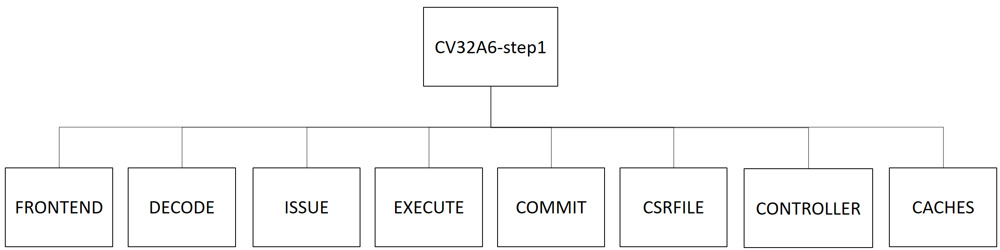

..
   Copyright 2022 Thales DIS design services SAS
   Licensed under the Solderpad Hardware Licence, Version 2.0 (the "License");
   you may not use this file except in compliance with the License.
   SPDX-License-Identifier: Apache-2.0 WITH SHL-2.0
   You may obtain a copy of the License at https://solderpad.org/licenses/

   Original Author: Jean-Roch COULON - Thales

.. _CVA6_SUBSYSTEM:

CV32A6 Subsystem
================

The CV32A6 v0.1.0 is a subsystem composed of the modules and protocol interfaces as illustrated `CV32A6 v0.1.0 modules`_
The processor is a Harvard-based modern architecture.
Instructions are issued in-order through the DECODE stage and executed out-of-order but committed in-order.
The processor is Single issue, that means that at maximum one instruction per cycle can be issued to the EXECUTE stage.

The CV32A6 implements a 6-stage pipeline composed of PC Generation, Instruction Detch, Instruction Decode, Issue stage, Execute stage and Commit stage.
At least 6 cycles are needed to execute one instruction.

Instantiation
^^^^^^^^^^^^^

.. list-table:: CV32A6 v0.1.0 parameterization
   :header-rows: 1

   * - Parameter
     - Type
     - Value
     - Description

   * - ``ArianeCfg``
     - ariane_pkg::ariane_cfg_t
     - ariane_pkg::v0.1.0_Config
     - CVA6 v0.1.0 configuration

.. list-table:: CV32A6 v0.1.0 interface signals
   :header-rows: 1

   * - Signal
     - IO
     - Type
     - Description

   * - ``clk_i``
     - in
     - logic
     - subsystem clock

   * - ``rst_ni``
     - in
     - logic
     - Asynchronous reset active low

   * - ``boot_addr_i``
     - in
     - logic[VLEN-1:0]
     - Reset boot address

   * - ``hart_id_i``
     - in
     - logic[XLEN-1:0]
     - Hart id in a multicore environment (reflected in a CSR)

   * - ``irq_i``
     - in
     - logic[1:0]
     - Level sensitive IR lines, mip & sip (async)

   * - ``ipi_i``
     - in
     - logic
     - Inter-processor interrupts (async)

   * - ``time_irq_i``
     - in
     - logic
     - Timer interrupt in (async)

   * - ``debug_req_i``
     - in
     - logic
     - Debug request (async)

   * - ``rvfi_o``
     - out
     - trace_port_t
     - RISC-V Formal Interface port (RVFI)

   * - ``cvxif_req_o``
     - out
     - cvxif_req_t
     - Coprocessor Interface request interface port (CV-X-IF)

   * - ``cvxif_resp_i``
     - in
     - cvxif_resp_t
     - Coprocessor Interface response interface port (CV-X-IF)

   * - ``axi_req_o``
     - out
     - req_t
     - AXI master request interface port

   * - ``axi_resp_i``
     - in
     - resp_t
     - AXI master response interface port

Functionality
-------------

CV32A6 v0.1.0 implements a configuration which allows to connect coprocessor through CV-X-IF coprocessor interface, but the lack of MMU, A extension and data cache prevent from executing Linux.

.. list-table:: CV32A6 v0.1.0 Standard Configuration
   :header-rows: 1

   * - Standard Extension
     - Specification
     - Configurability

   * - **I**: RV32i Base Integer Instruction Set
     - [RVunpriv]
     - ON

   * - **C**: Standard Extension for Compressed Instructions
     - [RVunpriv]
     - ON

   * - **M**: Standard Extension for Integer Multiplication and Division
     - [RVunpriv]
     - ON

   * - **A**: Standard Extension for Atomic transaction
     - [RVunpriv]
     - OFF

   * - **F and D**: Single and Double Precision Floating-Point
     - [RVunpriv]
     - OFF

   * - **Zicount**: Performance Counters
     - [RVunpriv]
     - OFF

   * - **Zicsr**: Control and Status Register Instructions
     - [RVpriv]
     - ON

   * - **Zifencei**: Instruction-Fetch Fence
     - [RVunpriv]
     - ON

   * - **Privilege**: Standard privilege modes M, S and U
     - [RVpriv]
     - ON

   * - **SV39, SV32, SV0**: MMU capability
     - [RVpriv]
     - OFF

   * - **PMP**: Memory Protection Unit
     - [RVpriv]
     - OFF

   * - **CSR**: Control and Status Registers
     - [RVpriv]
     - ON

   * - **AXI**: AXI interface
     - [CV-X-IF]
     - ON

   * - **TRI**: Translation Response Interface (TRI)
     - [OpenPiton]
     - OFF

.. list-table:: CV32A6 v0.1.0 Micro-Architecture Configuration
   :header-rows: 1

   * - Micro-architecture
     - Specification
     - Configurability

   * - **I$**: Instruction cache
     - current spec
     - ON

   * - **D$**: Data cache
     - current spec
     - OFF

   * - **Rename**: register Renaming
     - current spec
     - OFF

   * - **Double Commit**: out of order pipeline execute stage
     - current spec
     - ON

   * - **BP**: Branch Prediction
     - current spec
     - ON with no info storage

CVA6 memory interface complies with AXI5 specification including the Atomic_Transactions property support as defined in [AXI] section E1.1.

CVA6 coprocessor interface complies with CV-X-IF protocol specification as defined in [CV-X-IF].

The CV32A6 v0.1.0 core is fully synthesizable. It has been designed mainly for ASIC designs, but FPGA synthesis is supported as well.

For ASIC synthesis, the whole design is completely synchronous and uses positive-edge triggered flip-flops. The core occupies an area of about 80 kGE. The clock frequency can be more than 1GHz depending of technology.

Architecture and Modules
----------------------------

The CV32A6 v0.1.0 subsystem is composed of 8 modules.

   CV32A6 v0.1.0 modules

Connections between modules are illustrated in the following block diagram. FRONTEND, DECODE, ISSUE, EXECUTE, COMMIT and CONTROLLER are part of the pipeline. And CACHES implements the instruction and data caches and CSRFILE contains registers.

.. figure:: ../images/CVA6_subsystems.png
   :name: CVA6 subsystem
   :align: center
   :alt:

   CV32A6 v0.1.0 pipeline and modules

