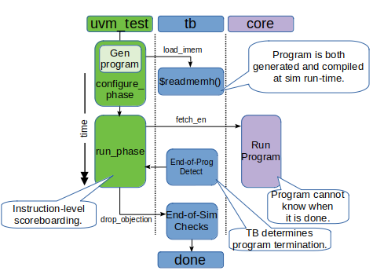

..
   Copyright (c) 2020 OpenHW Group
   
   Licensed under the Solderpad Hardware Licence, Version 2.0 (the "License");
   you may not use this file except in compliance with the License.
   You may obtain a copy of the License at
  
   https://solderpad.org/licenses/
  
   Unless required by applicable law or agreed to in writing, software
   distributed under the License is distributed on an "AS IS" BASIS,
   WITHOUT WARRANTIES OR CONDITIONS OF ANY KIND, either express or implied.
   See the License for the specific language governing permissions and
   limitations under the License.
  
   SPDX-License-Identifier: Apache-2.0 WITH SHL-2.0

.. _sim_tests:

Simulation Tests in the UVM Environments
========================================

With the exception of the “core testbench” for CV32E40P, the CORE-V
environments are all UVM environments and the overall structure should
be familiar to anyone with UVM experience. This section discusses the
CORE-V-specific implementation details that affect test execution, and
that are important to test writers. It attempts to be generic enough to
apply to both the CV32E and CVA6 environments.

A unique feature of the CORE-V UVM environments is that a primary source
of stimulus, and sometimes the only source of stimulus, comes in the
form of a “test program” that is loaded into the testbench’s memory
model and then executed by the core itself. The UVM test, environment
and agents are often secondary sources of stimulus and sometimes do not
provide any stimulus at all. This means it is important to draw a
distinction between the “\ **test program**\ ” which is a set of
instructions executed by the core, and the “\ **UVM test**\ ”, which is
a testcase in the UVM sense of the word.

.. _test_program:

Test Program
------------

In this context a “test program” is set of RISC-V instructions that are
loaded into the testbench memory. The core will starting fetching and
executing these instructions when *fetch\_en* is asserted. Test programs
may be manually produced by a human or by a tool such as the UVM random
instructor generator component of the environment. Test programs are
coded either in RISC-V assembler or C. All of the randomly generated
programs are RISC-V assembler [12]_.

The environment can support test programs regardless of how they are
created. However, the environment needs to know two things about a test
program:

-  Is the program pre-existing, or does it need to be generated at
   run-time?
-  Is the test program self-checking? That is, can it determine, on its
   own, the pass/fail criteria of a test program and can it signal this
   to the testbench?

Section :ref:`ri5cy_testcases` details how many of the test programs
inherited from the RI5CY project are both pre-existing and
self-checking. It is expected, but not required, that most of the
pre-existing test programs will be self-checking.

Section ToDo introduces the operation of the random instruction
generator and how it generates test programs. Here, the situation
regarding to self-checking tests is inverted. That is, it is expected,
but not required, that most of the generated test programs will **not**
be self-checking.

The UVM environment is equipped to support four distinct types of test
programs:

1. **Pre-existing, self-checking**
   The environment requires a memory image for the program to exist in
   the expected location, and will check the “status flags [13]_”
   virtual peripheral for pass/fail information.
2. **Pre-existing, not self-checking**
   The environment requires a memory image for the program to exist in
   the expected location, and will **not** check the “status flags”
   virtual peripheral for pass/fail information.
3. **Generated, self-checking**
   The environment will use its random instruction generator to create a
   test program, and will check the “status flags” virtual peripheral
   for pass/fail information.
4. **Generated, not self-checking**
   The environment will use its random instruction generator to create a
   test program, and will **not** check the “status flags” virtual
   peripheral for pass/fail information.
5. **None**
   It is possible to run a UVM test without running a test program. An
   example might be a test to access CSRs via the debug module interface
   interface in debug mode.

Although five types are supported, it is expected that types 1 and 4
will predominate.

Simulations pass/fail outcomes will also be affected by other
checkers/monitors that are not part of the status flags virtual
peripheral. It is required that any such checkers/monitors shall signal
an error condition with \`uvm\_error(), and these will cause a
simulation test to fail, independent of what the test program may or may
not write to the status flags virtual peripheral.

It is possible to use an instruction generator to write out a set of
test programs, self checking or not, and run these as if they were
pre-existing test programs. From the environment’s perspective, this
indistinguishable from type 1 or type 2.

The programs can be written to execute any legal instruction supported
by the core [14]_. Programs have access to the full address range
supported by the memory model in the testbench plus a small set of
memory-mapped “virtual peripherals”, see below.

.. _virtual_peripherals:

Virtual Peripherals
~~~~~~~~~~~~~~~~~~~

A SystemVerilog module called *mm_ram* is located at
*$PROJ_ROOT/cv32/tb/core/mm_ram.sv*. It connects to the core as shown
in :ref:`Illustration 4`. In addition to supporting the instruction,
data memory (*dp_ram*), and debug memory (*dbg_dp_ram*), this module
implements a set of virtual peripherals by responding to write cycles
at specific addresses on the data bus. These virtual peripherals provides
the features listed in Table 1.

The printer and status flags virtual peripherals are used in almost
every assembler testcase provided by the RISC-V foundation for their ISA
compliance test-suite. As such, these virtual peripherals will be
maintained throughout the entire CORE-V verification effort. It is also
believed, but not known for certain, that the signature writer is used
by several existing testcases, so this peripheral may also be maintained
over the long term.

The debug control virtual peripheral is used by a test program to control
the debug_req signal going to the core. The assertion can be a pulse or
a level change. The start delay and pulse duration is also controllable.
Once the debug_req is seen by the core, it will enter debug mode and
start executing code located at DM_HaltAddress, which is mapped to the
debug memory (*dbg_dp_ram*).

The debug memory is loaded with a hex image defined with the plusarg
+debugger=<filename.hex>

If the +debugger plusarg is not provided, then the debug memory will
have a single default instruction, dret, that will result in the
core returning back to main execution of the test program. The
debug_test is an example of a test that will use the debug control
virtual peripheral and provide a specific debugger code image.
 

The use of the interrupt timer control and instruction memory stall
controller are not well understood and it is possible that none of the
testscases inherited from the RISC-V foundation or the PULP-Platform
team use them. As such they are likely to be deprecated and their use by
new test programs developed for CORE-V is strongly discouraged.

+--------------------------+-----------------------+----------------------------------------------------------------+
| Virtual Peripheral       | VP Address            | Action on Write                                                |
|                          | (data_addr_i)         |                                                                |
+==========================+=======================+================================================================+
| Address Range Check      | >= 2**16, but not one | Terminate simulation                                           |
|                          |                       | TODO: make this a \`uvm_fatal()                                |
+--------------------------+-----------------------+----------------------------------------------------------------+
| Virtual Printer          | 32’h1000_0000         | $write("%c", wdata[7:0]);                                      |
+--------------------------+-----------------------+----------------------------------------------------------------+
| Interrupt Timer Control  | 32’h1500_0000         | timer_irg_mask <= wdata;                                       |
|                          +-----------------------+----------------------------------------------------------------+
|                          | 32’h1500_0004         | timer_count <= wdata;                                          |
|                          |                       |                                                                |
|                          |                       | This starts a timer that counts down each clk cycle.           |
|                          |                       |                                                                |
|                          |                       | When timer hits 0, an interrupt (irq\_o) is asserted.          |
+--------------------------+-----------------------+----------------------------------------------------------------+
| Debug Control            | 32’h1500_0008         | Asserts the debug_req signal to the core. debug_req can be a   |
|                          |                       | pulse or a level change, with a programable start delay and    |
|                          |                       | pulse duration as determined by the wdata fields:              |
|                          |                       |                                                                |
|                          |                       +----------------------------------------------------------------+
|                          |                       |   wdata[31]    = debug_req signal value                        |
|                          |                       +----------------------------------------------------------------+
|                          |                       |   wdata[30]    = debug request mode: 0= level, 1= pulse        |
|                          |                       +----------------------------------------------------------------+
|                          |                       |   wdata[29]    = debug pulse duration is random                |
|                          |                       +----------------------------------------------------------------+
|                          |                       |   wdata[28:16] = debug pulse duration or pulse random max range|
|                          |                       +----------------------------------------------------------------+
|                          |                       |   wdata[15]    = start delay is random                         |
|                          |                       +----------------------------------------------------------------+
|                          |                       |   wdata[14:0]  = start delay or start random max rangee        |
+--------------------------+-----------------------+----------------------------------------------------------------+
| Random Number Generator  | 32'h1500_1000         | Reads return a random 32-bit value with generated by the       |
|                          |                       | simulator's random number generator.                           |
|                          |                       | Writes have no effect.                                         |
+--------------------------+-----------------------+----------------------------------------------------------------+
| Cycle Counter            | 32'h1500_1004         | Reads return the value of the cycle counter.                   |
|                          |                       |                                                                |
|                          |                       | Writes resets the cycle counter to 0.                          |
|                          +-----------------------+----------------------------------------------------------------+
|                          | 32'h1500_1008         | Write this address to print the cycle counter value to log     |
+--------------------------+-----------------------+----------------------------------------------------------------+
| Virtual Peripheral       | 32’h2000_0000         | Assert test_passed if wdata==’d123456789                       |
| Status Flags             |                       |                                                                |
|                          |                       | Assert test_failed if wdata==’d1                               |
|                          |                       |                                                                |
|                          |                       | **Note**: asserted for one clk cycle only.                     |
|                          +-----------------------+----------------------------------------------------------------+
|                          | 32’h2000_0004         | Assert exit_valid;                                             |
|                          |                       |                                                                |
|                          |                       | exit_value <= wdata;                                           |
|                          |                       |                                                                |
|                          |                       | **Note**: asserted for one clk cycle only.                     |
+--------------------------+-----------------------+----------------------------------------------------------------+
| Signature Writer         | 32’h2000_0008         | signature_start_address <= wdata;                              |
|                          +-----------------------+----------------------------------------------------------------+
|                          | 32’h2000_000C         | signature_end_address <= wdata;                                |
|                          +-----------------------+----------------------------------------------------------------+
|                          | 32’h2000_0010         | Write contents of dp_ram from sig_start_addr to sig_end_addr   |
|                          |                       | to the signature file.                                         |
|                          |                       |                                                                |
|                          |                       | Signature filename must be provided at run-time using a        |
|                          |                       |                                                                |
|                          |                       | +signature=<sig_file> plusarg.                                 |
|                          |                       |                                                                |
|                          |                       | Note: this will also asset exit_valid with exit_value <= 0.    |
+--------------------------+-----------------------+----------------------------------------------------------------+
| Instruction Memory       | 32’h1600_XXXX         | Program a table that introduces “random” stalls on IMEM I/F.   |
| Interface Stall Control  |                       |                                                                +
+--------------------------+-----------------------+----------------------------------------------------------------+

Table 1: List of Virtual Peripherals

.. _uvm_test:

UVM Test
--------

A UVM Test is the top-level object in every UVM environment. That is,
the environment object(s) are members of the testcase object, not the
other way around. As such, UVM requires that all tests extend from
*uvm\_test* and the CV32E environment defines a “base test”,
*uvmt\_cv32\_base\_test\_c*, that is a direct extension of *uvm\_test*.
All testcases developed for CV32E should extend from the base test, as
doing so ensures that the proper test flow discussed here is maintained
(it also frees the test writer from much mundane effort and code
duplication). The comment headers in the base test (attempt to) provide
sufficient information for the test writer to understand how to extend
it for their needs.

A typical UVM test for CORE-V will extend three time consuming tasks:

1. **reset_phase():** often, nothing is done here except to call
   *super.reset_phase()* which will invoke the default reset sequence
   (which is a random sequence). Should the test writer wish to, this is
   where a test-specific reset virtual sequence could be invoked.
2. **configure_phase():** in a typical UVM environment, this is a busy
   task. However, assuming the program executed the core does so, the
   core’s CSRs do not require any configuration before execution begins.
   Any test that requires pre-compiled programs to be loaded into
   instruction memory should do that here.
3. **run_phase():** for most tests, this is where the procedural code
   for the test will reside. A typical example of the run-flow here
   would be:
   -  Raise an objection;
   -  Assert the core’s fetch\_en input;
   -  Wait for the core and/or environment(s) to signal completion;
   -  Drop the objection.

Workarounds
~~~~~~~~~~~

The CV32E base test, *uvmt_cv32_base_test_c*, in-lines code (using
**\`include)** from *uvmt_cv32_base_test_workaround.sv*. This file
is a convenient place to put workarounds for defects or incomplete code
in either the environment or RTL that will affect all tests. This file
must be reviewed before the RTL is frozen, and ideally it will be empty
at that time.

Run-flow in a CORE-V Test
-------------------------

The test program in the CORE-V environment directly impacts the usual
run-flow that is familiar to UVM developers. Programs running on the
core are completely self-contained within their extremely simple
execution environment that is wholly defined by the ISA, memory map
supported by the *dp\_mem* and the virtual peripherals supported by
*mm\_mem*\  [15]_. This execution environment knows nothing about the
UVM environment, so the CORE-V UVM environments are implemented to be
aware of the test program and to respond accordingly as part of the
run-flow.

Section :ref:`test_program` introduced the five types of core test
programs supported by the CORE UVM environment and section
:ref:`uvm_test` showed how the configure_phase() and run_phase()
of a CORE-V UVM run-flow implement the interaction between the UVM
environment and the test program. This interaction is depends on the
type of test program. Illustration 8 shows how the CORE-V UVM base test
supports a type 1 test program.

.. figure:: ../images/type1.png
   :name: TYPE1_Test_Program
   :align: center
   :alt: 

   Illustration 8: Preexisting, Self-checking Test Program (type 1) in a
   CORE-V UVM test

In the self-checking scenario, the testcase is pre-compiled into machine
code and loaded into the *dp_ram* using the **$readmemh()** DPI call.
The next sub-section explains how to select which test program to run
from the command-line. During the configuration phase the test signals
the TB to load the memory. The TB assumes the test file already exists
and will terminate the simulation if it does not.

In the run phase the base test will assert the fetch_en input to the
core which signals it to start running. The timing of this is randomized
but keep in mind that it will always happen after reset is de-asserted
(because resets are done in the reset phase, which always executes
before the run phase).

At this point the run flow will simply wait for the test program to flag
that it is done via the status flags virtual peripheral. The test
program is also expected to properly assert the test pass or test fail
flags. Note that the environment will wait for the test flags to asserts
or until the environment’s watch dog timer fires. A watch-dog firing
will terminate the simulation and is, by definition, a failure.

   Illustration 9: Generated, non-self-checking (type 4) Test Program in
   a CORE-V UVM test

The flow for a type 4 (generated, non-self checking) test program is
only slightly different as shown in Illustration 9. In these tests the configure phase
will invoke the generator to produce a test program and the toolchain to
compile it before signalling the TB to load the machine code into
*dp_mem*. As before, the run phase will assert fetch_en to the core
and the program begins execution.

Recall that a type 4 test program will not use the status flags virtual
peripheral to signal test completion. It is therefore up to the UVM
environment to detect end of test. This is done when the various agents
in the environment detect a lack of activity on their respective
interfaces. The primary way to detect this is via the Instruction-Retire
agent (TODO: describe this agent).

In a non-self-checking test program the intelligence to determine
pass/fail must come from the environment. In the CORE-V UVM environments
this is done by scoreboarding the results of the core execution and
those predicted by the ISS as shown in . Note that most UVM tests that
run self-checking test programs will also use the ISS as part of its
pass/fail determination.

CORE-V Testcase Writer’s Guide
------------------------------
TODO

File Structure of the Test Programs and UVM Tests
~~~~~~~~~~~~~~~~~~~~~~~~~~~~~~~~~~~~~~~~~~~~~~~~~

Below is a somewhat simplified view of the CV32 tests directory tree.
The test programs are in cv32/tests/core. (This should probably be
cv32/tests/programs, but is named “core” for historical reasons.)
Sub-directories below core contain a number of type 1 test programs.

The UVM tests are located at cv32/tests/uvmt_cv32. It is a very good
idea to review the code in the base-tests sub-directory. In
“core-program-tests” is the type 1 and type 4 testcases (types 2 and 3
may be added at a later date). These ca be used as examples and are also
production level tests for either type 1 or type 4 test programs. An up
to date description of the testcases under uvmt\_cv32 can be found in
the associated README.

Lastly, the cv32/tests/vseq directory is where you will be (and should
add) virtual sequences for any new testcases you develop.  ::

    $PROJ\_ROOT/
    └── cv32/
         └── tests/
               ├── core/
               │    ├── README.md
               │    ├── custom/
               │    │ ├── hello_world.c
               │    │ └── <etc>
               │    ├── riscv_compliance_tests_firmware/
               │    │ ├── addi.S
               │    │ └── <etc>
               │    ├── riscv_tests_firmware/
               │    │ └── <etc>
               │    └── firmware/
               │    └── <etc>
               └── uvmt_cv32/
                     ├── base-tests/
                     │    ├── uvmt_cv32_base_test.sv
                     │    ├── uvmt_cv32_base_test_workarounds.sv
                     │    └── uvmt_cv32_test_cfg.sv
                     ├── core-program-tests/
                     │    ├── README.md
                     │    └── uvmt_cv32_type1_test.sv
                     │    └── uvmt_cv32_type4_test.sv
                     └── vseq/
                          └── uvmt_cv32_vseq_lib.sv

Writing a Test Program
~~~~~~~~~~~~~~~~~~~~~~

This document will probably never include a detailed description for
writing a test program. The core’s ISA is well documented and the
execution environment supported by the testbench is trivial. The best
thing to do is check out the examples at
**$PROJ_ROOT/cv32/tests/core**.

Writing a UVM Test to run a Test Program
~~~~~~~~~~~~~~~~~~~~~~~~~~~~~~~~~~~~~~~~

The CV32 base test, *uvmt_cv32_base_test_c*, has been written to
support all five of the test program types discussed in Section
:ref:`test_program`.

There are pre-existing UVM tests for type 1 (pre-existing,
self-checking) and type 4 (generated, not-self-checking) tests for
CV32E40P in the core-v-verif repository. If you need a type 2 or type 3
test, have a look at these and it should be obvious what to do.

Testcase Scriptware
^^^^^^^^^^^^^^^^^^^

At **$PROJ_ROOT/cv32/tests/uvmt_cv32/bin/test_template** you will
find a shell script that will generate the shell of a testcase that is
compatible with the base test. This will save you a bit of typing.

Running the testcase
~~~~~~~~~~~~~~~~~~~~

Testcases are intended to be launched from
**$PROJ_ROOT/cv32/sim/uvmt_cv32**. The README at this location is
intended to provide you with everything you need to know to run an
existing testcase or a new testcase. If this is not the case, please
create a GitHub issue and assign it to @mikeopenhwgroup.

.. [12]
   Those familiar with the RI5CY testbench may recall that random
   generation of C programs using
   `csmith <https://embed.cs.utah.edu/csmith/>`__ was supported. Csmith
   was developed to exercise C compilers, not processors, it is not
   supported in the CORE-V environments.

.. [13]
   See Section :ref:`virtual_peripherals`.

.. [14]
   Generation of illegal or malformed instructions is also supported,
   and will be discussed in a later version of this document.

.. [15]
   This is termed Execution Environment Interface or EEI by the RISC-V
   ISA.

