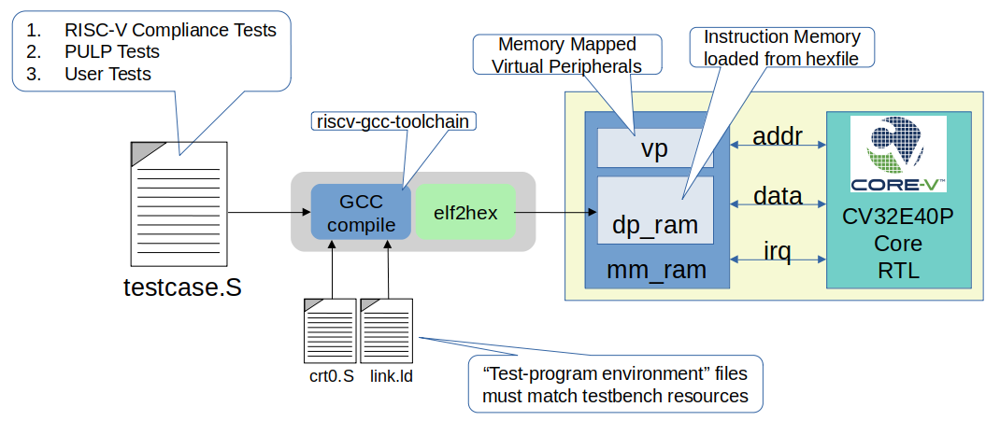

..
   Copyright (c) 2020 OpenHW Group

   Licensed under the Solderpad Hardware Licence, Version 2.0 (the "License");
   you may not use this file except in compliance with the License.
   You may obtain a copy of the License at

   https://solderpad.org/licenses/

   Unless required by applicable law or agreed to in writing, software
   distributed under the License is distributed on an "AS IS" BASIS,
   WITHOUT WARRANTIES OR CONDITIONS OF ANY KIND, either express or implied.
   See the License for the specific language governing permissions and
   limitations under the License.

   SPDX-License-Identifier: Apache-2.0 WITH SHL-2.0

.. _test_prog_env:

Test Program Environment
========================

A unique feature of the CORE-V-VERIF UVM environments is that a primary source of stimulus, and sometimes the only source of stimulus, comes in the form of a “test program” that is loaded into the testbench’s memory model and then executed by the core itself.
The UVM test, environment and agents are often secondary sources of stimulus and sometimes do not provide any direct stimulus at all.
This means it is important to draw a distinction between the “\ **test program**\ ” which is a set of instructions executed by the core, and the “\ **UVM test**\ ”, which is a testcase in the UVM sense of the word.
This chapter will discuss the test-programs that run on the core, and in particular the test programming environment which supports these test-programs.
Understanding the test-program environment is important if you plan to write your own test-programs or configure corev-dv to generate test-programs.

As test-program executes it uses specific resources typically implemented in hardware.
The most obvious example of this is the memory in which the program resides and the memory used to store data required by the program.
Another example is a memory-mapped hardware resource that can be used to assert a status flag.
Taken together, these hardware resources are called the "hardware environment".
The connection between the test-program and the hardware environment it runs on is the "board support package".
The hardware environment and board support package must be aligned in such as way as test-program is able to executed as required.
These two components of the CORE-V-VERIF environment are discussed in the following sub-sections.

Board Support Package (BSP)
---------------------------

Software teams will generally use the term **Board Support Package** or 
`BSP <https://github.com/openhwgroup/core-v-verif/blob/master/cv32e40p/bsp/README.md>`__
to refer to a set of configuration files that allow compilers, assemblers, linkers to
generate executable programs that are compatible with the hardware they run on.

Illustration 9 uses the Core testbench as an example to illustrate the relationship
between the testbench (everything inside the yellow rectangle), the test-program
(testcase.S) and the BSP (crt0.S and link.ld).
The UVM verification environment will use the same test program environment as the Core testbench.

   Illustration 9: Baord Support Package for "Core" testbench

This linkage between the test-program and hardware needs to be flexible to
support a variety of test-program sources:

- manually written assembler and C test-programs
- test-programs from the RISC-V Foundation Compliance Test Suite
- manually written OpenHW test-programs
- machine generated test-programs from an instruction generator (e.g. corev-dv)

Hardware Environment
--------------------

Both the Core and UVM testbenches instantiate a SystemVerilog module called *mm_ram*.
It connects to the core as shown in :ref:`Illustration 4`.
In addition to supporting the instruction, data and debug memory regions, this module supports a set of virtual peripherals.
Together, the memory and virtual peripherals make up the hardware environment that all CORE-V-VERIF test-programs execute on.

Memory
~~~~~~

The address range for I&D memory is 0x0..0x40_0000 (4Mbyte) for both the core and UVM testbenches.
The virtual peripherals start at address 0x1000_0000.

The addresses and sizes of the I&D memory and virtual peripheral must be compatible with the Configuration inputs of the core
(see `Core Integration <https://core-v-docs-verif-strat.readthedocs.io/projects/cv32e40p_um/en/latest/integration.html>`__ 
in the CV32E40P User Manual.
The core will start fetching instructions from the address provided on its **boot_addr_i** input.
In addition, if debug_req_i is asserted, execution jumps to **dm_halt_addr_i**.
This hardware setup constrains the test-program in important ways:

- The entire program, including data sections and exception tables must fit in a 4Mbyte space starting at address 0.
- The first instruction of the program must be at the address defined by **boot_addr_i**.
- The address **dm_halt_addr_i** must exist in the memory map, it should not be stomped on by the test-program and there should be something there to execute that will produce a predictable result.
- The program must "know" about the addressing and function of the virtual peripherals (using the peripherals is optional).

.. _virtual_peripherals:

Virtual Peripherals
~~~~~~~~~~~~~~~~~~~

The same module that implements the I&D memory also implements a set of virtual peripherals by responding to write cycles at specific addresses on the data bus.
These virtual peripherals provides the features listed in Table 1.

The printer and status flags virtual peripherals are used in almost
every assembler testcase provided by the RISC-V foundation for their ISA
compliance test-suite. As such, these virtual peripherals will be
maintained throughout the entire CORE-V verification effort. It is also
believed, but not known for certain, that the signature writer is used
by several existing testcases, so this peripheral may also be maintained
over the long term.

The debug control virtual peripheral is used by a test program to control
the debug_req signal going to the core. The assertion can be a pulse or
a level change. The start delay and pulse duration is also controllable.
Once the debug_req is seen by the core, it will enter debug mode and
start executing code located at DM_HaltAddress, which is mapped to the
debug memory (*dbg_dp_ram*).

The debug memory is loaded with a hex image defined with the plusarg
+debugger=<filename.hex>

If the +debugger plusarg is not provided, then the debug memory will
have a single default instruction, dret, that will result in the
core returning back to main execution of the test program. The
debug_test is an example of a test that will use the debug control
virtual peripheral and provide a specific debugger code image.

The use of the interrupt timer control and instruction memory stall
controller are not well understood and it is possible that none of the
testscases inherited from the RISC-V foundation or the PULP-Platform
team use them. As such they are likely to be deprecated and their use by
new test programs developed for CORE-V is strongly discouraged.

+--------------------------+-----------------------+----------------------------------------------------------------+
| Virtual Peripheral       | VP Address            | Action on Write                                                |
|                          | (data_addr_i)         |                                                                |
+==========================+=======================+================================================================+
| Address Range Check      | >= 2**16, but not one | Terminate simulation                                           |
|                          |                       | TODO: make this a \`uvm_fatal()                                |
+--------------------------+-----------------------+----------------------------------------------------------------+
| Virtual Printer          | 32’h1000_0000         | $write("%c", wdata[7:0]);                                      |
+--------------------------+-----------------------+----------------------------------------------------------------+
| Interrupt Timer Control  | 32’h1500_0000         | timer_irg_mask <= wdata;                                       |
|                          +-----------------------+----------------------------------------------------------------+
|                          | 32’h1500_0004         | timer_count <= wdata;                                          |
|                          |                       |                                                                |
|                          |                       | This starts a timer that counts down each clk cycle.           |
|                          |                       |                                                                |
|                          |                       | When timer hits 0, an interrupt (irq\_o) is asserted.          |
+--------------------------+-----------------------+----------------------------------------------------------------+
| Debug Control            | 32’h1500_0008         | Asserts the debug_req signal to the core. debug_req can be a   |
|                          |                       | pulse or a level change, with a programable start delay and    |
|                          |                       | pulse duration as determined by the wdata fields:              |
|                          |                       |                                                                |
|                          |                       +----------------------------------------------------------------+
|                          |                       |   wdata[31]    = debug_req signal value                        |
|                          |                       +----------------------------------------------------------------+
|                          |                       |   wdata[30]    = debug request mode: 0= level, 1= pulse        |
|                          |                       +----------------------------------------------------------------+
|                          |                       |   wdata[29]    = debug pulse duration is random                |
|                          |                       +----------------------------------------------------------------+
|                          |                       |   wdata[28:16] = debug pulse duration or pulse random max range|
|                          |                       +----------------------------------------------------------------+
|                          |                       |   wdata[15]    = start delay is random                         |
|                          |                       +----------------------------------------------------------------+
|                          |                       |   wdata[14:0]  = start delay or start random max rangee        |
+--------------------------+-----------------------+----------------------------------------------------------------+
| Random Number Generator  | 32'h1500_1000         | Reads return a random 32-bit value with generated by the       |
|                          |                       | simulator's random number generator.                           |
|                          |                       | Writes have no effect.                                         |
+--------------------------+-----------------------+----------------------------------------------------------------+
| Cycle Counter            | 32'h1500_1004         | Reads return the value of the cycle counter.                   |
|                          |                       |                                                                |
|                          |                       | Writes resets the cycle counter to 0.                          |
|                          +-----------------------+----------------------------------------------------------------+
|                          | 32'h1500_1008         | Write this address to print the cycle counter value to log     |
+--------------------------+-----------------------+----------------------------------------------------------------+
| Virtual Peripheral       | 32’h2000_0000         | Assert test_passed if wdata==’d123456789                       |
| Status Flags             |                       |                                                                |
|                          |                       | Assert test_failed if wdata==’d1                               |
|                          |                       |                                                                |
|                          |                       | **Note**: asserted for one clk cycle only.                     |
|                          +-----------------------+----------------------------------------------------------------+
|                          | 32’h2000_0004         | Assert exit_valid;                                             |
|                          |                       |                                                                |
|                          |                       | exit_value <= wdata;                                           |
|                          |                       |                                                                |
|                          |                       | **Note**: asserted for one clk cycle only.                     |
+--------------------------+-----------------------+----------------------------------------------------------------+
| Signature Writer         | 32’h2000_0008         | signature_start_address <= wdata;                              |
|                          +-----------------------+----------------------------------------------------------------+
|                          | 32’h2000_000C         | signature_end_address <= wdata;                                |
|                          +-----------------------+----------------------------------------------------------------+
|                          | 32’h2000_0010         | Write contents of dp_ram from sig_start_addr to sig_end_addr   |
|                          |                       | to the signature file.                                         |
|                          |                       |                                                                |
|                          |                       | Signature filename must be provided at run-time using a        |
|                          |                       |                                                                |
|                          |                       | +signature=<sig_file> plusarg.                                 |
|                          |                       |                                                                |
|                          |                       | Note: this will also asset exit_valid with exit_value <= 0.    |
+--------------------------+-----------------------+----------------------------------------------------------------+
| Instruction Memory       | 32’h1600_XXXX         | Program a table that introduces “random” stalls on IMEM I/F.   |
| Interface Stall Control  |                       |                                                                +
+--------------------------+-----------------------+----------------------------------------------------------------+

Table 1: List of Virtual Peripherals

Aligning the Test-Programs to the Hardware Environment
------------------------------------------------------

Most CORE-V-VERIF test-programs are written/generated in RISC-V assembler.
A set of global symbols are used to define control points to a linker that will generate the machine-code in a memory image.
Examples of these are **.start**, **.vectors**, **.text**, **.data** and **.string**.
Here we will define a minimal set of symbols for use in CORE-V-VERIF test-programs.
A sub-set of these will be mandatory (e.g. **.start**), while others may be optional.

There are a number of files in the BSP that define these symbols and set them to values that are compatible with the harware environment.
These are discussed below.

Linker Control File
~~~~~~~~~~~~~~~~~~~

A file variously refered to as the linker command file, linker control file or
linker script and typically given the filename **link.ld** is used to map the
symbols used in the test-program to physical memory addresses.  Some excellent
background material on the topic is available at
`Sourceware.org <https://sourceware.org/binutils/docs-2.34/ld/Scripts.html#Scripts>`__.

Typically, linker scripts have two commands, **MEMORY** and **SECTIONS**. If
MEMORY is not present then the linker assumes that there is sufficient
contiguous memory to hold the program.  We are constrained by a need to support
the Compliance test-suite and the Google generator, so it is possible we need
more than one linker control file, although a single script for all uses should
be out goal. 

Jeremy Bennett of Embecosm has provided a minimalist linker control file, and
Paul Zavalney of Silicon Labs suggested additions to support the debugger. The
two contributions have been merged into a single script by Mike Thompson::

  OUTPUT_ARCH( "cv32e40p" )
  ENTRY(_start)

  MEMORY
  {
     /* This matches the physical memory supported by the testbench    */
     mem (rwxai) : ORIGIN = 0x00000000, LENGTH = 0x00100000

     /* ORIGIN must match the DM_HALTADDRESS parameter in the core RTL */
     dbg (rwxai) : ORIGIN = 0x1A110800, LENGTH = 0x800
  }

  SECTIONS
  {
     DBG :
     {
        .debugger (ORIGIN(dbg)):
        {
          KEEP(*(.debugger));
        }

        /* Debugger Stack*/
        .debugger_stack         : ALIGN(16)
        {
         PROVIDE(__debugger_stack_start = .);
         . = 0x80;                    /* Is this ORIGIN + 0x80? */
        }
     } >dbg

     MEM : 
     {
        . = 0x00000000;
        .vectors : { *(.vectors) }
        . = 0x00000080;                   /* must equal value on boot_addr_i */
        _start = .;
        .text : { *(.start) }
        . = ALIGN (0x80)
        .legacy_irq : { *(.legacy_irq) }  /* is this still needed? */
        . = ALIGN(0x1000);
        .tohost : { *(.tohost) }
        . = ALIGN(0x1000);
        .page_table : { *(.page_table) }
        .data : { *(.data) }
        .user_stack : { *(.user_stack) }
        .kernel_data : { *(.kernel_data) }
        .kernel_stack : { *(.kernel_stack) }
        .bss : { *(.bss) }
        _end = .;
     } > mem
  }

A few open issues:

1. How does the linker control file need to change to support interrupts?

   At the time of this writting (2020-07-07), this is an area of active
   development in the CV32E40P projects.  This document (or its associated
   README) will be updated at a later date.

|

2. Will this linker script fully support test-programs generated by the Google
   generator (`riscv-dv <https://github.com/google/riscv-dv>`__)?

   This issue has been resolved by extending the riscv_asm_program_gen class
   in the `corev-dv <https://github.com/openhwgroup/core-v-verif/tree/master/vendor_lib/google/corev-dv>`__
   extensions.

C Runtime
~~~~~~~~~

While it is assumed that the vast majority of test programs written for CORE-V
pre-silicon verification will be captured as assembly (\*.S) programs, The
environment provides support for minimalist C programs via a C runtime
file in *./cv32/bsp/crt0.S*.  crt0.S performs the
bare minimum required to run a C program.  Note that **support for command-line
arguments is deliberately not supported**.

