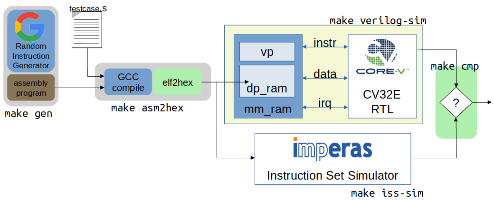
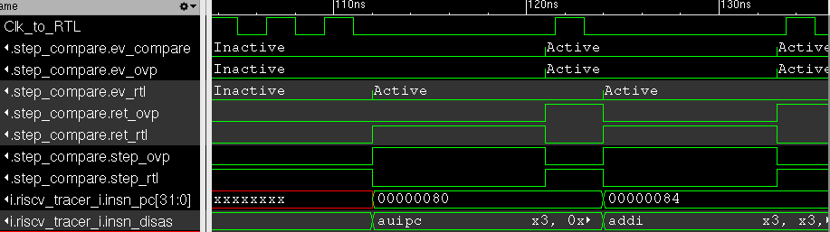
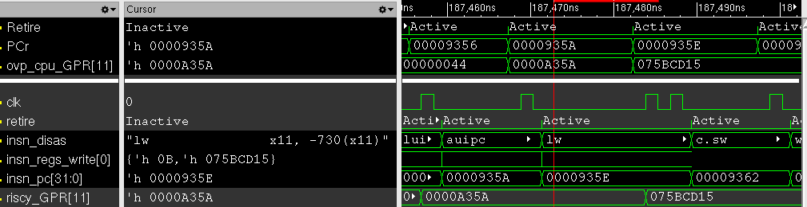
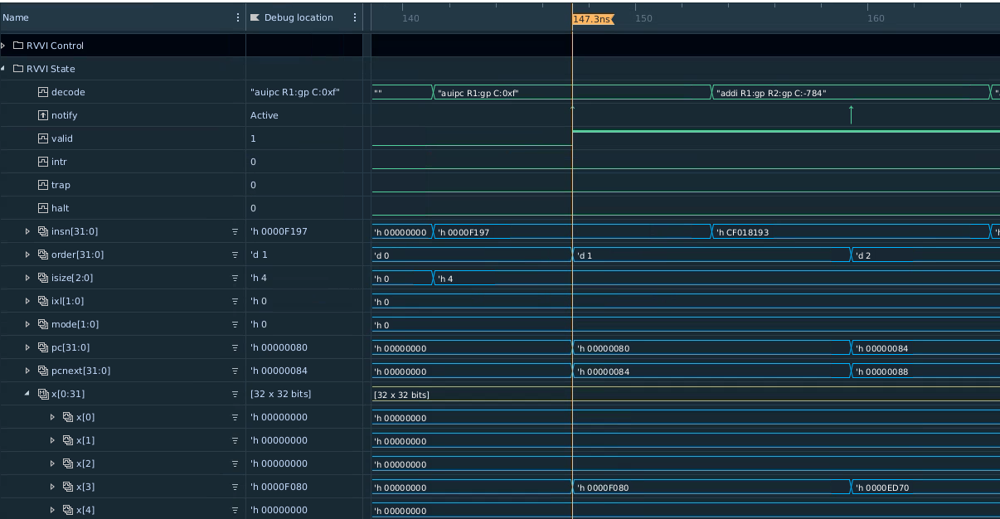
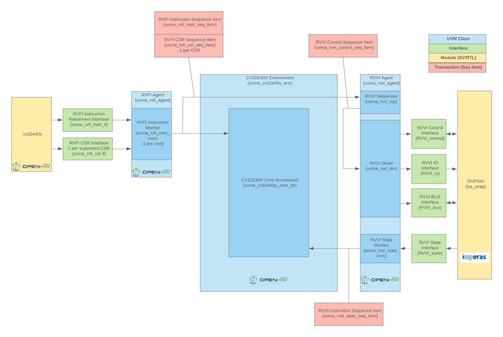
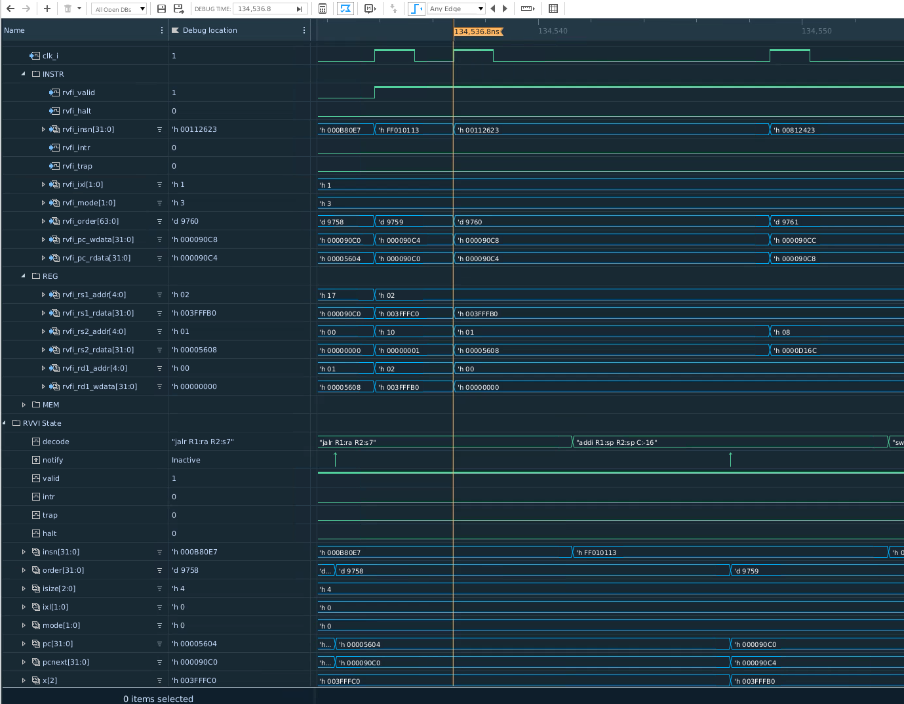
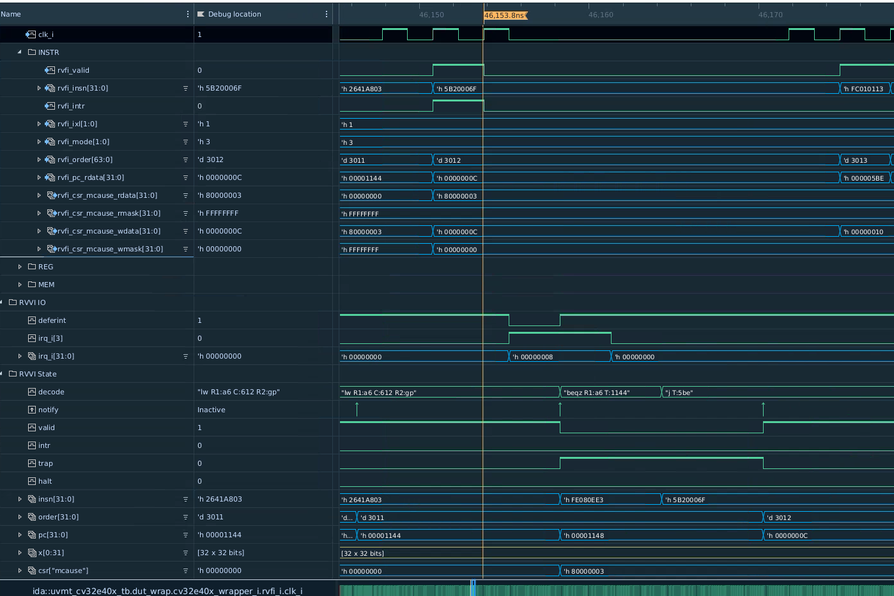

..
   Copyright (c) 2020 OpenHW Group
   
   Licensed under the Solderpad Hardware Licence, Version 2.0 (the "License");
   you may not use this file except in compliance with the License.
   You may obtain a copy of the License at
  
   https://solderpad.org/licenses/
  
   Unless required by applicable law or agreed to in writing, software
   distributed under the License is distributed on an "AS IS" BASIS,
   WITHOUT WARRANTIES OR CONDITIONS OF ANY KIND, either express or implied.
   See the License for the specific language governing permissions and
   limitations under the License.
  
   SPDX-License-Identifier: Apache-2.0 WITH SHL-2.0

.. _cv32_env:

CV32E4\* Simulation Testbench and Environment
==============================================

As stated in the :ref:`pulp-verif` chapter (in the :ref:`exec_summary`),
CV32E40P verification
followed a two-pronged approach using an updated RI5CY testbench,
hereafter referred to as the core testbench in parallel with the
development of a UVM environment. The UVM environment was developed
in a step-wise fashion adding ever more capabilities.

The UVM environment uses the Google random-instruction
generator for stimulus creation, the Imperas Instruction Set Simulator
(ISS) for results prediction. It is also capable running hand-coded
code-segments (test-programs) such as those developed by the RISC-V Compliance
Task Group.

The end-goal is to have a single UVM-based verification environment
capable of "industrial grade" verification of the CORE-V family of cores,
startng with the CV32E40P and the CV32E4* cores.
This environment is always evolving to meet the needs of curent and future cores.

Core Testbench
--------------

The “core” testbench, is essentially the RI5CY testbench
(shown in Illustration 1 of :ref:`PULP-Platform Simulation Verification`) with some
slight modifications. It is named after the directory is it located in. This
testbench has the ability to run the directed, self-checking RISC-V Compliance
and XPULP test programs (mostly written in Assembler) used by RISC-V and will
be used to update the RISC-V Compliance and add XPULP Compliance testing for
the CV32E40P.  These tests are the foundation of the `Base Instruction
Set <https://github.com/openhwgroup/core-v-docs/tree/master/verif/CV32E40P/VerificationPlan/base_instruction_set>`__
and `XPULP Instruction
Extensions <https://github.com/openhwgroup/core-v-docs/tree/master/verif/CV32E40P/VerificationPlan/xpulp_instruction_extensions>`__
captured in the CV32E40P verification plan.

The testbench has been modified in the following ways:

1. Fix several Lint errors (Metrics dsim strictly enforces the IEEE-1800
   type-checking rules).
2. Update parameters as appropriate.
3. Some RTL files were placed in the core directory – these have been
   moved out.
4. Support UVM error messages.
5. (TBD) Updates to the end-of-simulation flags in the Virtual
   Peripherals.

The CV32E40\* UVM Verification Environment
------------------------------------------

This sub-section discusses the structure and development of the UVM
verification environment under development for CV32E40\*. This
environment is intended to be able to verify the CV32E40P and CV32E40
devices with only minimal modification to the environment itself.

First Generation UVM Environment
~~~~~~~~~~~~~~~~~~~~~~~~~~~~~~~~

The first generation environment has been supplanted by subsequent generations to the point where is it no long useful to discuss it.

Second Generation UVM Environment
~~~~~~~~~~~~~~~~~~~~~~~~~~~~~~~~~

The second generation environment is shown in `Illustration 2`_. Phase 2 introduces the `Google
Random Instruction Generator <https://github.com/google/riscv-dv>`__ and
the `Imperas
ISS <http://www.imperas.com/articles/imperas-empowers-riscv-community-with-riscvovpsim>`__
as a stand-alone components. The most significant capabilities of the
second generation environment are:

-  Ability to use SystemVerilog class constraints to automatically
   generate testcases.
-  Results checking is built into the environment, so that testcases do
   not need to determine and check their own pass/fail criteria.
-  Simple UVM Agents for both the Interrupt and Debug interfaces. ToDo:
   show this in the Illustration.
-  Ability to run any/all testcases developed for the Phase 1
   environment.
-  Support either of the CV32E40P or CV32E40 with only minor
   modifications.

   Illustration 2: Second Generation Verification Environment for CV32E

As shown in `Illustration 2`_, the environment is not a single entity.
Rather, it is a collection of disjoint components, held together by
script-ware to make it appear as a single environment. When the user
invokes a command to run a testcase, for example, make
xrun-firmware [10]_, a set of scripts and/or Makefile rules are
invoked to compile the environment and test(s), run the simulation(s)
and check results. The illustration shows the most
significant of these:

-  **make gen**: this is an optional step for those tests that run
   stimulus generated by the Google random instruction generator. Tests
   that use manually generated or externally sourced tests will skip
   this test. The generator produces an assembly-language file which is
   used as input to *asm2hex*.
-  **make asm2hex**: this step invokes the SDK (riscv-gcc
   tool-chain) to compile/assemble/link the input program into an ELF
   file. The input program is either from the *make gen* step
   or a previously written assembler program. The ELF is translated
   to a hexfile, in verilog “memh” format, that can be loaded into a
   SystemVerilog memory.
-  **make sv-sim**: this step runs a SystemVerilog simulator that
   compiles the CV32E and its associated testbench. As with the RI5CY
   testbench, the asm2hex generated hexfile is loaded into Instruction
   memory and the core starts to execute the code it finds there.
   Results are written to an *actual* results output file.
-  **make iss-sim**: this step compiles and runs the
   Instruction Set Simulator, using the same ELF
   produced in the *make asm2hex step*. The ISS thereby runs
   the same program as the RTL model of the core and produces an
   *expected* result output file.
-  **make cmp**: here a simple compare script is run that
   matches the actual results produced by the RTL with the expected
   results produced by the ISS. Any mismatch results in a testcase
   failure.

Phase 2 Environment Reference Model (ISS) Integration
_____________________________________________________

`Illustration 2`_ shows the ISS as an entity external to the environment. Phase
3 adds significant capabilies to the environment, notably the integration
of the ISS as a fully integrated component in the UVM environment and a
**Step-and-Compare** instruction scoreboard. After Phase 3 the Imperas ISS is
used as the reference model to predict the status of the core's PC, GPRs and
CSRs after each instruction is executed.  (Note that after this point in the
document the terms "RM" and "ISS" are often used interchangeably.)

Wrapping the RM in a DPI layer allows the RM to be integrated
into the UVM environment and thus controllable via the UVM run-flow.  The
benefit of this is that testcases will have direct control over the operation
of the RM and comparision between the predictions made by the RM and actual
instruction execution by the Core are done in real time.  This is a significant
aid to debugging failures.

Step-and-Compare
^^^^^^^^^^^^^^^^

The integrated RM is used in a step-and-compare mode in which the RM and
RTL execution are in lock-step.  Step and compare is invaluable for debug
because the RM and RTL are executing the same instruction in a compare cycle.

The table below contains the main signals used in stepping and comparing the RTL and RM. 

+--------------------------------+----------+------------------------------------------------------------+
|  Name                          | Type     |    Meaning                                                 |
+================================+==========+============================================================+
| step_compare_if.ovp_cpu_retire | event    | RM has retired an instruction, triggers ev_ovp event       |
+--------------------------------+----------+------------------------------------------------------------+
| step_compare_if.riscv_retire   | event    | RTL has retired an instruction, triggers ev_rtl event      |
+--------------------------------+----------+------------------------------------------------------------+
| step_ovp     	                 | bit      | If 1, step RM until ovp.cpu.Retire event                   |
+--------------------------------+----------+------------------------------------------------------------+
| ret_ovp	                 | bit	    | RM has retired an instruction, wait for compare event.     |
|                                |          | Set to 1 on ovp.cpu.Retire event                           |
+--------------------------------+----------+------------------------------------------------------------+
| ret_rtl	                 | bit	    | RTL has retired an instruction, wait for compare event.    |
|                                |          | Set to 1 on riscv_tracer_i.retire event                    |
+--------------------------------+----------+------------------------------------------------------------+
| ev_ovp	                 | event    | RM has retired an instruction                              |
+--------------------------------+----------+------------------------------------------------------------+
| ev_rtl	                 | event    | RTL has retired an instruction                             |
+--------------------------------+----------+------------------------------------------------------------+
| ev_compare	                 | event    | RTL and RM have both retired an instruction.  Do compare.  |
+--------------------------------+----------+------------------------------------------------------------+

Referring to Illustration 3:

1. The simulation starts with step_rtl=1.  The RTL throttles the RM.
2. Once the RTL retires an instruction, indicated by ev_rtl, the RM is commanded to Step and retire an instruction, indicated by ev_ovp.
3. The testbench compares the GPR, CSR, and PC after both the RTL and RM have retired an instruction.
4. Once the testbench performs the compare, step_rtl asserts, event ev_compare is triggered, and the process repeats.

   Illustration 3: Step and Compare Sequencing

Step and compare is accomplished by the *uvmt_cv32_step_compare* module.

Compare
^^^^^^^

RTL module *riscv_tracer* flags that the RTL has retired an instruction by
triggering the *retire* event.  The PC, GPRs, and CSRs are compared when the
*compare* function is called. The comparison count is printed at the end of
the test. The test will call UVM_ERROR if the PC, GPR, or CSR is never compared,
i.e. the comparison count is 0.  

GPR Comparison
^^^^^^^^^^^^^^

When the RTL retire event is triggered *<gpr>_q* may not yet have updated. For
this reason RTL module *riscv_tracer* maintains queue *reg_t insn_regs_write*
which contains the address and value of any GPR which will be updated. It is
assumed and checked that this queue is never greater than 1 which implies that
only 0 or 1 GPR registers change as a result of a retired instruction. 

`Illustration 4`_ demonstrates that for a *lw x11, -730(x11)* instruction the GPR value 
is updated one clock cycle after the RTL retire signal. The load to *x11* is retired but 
RTL value *riscy_GPR[11]* has not updated to *0x075BCD15* yet. However, the queue *insn_regs_write* 
has been updated and is used for the compare. It is assumed that all other RTL GPR 
registers are static for this instruction and can be compared directly.  
 

   Illustration 4: Purpose of queue insn_regs_write

If the size of queue *insn_regs_write* is 1 the GPR at the specified address is
compared to that predicted by the RM.  The remaining 31 registers are then
compared. For these 31 registers, *<gpr>_q* will not update due to the current
retired instruction so *<gpr>_q* is used instead of *insn_regs_write*.

If the size of queue *insn_regs_write* is 0 all 32 registers are compared,
*<gpr>_q* is used for the observed value. 

CSR Comparison
^^^^^^^^^^^^^^

When the RTL retire event is triggered the RTL CSRs will have updated and can
be probed directly. At each Step the RM will write the updated CSR registers to
array *CSR* which is an array of 32-bits indexed by a string. The index is the
name of the CSR, for example, *mstatus*. Array *CSR* is fully traversed every
call of function *compare* and compared with the relevant RTL CSR. A CSR that
is not to be compared can be ignored by setting bit *ignore=1*.  An example is
*time*, which the RM writes to array *CSR* but is not present in the RTL CSRs.

Step-and-Compare 2.0
~~~~~~~~~~~~~~~~~~~~~

The second generation of step-and-compare builds upon and fixes many issues with the
previous iteration of step-and-compare while maintaining the same verification effectiveness.

| The following improvements are realized in Step-and-Compare 2.0:

- Formalize interface definition for the processor under test
- Formalize interface definition for the ISS/Reference Model
- Implement the Step-and-Compare architecture in UVM using standard methodologies such as UVCs (Universal Verification Components) when applicable.
- Encapsulate data collection and movement throughout the testbench as transactions
- Provide standard logging mechansims for Step-And-Compare to facilitate easy debug and triage

RVFI
____

The monitoring of processor activity was enabled by the *tracer* in the cv32e40p.  
The tracer was a SystemVerilog bound to the cv32e40p RTL that monitored all
processor activities such as GPR, PC and CSR state.  However the tracer interface was 
difficult to maintain and implemented an unspecified interface, requiring customized
frequent changes in the Step-and-Compare implementation.

For future Step-and-Compare implementations, the RISC-V Formal Interface (RVFI) will be
adapted to implement the processor monitor for the solution.  In general the RVFI will follow 
its standard but may be adapted for extra requirements introduced by its usage in Step-and-Compare. 
All attempts will be made to ensure backwards-compabitibility to the initial RVFI specification.

'The existing RVFI specification can be found here: <https://github.com/SymbioticEDA/riscv-formal/blob/master/docs/rvfi.md>'_
Any extensions to the RVFI will be described in this Verification Strategy document.

The RVFI consists of 2 major components.  First, the processor itself must implement an RVFI SystemVerilog module
that can be bound (using SystemVerilog bind) or another unobtrusive integration into the processor itself.  
The RVFI module presents a wired interface of the following signals.  Note that the entire signal set
may be replicated if the processor support retiring multiple instructions on the same clock cycle.

.. note::

   The table below indicates RVFI signals which are not currently explicitly used in the RVFI/RVVI.  
   However note that all RVFI signals are monitored and collected into sequence items for usage in logging and analysis port subscribers.

+----------------+-----------------------------------------------------------------------------------------+
| Signal         | Description                                                                             |
+================+=========================================================================================+
| rvfi_valid     | Signals that the rest of the bus is valid                                               |
+----------------+-----------------------------------------------------------------------------------------+
| rvfi_order     | Monotonically increasing value which represents instruction ordering.  Can be used with |
|                | multiple retirment instruction interfaces to re-order instructions (if needed)          | 
+----------------+-----------------------------------------------------------------------------------------+
| rvfi_insn      | The instruction word that was retired.  This should represent the ISA instruction       |
|                | directly.  For example if this is a C instruction it should be the 16-bit instruction   |
|                | word and not the uncompressed ILEN-bit word.                                            |
+----------------+-----------------------------------------------------------------------------------------+
| rvfi_intr      | Indicates that the current instruction is the first of a trap handler.   This could map |
|                | an interrupt, exception, or debug handler                                               |
+----------------+-----------------------------------------------------------------------------------------+
| rvfi_trap      | Indicates that an instruction will cause an exception such as a misaligned read or      |
|                | write (if not supported), a jump to a misaligned address (if not supported) or an       |
|                | illegal instruction.                                                                    |
+----------------+-----------------------------------------------------------------------------------------+
| rvfi_halt      | Indicates that an instruction is last before instruction execution halt.                |
|                | an interrupt, exception, or debug handler.                                              |
|                | *Not currently used in RVFI/RVVI checkers*                                              |
+----------------+-----------------------------------------------------------------------------------------+
| rvfi_dbg       | Indicates that an instruction is the first instruciton of a debug handler.              |
+----------------+-----------------------------------------------------------------------------------------+
| rvfi_mode      | Indicates the processor mode for this instruction (0-U, 1-S, 2-Reserved, 3-M)           |
+----------------+-----------------------------------------------------------------------------------------+
| rvfi_ixl       | Indicate the current XL setting of the prvilege mode.                                   |
|                | *Not currently used in RVFI/RVVI checkers*                                              |
+----------------+-----------------------------------------------------------------------------------------+
| rvfi_pc_rdata  | The PC for the currently executed instruction                                           |
+----------------+-----------------------------------------------------------------------------------------+
| rvfi_pc_wdata  | The expected PC for the next executed instruction, not taking into account interrupts,  |
|                | exceptions, or debug entry                                                              |
+----------------+-----------------------------------------------------------------------------------------+
| rvfi_rs1_addr  | The first source register address for the instruction.  Set to zero if rs1 is not valid |
|                | for the instruction opcode.                                                             |
|                | *Not currently used in RVFI/RVVI checkers*                                              |
+----------------+-----------------------------------------------------------------------------------------+
| rvfi_rs1_rdata | The first source register operand register read data                                    |
|                | *Not currently used in RVFI/RVVI checkers*                                              |
+----------------+-----------------------------------------------------------------------------------------+
| rvfi_rs2_addr  | The second source register address for the instruction.  Set to zero if rs1 is not valid|
|                | for the instruction opcode.                                                             |
|                | *Not currently used in RVFI/RVVI checkers*                                              |
+----------------+-----------------------------------------------------------------------------------------+
| rvfi_rs2_rdata | The second source register operand register read data                                   |
|                | *Not currently used in RVFI/RVVI checkers*                                              |
+----------------+-----------------------------------------------------------------------------------------+
| rvfi_rd1_addr  | The destination register address for the instruction.  Set to zero if rd1 is not valid  |
|                | for the instruction opcode.                                                             |
+----------------+-----------------------------------------------------------------------------------------+
| rvfi_rd1_wdata | The destination register operand register write data                                    |
+----------------+-----------------------------------------------------------------------------------------+
| rvfi_mem_addr  | The memory address accessed for the instruction                                         |
|                | *Not currently used in RVFI/RVVI checkers*                                              |
+----------------+-----------------------------------------------------------------------------------------+
| rvfi_mem_rmask | Signals enabled bits in the memory read data                                            |
|                | *Not currently used in RVFI/RVVI checkers*                                              |
+----------------+-----------------------------------------------------------------------------------------+
| rvfi_mem_wmask | Signals enabled bits in the memory write data                                           |
|                | *Not currently used in RVFI/RVVI checkers*                                              |
+----------------+-----------------------------------------------------------------------------------------+
| rvfi_mem_rdata | Memory read data for this instruction.  Valid bits indicated by *rvfi_mem_rmask*        |
|                | *Not currently used in RVFI/RVVI checkers*                                              |
+----------------+-----------------------------------------------------------------------------------------+
| rvfi_mem_wdata | Memory write data for this instruction.  Valid bits indicated by *rvfi_mem_wmask*       |
|                | *Not currently used in RVFI/RVVI checkers*                                              |
+----------------+-----------------------------------------------------------------------------------------+

CSR Interfaces
^^^^^^^^^^^^^^

Each CSR implemented for a processor will have a CSR *bus*.  Each CSR bus will consist of the following signals. 
Note that the CSR bus is valid based on *rvfi_valid*.  In other words it is valid with the rest of the RVFI interface.  
The <csr> in the following table should be replaced with the CSR name (e.g. *rvfi_csr_mstatus_mask*)

+--------------------------+-----------------------------------------------------------------------------------------+
| Signal                   | Description                                                                             |
+==========================+=========================================================================================+
| rvfi_csr_<csr>_rmask     | Signals bits of the CSR that are valid at the beginning of instruction execution        |
+--------------------------+-----------------------------------------------------------------------------------------+
| rvfi_csr_<csr>_wmask     | Signals bits of the CSR updated during the execution of this instruction                |
+--------------------------+-----------------------------------------------------------------------------------------+
| rvfi_csr_<csr>_rdata     | The state of the CSR before the instruction is executed.                                |
+--------------------------+-----------------------------------------------------------------------------------------+
| rvfi_csr_<csr>_wdata     | The state of the CSR after the instruction is executed.   Only bits enabled by          |
|                          | *rvfi_csr_<csr>_wmask* are valid.  For any bits not enabled, the value of the CSR       |
|                          | for this instruction should use *rvfi_csr_<csr>_rdata*                                  |
+--------------------------+-----------------------------------------------------------------------------------------+

RVFI Agent
^^^^^^^^^^

The RVFI Agent is a passive agent that continuously monitors the connected RVFI interfaces, publishes full RVFI 
transactions on its analysis port, and logs the RVFI interface.

Each RVFI agent instance is parameterizable for ILEN and XLEN depending on the core being tested.  Note that because of this, all 
object creation, uvm_config_db access and other general UVM calls must use proper parameterization to avoid 
difficult-to-debug compiler and elaborator errors.

The configuration object for the RVFI agent requires 2 settings.  (This does not include standard log and monitor disables.)

+--------------------------+--------------------+------------------------------------------------------------------------+
| Variable                 | Type               | Description                                                            |
+==========================+====================+========================================================================+
| nret                     | rand int unsigned  | Constrain to match the number of parallel instruction retirements      |
|                          |                    | possible for the processor tested.  The Agent will expect *nret*       |
|                          |                    | number of virtual interfaces to be configured for this instance        |
+--------------------------+--------------------+------------------------------------------------------------------------+
| csrs                     | string[$]          | Add all supported csrs to this queue by name.  The agent will expect   |
|                          |                    | *nret* number of RVFI CSR virtual interfaces named for each configured |
|                          |                    | CSR in the queue.                                                      |
+--------------------------+--------------------+------------------------------------------------------------------------+

RVFI Monitor
^^^^^^^^^^^^

The RVFI monitor is a simple UVM component that checks a configured RVFI interface each clock cycle for *rvfi_valid*.  In an 
agent instance there are *nret* RVFI monitors instantiated, each checking one RVFI virtual interface and one *set* of
RVFI CSR virtual interfaces.

When the *rvfi_valid* is detected, the monitor simply samples all RVFI signals and packs them into an RVFI sequence item object.
Each RVFI CSR virtual interface will also be sampled into a sequence item object which is attached to the instruction sequence item 
via a queue.

To facilitate asynchronous event simulation with step-and-compare, the RVFI monitor does include some logic to further 
determine whether the instruction represets an external debug entry request or an external interrupt.  This information is encoded 
into the sequence item

Once the sequence item is complete, it is broadcast to the rest of the testbench via its analysis.  For debug via logs, a 
transaction log monitor is implemented which logs all RVFI transactions in single line to the following file: 
*uvm_test_top.env.rvfi_agent.trn.log*

The following is a snippet from the log transaction file::

     0.000 ns: RVFI  Order       PC    Instr M rs1 rs1_data rs2 rs2_data  rd  rd_data mem_op mem_addr mem_data   
   138.000 ns: RVFI      1 00000080 0000d197 M x 1 00000000 x 0 00000000 x 3 0000d080 N/A   
   149.000 ns: RVFI      2 00000084 53018193 M x 3 0000d080 x16 00000000 x 3 0000d5b0 N/A

RVVI
____
   
The RISC-V Verification Interface provides a consistent interface to monitor and control a RISC-V Reference Model.  
The reference model often incorporates a instruction set simulator.  The RVVI provides an implementation of a monitor
to collect and report state of the reference model for checking.  It provides an interface to the RVFI to be instructed
of instruction retirements and other asynchronous events to properly control the reference model.

Note that the RVVI itself does not attmept to verify processor functionality.  That testbench functionality should be 
handled by the processor UVM environment.  The RVVI simply provides *control* and *monitoring* for a Reference 
Model in a CORE-V testbench.

RVVI Control Interface
^^^^^^^^^^^^^^^^^^^^^^

The RVVI control interface is used to control the reference model.  The reference model is typically a software implementation
of the processor under test that focuses on ISA-level functionality.  The step-and-compare methodology (and therefore the RVVI)
assume that the reference supports a resolution of a single instruction.  In other words, the reference model can execute a single 
instruction and stop and wait for further instruction.

The following represents the RVVI interface:

+----------------+----------------+------------------------------------------------------------------------+
| Signal         | Type           | Description                                                            |
+================+================+========================================================================+
| stepi          | task           | Called to instruct the reference model to step a single instruction    |
+----------------+----------------+------------------------------------------------------------------------+
| notify         | event          | Signals that a command was issued on the control interface             | 
|                |                | *Not currently used in RVFI/RVVI checkers*                             |
+----------------+----------------+------------------------------------------------------------------------+
| cmd            | enum           | Indicates the state of the reference model (STEP, IDLE, etc.).  Can    |
|                |                | be useful (in waves) to indicate state of the reference model          |
|                |                | *Not currently used in RVFI/RVVI checkers*                             |
+----------------+----------------+------------------------------------------------------------------------+

.. note::
   The control interface (or a similar new interface) will be updated to incorporate more signaling required 
   for the reference model.  These signals include asynchronous event detection.  For example a reference model
   normally has no indication that an external interrupt is causing the processor-under-test to vector to 
   an interrupt handler without this signaling.  The current solution reuses vendor-specific interrupt signaling
   but this will be formalized into RVVI in a soon-to-be-released update.   

RVVI State Interface
^^^^^^^^^^^^^^^^^^^^

The RVVI state interface is used to monitor the execution of the reference model.  The following signals comprise the 
interface:

+----------------+-----------------------+-----------------------------------------------------------------+
| Signal         | Type                  | Description                                                     |
+================+=======================+=================================================================+
| notify         | event                 | Indicates that the reference model has completed an             |
|                |                       | operation. After trigging on this event, all other fields of    |
|                |                       | the state interface are valid                                   |
+----------------+-----------------------+-----------------------------------------------------------------+
| valid          | bit                   | Indicates that the notify event triggered on a valid            |
|                |                       | instruction retirment                                           |
+----------------+-----------------------+-----------------------------------------------------------------+
| intr           | bit                   | Indicates that the notify event triggered on an                 |
|                |                       | instruction retirement that entered an interrupt handler        |
+----------------+-----------------------+-----------------------------------------------------------------+
| trap           | bit                   | Indicates that the notify event triggered on an                 |
|                |                       | instruction retirement that entered an exception handler        |
+----------------+-----------------------+-----------------------------------------------------------------+
| halt           | bit                   | Indicates that the notify event triggered on an                 |
|                |                       | instruction retirement that entered a debug handler             |
+----------------+-----------------------+-----------------------------------------------------------------+
| insn           | bit[ILEN-1:0]         | For valid instructions, the instruction word just retired.      |
|                |                       | This should always be the ISA instruction word as read on the   |
|                |                       | instruction interface.                                          |
+----------------+-----------------------+-----------------------------------------------------------------+
| order          | bit[XLEN-1:0]         | An integer that increments for each retired instruction         |
+----------------+-----------------------+-----------------------------------------------------------------+
| isize          | bit[2:0]              | The number of bytes in the *insn* word.  For example, this      |
|                |                       | should be set to 2 for C-extension (compressed) instructions    |
+----------------+-----------------------+-----------------------------------------------------------------+
| ixl            | bit[1:0]              | Current XLEN for the retired instruction                        |
+----------------+-----------------------+-----------------------------------------------------------------+
| mode           | bit[1:0]              | Privilege mode for the retired instruction                      |
+----------------+-----------------------+-----------------------------------------------------------------+
| pc             | bit[XLEN-1:0]         | PC for the currently retired instruction                        |
+----------------+-----------------------+-----------------------------------------------------------------+
| pcnext         | bit[XLEN-1:0]         | Expected PC for the next instruction, not considering           |
|                |                       | interrupts, exceptions, nor debug                               |
+----------------+-----------------------+-----------------------------------------------------------------+
| x              | bit[XLEN-1:0][32]     | The values for all General Purpose Registers after instruction  |
|                |                       | retirement                                                      |
+----------------+-----------------------+-----------------------------------------------------------------+
| csr            | bit[XLEN-1:0][string] | Values for all CSRs after instruction retirement                |
+----------------+-----------------------+-----------------------------------------------------------------+
| decode         | string                | Assembly for the retired instruction for debug                  |
|                |                       | *Not currently used in RVFI/RVVI checkers*                      |
+----------------+-----------------------+-----------------------------------------------------------------+

RVVI Agent
^^^^^^^^^^

The RVVI functionality is implemented in a single RVVI agent which controls and samples a single
reference model instance in a testbench.  The RVVI agent is typically an active agent, but should be 
configurable to be purely passive (for execution without the reference model as required, even though
this mode should be avoided in most tests.)

.. note::
   
   The RVVI Agent is intended to be targeted to multiple reference model implementations.  Those 
   implementations may well require additional considerations (e.g. sequences, configuration).  It is 
   expected that the testbench implementer will derive from the RVVI agent as necessary to implement
   reference-model-specific functionality.  The description  in this document will focus on common functionality 
   provided in the RVVI agent in core-v-verif.

The RVVI agent does not generally require specific configuration beyond typical virtual interface 
configuration and enabling logging.  There should be virtual interface configuration of the control
and state interfaces from the SystemVerilog testbench.  As mentioned above the RVVI agent is typically 
active, which implies that the control interface is active (via the RVVI driver) to actively control
the reference model connected through the control virtual interface.  This can be switched to passive to 
disable the driver.

RVVI State Monitor
^^^^^^^^^^^^^^^^^^

The RVVI agent implements a monitor which continuously observes the state interface to report any activity from
the reference model.  The state monitor simply waits for the *notify* event from the state interface to trigger,
then all signals from the interface are sampled, added to a rvvi state sequence item and broadcast
to an analysis port.

There is also a state log monitor that logs all RVVI state activity to: 

*uvm_test_top.env.rvvi_agent.trn.log*

The following is a snippet from the log transaction file::

     0.000 ns: RVVI  Order       PC    Instr M  rd  rd_data
   147.000 ns: RVVI      1 00000080 0000d197 U x 3 0000d080
   159.000 ns: RVVI      2 00000084 53018193 U x 3 0000d5b0
   171.000 ns: RVVI      3 00000088 00400117 U x 2 00400088

When visually debugging the RVVI state interface it is important to recall the 0-time nature of the *notify* 
signal with respect to the rest of the bus.  The signal values *after notify* should be read to understand
the field values at the time of the *notify* event.  In the example below the *valid*, *order*, *pc*, and *pcnext*
values are updated coincident to the cursor at the notify event and will be recorded as 1, 1, 0x80 and 0x84 
respectively.

   Illustration 5: RVVI State Instruction Example

RVVI Driver
^^^^^^^^^^^

The RVVI contains an active driver component which actually controls the reference model via the 
control virtual interface that was configured to the RVVI agent instance.  The actual driver implementation will
be discussed below.

The important features that the RVVI driver must accomplish are to:

- Notify the reference model when normal program interruptions occur.  These are usually external interrupts or
  external debug requests, but the implementation could be extended to any external event.
- Step the reference model at the right time (i.e. after the RVFI completes an instruction)

The RVVI driver is implemented as a reactive slave.  This differs from an active master where the user's test would
typically create and send sequence tiems to the driver.  In this case, the RVVI driver is "driven" with sequence items
that are created when the RVFI Monitor broadcasts a sequence itemm to its analysis port.  The sequencer for RVVI 
implements an *analysis_export* that can receive RVFI instruction sequence items.  

Thus when using the RVVI control driver the implmenter must connect the RVFI monitor analysis port to the 
sequencer's analysis_export.  Typically this higher-level connection would be handled in the processor's 
UVM environment as below::

   function void uvme_cv32e40x_env_c::connect_rvfi_rvvi();
      foreach (rvfi_agent.instr_mon_ap[i])
         rvfi_agent.instr_mon_ap[i].connect(rvvi_agent.sequencer.rvfi_instr_export);   
   endfunction : connect_rvfi_rvvi

Within the sequencer, the analsyis export simply pushes the RVFI sequence item to a queue in the sequencer::

   function void uvma_rvvi_sqr_c::write_rvfi_instr(uvma_rvfi_instr_seq_item_c#(ILEN,XLEN) rvfi_instr);      
      rvfi_instr_q.push_back(rvfi_instr);
   endfunction : write_rvfi_instr

The RVVI agent itself will start a sequence on the sequencer at time 0 of the simulation.  This sequence will run in 
perpetuity until the end of the simulation.  The sequence will continuously poll the *rvfi_instr_q* and issue 
rvvi control sequence items to the driver (to step the reference model for instance) as RVFI sequence items are received.

In the actual driver it may be necessary to *step* the reference model multiple times per transaction received if an 
external asychronous event is signaled in the RVFI sequence item.  See the Examples section for examples of this.

Core Scoreboard
_______________

With the RVFI and RVVI implemented, one can now create a scoreboard component that can verify processor operation as
individual instructions are executed.
The following diagram shows the full testbench environment for a RVFI/RVVI scoreboard.  

   Illustration 6: Step and Compare 2.0 Scoreboard with RVFI and RVVI Agents

The Core Scoreboard is implemented and considered part of the core environment (e.g. *cv32e40x_env_c*).  The scoreboard 
simply compares the sequence items received from the RVFI Monitor with the state received from the RVVI Monitor.  In most
embedded cores the instructions from each agent should arrive in order, however the scoreboard can work with multi-retirement
cores (i.e. nret > 1) by using the unique *order* field in both RVFI and RVVI transactions to determine proper ordering.

The scoreboard is configured based on the following fields in the environment's configuration object (e.g. *cv32e40x_cfg_c*).

+-------------------------------------+---------------+------------------------------+---------------------------------------------+
| Configuration class variable        | Default value | Simulation make control      | Description                                 |
+=====================================+===============+==============================+=============================================+
+ scoreboarding_enabled               | 1             | USE_ISS=<0|1>                | Disables entire scoreboard and all checks   |
+-------------------------------------+---------------+------------------------------+---------------------------------------------+
+ scoreboarding_disable_csr_check_all | 0             | Plusarg:                     | Disables checking of all CSR values in      |
+                                     |               | +disable_csr_chk_all         | scoreboard                                  |
+-------------------------------------+---------------+------------------------------+---------------------------------------------+
+ scoreboarding_disable_csr_check     | Empty hash.   | Plusarg:                     | Disables checking of specific CSR values in |
+                                     | Indexed by    | +disable_csr_chk=mip+mepc    | scoreboard                                  |
+                                     | CSR name      |                              |                                             |
+-------------------------------------+---------------+------------------------------+---------------------------------------------+

An individual test may *configure* the scoreboard within its *test.yaml* file.  Each of the above could be configured via the 
following::

   tests/programs/custom/hello-world/test.yaml

   name: hello-world
   uvm_test: uvmt_$(CV_CORE_LC)_firmware_test_c
   description: >
      Simple hello-world sanity test
   # This would disable the ISS (i.e. set scoreboarding_enabled = 0)
   iss: 0
   # This would disable all CSR checking
   disable_csr_chk_all: 1
   # This would disable CSR checks for mip, mepc, mcause
   disable_csr_chk: >
      mip
      mepc
      mcause

For each instruction the following is checked:

* PC of the retired instruction
* GPR state including any updated GPR from the retired instruction
* *order* field should be monotonically increasing (i.e. no skipped nor repeated *order* fields on either interface)
* *order* field should match from RVFI to RVVI
* CSR state as result of the instruction execution (i.e. CSR state at instruction retirement) should match

Examples
________

The following sections will give some examples to illustrate how instructions are checked in the scoreboard.  Note that
for all of these examples the RVVI wraps an Imperas RISCVOVPSim instance as the Reference Model.  Other reference model
implementations may slightly differ (when and if added in the future).

Instruction Check
^^^^^^^^^^^^^^^^^
The following waveform shows an instruction being successfully compared in the *hello-world* test.

   Illustration 7: Step and Compare 2.0 Scoreboard Instruction Check Example

The first event which start the instruction check cycle is the RVFI signalling that an instruction is complete by
asserting *rvfi_valid* (see the cursor location in waveform).  The RVFI Monitor will record all signals from the RVFI 
instruction, register, memory, and CSR interfaces into an RVFI sequence item as stated above.  

When the RVVI Sequencer receives this transaction, the perpetual sequence that steps the Reference Model will send an 
approrpriate sequence item to the RVVI Driver.  Note that this manifests on the waveforms by gating clocks to the 
DUT (i.e. RVFI).  This is a consequence of how the Imperas RISCVOVPSim works and may not apply to other reference models. 
The RVVI Control Interface will step the Reference Model for one instruction.

On the RVVI state interface, the *notify* event asynchonrously signals that the Reference Model has retired an instruction.  
The RVVI State Monitor will sample all relevant signals from the RVVI State Interface into a sequence item for broadcast
on its analysis port.  Since the Reference Model and the state interface signal asynchronously as soon as the Reference Model
completes, one should read waveform values *to the right* of the event.  In the simulation these values are updated before the *notify*
event such that the RVVI state monitor will pick up those new values.  This is slightly non-intuitive versus reading signals at 
a clock edge (where you would typically read *to the left* of the positive edge for synchronous logic).  

The Scoreboard upon receipt of the RVVI sequence item will then initiate a check (at the same simulation time as the *notify* event)
versus the first RVFI sequence item in its queue.  All fields will be checked, any errors reported and the sequence items then discarded.

CSR Check
^^^^^^^^^

.. note::
   
   CSR checks occur simultaneously with RVFI and RVVI sequence items in an instruction check as described abovce.  
   However they are presented in this separate section for clarification such that the specific CSR waveforms are highlighed.

The following waveform shows a CSR (mstatus) being check for an instruction in which it is being updated by the 
controller (from the *interrupt_test* test).

.. figure:: ../images/rvfi_rvvi_csr_check.png
   :name: Illustration 8
   :align: center
   :alt: 

   Illustration 8: Step and Compare 2.0 Scoreboard CSR Check Example

This example is a *mret* instruction retirement, which will update the *mstatus* register interrupt enables.  The RVFI 
initially signals *rvfi_valid* and as part of the instruction monitoring, the CSR masks and data for *mstatus* are 
recorded.  Note that since *rvfi_csr_mstatus_wmask* is set to 32'hffff_fffff, this designates that all bits of *mstatus*
are updated by the instruction and thus *rvfi_csr_mstatus_wdata* will contain the value of the CSR at instruction
retirement, which is 32'h0000_1888).  Note that the previous instruction has a write mask of 0, and thus the CSR value of
*mstatus* for the previous instruction on RVFI is 32'h0000_1080.

The RVVI state interface only shows the Reference Model's expected value of *mstatus* at instruction retirement.  This value
is contained in the associative array *csr* under the csr name (*csr["mstatus"]*).  This value is also 32'h0000_1888 so the CSR
will check properly at the notify event.

Interrupt Handler Check
^^^^^^^^^^^^^^^^^^^^^^^

On its own, the Reference Model cannot determine when interrupts to normal program flow occur, such as external interrupts or 
external debug requests.  The RVFI monitors and reports those events, and thus the RVVI can be used to *inform* the Reference
Model to interrupt normal program flow, maintaining processor state lock-step with the DUT.

The following example waveform shows entry into an interrupt handler due to external interrupt request assertion.

   Illustration 9: Step and Compare 2.0 Scoreboard Interrupt Check Example

The example shows the very first instruction of an instruction handler.  In this case the RVFI signals a valid instruction
retirment with the *rvfi_intr* signal set.  From the RVFI specification *rvfi_intr* signals that this instruction is the
first instruction of any trap, which could be an exception (which the Reference Model can generally model without assistance)
or an interrupt handler due to external signaling which requires assistance.  To determine this, the RVVI control driver
for the OVPSim will use the *mcause* value reported by the RVFI instruction.  In this case the RVFI is reporting a value
of 0x8000_0003.  Since bit[31] is set, the trap is therefore an external interrupt.  

Now that the RVVI OVPSim driver knows that an external interrupt of 0x3 is signaled from RVFI, it will assert
*deferint* (active low) and *irq_i) on the RVVI IO interface.  Then it will step for an "instruction".  The Reference model
then is signaled that an interrupt is to be entered.  Note that due to the way OVPSim works, an extra step is required to
actually step into the interrupt handler to retire the first instruction of the handler.  Thus the RVFI and RVVI are re-synchronized.
The RVVI monitor uses the *rvvi_valid* signal in conjunction wit the *rvvi.csr["mcause"]* value to determine that the *notify*
event should be discarded for the *deferint* step.

.. note::

   If an exception (e.g. illegal instruction) handler were entered and *mcause[31]* is deasserted, then that instruction
   should be checked against an RVFI instruction.  (This may be better clarified via the *valid* signal on the RVVI state
   interface in the future).

Third Generation UVM Environment
~~~~~~~~~~~~~~~~~~~~~~~~~~~~~~~~~

At the time of this writing (2022-11-06), the third generation of the CV32E4\* UVM verification environment is being rolled out.
Watch this space for updates.

.. [10]
   See the README at
   https://github.com/openhwgroup/core-v-verif/tree/master/cv32/tests/core
   to see what this does. Note that the User Manual for the Verification
   Environment, which explains how to write and run testcases, will be
   maintained there, not in the
   `core-v-docs <https://github.com/openhwgroup/core-v-docs/tree/master/verif>`__\ project
   which is home for this document.

