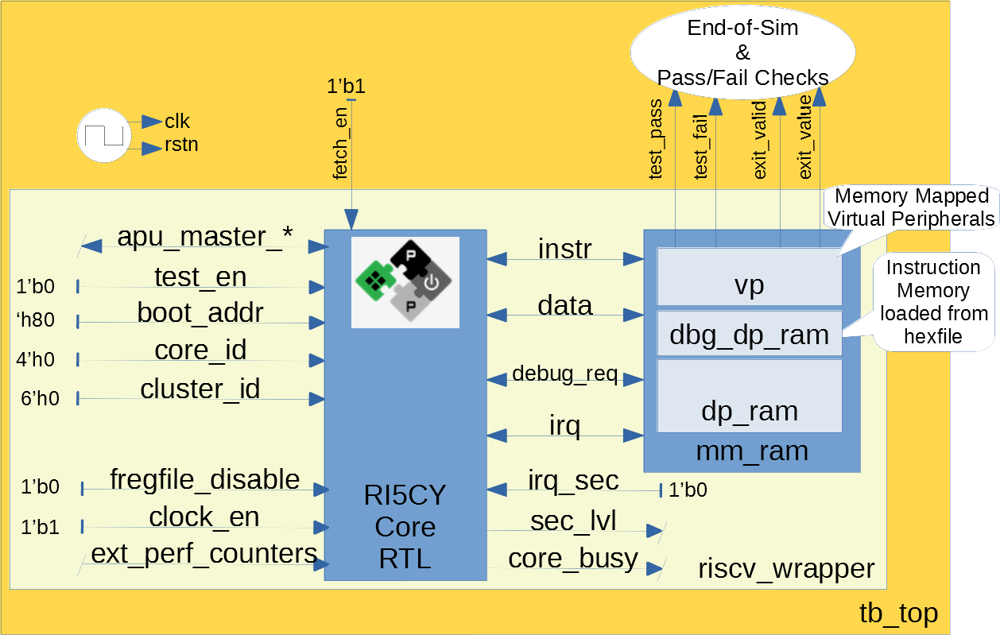
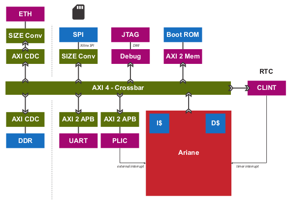

..
   Copyright (c) 2020 OpenHW Group
   
   Licensed under the Solderpad Hardware Licence, Version 2.0 (the "License");
   you may not use this file except in compliance with the License.
   You may obtain a copy of the License at
  
   https://solderpad.org/licenses/
  
   Unless required by applicable law or agreed to in writing, software
   distributed under the License is distributed on an "AS IS" BASIS,
   WITHOUT WARRANTIES OR CONDITIONS OF ANY KIND, either express or implied.
   See the License for the specific language governing permissions and
   limitations under the License.
  
   SPDX-License-Identifier: Apache-2.0 WITH SHL-2.0

.. _pulp-verif:

PULP-Platform Simulation Verification
=====================================

OpenHW's starting point was the RI5CY (CV32E40P) and Ariane (CVA6) cores from PULP-Platform.
The structure of the testbenches for these projects had a direct influence on the architecture of CORE-V-VERIF, so it's help to review these.
It is also informative to consider the Ibex project, another open-source RISC-V project derived from the ‘zero-riscy’ PULP-Platform core.
The reader should keep in mind that this chapter was written in the early days of core-v-verif and will now be out of date in many places.
Nevertheless, it is a useful historical document that captures the initial conditions of the project.

For those without the need or interest to delve into history of these
projects, the Executive Summary below provides a (very) quick summary.
Those wanting more background should read the :ref:`ri5cy` and
:ref:`ariane` sub-sections of this chapter which review the
status of RI5CY and Ariane testbenches in sufficient detail to provide
the necessary context for the :ref:`cv32_env` and
:ref:`cva6_env` chapters, which detail how the RI5CY and Ariane simulation
environments will be migrated to CV32E and CVA6 simulation
environments.

.. _exec_summary:

Executive Summary
-----------------

In the case of the CV32E40P, we have an existing testbench developed for
RI5CY. This testbench is useful, but insufficient to execute a complete,
industrial grade pre-silicon verification and achieve the goal of
‘production ready’ RTL. Therefore, a two-pronged approach will be
followed whereby the existing RI5CY testbench will be updated to create
a CV32E40P “core” testbench. New testcases will be developed for this
core testbench in parallel with the development of a single UVM
environment capable of supporting the existing RI5CY testcases and fully
verifying the CV32E4 cores. The UVM environment will be loosely based on
the verification environment developed for the Ibex core and will also
be able to run hand-coded code-segments (programs) such as those
developed by the RISC-V Compliance Task Group.

In the case of CVA6, the existing verification environment developed
for Ariane is not yet mature enough for OpenHW to use. The
recommendation here is to build a UVM environment from scratch for the
CVA6. This environment will re-use many of the components developed for
the CV32E verification environments, and will have the same ability to
run the RISC-V Compliance test-suite.

RI5CY
-----

The following is a discussion of the verification environment, testbench
and testcases developed for RI5CY.

RI5CY Testbench
~~~~~~~~~~~~~~~

The verification environment (testbench) for RI5CY is shown in Illustration 1. It is
coded entirely in SystemVerilog. The core is instantiated in a wrapper
that connects it to a memory model. A set of assertions embedded in the
RTL [4]_ catch things like out-of-range vectors and unknown values on
control data. The testbench memory model supports I and D address spaces
plus a memory mapped address space for a set of virtual peripherals. The
most useful of these is a virtual printer that provides something akin
to a “hardware printf” capability such that when the core writes ASCII
data to a specific memory location it is written to stdout. In this way,
programs running on the core can write human readable messages to
terminals and logfiles. Other virtual peripherals include external
interrupt generators, a ‘perturbation’ capability that injects random
(legal) cycle delays on the memory bus and test completion flags for the
testbench.

.. _ri5cy_testcases:

RI5CY Testcases
~~~~~~~~~~~~~~~

Testcases are written as C and/or RISC-V assembly-language programs
which are compiled/linked using a light SDK developed to support these
test [5]_. The SDK is often referred to as the “toolchain”. These
testcases are all self-checking. That is, the pass/fail determination is
made by the testcase itself as the testbench lacks any real intelligence
to find errors. The goal of each testcase is to demonstrate correct
functionality of a specific instruction in the ISA. There are no
specific testcases targeting features of the core’s micro-architecture.

A typical testcase is written using a set of macros similar to
**TEST_IMM_OP** [6]_ as shown below: ::

    # instruction under test: addi
    # result op1 op2
    TEST_IMM_OP(addi, 0x0000000a, 0x00000003, 0x007);
    
This macro expands to: ::
    
    li   x1,  0x00000003;        # x1 = 0x3
    addi x14, x1,        0x007;  # x14 = x1 + 0x7
    li   x29, 0x0000000a;        # x29 = 0xA
    bne  x14, x29,       fail;   # if ([x14] != [x29]) fail

Note that the GPRs used by a given macro are fixed. That is, the
*TEST\_IMM\_OP* macro will always use x1, x14 and x29 as destination
registers.

   Illustration 1: RI5CY Testbench

The testcases are broadly divided into two categories, **riscv_tests** and
**riscv_compliance_tests**. In the RI5CY repository these were located in
the *tb/core/riscv_tests* and *tb/core/ riscv_compliance_tests*
respectively. [7]_

RISC-V Tests
^^^^^^^^^^^^

This directory has sub-directories for many of the instruction types
supported by RISC-V cores. According to the README, only those testcases
for integer instructions, compressed instructions and multiple/divide
instructions are in active development. It is not clear how much
coverage the PULP defined ISA extensions have received.

Each of the sub-directories contains one or more assembly source
programs to exercise a given instruction. For example the code segments
above were drawn from the **addi.S**, a program that exercises
the *add immediate* instruction. The testcase exercises the addi
instruction with a set of 24 calls to *TEST\_\** macros as shown above.

There are 217 such tests in the repository. Of these the integer,
compressed and multiple/divide instructions total 65 unique tests.

RISC-V Compliance Tests
^^^^^^^^^^^^^^^^^^^^^^^

There are 56 assembly language tests in the\ **
riscv\_compliance\_tests** directory. It appears that that these are a
clone of a past version of the RISC-V compliance test-suite.

Firmware Tests
^^^^^^^^^^^^^^

There are a small set of C programs in the *firmware* directory. The
ability to compile small stand-alone programs in C and run them on a RTL
model of the core is a valuable demonstration capability, and will be
supported by the CORE-V verification environments. These tests will not
be used for actual RTL verification as it is difficult to attribute
specific goals such as feature, functional or code coverage to such
tests.

Comments and Recommendations for CV32E Verification
~~~~~~~~~~~~~~~~~~~~~~~~~~~~~~~~~~~~~~~~~~~~~~~~~~~

The RI5CY verification environment has several attractive attributes:

1. It exists and it runs. The value of a working environment is
   significant as they all require many person-months of effort to
   create.
2. It is simple and straightforward.
3. The ‘perturbation’ virtual peripheral is a clever idea that will
   significantly increase coverage and increase the probability of
   finding corner-case bugs.
4. Software developers that are familiar with RISC-V assembler and its
   associated tool-chain can develop testcases for it with little or no
   ramp-up time.
5. Any testcase developed for the RI5CY verification environment can run
   on real hardware with only minor modification (maybe none).
6. It runs with Verilator, an open-source SystemVerilog simulator. This
   is not a requirement for the OpenHW Group or its member companies,
   but it may be an attractive feature nonetheless.

Having said that the RI5CY verification environment has several
shortcomings:

i.    All of the intelligence is in the testcases. A consequence of this
      is that achieving full coverage of the core will require a
      significant amount of testcase writing.
ii.   All testcase are directed-tests. That is, they are the same every
      time they run. By definition only the stimulus we think about will
      be run and only the bugs we can imagine will be found. Experience
      shows that this is a high-risk approach to functional
      verification.
iii.  Testcases focuses on only ISA with no attention paid to
      micro-architecture features and non-core features such as
      interrupts and debug.
iv.   Stimulus generation and response checking is 100% manual.
v.    The performance counters are not verified.
vi.   The FPU is not instantiated, so it is not clear if it was ever
      tested in the context of the core.
vii.  All testing is success-based – there are no tests for things such
      as illegal instructions or incorrectly formatted instructions.
viii. There is no functional coverage model, and code coverage data has
      not been collected.
ix.   Some of the features of the testbench, such as the ‘perturbation’
      virtual peripheral on the memory interface are not used by
      Verilator as the perturbation model uses SystemVerilog constructs
      that Verilator does not support.
x.    Randomization of the ‘perturbation’ virtual peripheral on the
      memory interface is not controllable by a testcase.

So, much work remains to be done, and the effort to scale the existing
RI5CY verification environment and testcases to ‘production ready’ CV32E
RTL is not warranted given the shortcomings of the approach taken. It is
therefore recommended to replace this verification environment with a
UVM compliant environment with the following attributes:

a) Structure modelled after the verification environment used for the
   low-RISC Ibex core (see Section `3.4 <#anchor-8>`__ in this
   document).
b) UVM environment class supporting the complete UVM run-flow and
   messaging service (logger).
c) Constrained-random stimulus of inst ructions using a UVM
   sequence-item generator. An example is the `Google RISC-V instruction
   generator <https://content.riscv.org/wp-content/uploads/2018/12/14.25-Tao-Liu-Richard-Ho-UVM-based-RISC-V-Processor-Verification-Platform.pdf>`__.
d) Prediction of execution results using a reference model built into
   the environment, not the individual testcases. Imperas has an
   open-source ISS that could be used for this component.
e) Scoreboarding to compare results from both the reference model and
   the RTL.
f) Functional coverage and code coverage to ensure complete verification
   of the core.

Its important to emphasize here that the the goal is to have a single
verification environment capable of both compliance testing, using the
model developed for the RI5CY verification environment, and
constrained-random tests as per a typical UVM environment. Once this
capability is in place, the existing RI5CY verification environment will
be retired altogether.

Developing such a UVM environment is a significant task that can be
expected to require up to six engineer-months of effort to complete.
This need not be done by a single AC, so the calendar time to get a UVM
environment up and running for the core will be in the order of two to
three months. This document outlines a strategy for developing and
deploying the UVM environment for CV32E in sub-section
`4 <#anchor-4>`__.

The rationale for undertaking such a task is twofold:

1) A full UVM environment is the shortest path to achieving the goals of
   the OpenHW Group. A UVM based constrained-stimulus, coverage driven
   environment is scale-able and will have measurable goals which can be
   easily tracked so that all member companies can see the effort’s
   status in real-time [8]_. The overall effort will be reduced via
   testcase automation and the probability of finding corner-case bugs
   will be greatly enhanced.
2) The ability to run processor-driven, self-checking testcases written
   in assembly or C, maintains the ability to run the compliance
   test-suite. Also, this scheme is common practice within the RISC-V
   community and such support will be expected by many users of the
   verification environment, particularly software developers. Note that
   such tests can be difficult to debug if the self check indicates an
   error, but, for a more "mature" core design, such as the CV32E
   (RI5CY) and CVA6 (Ariane) they can provide a useful way to run
   ‘quick-and-dirty’ checks of specific core features.

Waiting for two to three months for RI5CY core verification to re-start
is not practical given the OpenHW Group goals. Instead, a two-pronged
approach which sees new testcases developed for the existing testbench
in parallel with the development of the UVM environment is recommended.
This is a good approach because it allows CORE-V verification to make
early progress. When the CV32E UVM environment exceeds the capability of
the RI5CY environment, the bulk of the verification effort will
transition to the UVM environment. The RI5CY environment can be
maintained as a tool for software developers to try things out, a tool
for quick-and-easy bug reproduction and a platform for members of the
open-source community restricted to the use of open-source tools.

Ariane
------

The verification environment for Ariane is shown in Illustration 2. It is coded
entirely in SystemVerilog, using more modern syntax than the RI5CY
environment. As such, it is not possible to use an open source
SystemVerilog simulator such as Icarus Verilog or Verilator with this
core.

The Ariane testbench is much more complex than the RI5CY testbench. It
appears that the Ariane project targets an FPGA implementation with
several open and closed source peripherals and the testbench supports a
verification environment that can be used to exercise the FPGA
implementation, including peripherals as well as the Ariane core itself.

   Illustration 2: Ariane Testbench

Ariane Testcases
~~~~~~~~~~~~~~~~

A quick review of the Ariane development tree in GitHub shows that there
are no testcases for the Ariane core. In response to a query to
Davide Schiavone, the following information was provided
by Florian Zaruba, the current maintainer of Ariane:

*There are no specific testcases for Ariane. The Ariane environment runs
cloned versions of the official RISC-V test-suite in simulation. In
addition, Ariane boots Linux on FPGA prototype and also in a multi core
configuration.*

So, the (very) good news is that the Ariane core has been subjected to
basic verification and extensive exercising in the FPGA prototype. The
not-so-good news is that CVA6 lacks a good starting point for its
verification efforts.

Comments and Recommendations for CVA6 Verification
~~~~~~~~~~~~~~~~~~~~~~~~~~~~~~~~~~~~~~~~~~~~~~~~~~~

Given that the focus of the Ariane verification environment is based on
a specific FPGA implementation that the OpenHW Group is unlikely to use
and the lack of a library of existing testcases, it is recommended that
a new UVM-based verification environment be developed for CVA6. This
would be a core-based verification environment as is envisioned for
CV32E and not the mini-SoC environment currently used by Ariane.

At the time of this writing it is not known if the UVM environment
envisioned for CV32E can be easily extended for CVA6, thereby allowing
a single environment to support both, or completely independent
environments for CV32E and CVA6 will be required.

IBEX
----

**Note**: the following was written in April of 2020 and is by now somewhat out of date.
It is included here for its historical value for understanding the thinking behind the development of CORE-V-VERIF.

Strictly speaking, the Ibex is not a PULP-Platform project. According to
the README.md at the Ibex GitHub page, this core was initially developed
as part of the `PULP platform <https://www.pulp-platform.org/>`__ under
the name "Zero-riscy", and was contributed to
`lowRISC <https://www.lowrisc.org/>`__ who now maintains and develops
it. As of this writing, Ibex is under active development, with on-going
code cleanups, feature additions, and verification planned for the
future. From a verification perspective, the
`Ibex <https://github.com/lowRISC/ibex>`__ core is the most mature of
the three cores discussed in this section.

Ibex is not a member of the CORE-V family of cores, and as such the
OpenHW Group is not planning to verify this core on its own. However,
the Ibex verification environment is the most mature of the three cores
discussed here and its structure and implementation is the closest to
the UVM constrained-random, coverage driven environment envisioned for
CV32E and CVA6.

The documentation associated with the Ibex core is the most mature of
the three cores discussed and this is also true for the `Ibex
verification
environment <https://ibex-core.readthedocs.io/en/latest/verification.html>`__,
so it need not be repeated here.

IBEX Impact on CV32E and CVA6 Verification
~~~~~~~~~~~~~~~~~~~~~~~~~~~~~~~~~~~~~~~~~~~

Illustration 3 is a schematic of the Ibex UVM verification environment.  The
flow of the Ibex environment is very close to what
you’d expect to see in a UVM environment: constraints define the instructions in
the generated program which is fed to both the device-under-test (Ibex core
RTL model) and an ISS reference model. The resultant output of the RTL and ISS
are compared to produce a pass/fail result. Functional coverage (not
shown in the Illustration) is applied to measure whether or not the
verification goals have been achieved.

As shown in the Illustration, the Ibex verification environment is a set
of five distinct processes which are combined together by script-ware to
produce the flow above:

1. An SV/UVM simulation of the Instruction Set Generator. This produces
   a RISC-V assembly program in source format. The program is produced
   according to a set of input constraints.
2. A compiler that translates the source into an ELF and then to a
   binary memory image that can be executed directly by the Core and/or
   ISS.
3. An ISS simulation.
4. A second SV/UVM simulation, this time of the core itself.
5. Once the ISS and RTL complete their simulations, a comparison script
   is run to check for differences.

.. figure:: ../images/ibex-ve.png
   :name: IBEX_VE
   :align: center
   :alt: 

   Illustration 3: Ibex Verification Environment

This is an excellent starting point for the CV32E verification
environment and our first step shall be to clone the Ibex environment
and get it running against the CV32E [9]_. Immediately following, an
effort will be undertaken to integrate the existing generator, compiler,
ISS and RTL into a single UVM verification environment. It is known that
the compiler and ISS are coded in C/C++ so these components will be
integrated using the SystemVerilog DPI. A new scoreboarding component to
compare results from the ISS and RTL models will be required. It is
expected that the *uvm_scoreboard* base class from the UVM library will
be sufficient to meet the requirements of the CV32E and CVA6
environments with little or no extension.

Refactoring the existing Ibex environment into a single UVM environment
as above has many benefits:

-  Run-time efficiency. Testcases running in the existing Ibex
   environment must run to completion, regardless of the pass/fail
   outcome and regardless of when an error occurs. A typical simulation
   will terminate after only a few errors (maybe only one) because once
   the environment has detected a failure it does not need to keep
   running. This is particularly true for large regressions with lots of
   long tests and develop/debug cycles. In both cases simulation time is
   wasted on a simulation that has already failed.
-  Easier to debug failing simulations:

   -  Informational and error messages can be added in-place and will
      react at the time an event or error occurs in the simulation.
   -  Simulations can be configured to terminate immediately after an
      error.

-  Easier to maintain.
-  Integrated testcases with single-point-of-control for all aspects of
   the simulation.
-  Ability to add functional coverage to any point of the simulation,
   not just instruction generation.
-  Ability to add checks/scoreboarding to any point of the RTL, not just
   the trace output.

.. [4]
   These assertions are embedded directly in the RTL source code. That
   is, they are not bound into the RTL from the TB using cross-module
   references. There does not appear to be an automated mechanism that
   causes a testcase or regression to fail if one or more of these
   assertions fire.

.. [5]
   Derived from the PULP platform SDK.

.. [6]
   The macro and assembly code shown is for illustrative purposes. The
   actual macros and testcases are slightly more complex and support
   debug aids not shown here.

.. [7]
   These tests have been deprecated and are no longer part of the core-v-verif repository.

.. [8]
   Anyone with access to GitHub will be able to see the coverage results
   of CORE-V regressions.

.. [9]
   This does not change the recommendation made earlier in this document
   to continue developing new testcases on the existing RI5CY testbench
   in parallel.

