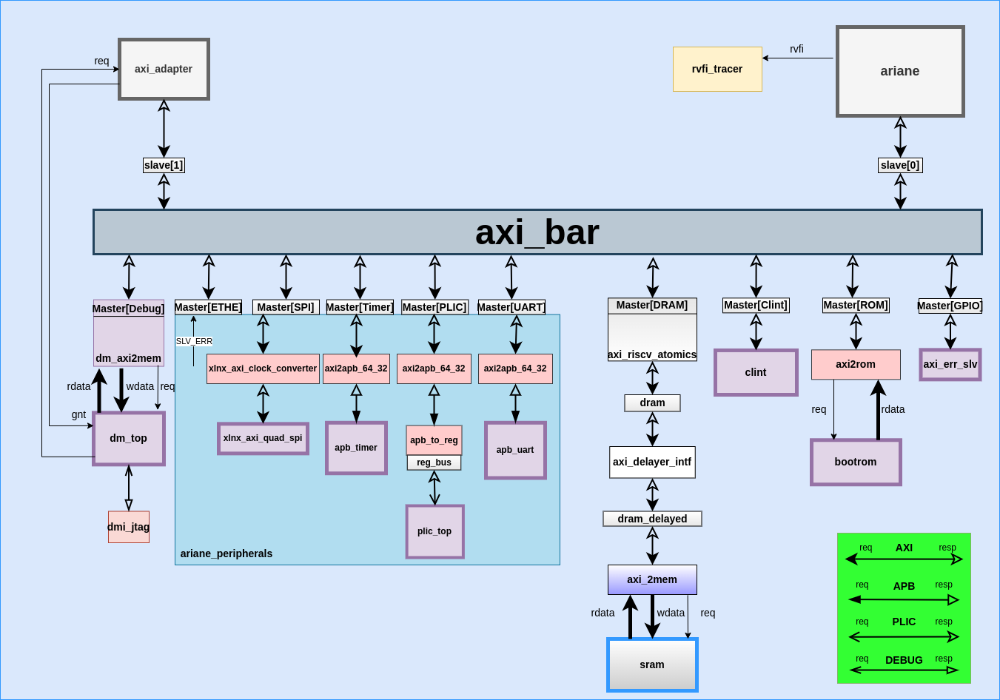

# Ariane testharness

`ariane_testharness` is the module where all the masters and slaves have been connected with the axi crossbar. The following block diagram shows the connections of the slaves and masters in the `ariane_testharness` module.

## Ariane

The `ariane` core is instantiated as `i_ariane` in `ariane_testharness` module. It is acting as a master in this `ariane_testharness`.  
The following is the diagram of the `ariane` module along with its inputs/outputs ports.

`Ipi`, `irq` and `time_irq` are being sent to this module from the `ariane_testharness` module.  
The  AXI request and response signals that are being passed from the `ariane_testharness` to `ariane` module are the following:

> `.axi_req_o           ( axi_ariane_req      ),`  
`.axi_resp_i           ( axi_ariane_resp     )`

In the `ariane_testharness` module `axi_ariane_req` and `axi_ariane_resp` structs are being linked with the `slave[0]` (AXI_BUS interface) in a way that the information of `axi_ariane_req` are being passed to the `slave[0]` and the information from the `slave[0]` are being passed to the `axi_ariane_resp` struct. The following compiler directives are being used for this purpose.

> `AXI_ASSIGN_FROM_REQ(slave[0], axi_ariane_req)`
 `AXI_ASSIGN_TO_RESP(axi_ariane_resp, slave[0])`

`Rvfi_o` is the output of `ariane` and it will go into the `rvfi_tracer` module.

## Debug

### Master

`axi_adapter` is acting as a master for the debug module.  
The following is the diagram of the `axi_adapter` module along with its signals.

The AXI request and response that are being passed from the test_harness module are the following:  

> `.axi_req_o             ( dm_axi_m_req              )`  
`.axi_resp_i            ( dm_axi_m_resp             )`

`Slave[1]` is the interface of AXI_BUS and it actually acts as a master for axi_protocol.  

The `dm_axi_m_req` and `dm_axi_m_resp` are being linked with the slave[1] AXI_BUS interface in this way that the requests signals of the `dm_axi_m_req` are being passed to the `slave[1]` and the response signals from the  `slave[1]` are being passed to the `dm_axi_m_resp` struct.

> `AXI_ASSIGN_FROM_REQ(slave[1], dm_axi_m_req)`
 `AXI_ASSIGN_TO_RESP(dm_axi_m_resp, slave[1])`

### Slave

This is the memory of debug and `axi2mem` converter is used whenever a read or write request is made to memory by the master.  
`axi2mem` module simply waits for the ar_valid or aw_valid of the master (actual slave) interface and then passes the req_o, we_o, addr_o, be_o, user_o signals and data_o to the memory and will receive the data_i and user_i from the memory.

The memory is has been instantiated in the `dm_top` module and the hierarchy is as follows:

## CLINT

Clint is a slave in this SoC. The signals of the `clint` module are as follows:

`ipi_o` (inter-processing interrupt) and `timer_irq_o` (timer_interrupt request), these are generated from the `clint` module and are the inputs of the ariane core.  
This module interacts with the axi bus interface through the following assignments:

> `AXI_ASSIGN_TO_REQ(axi_clint_req, master[ariane_soc::CLINT])`

This compiler directive is used to transfer the request signals of the master via the interface mentioned as `master[ariane_soc::CLINT]` to the struct `axi_clint_req`.

> `AXI_ASSIGN_FROM_RESP(master[ariane_soc::CLINT], axi_clint_resp)`

This compiler directive is used to assign the response of the slave in this case `clint` module from the  
`Axi_clint_resp` struct to the interface `master[ariane_soc::CLINT]`.

## Bootrom

`axi2mem` module is used to communicate with `bootrom` module. The signals of this memory have been shown in the diagram below:

Bootrom is pre-initialized with `ROM_SIZE = 186`.

## SRAM

The complete sequence through which a request to SRAM is transferred is as follows:

`dram` and `dram_delayed` are two AXI_BUS interfaces.
The slave modport of AXI_BUS interface for `Master[DRAM]` has been linked with `axi_riscv_atomics` module and the request of the master has been passed to `dram` interface, another instantiation of interface of AXI_BUS. All this is for the exclusive accesses and no burst is supported in this exclusive access.  
`dram` and `dram_delayed` interfaces have also been passed to `axi_delayer_intf` module as a slave modport and master modport of the AXI_BUS interface, respectively. The `axi_delayer_intf` module is used to introduce the delay.  
`dram_delayed` is also passed to the `axi2mem` module as a slave modport of AXI_BUS interface. `axi2mem` module with `dram_delayed` as an AXI_Bus interface will interact with SRAM.  
SRAM is a word addressable memory with the signals as follows:

## GPIO

GPIO not implemented, error slave has been added in place of it.

## UART

There are two signals for the `apb_uart` module in the `ariane_testharness` namely `tx` and `rx` for transmitting and receiving the data.  
`axi2apb_64_32`, module has been used to convert the axi protocol five channel signals to a single channel apb signals. The `axi2apb_64_32` module has been used between AXI_BUS and `apb_uart module`.  
The signals of the `apb_uart` module have been shown in the diagram below:

Only the signals related to the test_harness have been shown in the above diagram.

## PLIC

PLIC is a slave in this SoC. The hiearchy through which the request is propagated to the plic_top module is as follows:

`axi2apb_64_32` has been used to convert all the plic axi signals into apb signals.  
apb_to_reg is used to assign the apb signals to the `reg_bus` interface which basically communicates with the `plic_top` module. In `apb_to_reg` module ,the logical `AND` of `psel` and `penable` signals of apb makes the `valid` signal of `reg_bus` interface.  
The signals of the `plic_top` have been shown below:

## Timer

The `axi2apb_64_32` module has been used to convert all the timer axi signals into  timer apb signals.The diagram of the apb_timer is as follows.

The signals of apb protocol have been shown in the form of `apb_timer_req` and `apb_timer_resp` in the above diagram.

## Ethernet

Ethernet is a slave in this testharness.

Ethernet support has not been added in the 'ariane_testharness' at this time. For any read or write request from the master to this module is returned with

> `"ethernet.b_resp = axi_pkg::RESP_SLVERR"`

where,
> `"localparam RESP_SLVERR = 2'b10;" in axi_pkg`

 which shows `"Slave error"`. It is used when the access has reached the slave successfully, but the slave wishes to return an error condition to the originating master."

## SPI

 SPI is a slave in this testharness.
  There is the support of the of SPI protocol but at this time it is turned off, as the `.spi_clk_o ( )`,`.spi_mosi  ( )`,`.spi_miso  ( )` ,and `.spi_ss    ( )` signals of SPI have been left opened in the `ariane_testharness` module. For any read or write request from the master to this module is returned with `"Slave error"`.
