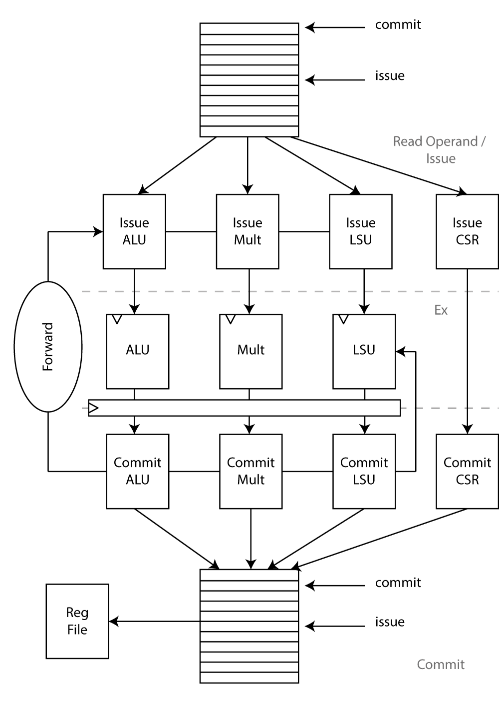

# Block Details

The processor has 5-stages:

## Next PC Generation (PC Gen)

PC gen is responsible for generating the next program counter. All program counters are logical addressed. If the logical to physical mapping changes a fence instruction should flush the pipeline, caches (?) and TLB.
This stage contains speculation on the next branch target as well as the information if the branch target is taken or not. In addition, it provides ports to the branch history table (BHT) and branch target buffer (BTB).

If the branch target buffer decodes a certain PC as a jump the BHT decides if the branch is taken or not.
Because of the various state-full memory structures this stage is split into two pipeline stages. It also provides a handshaking signal to the decode stage to stall the pipeline if this should be necessary (back-pressure).

The next PC can originate from the following sources:

1.  Exception (including interrupts): This also means to figure out to which exception handler the delegate registers are pointing to. If an exception is taken, disable interrupts.
2.  Debug
3.  Request from execute stage (jump, branch) which was not detected as one by the BHT.
4.  Predicted PC (BHT and BTB)
5.  Environment Call (`ecall) instruction. Read the CSRs to figure out where to jump.
6.  Miss-predict: This triggers a pipeline flush and the PC Gen stage starts fetching from there.

### BTB and BHT

Currently all branch prediction data structures reside in a single register like file. It is indexed with the appropriate number of bits from the PC and contains information about the predicted target address as well as the outcome of a two (actually configurable) saturation counter. The prediction result is used in the subsequent stage to jump (or not).

For a future version a more accurate predictor might be necessary (gshare, tournament,...).

## Instruction Fetch (IF)

In the IF stage we already know the physical PC. The request of the instruction is on its way to the instruction memory. We know the result of the BHT and can set the next PC accordingly. At the end of this stage the instruction PC is passed on to the ID stage. Retrieved instructions are stored in an instruction queue.
It is possible that a TLB or cache miss occurred. If this is the case the IF stage signals that it is not ready. The pipeline in the direction of the ID stage will empty itself.

### ITLB

### Instruction Queue

The instruction queue is part of the IF stage. Its purpose is to decouple the instruction fetch unit as much as possible from the rest of the pipeline.

### Interface

|      **Signal**     | **Direction** |                                         **Description**                                         |         **Category**        |
|---------------------|---------------|-------------------------------------------------------------------------------------------------|-----------------------------|
| epc_i               | Input         | EPC from CSR registers, depending on the privilege level the epc points to a different address. | CSR Regs                    |
| ecall_i             | Input         | Ecall request from WB                                                                           | Commit                      |
| epc_commit_i        | Input         | EPC Commit                                                                                      | Commit                      |
| epc_commit_valid_i  | Input         | EPC from Commit is valid                                                                        | Commit                      |
| flush_s1_i          | Input         | Flush PC Gen stage                                                                              | Control                     |
| flush_s2_i          | Input         | Flush fetch stage                                                                               | Control                     |
| bp_pc_i             | Input         | Branch prediction PC, from EX stage                                                             | EX -- Update BP/take branch |
| bp_misspredict_i    | Input         | Branch was misspredicted                                                                        | EX -- Update BP/take branch |
| bp_target_address_i | Input         | Target address of miss-predicted  jump                                                          | EX -- Update BP/take branch |
| instr_req_o         | Output        | Request to ICache                                                                               | ICache                      |
| instr_addr_o        | Output        | Instruction address                                                                             | ICache                      |
| instr_rdata_i       | Input         | Instruction data in                                                                             | ICache                      |
| dbg_addr_i          | Input         | Fetch address from debug                                                                        | Debug                       |
| instr_valid_o       | Output        | Instruction is valid                                                                            | To ID                       |
| instr_rdata_o       | Output        | Instruction                                                                                     | To ID                       |
| pc_o                | Output        | PC of instruction                                                                               | To ID                       |
| is_spec_branch_o    | Output        | Is a speculative branch instruction                                                             | To ID                       |
| spec_branch_pc_o    | Output        | Speculated branch target                                                                        | To ID                       |
| busy_o              | Output        | If is busy                                                                                      | To ID                       |
| ready_i             | Input         | ID is ready                                                                                     | From ID                     |

## Instruction Decode (ID)

The ID stage contains the instruction decode logic (including the planned compressed decoder) as well as the register files (CSR, floating point and regular register file). The decoded instruction is committed to the scoreboard. The scoreboard decides which instruction it can issues next to the execute stage.

### Decoder

The decoder's purpose is to expand the 32 bit incoming instruction stream to set the right values in the scoreboard, e.g.: which functional unit to activate, setting wright path and reading the destination, src1 and src2 register.

|   **Signal**   | **Direction** |                              **Description**                              |  **Category** |
|----------------|---------------|---------------------------------------------------------------------------|---------------|
| instr_i        | Input         | 32 bit instruction to decode                                              | From IF       |
| illegal_insn_o | Output        | decoded an illegal instruction                                            | Exception     |
| ebrk_insn_o    | Output        | Ebreak instruction encountered                                            | Exception     |
| mret_insn_o    | Output        | return from machine exception instruction encountered, as a hint to IF    | Exception     |
| sret_insn_o    | Output        | return from supervisor exception instruction encountered, as a hint to IF | Exception     |
| uret_insn_o    | Output        | return from user exception instruction encountered, as a hint to IF       | Exception     |
| ecall_insn_o   | Output        | environment call instruction encountered, as a hint to IF                 | Exception     |
| fu_o           | Output        | Which functional unit the scoreboard needs to activate                    | To scoreboard |
| op_o           | Output        | Operation the FU should perform                                           | To scoreboard |
| rd_o           | Output        | Destination register                                                      | To scoreboard |
| rs1_o          | Output        | Source register 1                                                         | To scoreboard |
| rs2_o          | Output        | Source register 2                                                         | To scoreboard |
| wfi_o          | Output        | Wait for interrupt                                                        | To IF         |

The current privilege level is not checked in the decoder since there could be an operation in progress that sets the privilege level to the appropriate level.
### Scoreboard

The scoreboard's purpose was described in detail in the architecture section.

The field functional unit can be of the following types:

- CSR: Modify the CSR register using OP, OP can be of type:
    + MRET (check the current privilege level against the mret instruction, are we allowed to execute it?)
    + SRET (same as above but with sret)
    + URET (same as above but with uret)
    + ECALL (make an environment call)
    + WRITE (writing a CSR, we need to flush the whole pipeline after a write)
    + READ (we can simply continue with the execution, the worst that could happen is an access fault if we do not have the right privilege level)
    + SET (atomic set, flush the whole pipeline)
    + CLEAR (atomic clear, flush the whole pipeline)
- ALU: Use the ALU to perform OP
    + ADD, SUB, etc. all arithmetic instructions. ALU always writes to the register file
- LSU: Use the LSU to perform OP
    + LD, SD, LBU, etc. Loads are writing to the register file, stores are committed as soon as the store address and store data is known.
- MULT: Use the Multiplier to perform OP
    + MULT, DIV, etc. all multiplier instructions are writing to the register file.

#### Interface

|       **Signal**      | **Direction** |                                  **Description**                                  |      **Category**      |
|-----------------------|---------------|-----------------------------------------------------------------------------------|------------------------|
| flush_i               | Input         | Flush Scoreboard                                                                  | Control                |
| full_o                | Output        | Scoreboard is full                                                                | Control                |
| rd_clobber_o          | Output        | Used destination registers, includes the FU that is going to write this register  | To issue/read operands |
| rs1_i                 | Input         | Check the scoreboard for a valid register at that address                         | From read operands     |
| rs2_i                 | Input         | Check the scoreboard for a valid register at that address                         | From read operands     |
| rs1_o                 | Output        | Data for rs1                                                                      | To read operands       |
| rs1_valid_o           | Output        | Data for rs1 is valid                                                             | To read operands       |
| rs2_o                 | Output        | Data for rs2                                                                      | To read operands       |
| rs2_valid_o           | Output        | Data for rs2 is valid                                                             | To read operands       |
| commit_instr_o        | Output        | Instruction to commit                                                             | To WB stage            |
| commit_ack_i          | Input         | Commit unit acknowledges instruction, it mus immediately begin with processing it | To WB stage            |
| decoded_instr_i       | Input         | Decoded instruction entering scoreboard                                           | From ID                |
| decoded_instr_valid_i | Input         | Decoded instruction entering scoreboard is valid                                  | From ID                |
| issue_instr_o         | Output        | Instruction to issue stage                                                        | To Issue               |
| issue_instr_valid_o   | Output        | Instruction to issue stage is valid                                               | To Issue               |
| issue_ack_i           | Input         | Issue stage is acknowledging instruction, it must immediately begin processing    | From Issue             |
| pc_i                  | Input         | PC at which to write back the data                                                | From WB                |
| wdata_i               | Input         | Write data from WB                                                                | From WB                |
| wb_valid_i            | Input         | Data from WB stage is valid                                                       | From WB                |

### Issue

The issue stage itself is not a real stage in the sense that it is pipelined, it is still part of the decode stage. The purpose of the issue stage is to find out whether we can issue the current top of the scoreboard to one of the functional units. It therefore takes into account whether the any other FU has or is going to write the destination register of the current instruction and whether or not the necessary functional unit is currently busy. If the FU is not busy and there are no dependencies we can issue the instruction to the execute stage.

### Compressed Decoder
The compressed decoders purpose is to expand a compressed instruction (16 bit) to its 32 bit equivalent.

### Interface

|     **Signal**    | **Direction** |                                             **Description**                                             |     **Category**    |
|-------------------|---------------|---------------------------------------------------------------------------------------------------------|---------------------|
| flush_i           | Input         | Flush ID, there was an architectural state change that needs to invalidate the whole buffer | From controller     |
| ready_o           | Output        | The scoreboard is ready to accept new instructions.                                                     | To ID               |
| valid_i           | Input         | The instruction is valid                                                                                | From ID             |
| imm_i             | Input         | Immediate field in                                                                                      | From ID             |
| rs1_i             | Input         | Source register 1                                                                                       | From ID             |
| rs2_i             | Input         | Source register 2                                                                                       | From ID             |
| rd_i              | Input         | Destination register                                                                                    | From ID             |
| fu_i              | Input         | Functional unit needed                                                                                  | From ID             |
| op_i              | Input         | Operation to perform                                                                                    | From ID             |
| exception_i       | Input         | Exception                                                                                               | From ID             |
| exception_valid_i | Input         | Exception is valid                                                                                      | From ID             |
| epc_i             | Input         | Exception PC                                                                                            | From ID             |
| FU_ALU_o          | Output        | Signals to ALU e.g.: operation to perform etc.                                                          | To ALU              |
| FU_ALU_i          | Input         | Signals from ALU e.g.: finished operation, result                                                       | From ALU            |
| FU_MULT_o         | Output        | Signals to Multiplier                                                                                   | To Mult             |
| FU_MULT_i         | Input         | Signals from Multiplier                                                                                 | From Mult           |
| FU_LSU_o          | Output        | Signals to LSU                                                                                          | To LSU              |
| FU_LSU_i          | Input         | Signals from LSU                                                                                        | From LSU            |
| Regfile           | Inout         | Signals from and to register file                                                                       | From/To regfile     |
| CSR               | Inout         | Signals from and to CSR register file                                                                   | From/To CSR regfile |

## Execute Stage (EX)

### Read Operands

The read operands stage is still part of the scoreboard but conceptually lies at the boundary between ID and EX. The operands where read in the previous cycle but we can still use forwarding to get the source operands from either:

1. Register file
2. Scoreboard (Forwarding)
4. Immediate field

The scoreboard and forwarding are mutually exclusive. The selection logic is a classical priority selection giving precedence to results form the scoreboard/FU over the register file.

To obtain the right register value we need to poll the scoreboard for both source operands.

### Interface

| **Signal** | **Direction** |                  **Description**                  | **Category** |
|------------|---------------|---------------------------------------------------|--------------|
| flush_i    | Input         | Flush ex stage                                    | CSR Regs     |
| FU_ALU_i   | Input         | Signals to ALU e.g.: operation to perform etc.    | To ALU       |
| FU_ALU_o   | Output        | Signals from ALU e.g.: finished operation, result | From ALU     |
| FU_MULT_i  | Input         | Signals to Multiplier                             | To Mult      |
| FU_MULT_o  | Output        | Signals from Multiplier                           | From Mult    |
| FU_LSU_i   | Input         | Signals to LSU                                    | To LSU       |
| FU_LSU_o   | Output        | Signals from LSU                                  | From LSU     |

### Write-Back

The write-back stage writes the results from the FU back to the scoreboard. They are committed in-order in the next stage.

## Commit Stage (Commit)

The commit stage is the single commit point in the whole architecture. Everything prior to this stage was just computed in a temporary fashion. This is also the only point where an exception can occur.
The commit stage is entirely decoupled from the rest of the pipeline. It has access to the scoreboard which issues finished instructions in-order to the commit stage.

### CSR Register File

The CSR register file contains all registers which are not directly related to arithmetic instructions. It contains the following registers supervisor registers:

| **Register** | **Address** |                      **Description**                      |
|--------------|-------------|-----------------------------------------------------------|
| sstatus      | 0x100       | Supervisor status register                                |
| sedeleg      | 0x102       | Supervisor exception delegation register (maybe external) |
| sideleg      | 0x103       | Supervisor interrupt delegation register (maybe external) |
| sie          | 0x104       | Supervisor interrupt-enable register (maybe external)     |
| stvec        | 0x105       | Supervisor trap handler base address                      |
| sscratch     | 0x140       | Scratch register for supervisor trap handler              |
| sepc         | 0x141       | Supervisor exception program counter                      |
| scause       | 0x142       | Supervisor trap cause                                     |
| stval        | 0x143       | Supervisor bad address or instruction                     |
| sip          | 0x144       | Supervisor interrupt pending (maybe external)             |
| sptbr        | 0x180       | Page-table base register                                  |
| tlbflush     | ?           | Flush TLB                                                 |
| cflush       | ?           | Flush Cache                                               |

And the following machine mode CSR registers:

|     **Register**    |  **Address**   |                    **Description**                     |
| ------------------- | -------------- | ------------------------------------------------------ |
| mvendorid           | 0xF11          | Vendor ID                                              |
| marchid             | 0xF12          | Architecture ID                                        |
| mimpid              | 0xF13          | Implementation ID                                      |
| mhartid             | 0xF14          | Hardware thread ID                                     |
| mstatus             | 0x300          | Machine status register                                |
| medeleg             | 0x302          | Machine exception delegation register (maybe external) |
| mideleg             | 0x303          | Machine interrupt delegation register (maybe external) |
| mie                 | 0x304          | Machine interrupt-enable register (maybe external)     |
| mtvec               | 0x305          | Machine trap handler base address                      |
| mscratch            | 0x340          | Machine register for machine trap handler              |
| mepc                | 0x341          | Machine exception program counter                      |
| mcause              | 0x342          | Machine trap cause                                     |
| mtval               | 0x343          | Machine bad address or instruction                     |
| mip                 | 0x344          | Machine interrupt pending (maybe external)             |
| mcycle              | 0xB00          | Machine cycle counter                                  |
| minstret            | 0xB02          | Machine instruction-retired counter                    |
| Performance Counter | 0xB03 -- 0xB9F | Machine performance-monitoring counter                 |

We need to be careful when altering some of the register. Some of those registers would potentially lead to different behavior (e.g.: mstatus by enabling address translation).

### Interface

|   **Signal**   | **Direction** |               **Description**                |       **Category**       |
|----------------|---------------|----------------------------------------------|--------------------------|
| flush_i        | Input         | Flush WB stage                               | CSR Regs                 |
| instr_commit_i | Input         | Instruction to commit                        | From Scoreboard/ID Stage |
| CSR Regs       | Output        | Interface to CSR registers                   | To CSR Registers         |
| Regfile        | Output        | Interface to the architectural register file | To regfile               |
| Exception      | Output        | Exception occured                            | To PC gen                |

## MMU

|      **Signal**      | **Direction** |                                     **Description**                                      |
| -------------------- | ------------- | ---------------------------------------------------------------------------------------- |
| enable_translation_i | Input         | Enables translation, coming from CSR file.                                               |
| ireq_o               | Output        |                                                                                          |
| ivalid_i             | Output        |                                                                                          |
| ierr_i               | Input         |                                                                                          |
| ipaddr_o             | Output        | Physical address out                                                                     |
| fetch_req_i          | Input         | Fetch request in                                                                         |
| fetch_gnt_o          | Output        | Fetch request granted                                                                    |
| fetch_valid_o        | Output        | The output is valid                                                                      |
| fetch_err_o          | Output        | Fetch error                                                                              |
| fetch_vaddr_i        | Input         | Virtual address in                                                                       |
| dreq_o               | Output        | Request to data memory                                                                   |
| dgnt_i               | Input         | Grant from data memory                                                                   |
| dvalid_i             | Input         | Data from data memory is valid                                                           |
| dwe_o                | Output        | Write enable to data memory                                                              |
| dbe_o                | Output        | Byte enable to data memory                                                               |
| dpaddr_o             | Output        | Physical address to data memory                                                          |
| ddata_i              | Input         | Data from data memory                                                                    |
| lsu_req_i            | Input         | Request from LSU                                                                         |
| lsu_gnt_o            | Output        | Request granted to LSU                                                                   |
| lsu_valid_o          | Output        | Data to LSU is valid                                                                     |
| lsu_we_i             | Input         | Write enable from LSU                                                                    |
| lsu_err_o            | Output        | Error to LSU                                                                             |
| lsu_be_i             | Input         | Byte enable from LSU                                                                     |
| lsu_vaddr_i          | Input         | Virtual address from LSU                                                                 |
| priv_lvl_i           | Input         | Current Privilige Level                                                                  |
| flag_pum_i           | Input         | PUM (Protected User Mode) Flag, prevents S-mode code to alter user mode code -- from CSR |
| flag_mxr_i           | Input         | MXR (Make eXecutable Readable), makes it possible to read executable only pages          |
| pd_ppn_i             | Input         | Physical page number                                                                     |
| asid_i               | Input         | ASID (address space identifier)                                                          |
| flush_tlb_i          | Input         | Flush TLB                                                                                |
| lsu_ready_wb_i       | Input         | LSU is ready to accept new data                                                          |

## LSU

### Memory Arbiter

The memory arbiter's purpose is to arbitrate the memory accesses coming/going from/to the PTW, store queue and load requests. On a flush it needs to wait for all previous transactions to return. We currently do not have another way to squash load and stores that already went into the memory hierarchy.

### Store Queue

The store queue keeps track of all stores. It has two entries: One is for already committed instructions and one is for outstanding instructions. On a flush only the instruction which has the already committed instruction saved persists its data. But on a flush it can't request further to the memory since this could potentially stall us indefinitely because of the property of the memory arbiter (see above).

The store queue works with physical addresses only. At the time when they are committed the translation is correct. Furthermore the store queue directly outputs the address and value of the instruction it is going to commit since any subsequent store also needs to check for the address.
