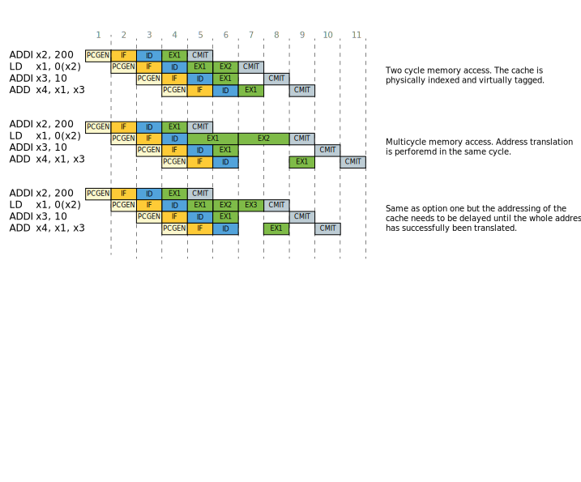

# Timing Diagrams

## D$ Interface

Basic D$ Memory Request:

Slow D$ response:

Fast back to back D$ response:

Aborted D$ request (with a new back to back request):

<!-- ## LSU

- **Multicycle D$ access**: Making the path to the cache a multicycle path. This will give enough headroom for the memories to propagate their output.

- **Extra MMU stage**: Splitting the path after address generation. With the headroom gained we could deskew the ld/st path again.

- Making the D$ **virtually indexed and physically tagged**. This will hide the latency of address translation.
 -->

## Functional Unit

# Pipeline Diagram

## LSU

