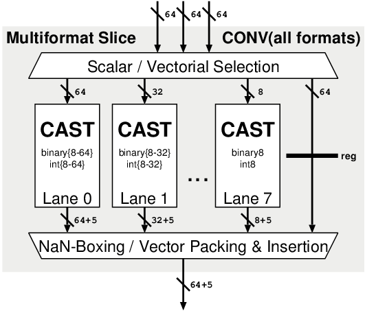

# FPnew Documentation

FPnew is a parametric floating-point unit which supports standard RISC-V operations as well as transprecision formats, written in SystemVerilog.

**Table of Contents**
- [Top-Level Interface](#top-level-interface)
  - [Parameters](#parameters)
  - [Ports](#ports)
  - [Handshake Inteface](#handshake-interface)
  - [Operation Tags](#operation-tags)
- [Configuration](#configuration)
  - [Configuration Parameters](#configuration-parameters)
  - [Adding Custom Formats](#adding-custom-formats)
- [Architecture](#architecture)
  - [Top-Level](#top-level)
  - [Operation Group Blocks](#operation-group-blocks)
  - [Format-Specific Slices](#format-specific-slices-parallel)
  - [Multi-Format Slices](#multi-format-slices-merged)
  - [Pipelining](#pipelining)
  - [Output Arbitration](#output-arbitration)

## Top-Level Interface

The top-level module of the FPU is `fpnew_top` and its interface is further described in this section.
FPnew uses a synchronous interface using handshaking to transfer data into and out of the FPU.

All array types are packed due to poor support of unpacked arrays in some EDA tools.  
SystemVerilog `interface`s are not used due to poor support in some EDA tools.


### Parameters

The configuration parameters use data types defined in `fpnew_pkg` which are structs containing multi-dimensional arrays of custom enumeration types.  
For more in-depth explanations on how to configure the unit and the layout of the types used, please refer to the [Configuration Section](#configuration).

|  Parameter Name  |                                                         Description                                                          |
|------------------|------------------------------------------------------------------------------------------------------------------------------|
| `Features`       | Specifies the features of the FPU, such as the set of supported formats and operations.                                      |
| `Implementation` | Allows to control how the above features are implemented, such as the number of pipeline stages and architecture of subunits |
| `TagType`        | The SystemVerilog data type of the operation tag                                                                             |


### Ports

Many ports use custom types and enumerations from `fpnew_pkg` to improve code structure internally (see [Data Types](#data-types)).  
As the width of some input/output signals is defined by the configuration, it is denoted `W` in the following table.

|    Port Name     | Direction |         Type         |                          Description                           |
|------------------|-----------|----------------------|----------------------------------------------------------------|
| `clk_i`          | in        | `logic`              | Clock, synchronous, rising-edge triggered                      |
| `rst_ni`         | in        | `logic`              | Asynchronous reset, active low                                 |
| `operands_i`     | in        | `logic [2:0][W-1:0]` | Operands, henceforth referred to as `op[`*i*`]`                |
| `rnd_mode_i`     | in        | `roundmode_e`        | Floating-point rounding mode                                   |
| `op_i`           | in        | `operation_e`        | Operation select                                               |
| `op_mod_i`       | in        | `logic`              | Operation modifier                                             |
| `src_fmt_i`      | in        | `fp_format_e`        | Source FP format                                               |
| `dst_fmt_i`      | in        | `fp_format_e`        | Destination FP format                                          |
| `int_fmt_i`      | in        | `int_format_e`       | Integer format                                                 |
| `vectorial_op_i` | in        | `logic`              | Vectorial operation select                                     |
| `tag_i`          | in        | `TagType`            | Operation tag input                                            |
| `in_valid_i`     | in        | `logic`              | Input data valid (see [Handshake](#handshake-interface))       |
| `in_ready_o`     | out       | `logic`              | Input interface ready (see [Handshake](#handshake-interface))  |
| `flush_i`        | in        | `logic`              | Synchronous pipeline reset                                     |
| `result_o`       | out       | `logic [W-1:0]`      | Result                                                         |
| `status_o`       | out       | `status_t`           | RISC-V floating-point status flags `fflags`                    |
| `tag_o`          | out       | `TagType`            | Operation tag output                                           |
| `out_valid_o`    | out       | `logic`              | Output data valid (see [Handshake](#handshake-interface))      |
| `out_ready_i`    | in        | `logic`              | Output interface ready (see [Handshake](#handshake-interface)) |
| `busy_o`         | out       | `logic`              | FPU operation in flight                                        |

#### Data Types

The following custom data types and enumerations used in ports of the FPU and are defined in `fpnew_pkg`.
Default values from the package are listed.

##### `roundmode_e` - FP Rounding Mode

Enumeration of type `logic [2:0]` holding available rounding modes, encoded for use in RISC-V cores:

| Enumerator |  Value   |                    Rounding Mode                     |
|------------|----------|------------------------------------------------------|
| `RNE`      | `3'b000` | To nearest, tie to even (default)                    |
| `RTZ`      | `3'b001` | Toward zero                                          |
| `RDN`      | `3'b010` | Toward negative infinity                             |
| `RUP`      | `3'b011` | Toward positive infinity                             |
| `RMM`      | `3'b100` | To nearest, tie away from zero                       |
| `DYN`      | `3'b111` | *RISC-V Dynamic RM, invalid if passed to operations* |

##### `operation_e` - FP Operation

Enumeration of type `logic [3:0]` holding the FP operation.
The operation modifier `op_mod_i` can change the operation carried out.
Unless noted otherwise, the first operand `op[0]` is used for the operation.

| Enumerator | Modifier |                                                                                                    Operation                                                                                                     |
|------------|----------|------------------------------------------------------------------------------------------------------------------------------------------------------------------------------------------------------------------|
| `FMADD`    | `0`      | Fused multiply-add (`(op[0] * op[1]) + op[2]`)                                                                                                                                                                   |
| `FMADD`    | `1`      | Fused multiply-subtract (`(op[0] * op[1]) - op[2]`)                                                                                                                                                              |
| `FNMSUB`   | `0`      | Negated fused multiply-subtract (`-(op[0] * op[1]) + op[2]`)                                                                                                                                                     |
| `FNMSUB`   | `1`      | Negated fused multiply-add (`-(op[0] * op[1]) - op[2]`)                                                                                                                                                          |
| `ADD`      | `0`      | Addition (`op[1] + op[2]`) *note the operand indices*                                                                                                                                                            |
| `ADD`      | `1`      | Subtraction (`op[1] - op[2]`) *note the operand indices*                                                                                                                                                         |
| `MUL`      | `0`      | Multiplication (`op[0] * op[1]`)                                                                                                                                                                                 |
| `DIV`      | `0`      | Division (`op[0] / op[1]`)                                                                                                                                                                                       |
| `SQRT`     | `0`      | Square root                                                                                                                                                                                                      |
| `SGNJ`     | `0`      | Sign injection, operation encoded in rounding mode<br>`RNE`: `op[0]` with `sign(op[1])`<br>`RTZ`: `op[0]` with `~sign(op[1])`<br>`RDN`: `op[0]` with `sign(op[0]) ^ sign(op[1])`<br>`RUP`: `op[0]` (passthrough) |
| `SGNJ`     | `1`      | As above, but result is sign-extended instead of NaN-Boxed                                                                                                                                                       |
| `MINMAX`   | `0`      | Minimum / maximum, operation encoded in rounding mode<br>`RNE`: `minimumNumber(op[0], op[1])`<br>`RTZ`: `maximumNumber(op[0], op[1])`                                                                            |
| `CMP`      | `0`      | Comparison, operation encoded in rounding mode<br>`RNE`: `op[0] <= op[1]`<br>`RTZ`: `op[0] < op[1]`<br>`RDN`: `op[0] == op[1]`                                                                                   |
| `CLASSIFY` | `0`      | Classification, returns RISC-V classification block                                                                                                                                                              |
| `F2F`      | `0`      | FP to FP cast, formats given by `src_fmt_i` and `dst_fmt_i`                                                                                                                                                      |
| `F2I`      | `0`      | FP to signed integer cast, formats given by `src_fmt_i` and `int_fmt_i`                                                                                                                                          |
| `F2I`      | `1`      | FP to unsigned integer cast, formats given by `src_fmt_i` and `int_fmt_i`                                                                                                                                        |
| `I2F`      | `0`      | Signed integer to FP cast, formats given by `int_fmt_i` and `dst_fmt_i`                                                                                                                                          |
| `I2F`      | `1`      | Unsigned integer to FP cast, formats given by `int_fmt_i` and `dst_fmt_i`                                                                                                                                        |
| `CPKAB`    | `0`      | Cast-and-pack `op[0]` and `op[1]` to entries 0, 1 of vector `op[2]`.                                                                                                                                             |
| `CPKAB`    | `1`      | Cast-and-pack `op[0]` and `op[1]` to entries 2, 3 of vector `op[2]`.                                                                                                                                             |
| `CPKCD`    | `0`      | Cast-and-pack `op[0]` and `op[1]` to entries 4, 5 of vector `op[2]`.                                                                                                                                             |
| `CPKCD`    | `1`      | Cast-and-pack `op[0]` and `op[1]` to entries 6, 7 of vector `op[2]`.                                                                                                                                             |

##### `fp_format_e` - FP Formats

Enumeration of type `logic [2:0]` holding the supported FP formats.

| Enumerator | Format        | Width  | Exp. Bits | Man. Bits |
| ---------- | ------------- | -----: | :-------: | :-------: |
| `FP32`     | IEEE binary32 | 32 bit | 8         | 23        |
| `FP64`     | IEEE binary64 | 64 bit | 11        | 52        |
| `FP16`     | IEEE binary16 | 16 bit | 5         | 10        |
| `FP8`      | binary8       | 8 bit  | 5         | 2         |
| `FP16ALT`  | binary16alt   | 16 bit | 8         | 7         |

The following global parameters associated with FP formats are set in `fpnew_pkg`:
```SystemVerilog
localparam int unsigned NUM_FP_FORMATS = 5;
localparam int unsigned FP_FORMAT_BITS = $clog2(NUM_FP_FORMATS);
```

##### `int_format_e` - Integer Formats

Enumeration of type `logic [1:0]` holding the supported integer formats.

| Enumerator | Width  |
| ---------- | -----: |
| `INT8`     | 8 bit  |
| `INT16`    | 16 bit |
| `INT32`    | 32 bit |
| `INT64`    | 64 bit |

The following global parameters associated with integer formats are set in `fpnew_pkg`:
```SystemVerilog
localparam int unsigned NUM_INT_FORMATS = 4;
localparam int unsigned INT_FORMAT_BITS = $clog2(NUM_INT_FORMATS);
```

##### `status_t` - FP Status Flags

Packed struct containing the five FP status flags as `logic` in order MSB to LSB:

| Memeber |    Description    |
|---------|-------------------|
| `NV`    | Invalid operation |
| `DZ`    | Division by zero  |
| `OF`    | Overflow          |
| `UF`    | Underflow         |
| `NX`    | Inexact operation |

#### NaN-Boxing

RISC-V mandates so-called NaN-boxing of all FP values in formats that are narrower than the widest available format in the system.
This means that all unused high-order bits of narrow formats must be set to `'1`, otherwise the value is considered invalid (a NaN).

Checks for whether input values are properly NaN-boxed are enabled by default but can be turned off (see [Configuration](#configuration)).
Narrow FP output values from the FPU are always NaN-boxed.
Narrow integer output values from the FPU are sign-extended, even if unsigned.


### Handshake Interface

Both the input and output side of FPnew feature a `valid`/`ready` handshake interface which controls the flow of data into and out of the FPU.
The handshaking protocol is similar to ones used in common protocols such as AXI:

- An asserted `valid` singnals that data on the corresponding interface is valid and stable.
- Once `valid` is asserted, it *must not* be disasserted until the handshake is complete.
- An asserted `ready` signals that the interface is capable of processing data on the following rising clock edge.
- Once `valid` and `ready` are asserted during a rising clock edge, the transaction is complete.
- After a completed transaction, `valid` may remain asserted to provide new data for the next transfer.
- The protocol direction is *top-down*. `ready` may depend on `valid` but `valid` *must not* depend on `ready`.


### Operation Tags

Operation tags are metadata accompanying an operation and can be used to link results back to the oprerations that produced them.
Tags traverse the FPU without being modified, but always stay in sync with the operation they were issued with.

Tags are an optional feature of FPnew and can be controlled by setting the `TagType` parameter as needed (usually a packed vector of `logic`, but can be any type).
In order to disable the use of tags, set `TagType` to `logic` (the default value), and bind the `tag_i` port to a static value.
Furthermore ensure that your synthesis tool removes static registers.


## Configuration

Main configuration of the FPU is done through parameters on the `fpnew_top` module.
A default selection of formats and features is defined in the package and can be controlled through these parameters.
Furthermore, the project package `fpnew_pkg` can be modified to provide even more custom formats to the FPU.


### Configuration Parameters

#### `Features` - Feature set of the FPU

The `Features` parameter is used to configure the available formats and special features of the FPU.
It is of type `fpu_features_t` which is defined as:
```SystemVerilog
typedef struct packed {
  int unsigned Width;
  logic        EnableVectors;
  logic        EnableNanBox;
  fmt_logic_t  FpFmtMask;
  ifmt_logic_t IntFmtMask;
} fpu_features_t;

```
The fields of this struct behave as follows:

##### `Width` - Datapath Wdith

Specifies the width of the FPU datapath and of the input and output data ports (`operands_i`/`result_o`).
It must be larger or equal to the width of the widest enabled FP and integer format.

*Default*: `64`

##### `EnableVectors` - Vectorial Hardware Generation

Controls the generation of packed-SIMD computation units in the FPU.
If set to `1`, vectorial execution units will be generated for all FP formats that are narrower than `Width` in order to fill up the datapath width.
For example, given `Width = 64`, there will be four execution units for every operation on 16-bit FP formats.

*Default*: `1'b1`

##### `EnableNanBox` - NaN-Boxing Check Control

Controls whether input value NaN-boxing is enforced (see [NaN-Boxing](#nan-boxing)).
If set to `1`, all values of FP formats that are narrower than `Width` will be considered NaN unless all unused high-order bits are set to `'1`.
Output FP values are always NaN-boxed, regardless of this setting.

*Default*: `1'b1`

##### `FpFmtMask` - Enabled FP Formats

The `FpFmtMask` parameter is of type `fmt_logic_t` which is an array holding one `logic` bit per FP format from `fp_format_e`, in ascending order.
```SystemVerilog
typedef logic [0:NUM_FP_FORMATS-1] fmt_logic_t; // Logic indexed by FP format
```
If a bit in `FpFmtMask` is set, FPU hardware for the corresponding format is generated.
Otherwise, synthesis tools can optimize away any logic associated with this format and operations on the format yield undefined results.

*Default*: `'1` (all enabled)

##### `IntFmtMask` - Enabled Integer Formats

The `IntFmtMask` parameter is of type `ifmt_logic_t` which is an array holding one `logic` bit per integer format from `int_format_e`, in ascending order.
```SystemVerilog
typedef logic [0:NUM_INT_FORMATS-1] ifmt_logic_t; // Logic indexed by integer format
```
If a bit in `IntFmtMask` is set, FPU hardware for the corresponding format is generated.
Otherwise, synthesis tools can optimize away any logic associated with this format and operations on the format yield undefined results.

*Default*: `'1` (all enabled)


#### `Implementation` - Implementation Options

The FPU is divided into four operation groups,  `ADDMUL`, `DIVSQRT`, `NONDOMP`, and `CONV` (see [Architecture: Top-Level](#top-level)).
The `Implementation` parameter controls the implementation of these operation groups.
It is of type `fpu_implementation_t` which is defined as:
```SystemVerilog
typedef struct packed {
  opgrp_fmt_unsigned_t   PipeRegs;
  opgrp_fmt_unit_types_t UnitTypes;
  pipe_config_t          PipeConfig;
} fpu_implementation_t;
```
The fields of this struct behave as follows:

##### `PipeRegs` - Number of Pipelining Stages

The `PipeRegs`parameter is of type `opgrp_fmt_unsigned_t` which is an array of arrays, holding for each operation group for each format an unsigned value, in ascending order.
```SystemVerilog
typedef logic [0:NUM_FP_FORMATS-1][31:0] fmt_unsigned_t; 		// Array of unsigned indexed by FP format
typedef fmt_unsigned_t [0:NUM_OPGROUPS-1] opgrp_fmt_unsigned_t; // Array of format-specfic unsigned indexed by operation group
```
This parameter sets a number of pipeline stages to be inserted into the computational units per operation group, per FP format.
As such, latencies for different operations and different formats can be freely configured.

*Default*: `'{default: 0}` (no pipelining - all operations combinatorial)

##### `UnitTypes` - HW Unit Implementation

The `UnitTypes`parameter is of type `opgrp_fmt_unit_types_t` which is an array of arrays, holding for each operation group for each format an enumeration value, in ascending order.
```SystemVerilog
  typedef unit_type_t [0:NUM_FP_FORMATS-1]    fmt_unit_types_t;        // Array of unit types indexed by format
  typedef fmt_unit_types_t [0:NUM_OPGROUPS-1] opgrp_fmt_unit_types_t;  // Array of format-specific unit types indexed by opgroup
```
The unit type `unit_type_t` is an enumeration of type `logic [1:0]` holding the following implementation options for a particular hardware unit:

| Enumerator |                                         Description                                          |
|------------|----------------------------------------------------------------------------------------------|
| `DISABLED` | No hardware units will be generated for this format                                          |
| `PARALLEL` | One hardware unit per format will be generated                                               |
| `MERGED`   | One combined multi-format hardware unit will be generated for all formats selecting `MERGED` |

The `UnitTypes` parameter allows to control resources used for the FPU by either removing operation units for certain formats and operations, or merging multiple formats into one.
Currently, the follwoing unit types are available for the FPU operation groups:

|            |      `ADDMUL`      |     `DIVSQRT`      |     `NONCOMP`      |       `CONV`       |
|------------|--------------------|--------------------|--------------------|--------------------|
| `PARALLEL` | :heavy_check_mark: |                    | :heavy_check_mark: |                    |
| `MERGED`   | :heavy_check_mark: | :heavy_check_mark: |                    | :heavy_check_mark: |

*Default*:
```SystemVerilog
'{'{default: PARALLEL}, // ADDMUL
  '{default: MERGED},   // DIVSQRT
  '{default: PARALLEL}, // NONCOMP
  '{default: MERGED}}   // CONV`
``` 
(all formats within operation group use same type)


##### `PipeConfig` - Pipeline Register Placement

The `PipeConfig` parameter is of type `pipe_config_t` and controls register placement in operational units.
The requested number of registers is placed to predefined locations within the units according to the `PipeConfig` parameter.
For best results, we *strongly* encourage the use of automatic retiming options in synthesis tools to optimize the pre-placed pipeline registers.

The configuration  `pipe_config_t` is an enumeration of type `logic [1:0]` holding the following implementation options for the pipelines in operational units:

|   Enumerator  |                                             Description                                              |
|---------------|------------------------------------------------------------------------------------------------------|
| `BEFORE`      | All pipeline registers are inserted at the inputs of the operational unit                            |
| `AFTER`       | All pipeline registers are inserted at the outputs of the operational unit                           |
| `INSIDE`      | All registers are inserted at roughly the middle of the operational unit (if not possible, `BEFORE`) |
| `DISTRIBUTED` | Registers are evenly distributed to `INSIDE`, `BEFORE`, and `AFTER` (if no `INSIDE`, all `BEFORE`)   |


### Adding Custom Formats

In order to add custom FP or integer formats to the FPU, it is necessary to make small changes to `fpnew_pkg`.
New formats can easily be added by extending the default list of available formats, and/or by changing or removing the defaults. 

Namely, the following parameters and types shall be adapted:
```
// For FP formats:
localparam int unsigned NUM_FP_FORMATS
typedef enum logic [FP_FORMAT_BITS-1:0] {...} fp_format_e
localparam fp_encoding_t [0:NUM_FP_FORMATS-1] FP_ENCODINGS
localparam fmt_logic_t CPK_FORMATS

// For Int formats:
localparam int unsigned NUM_INT_FORMATS
typedef enum logic [INT_FORMAT_BITS-1:0] {...} int_format_e
```
Furthermore, the default configuration parameters shall be adjusted to match the dimensions of the modified format list.

No other changes should be necessary to the package or other source files of the FPU.


## Architecture

The exact architecture of FPnew depends on the configuration through parameters.
The main architectural traits as well as the effect of some parameters are described henceforth.

The design philosophy begind FPnew is that the "plumbing" of the architecture is quite regular and generic and the actual operations that handle the data are located at the lowest level.
Handshaking is used to pass data through the hierarchy levels.
As such, very fine-grained clock-gating can be applied to silence all parts of the architecture that are not actively contributing to useful work, significantly increasing energy efficiency.


### Top-Level

The topmost level of hierarchy in FPnew is host to several operation group blocks as well as an output arbiter.
The *operation group* is the highest level of grouping within FPnew and signifies a class of operations that can usually be executed on a single hardware unit - such as additions and multiplications usually being mapped to an FMA unit.


There are currently four operation groups in FPnew which are enumerated in `opgroup_e` as outlined in the following table:

| Enumerator |                  Description                  |         Associated Operations         |
|------------|-----------------------------------------------|---------------------------------------|
| `ADDMUL`   | Addition and Multiplication                   | `FMADD`, `FNMSUB`, `ADD`, `MUL`       |
| `DIVSQRT`  | Division and Square Root                      | `DIV`, `SQRT`                         |
| `NONCOMP`  | Non-Computational Operations like Comparisons | `SGNJ`, `MINMAX`, `CMP`, `CLASS`      |
| `CONV`     | Conversions                                   | `F2I`, `I2F`, `F2F`, `CPKAB`, `CPKCD` |

Most architectural decisions for FPnew are made at very fine granularity.
The big exception to this is the generation of vectorial hardware which is decided at top level through the `EnableVectors` parameter.


### Operation Group Blocks

Each operation group is implemented in its own operation group block, each generating *slices*.
A unit type is selected for each format according to the settings in the `Implementation` parameter.
Formats can either be implemented in a format-specific `PARALLEL` slice, or a multi-format `MERGED` slice.
Both `PARALLEL` and `MERGED` slices can co-exist in case a subset of formats is assigned to both of the two options.


### Format-Specific Slices (`PARALLEL`)

In a parallel slice, operational units capable of processing exactly one format are generated.
If `EnableVectors` is set, operational units are duplicated into vectorial *lanes* in order to fill up the width of the datapath.
Results from all lanes are collected and assembled at the output of the slice.

Implementing units as parallel slices usually yields best format-specific latency, however costs more in terms of area.


### Multi-Format Slices (`MERGED`)

In a merged slice, operational units capable of processing multiple formats are generated.
If `EnableVectors` is set, operational units for narrow formats are duplicated into vectorial *lanes* in order to fill up the width of the datapath.
To facilitate vectorial conversions that update an input vector, the third operand is pipelined along with the operation in the `CONV` block.
Results from all lanes are collected and assembled at the output of the slice.

Implementing units as merged slices usually yields best total area, however costs more in terms of per-format latency.

When the `ADDMUL` block is implemented using the `MERGED` implementation, multi-format FMA (multiplication done in `src_format`, accumulation in `dst_format`) is automatically supported among all formats using `MERGED`.




### Pipelining

Pipeline registers are inserted into the operational units directly, according to the settings in the  `Implementation` parameter.
As such, each slice in the system can have a different latency.
Merged slices are bound to thave the largest latency of the included formats.

All pipeline registers are inserted as shift registers at predefined locations in the FPU.
For optimal mapping, retiming funcitonality of your synthesis tools should be used to balance the paths between registers.

Data traverses the pipeline stages within the operational units using the same handshaking mechanism that is also present at the top-level FPU interface.
An individual pipeline stage is only stalled if its successor stage is stalled and cannot proceed in the following cycle.
In general, different operations can overtake each other in the FPU if their latencies differ or significant backpressure exists in one of the paths.
Hence, the use of operation tags is required to identify the exiting data if more than one operation is allowed to enter the FPU.


### Output Arbitration

There are round-robin arbiters located at the ouputs of slices as well as the outputs of operation group blocks that resolve contentions for the ouput port of the FPU.
Arbitration is fair, i.e. a unit cannot write the outputs twice in a row if other units are also contending for the output.
