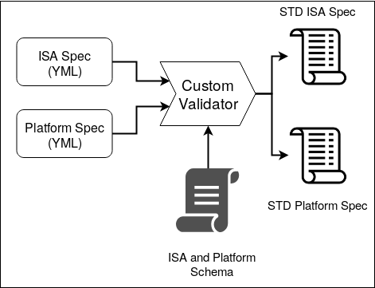

########
Overview
########

The following diagram captures the overall-flow of RISCV-Config.

The user is required to provide 2 YAML files as input:

1. **ISA Spec**: This YAML file is meant to capture the ISA related features implemented by the user. Details of this input file can be found here : :ref:`isa_yaml_spec`. 
2. **Platform Spec**: This YAML file is meant to capture the platform specific features implemented by the user. Details of this input file can be found here : :ref:`platform_yaml_spec`.

Working
=======

The ISA and Platform spec are first checked by the validator for any inconsistencies. Checks like 'F' to exist for 'D' are performed by the validator. The validator exits with an error if any illegal configuration for the spec is provided. Once the validator checks pass, two separate standard yaml files are generated, one for each input type. These standard yaml files contain all fields elaborated and additional info for each node. While the user need not specify all the fields in the input yaml files, the validator will assign defaults to those fields and generate a standard exhaustive yaml for both ISA and Platform spec.

