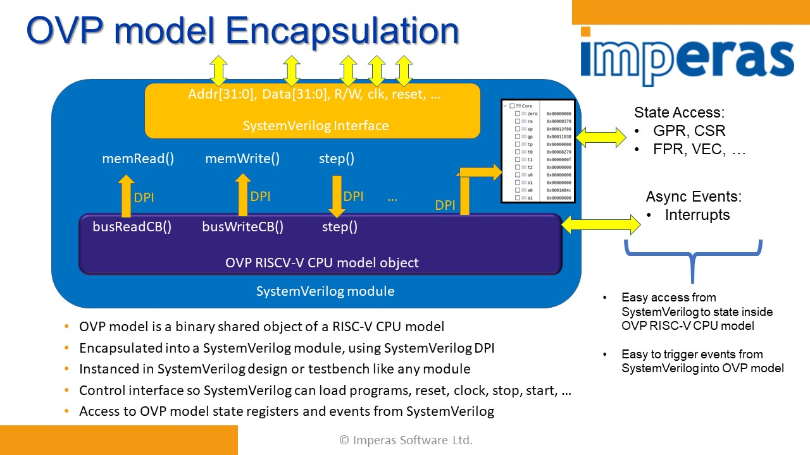

Imperas OVP Fixed Model of OpenHW CV32E40P CPU for SystemVerilog encapsulation
==============================================================================
A Complete, Fully Functional, Configurable CV32E40P Simulation Model
===

Author: Imperas Software, Ltd., using OVP Open Standard APIs  
Date   : 20211209 
Version: 20200821.475  
License: Simulation Model CV32E40P licensed under [Software License Agreement for Open Virtual Platforms Technology](OVP_IMPERAS_LICENSE.pdf)
RISC-V Specifications currently supported:
- RISC-V Instruction Set Manual, Volume I: User-Level ISA (User Architecture Version 2.3)
- RISC-V Instruction Set Manual, Volume II: Privileged Architecture (Privileged Architecture Version 1.11)

  
[OVP_MODIFIED_1.1_APACHE_OPEN_SOURCE_LICENSE_2.0.pdf](./doc/OVP_MODIFIED_1.1_APACHE_OPEN_SOURCE_LICENSE_2.0.pdf)

About Imperas OVP OpenHW CV32E40P Model
---
The **riscv_CV32E40P_OVPsim** fixed model implements the functionality of the RISC-V Foundation's public User and Privilege specifications, configured for the OpenHW Group CV32E40P processor.

The fixed model is provided as a shared object, riscv_CV32E40P.dpi.so, with a System Verilog DPI interface allowing it to be used in any compatible System Verilog simulator.

The simulator is developed, licensed and maintained by [Imperas Software](http://www.imperas.com/riscv) and it is fully compliant to the OVP open standard APIs. 

As a member of the RISC-V Foundation community of software and hardware innovators collaboratively driving RISC-V adoption, Imperas has developed the riscvOVPsim simulator to assist RISC-V adopters to become compliant to the RISC-V specifications.

Debugging using GDB / Eclipse
---
The same fixed module can be used to debug the application using GDB and Eclipse. Additional Imperas products must be installed to enable these features.

Command line parameters for the fixed model can be provided using an Imperas Control file. Specify a text file containing commands using IMPERAS_TOOLS in the environment.

For GDB debug add the command line argument _-gdbconsole_, this will start the GDB debugger and connect to the virtual platform.

For Eclipse debug add the command line argument _-gdbegui_, this will start the Eclipse eGui debugger and connect to the virtual platform.

Using OpenHW CV32E40P Model
---
The documentation for this CV32E40P model is in the document:
[OVP_Model_Specific_Information_openhwgroup_riscv_CV32E40P.pdf](./doc/OVP_Model_Specific_Information_openhwgroup_riscv_CV32E40P.pdf)

  
Extending CV32E40P Model and building your own models and platforms
---
CV32E40P Model is a fixed function simulation of one configurable processor model in a fixed platform. Full extendable platform simulations of reference designs booting FreeRTOS, Linux, SMP Linux etc. are available as open source and are available from [www.IMPERAS.com](http://www.imperas.com), [www.OVPworld.org](http://www.OVPworld.org).  

About Open Virtual Platforms (OVP) and Imperas Software
---
**Open Virtual Platforms** was created in 2008 to provide an open standard set of APIs and methodology to develop virtual platforms and simulation technology. 
[www.OVPworld.org](http://www.OVPworld.org/riscv).

**Imperas Software Ltd.** is the leading independent commercial developer of virtual platforms and high-performance software simulation solutions for embedded processor and systems. Leading semiconductor and embedded software companies use Imperas simulators for their processor based simulation solutions.
[www.imperas.com](http://www.imperas.com/riscv).

  
  
---

This is the CV32E40P/README.md  
