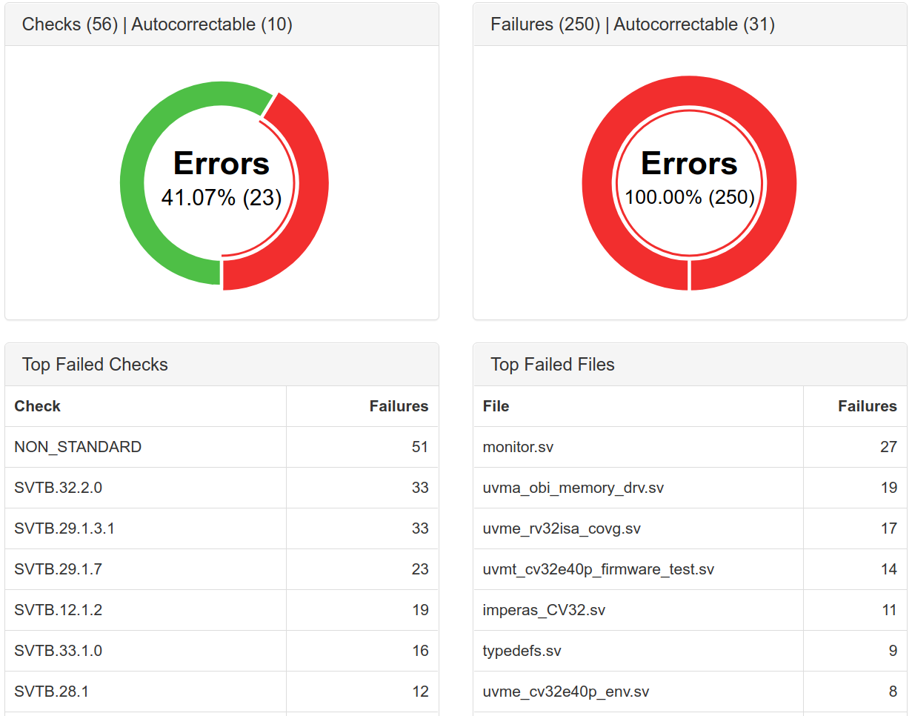

# Verissimo SystemVerilog Testbench Linter

Verissimo SystemVerilog Testbench Linter is a coding guideline and verification methodology compliance checker that enables engineers to perform a thorough audit of their testbenches. With this tool, users can check for language pitfalls, semantic and style issues, performance issues, dead code, and compliance with the appropriate methodologies.

The continous integration with the ***core-v-verif*** project is available [here](https://www.dvteclipse.com/core5verif-verissimo/1/main/index.html), where several release and dev branches are analyzed, including pull requests.

This folder also contains a ruleset file called ***ruleset.xml***, used to define the set of rules to be applied in a linting session and a waivers file called ***waivers.xml*** used to hide, demote or promote linting failures.

More information can be found on the [Verissimo](https://dvteclipse.com/products/verissimo-linter) product page.
