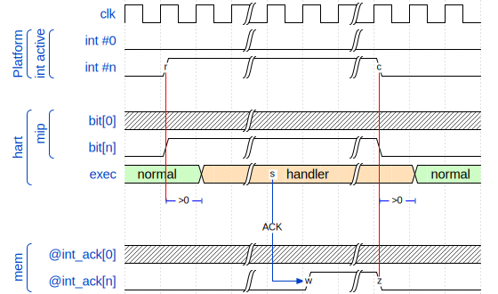

////
Copyright 2024 Thales DIS France SAS

Licensed under the Solderpad Hardware Licence, Version 2.0 (the "License");
you may not use this file except in compliance with the License.
SPDX-License-Identifier: Apache-2.0 WITH SHL-2.0
You may obtain a copy of the License at https://solderpad.org/licenses/

Original Author: Zbigniew CHAMSKI - Thales
////

= Interrupt Verification protocol

== Scope

In the rest of this section it is assumed that the design-under-test is limited to a hart (or 'core') with its internal CSRs.  The hart supports only Machine mode, explicitly excluding User and Supervisor modes as not implemented.

Arbitration between multiple sources of external interrupts is under the responsibility of the "platform" and thus performed outside of the hart.

Therefore, the verification of interrupt handling at hart level covers two co-ordinated aspects:

* the detection of "interrupt present" state for all implemented interrupt types among those listed in MIP/MIE;
* the generation of the response to the "interrupt present" state according to the fixed interrupt priority (see https://cva6.readthedocs.io/en/latest/04_cv32a65x/riscv/priv.html#_machine_interrupt_mip_and_mie_registers[Machine Interrupt Registers, CV32A65X Privileged ISA spec, section 3.1.9]).

== Interfaces

The interface for raising interrupts (from the platform to the hart) is a set of bits in the `MIP` (Machine Interrupt Present) CSR.  These bits are controlled by the verification platform by driving hardware inputs of the hart.
The interface for clearing pending interrupts (from the hart to the platform) can either rely on writable "interrupt pending" bits in `MIP`, or "the implementation must provide some other mechanism for clearing the pending interrupt."

On CV32A65X the "interrupt pending" bits in `MIP` are read-only and therefore, they cannot be used to acknowledge (clear) a pending interrupt.  Hence, for the purpose of verification we introduce a 64-bit memory-mapped register `int_ack`.  To acknowledge a pending interrupt represented by bit N in the `MIP` register, the hart performs a memory store at the address of `int_ack` with bit N set in the value being stored.  All stores into `int_ack` shall be monitored by the platform and shall eventually result in clearing a pending interrupt if both the corresponding "interrupt pending" bit in MIP is set and the value written into `int_ack` has a bit set at the same bit position.  The clearing of the corresponding pending interrupt by the platform may be immediate or delayed.

The `int_ack` memory location has no fixed address.

== The protocol

The basic operation of the interrupt verification protocol is shown in xref:fig-basic-raise-clear-protocol[xrefstyle=short].

.Basic interrupt raise-acknowledge protocol
[#fig-basic-raise-clear-protocol]

The platform/testbench notifies the hart of raising an interrupt by setting the corresponding hardware input of the hart.  This results in the hart setting a bit at position 'N' in the `mip` CSR according to the hardware input being raised (marker `r` for "raise").
The hart detects the presence of a pending interrupt at position N in `mip`, and if that interrupt is enabled it starts executing the interrupt handler.

While executing the handler, the hart performs a memory store to the symbolic location `int_ack` with bit N set to acknowledge the servicing of interrupt at position N in `mip` (markers `s` for "store" and `w` for "write").

The platform responds by clearing the interrupt (marker `c` for "clear"): it clears bit N in `mip` *and* performs a memory store that clears bit N in `int_ack` (marker `z` for "zero the ACK").  Both operations shall occur in finite time but quickly enough to clear the interrupt pending bit in `mip` before the hart enables interrupts at the end of the interrupt handler.

== Software implementation

Test programs used for interrupt verification shall reserve the necessary memory storage located at symbol `int_ack` and shall make the value of that symbol available to verification software.
To reserve the storage, assembly program shall use storage type `.dword`. C/C++ programs shall use scalar type `unsigned long int` with `volatile` qualifier to prevent over-optimization of assignment operations.

The symbol shall be defined in section `.uvmif`.  The linker scripts shall ensure that this section is aligned on a 64-byte multiple to reduce cache latency artefacts where applicable.

== Rationale

. The storage allocated for `int_ack` is 64 bits wide to support a single test program source for XLEN=32 and XLEN=64.
. The symbol `int_ack` has no fixed address to avoid hardcoded dependencies in the verification flow.
. In order to keep `int_ack` isolated from other symbols occurring in verification test programs, the symbol is placed in a dedicated section.
. The interrupt acknowledge mechanism abstracts from the Machine Timer Interrupt logic (cf. https://cva6.readthedocs.io/en/latest/04_cv32a65x/riscv/priv.html#_machine_timer_mtime_and_mtimecmp_registers[Machine Timer Registers, CV32A65X Privileged ISA spec, section 3.2.1]).
  In particular, it relieves the verification platform from maintaining consistent `MTIME` and `MTIMECMP` values.
